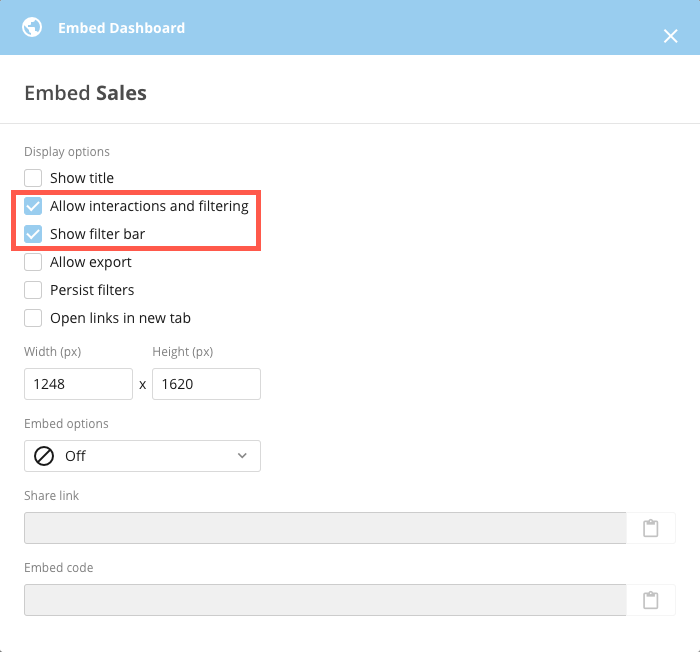
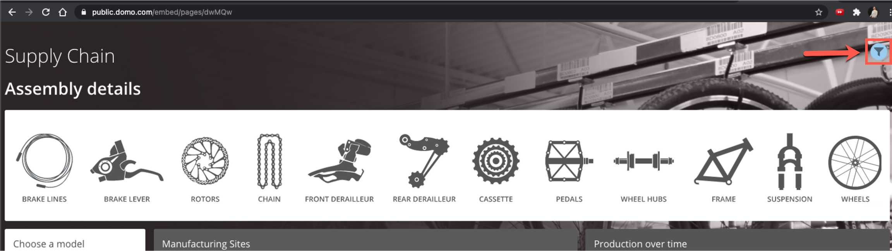
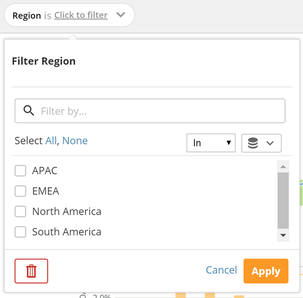
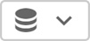
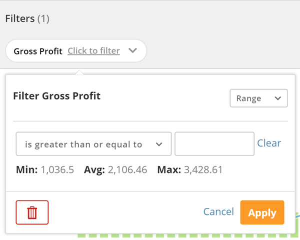
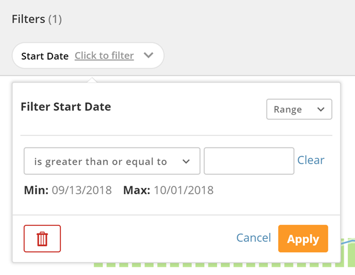
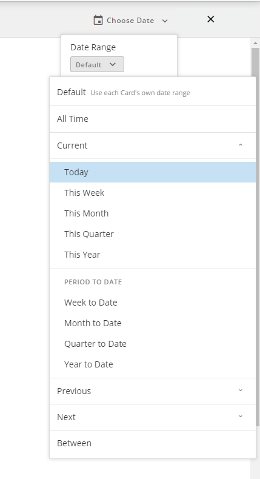

---
    title: Page Filters in Dashboard Embed
    url: https://domo-support.domo.com/s/article/4403508913943
    linked_kbs:  ['[https://domo-support.domo.com/s/knowledge-base/](https://domo-support.domo.com/s/knowledge-base/)', '[https://domo-support.domo.com/s/](https://domo-support.domo.com/s/)', '[https://domo-support.domo.com/s/topic/0TO5w000000ZamqGAC](https://domo-support.domo.com/s/topic/0TO5w000000ZamqGAC)', '[https://domo-support.domo.com/s/topic/0TO5w000000ZanbGAC](https://domo-support.domo.com/s/topic/0TO5w000000ZanbGAC)', '[https://domo-support.domo.com/s/article/360042923914](https://domo-support.domo.com/s/article/360042923914)', '[https://domo-support.domo.com/s/article/360043428713](https://domo-support.domo.com/s/article/360043428713)', '[https://domo-support.domo.com/s/article/4403508913943](https://domo-support.domo.com/s/article/4403508913943)', '[https://domo-support.domo.com/s/topic/0TO5w000000ZanbGAC/domo-everywhere](https://domo-support.domo.com/s/topic/0TO5w000000ZanbGAC/domo-everywhere)', '[https://domo-support.domo.com/s/article/360043429933](https://domo-support.domo.com/s/article/360043429933)', '[https://domo-support.domo.com/s/article/360043429953](https://domo-support.domo.com/s/article/360043429953)', '[https://domo-support.domo.com/s/article/360042925494](https://domo-support.domo.com/s/article/360042925494)', '[https://domo-support.domo.com/s/article/360043429913](https://domo-support.domo.com/s/article/360043429913)', '[https://domo-support.domo.com/s/article/4408174643607](https://domo-support.domo.com/s/article/4408174643607)', '[https://domo-support.domo.com/s/login/](https://domo-support.domo.com/s/login/)']
    article_id: 000004245
    views: 2.598
    created_date: 2022-10-24 21:35:00
    last updated: 2022-10-24 22:39:00
    ---

Intro
-----

With Page Filters in Dashboard Embed you are now able to add the same filters you use in your Domo instance inside of your embedded Dashboard. This will allow users to:

* Filter for any column with the same flow you know from the full instance.
* Choose from default date ranges to jump quickly to popular time frames.
* Change trend granularity with the “graph by” option for hour, day, week, etc.

**Note:** Unlike filtering on Dashboards in your full instance of Domo, you cannot save the filtered view in the embedded instance.

Enabling Page Filters in Dashboard Embed
----------------------------------------

1. Navigate to the Dashboard you would like to embed.
2. Click the  icon.
3. Select **Embed Dashboard** from the dropdown menu.
4. Enable the check the boxes for **Allow interactions and filtering** AND **Show filter bar**.  
  

Using Page Filters in Dashboard Embed
-------------------------------------

### To apply Page Filters,

1. Navigate to the Dashboard you would like to filter.
2. Click on the blue filter icon located at the top right-hand side of the Dashboard.  
  

3. Click the **+** button.  
  
A list of all column names used in DataSets in Cards in this Page appears. If a column name is used in more than one DataSet, an arrow appears to the right of the name so you can filter down to the desired DataSet if you want.
4. Click the name of the column you want to filter.  
  
Alternatively, if the column name is used in more than one DataSet and you want to filter to show just the rows in a specific DataSet, you can click the arrow next to the column name to bring up a dialog with the names of all the applicable DataSets. Here you can check the boxes for all the DataSets you want to show rows for (or simply select all DataSets by checking the Select all box).  
  
If you select a column that appears in more than one DataSet without filtering down to a specific DataSet, the columns from the DataSet powering the most Cards in the Page will be used for the Filter.  
  
After you select a column or DataSets, a Filter button appears on the left side of the gray bar, and a dialog appears in which you can select your Filters. The interface components of the dialog differ depending on whether the column or row you selected contains series, amount, or date data.
5. Do one of the following:

* (Conditional) If the selected column contains string data,  
  
  
  

	1. Select the checkboxes for each series you want to show in the Cards in this Page.  
	You can select all of the checkboxes by clicking **All** or deselect all of the checkboxes by clicking **None**.  
	You can filter the series that appear in the list by entering a keyword or a string of characters found in a keyword in the Filter by field.  
	Note: Currently, only 500 unique values will show in the Filter menu.  
	Finally, if you want to load values from a specific DataSet, you can click  then choose the desired DataSet. This will load the unique values on that DataSet but apply to all DataSets with that same column name.
	2. Specify whether the items you have checked appear or do not appear in your chart by selecting **In** or **Not In** from the menu in the top right.
	3. Click **Apply**.
* (Conditional) If the selected column contains amount data,  
  
  
  

	+ Do one of the following:
		- If you want to filter amounts based on a range...
			1. Leave the dropdown menu in the upper right corner set to **Range**.
			2. Select a condition statement from the menu.  
			One or more fields may appear, depending on the condition statement.
			3. (Conditional) If one or more fields appeared when you selected a condition statement, enter the desired amounts in the fields.  
			For example, if you wanted your Cards to show information for amounts between 200,000 and 300,000, you would select **is between** from the menu, enter "200,000" in the first field, and enter "300,000" in the second field.
		- If you want to filter amounts based on specific values from your DataSet...
			1. Select **Selection** in the dropdown menu in the upper right corner.
			2. Check the boxes for all of the values you want to filter on.  
			  
			You can select all of the checkboxes by clicking All or deselect all of the checkboxes by clicking None. Or you can filter the values that appear in the list by entering a string of numbers in the Filter by field.  
			  
			If you want to load values from a specific DataSet, you can click  then choose the desired DataSet. This will load the unique values on that DataSet but apply to all DataSets with that same column name.  
			  
			Finally, you can specify whether the items you have checked appear or do not appear in your chart by selecting In or Not In from the menu in the top right.
			3. Click **Apply**.
* (Conditional) If the selected column contains date data,  
  
  
  

	+ Do one of the following:
		- If you want to filter dates based on a range...
			1. Leave the dropdown menu in the upper right corner set to **Range**.
			2. Select a condition statement from the menu.  
			One or more fields may appear, depending on the condition statement.
			3. Enter the desired dates in the fields as necessary.  
			  
			For example, if you wanted your Cards to show information for dates between 1-31-2014 and 4-30-2015, you would select **is between** from the menu, select January 1, 2014 in the first field, and select April 30, 2015 in the second field.
		- If you want to filter dates based on specific dates from your DataSet...
			1. Select Selection in the dropdown menu in the upper right corner.
			2. Check the boxes for all of the dates you want to filter on.  
			  
			You can select all of the checkboxes by clicking All or deselect all of the checkboxes by clicking None. Or you can filter the dates that appear in the list by entering a filter string in the Filter by field. (For example, if you wanted to filter down to dates from 2010, you would enter "2010" into this field.)  
			If you want to load values from a specific DataSet, you can click  then choose the desired DataSet. This will load the unique values on that DataSet but apply to all DataSets with that same column name.  
			  
			Finally, you can specify whether the dates you have checked appear or do not appear in your chart by selecting In or Not In from the menu in the top right.
			3. Click **Apply**.

The affected Cards in the Page update to reflect the Filters you have selected. In addition, a  icon appears on each affected Card.

### To edit a Filter,

1. Click the button for the Filter in the gray bar at the top of the Page.  
The dialog for the Filter appears.
2. Edit the Filter settings as desired.
3. Click **Apply**.

Your changes are applied to the Filter.

### To remove a Filter,

1. Click the button for the Filter in the gray bar at the top of the Page.  
The dialog for the Filter appears.
2. Click .
3. Click **Continue** to confirm the removal.

This Filter is removed, and all of the Cards that used the Filter are updated accordingly.

Using Filter views
------------------

You can embed a Dashboard with Filter views that you have curated for your Subscribers. Filter views allow you to customize a Page to meet the needs of all audiences. Using Filter views, you can do all of the following:

* Create and save your own Filters without affecting anyone else's view.
* Curate and share important views to create alignment on a specific perspective.
* Provide any number of personalized data stories for any person in any role.
* Designate which saved Filter view is the "default" for first-time visitors to a Page.

Any Subscriber can add Filter views as well as rename, copy, and delete his/her own Filter views. For more information on Filter views, see [Applying Page-Level Filters with Filter Views](/s/article/360042923914).

Applying dynamic date range Filters
-----------------------------------

You can use dynamic date range Filters to adjust the date range window for all the Cards on a Page. These Filters can be saved and used as the default for all users in a Page. They can also be saved to different Filter Views (described in the previous section). Dynamic date range Filters can be a huge time-saver, since users do not need to manually apply filters to see data for a given date or time range. Also, with dynamic date range Filters, the date range data for your Cards automatically "rolls over" when the current period ends. 

**Note:** Dynamic date range filters only apply to Visualization Cards and Sumo Cards. They do NOT work on Doc Cards, Poll Cards, Notebook Cards, and Custom Apps.

You choose dynamic date range Filters in the **Choose Date** menu in the gray filter bar at the top of a Page.  
  
  
  
The Filters you choose here are applied to all Cards in the Page that have had a [date column applied in Analyzer](/s/article/360043428713 "Applying DataSet Columns to Your Chart"). Filters are applied to each Card's unique date column and take into account date filters that have already been set on the Card. So for example, if a Page contained a Card that was powered by the "Sales Dates" column and the dates were filtered in Analyzer to show March through June, if dynamic date range Filters were set on the Page, the Filters would be applied to the "Sales Dates" column and would only work within the March-June time period. If the dynamic Filters were set outside that time period, the Card would display "No data in filtered range."

You are able to choose Cards that will not be affected by the dynamic date, by deselecting the **Allow global date** feature. More information can be found in the [Controlling how Page Filters affect your Page](#h_01F9AABYR9EW4G9K3NEAHG8GA0) section above. If you have chosen the **Hide Date on Card Details** option for a Card, the dynamic date will also not be applied to the Card.

Most of the options for dynamic date range Filters are the same as those for filtering dates in the Analyzer. In essence, these options are as follows:

* ****Date Range****. This lets you choose the range of data shown for all Cards in the Page being powered by date columns. By default this is set to ****Default****, meaning that all Cards use their own date ranges. A wide variety of other options is available, including the current date period, period-to-date options such as **Week to Date**, and so on.
* ****Graph By****. This lets you choose the date grain for all Cards in the Page being powered by date columns. The date grain determines whether the data is shown by week, by month, etc. This menu is described in more detail in [Changing the unit of time used to represent data](#HowdoIfilterdates?-changingdategrain "Adding Filters to Your Chart"). By default no date grain is selected, meaning the Cards use the same date grain used in their powering DataSets. (For example, if data for a Card was broken down by week in the DataSet, it would be automatically broken down by week in the Card).

**Note:** The Date Graph By does not impact Single Value charts. This is to ensure best data practices as Graph By will impact which row is returned in the chart query.

