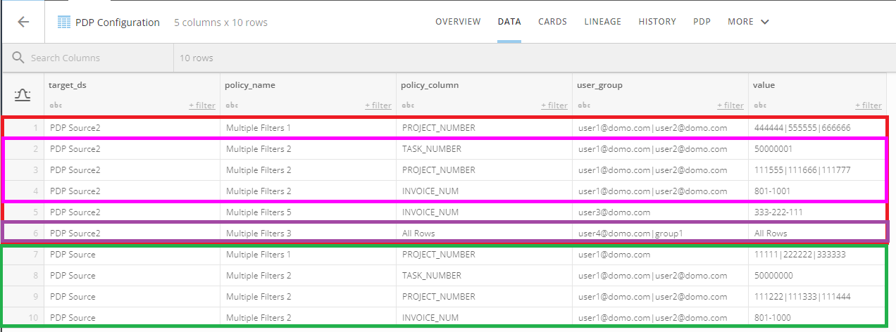

Intro
-----


This utility automates the creation of PDP policies.


Prerequisites
-------------


You need the following to use the PDP utility:


* Access Token with access to the customer instance and DataSets.
* The name or ID of the ‘config’ DataSet. This is the DataSet that contains the values to create the polices. This is typically a user email and values.  
 · The user name or group name. Multiples are separated by the pipe ‘|’ character.  
 · The comparison ‘value’ in a policy, separated each value with the pipe ‘|’ character.  
 · Currently only the ‘Equals’ operator is supported.
* If you want email notifications for successes and errors, place a properties file in the same directory as the JAR.  
 · For email.properties, the **user** is [user.name@host.com](mailto:user.name@host.com), and the **host** is smtp.comcast.com.  
 · For application.properties, the file is auto-generated on a successful login. Afteryou have logged in successfully, you can run the utility headless.


Configuration DataSet
---------------------


The following is an example of the configuration DataSet.


 

**Note:** It is very important to order this DataSet by the `target\_ds` column and then the `policy\_name` column. This ensures that all the actions happen on the same DataSet and the same policy.


 


 

**Important:** Your configuration DataSet schema should exactly match the following:

* target\_ds – The name or ID of the DataSet where you want to create the policies.
* policy\_name – The human readable policy name.
* policy\_column – The column name that the filter will be created on.
* user\_group – The user name or group name. Multiples are separated by the pipe ‘|’ character.
* value – The value in the filter. Multiples are separated by the pipe ‘|’ character.





To add multiple filters, set the ‘policy\_name’ & ‘user\_group’ to the same values. *Pink highlight.*


The utility supports multiple target DataSet in the ‘target\_ds’ column. *Red & Green highlights.*


To add users/groups to the ‘default’ policy set the ‘policy\_column’ & ‘value’ to “All Rows". *Purple highlight.*


Running the PDP Utility
-----------------------


The PDP Utility can be run in one of two modes: standalone GUI or Command Line. First, download the .jar file from <https://app.domo.com/labs/pdp/pdputil-3.1.0.jar>.


### Standalone GUI


This is a wizard like interface that will walk you through the creation of the PDP Policies. Double click the PDP.jar or execute from the command line with no params.


```
java -Xmx1024m -jar pdputil-3.1.0.jar
```

### Command Line


This is a headless utility that can be scripted. Once you have logged in successfully, you can run the utility headless.


```
java -Xmx1024m -jar pdputil-3.1.0.jar <domain> <config_ds>
```

<domain> : The customer instance  
<config\_ds> : The name or ID of the ‘config’ dataset. This is the dataset that contains the key value pairs to create the polices. This is typically a user email and a value.

