Intro
-----

Domo has partnered with Anonomatic to safely store, anonymize, mask, mine, redact and share sensitive Personally Identifiable Information (PII) data with 100% data accuracy and full international data privacy compliance. This allows you to upload your data that contains PII data with the information redacted so that it is never stored in Domo. For more information on PII, see [What Constitutes PII?](/s/article/360042934554)

Privacy compliance is accomplished through a process called Poly-Anonymization™. Poly-Anonymization involves taking any personal identifying pieces of information (name, gender, address, social security number, etc.) and swapping it out for an anonymous value (Poly-ID). This value is unique, inconsistent, unpredictable, and not hashed. After data anonymization has been completed, organizations can share the resulting data either internally or externally without the usual risk that would be associated with such activity. For more information on this process and on Anonomatic, visit their site <https://anonomatic.com>.

**Video - PII Vault Plugin For Domo Workbench - Introduction and Overview**

Try it out
----------

In order to test the PII Vault Protection and Compliance feature with Domo, you need to do the following:

* Create an Anonomatic Trial account.
* Download the Workbench plugin.

This free trial will let you upload 2,000 unique personal profiles and will last for 30 days.

 

**Note:**  This feature is available *on demand and paid*.

 

To request this feature be enabled,

* Reach out to your Domo Customer Success Manager, Technical Consultant, or Account Executive.
* If you do not have contact information for your CSM, TC, or AE, contact Technical Support. For information on how to contact Support, please see: [Getting Help](/s/article/360042922874)

Depending on the feature, you may be required to complete training before you can use the feature.

Create an Anonomatic Trial account
----------------------------------

In order to use the PII Vault Protection and Compliance feature with Domo, you will first need to create an account with Anonomatic.

**Video - How to Create a new PII Vault Trial Account**

**To create an Anonomatic account,**

1. Navigate to <https://api.anonomatic.com/ui>.
2. Click **Create New Account**.  
  
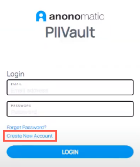
3. Fill out the registration information.
4. (Conditional) Under the **Subscription Type** dropdown select one of the following:  
To create a trial account, select **Trial Vault**.  
To create a regular account select **Standard Vault**. (If you choose this option, you will need to reach out to your Domo Account Executive for an **Activation Key**.)  
  

**Note:** If you select a Trial Vault it is fully functional and allows you to test all of the features. However, do NOT use any production data in this environment as the data can be wiped at any time.
5. Select the checkbox for **I accept the terms and conditions**.  
  
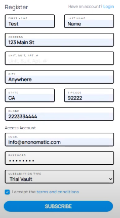
6. Click **Subscribe**.
7. On the success page, click **Login**.  
  
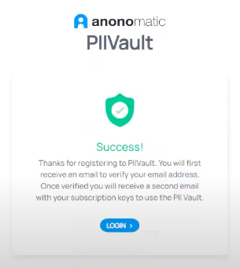
8. A verification email will be sent to the email address you provided. You will need to click the link to verify your account before you can log in for the first time.  
  
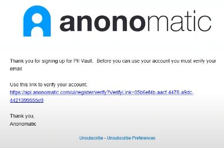
9. Enter your credentials.
10. Click **Login**.
11. Once you log in, you will receive a second email that will provide you with the **API Access URL**, **AccountId,** and **ApiKey** you need in order to use the vault.

Download the Workbench plugin
-----------------------------

In order to use the PII Vault Protection and Compliance feature with Domo, you will need to download the plugin for use inside of Domo Workbench.

**Video - How To Download PII Vault Plugin for Domo Workbench**

**To download the Workbench plugin,**

1. Navigate to <https://github.com/AnonomaticInc/Domo>.
2. (Conditional) Depending on the version of Workbench on your machine, you will select one of the following files:  
If you are using Workbench 5.0, you will select the file **PIIVaultDomoPlugin5.0.zip**.  
If you are using Workbench 5.1, you will select the file **PIIVaultDomoPluginWB5.1.zip**.  
  
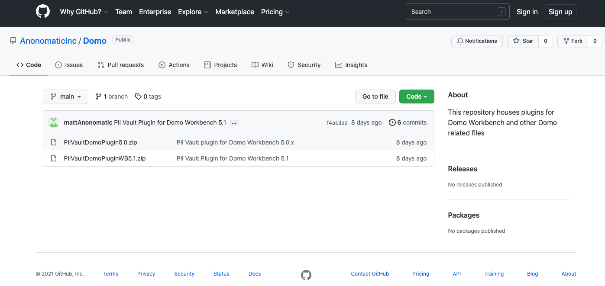
3. Click **Download**.  
  
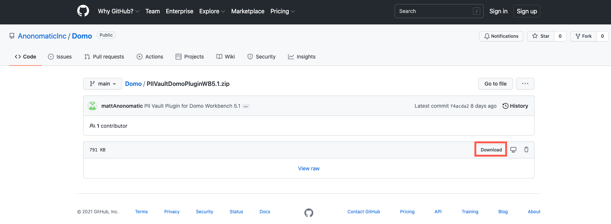
4. Once the file has been downloaded, open the file so that you can see the **PIIVaultDomoPlugin** folder.
5. In a separate file window, navigate to the following folder path on your PC:  
**This PC > OS (C:) > ProgramData > Domo > Workbench > Pipeline > AddIns**  
  

**Note:** This is the default file path that is created when Workbench is installed on your machine, if you selected a different file path when it was installed, you will need to navigate to where you saved it.

 

**Note:** If the file doesn't appear in the folder, click **View** at the top of the explorer and then check the **Hidden Items** box.
6. Click and drag the **PIIVaultDomoPlugin** folder into the **AddIns** folder.
7. The plugin will now be available inside of your Domo Workbench.

Using PII Vault Protection and Compliance
-----------------------------------------

Once you have created an account with Anonomatic and downloaded the Domo Workbench plugin, you can create a Workbench job to upload the data. You have two options for handling the PII data, it can be Redacted or Masked.

### PII Vault with Data Redaction

Using the PII Vault Protection and Compliance plugin with the Data Redaction method replaces all PII data with null values before uploading the data into Domo. The values are given a Poly Anonymous-Id that is used to reference the particular individual anytime they have data added to the database.

**Video - PII Vault Plugin Setup for Data Redaction**

 

**To use PII Vault Protection and Compliance with data redaction,**

1. Create a new job inside of Domo Workbench.
2. Select the data you would like to upload.  

**Note:** If you are doing a database query, be sure to use an Order By statement on the unique ID field for the individual.
3. Under the **Transforms** section, select **PIIVault Transform**.
4. Click the **+** icon.
5. Under the **PII Vault Parameter Value** type **Redact**.  
This will replace the data with null values.  
  

6. Click the **Configure PII Vault Connection** button.  
  
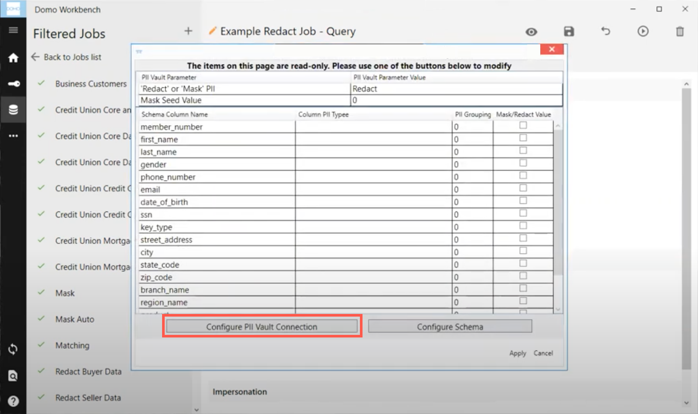
7. Enter the **PII Vault URL**.
8. Enter the **PII Vault Account Id**.
9. Enter the **PII Vault API Key**.  
  
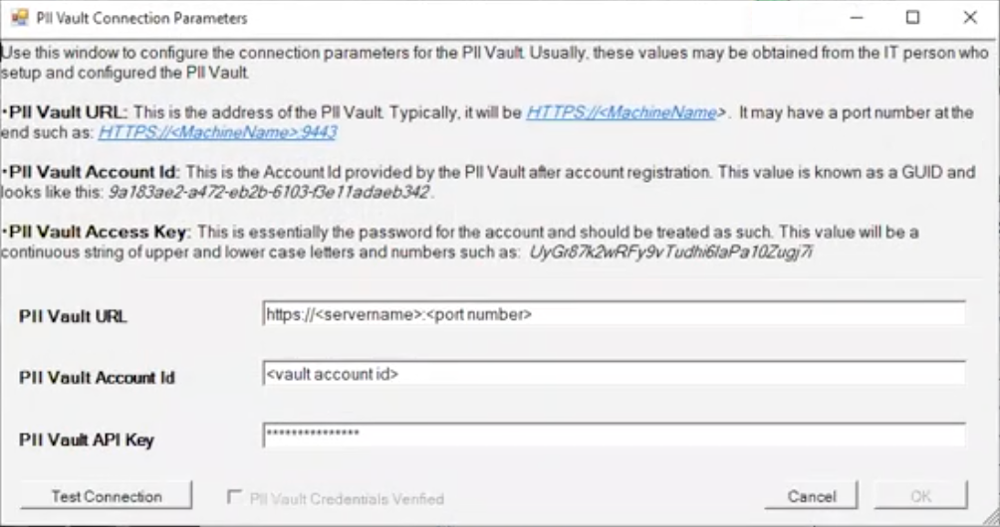  

**Note:** The PII Vault URL, Account Id, and API Key will be emailed to you once you set up your account with Anonomatic. To create an account, see [Create an Anonomatic Trial account](#h_01FHXCNZ9GJN49H884WPF1M77N).
10. Click **OK**.
11. Click the **Configure Schema** button.  
  
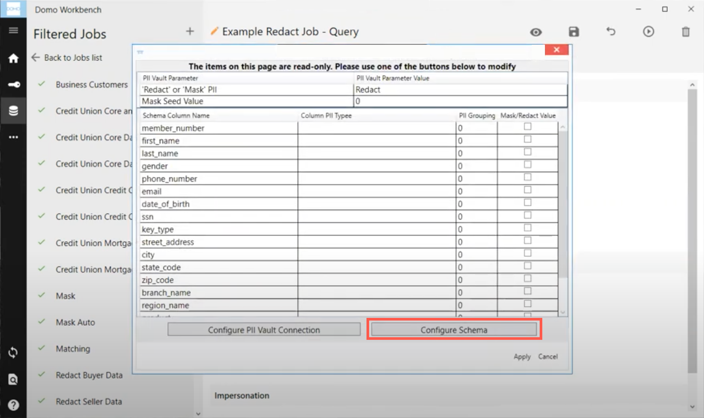
12. Under the **Column Type** field for each column, select what type of PII data it contains (if applicable.)  
  
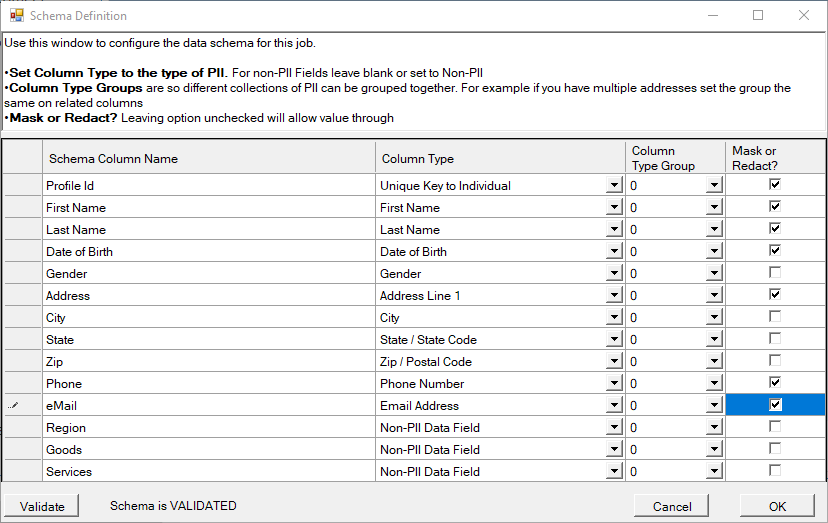  
  

**Note:** There must be one column set to **Unique Key to Individual** that must be a consistent value that you use to identify an individual whenever data is uploaded about them.

  

**Tip:** There is an option for **Non-PII Data Field** however, this does not need to be selected for each non-PII column. If the selection is left blank, it defaults to the Non-PII Data Field option.
13. (Optional) Set the **Column Type Group** field.  
This option is used when there are multiple addresses (mailing or email such as a personal and a work address) associated to a single individual. You would set all of the secondary address information to another group so that the plugin knows how to anonymize the data while keeping the addresses separate.
14. Click the checkbox next to the columns you want to be Redacted.
15. Click **OK**.
16. Click **Apply**.
17. **Save** and **Run** the job.

### PII Vault with Data Masking

Using the PII Vault Protection and Compliance plugin with the Data Masking method replaces all PII data with non-identifying fake values. This gives the appearance of real values for your data, without actually containing PII data. The values are not given a Poly Anonymous-Id as they are assigned fake data that is unique to that individual.

**Video - PII Vault Plugin Setup Data Masking**

 

**To use PII Vault Protection and Compliance with data masking,**

1. Create a new job inside of Domo Workbench.
2. Select the data you would like to upload.  

**Note:** If you are doing a database query, be sure to use an Order By statement on the unique ID field for the individual.
3. Under the **Transforms** section, select **PIIVault Transform**.
4. Click the **+** icon.
5. Under the **PII Vault Parameter Value** type **Mask**.  
This will replace the data with non-identifying fake values.  
  
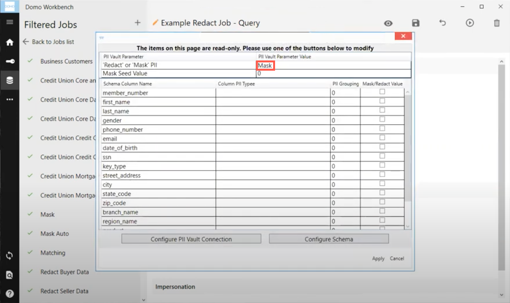
6. Click the **Configure PII Vault Connection** button.  
  
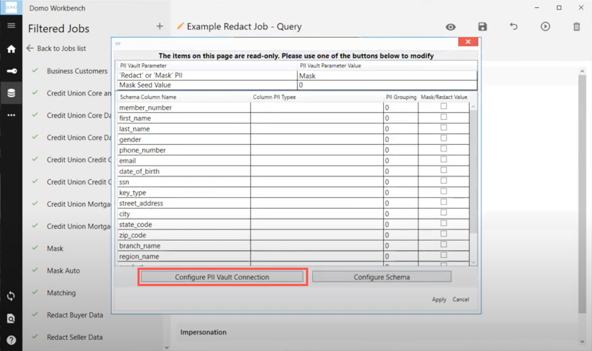
7. Enter the **PII Vault URL**.
8. Enter the **PII Vault Account Id**.
9. Enter the **PII Vault API Key**.  
  
  

**Note:** The PII Vault URL, Account Id, and API Key will be emailed to you once you set up your account with Anonomatic. To create an account, see [Create an Anonomatic Trial account](#h_01FHXCNZ9GJN49H884WPF1M77N).
10. Click **OK**.
11. Click the **Configure Schema** button.  
  

12. Under the **Column Type** field for each column, select what type of PII data it contains (if applicable.)  
  
  
  

**Note:** There must be one column set to **Unique Key to Individual** that must be a consistent value that you use to identify an individual whenever data is uploaded about them.

  

**Tip:** There is an option for **Non-PII Data Field** however, this does not need to be selected for each non-PII column. If the selection is left blank, it defaults to the Non-PII Data Field option.
13. (Optional) Set the **Column Type Group** field.  
This option is used when there are multiple addresses (mailing or email such as a personal and a work address) associated to a single individual. You would set all of the secondary address information to another group so that the plugin knows how to anonymize the data while keeping the addresses separate.
14. Click the checkbox next to the columns you want to be Masked.
15. Click **OK**.
16. Click **Apply**.
17. **Save** and **Run** the job.

Anonymous Data Matching
-----------------------

The PIIVault Reader Plugin allows you to link users together from different sources. You configure what fields need to match (such as name and email) in order to prove two records are the same individual.

**Video - Anonymous Data Matching Conceptual Overview**

 

**Video - Anonymous Data Matching Plugin Configuration**

 

**To use PII Vault Protection and Compliance with anonymous data matching,**

1. Create a new job inside of Domo Workbench.
2. Set the **Source** as **PIIVault Provider**.  
  
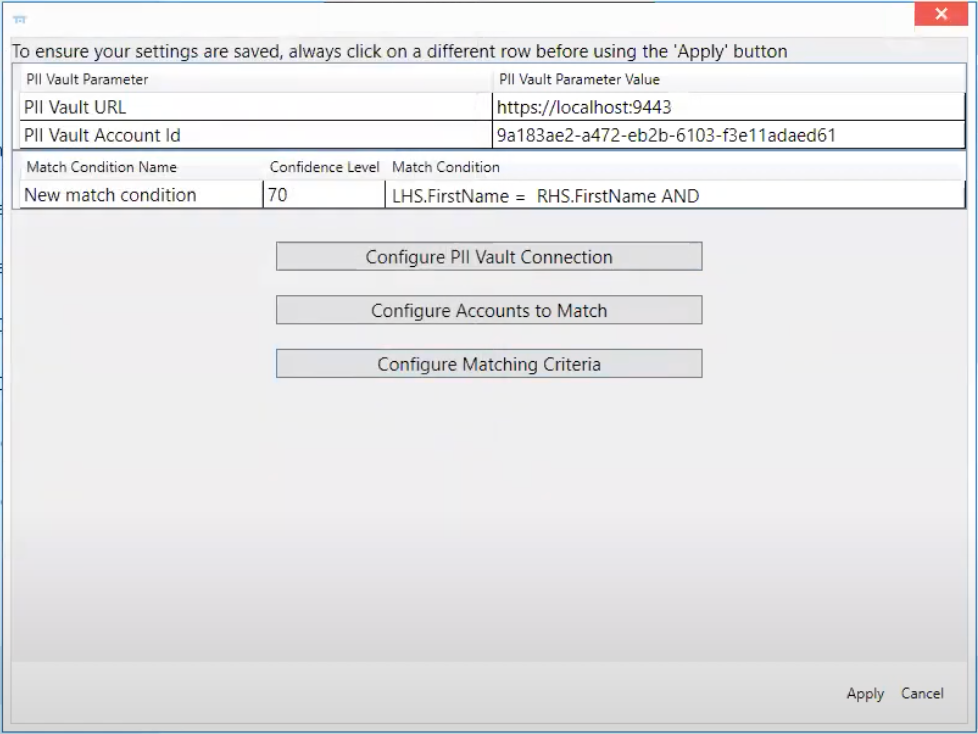
3. Click the **Configure PII Vault Connection** button.
4. Enter the **PII Vault URL**.
5. Enter the **PII Vault Account Id**.
6. Enter the **PII Vault API Key**.  
  
  

**Note:** The PII Vault URL, Account Id, and API Key will be emailed to you once you set up your account with Anonomatic. To create an account, see [Create an Anonomatic Trial account](#h_01FHXCNZ9GJN49H884WPF1M77N).
7. Click **OK**.
8. Click the **Configure Accounts to Match** button.
9. Enter the **Account Id** for each account you would like to match.
10. Enter an **Account Name** to list which account the match came from.  
  
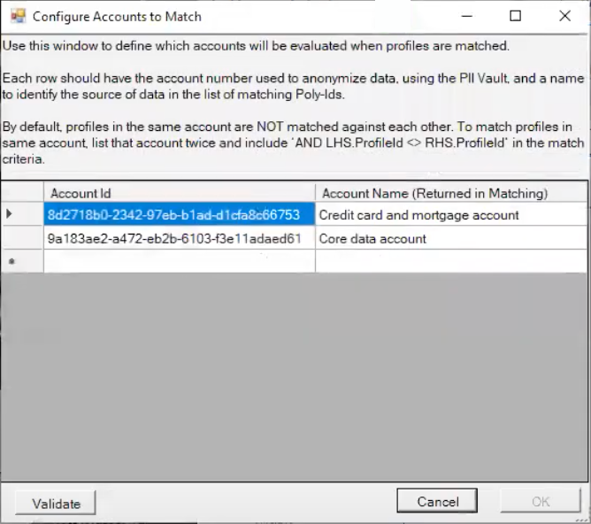
11. Click **OK**.
12. Select the **Configure Matching Criteria** button.
13. Enter a **Test Name**.
14. Select the **Confidence Level**.
15. Enter the **Test Criteria**.  
  
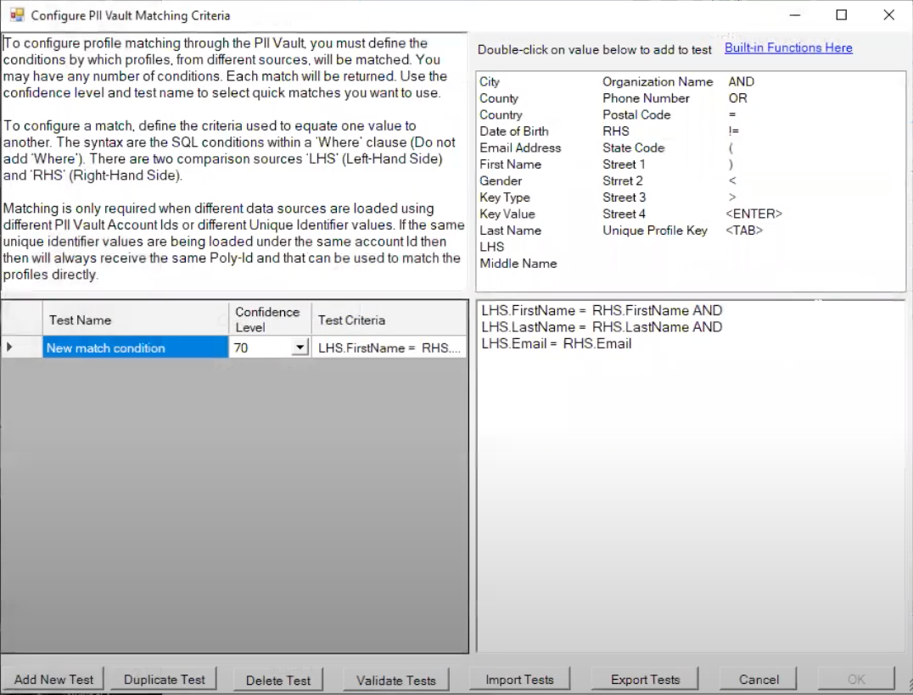
16. Click **Validate Tests**.
17. Click **OK**.
18. Click **Apply**.
19. Set **Processing** as **PIIVault Reader**.
20. Set the **Data Type** as **Workbench CSV**.
21. **Save** and **Run** the job.

FAQ's
-----

As more plugins become available, they will be added to the YouTube Playlist found [here](https://www.youtube.com/playlist?list=PL9Dt2EnZSLIXExIExE9Z8v-jFi2_Xn7w0).

