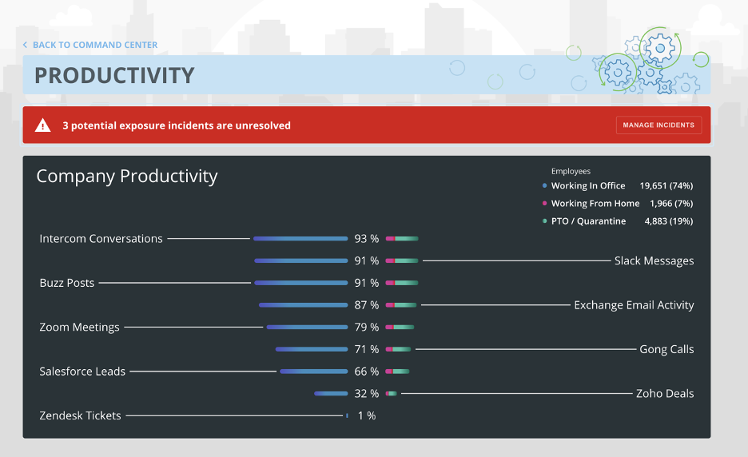
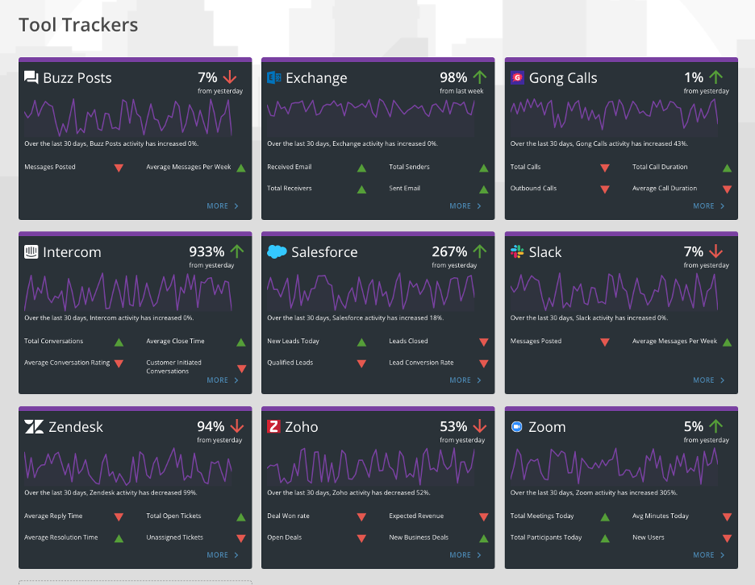
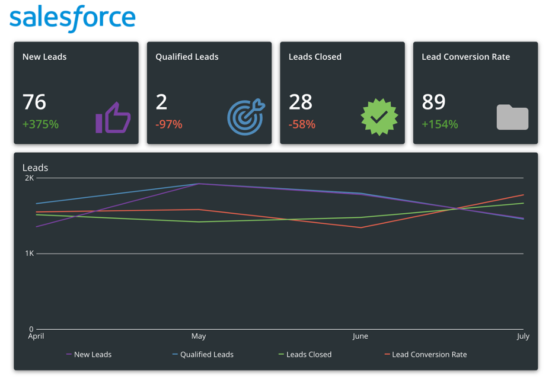
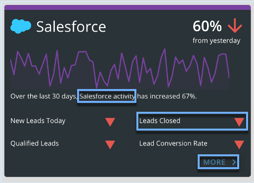
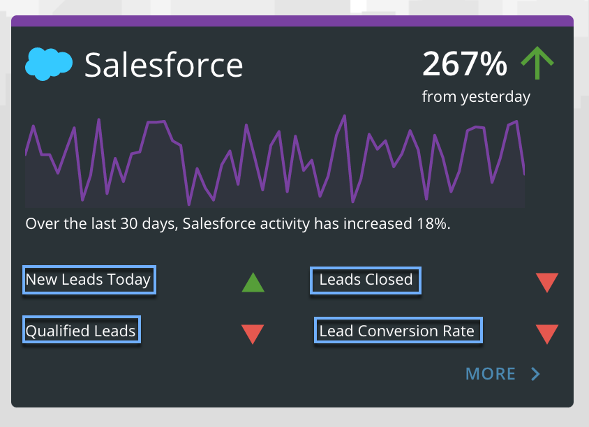
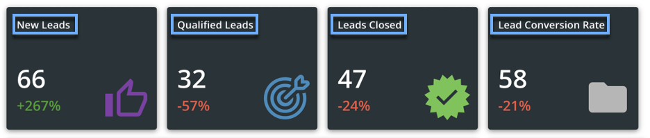
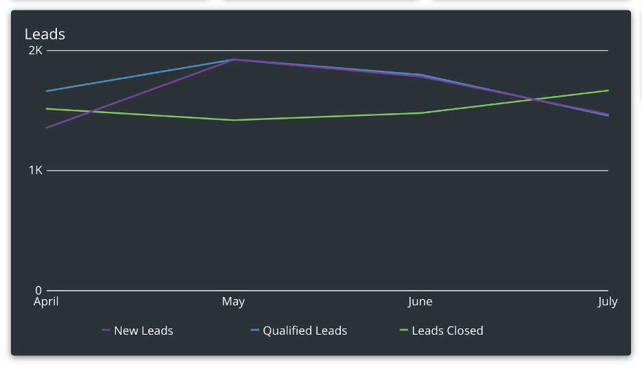

---
    title: Productivity
    url: https://domo-support.domo.com/s/article/360056655734
    linked_kbs:  ['[https://domo-support.domo.com/s/knowledge-base/](https://domo-support.domo.com/s/knowledge-base/)', '[https://domo-support.domo.com/s/](https://domo-support.domo.com/s/)', '[https://domo-support.domo.com/s/topic/0TO5w000000ZampGAC](https://domo-support.domo.com/s/topic/0TO5w000000ZampGAC)', '[https://domo-support.domo.com/s/topic/0TO5w000000Zan9GAC](https://domo-support.domo.com/s/topic/0TO5w000000Zan9GAC)', '[https://domo-support.domo.com/s/article/360056653654](https://domo-support.domo.com/s/article/360056653654)', '[https://domo-support.domo.com/s/article/360042922874](https://domo-support.domo.com/s/article/360042922874)', '[https://domo-support.domo.com/s/article/360056655734](https://domo-support.domo.com/s/article/360056655734)', '[https://domo-support.domo.com/s/topic/0TO5w000000Zan9GAC/available-apps](https://domo-support.domo.com/s/topic/0TO5w000000Zan9GAC/available-apps)', '[https://domo-support.domo.com/s/article/360043429933](https://domo-support.domo.com/s/article/360043429933)', '[https://domo-support.domo.com/s/article/360043429953](https://domo-support.domo.com/s/article/360043429953)', '[https://domo-support.domo.com/s/article/360042925494](https://domo-support.domo.com/s/article/360042925494)', '[https://domo-support.domo.com/s/article/360043429913](https://domo-support.domo.com/s/article/360043429913)', '[https://domo-support.domo.com/s/article/4408174643607](https://domo-support.domo.com/s/article/4408174643607)', '[https://domo-support.domo.com/s/login/](https://domo-support.domo.com/s/login/)']
    article_id: 000004132
    views: 2,136
    created_date: 2022-10-24 21:24:00
    last updated: 2022-10-24 22:39:00
    ---

Intro
-----

The Productivity App helps you to understand productivity trends in your business over time as well as how many of your employees are working in the office, working from home, and on PTO/quarantine. The main overview Company Productivity Card displays where employees are working and high-level productivity metrics for your business systems. Individual Tool Tracker Cards for each system highlight more detailed metrics, along with trends over the last 30 days and comparisons to your data from yesterday. The **More** button on each Tool Tracker links to a dashboard that offers even more detailed information. 

With the Productivity App, you can define productivity indicators and track them in real-time to see how your teams are doing. The system calculates your highest productivity over the last 90 days, then tells you your current percentage of attainment to that high. You can see participation in each activity, and even compare productivity estimates for when people are working in the office versus working at home.

 

**Note:** This app is part of the [Get Back to Work Solution](/s/article/360056653654 "Get Back to Work Solution") and is available *on-demand and paid*. 

 

To request this feature be enabled,

* Reach out to your Domo Customer Success Manager or Account Executive.
* If you do not have contact information for your CSM or AE, contact Domo Support. For information on how to contact Support, please see: [Getting Help](/s/article/360042922874 "Getting Help")

Company Productivity Card
-------------------------

The Company Productivity Card shows whether employees are working in the office, working from home, or on PTO/quarantine as reported in the Safe Worker App. Each of the systems connected to the app will appear in the Company Productivity Card tracking a key activity, along with a percentage about how that activity today compares to the highest level from the last 90 days. Estimates are also given indicating whether this activity is happening in the office, from home, or on PTO/quarantine.  
  

Tool Trackers
-------------

The Tool Trackers have a sampling of systems to connect to, and you can choose which Tool Trackers you want to use, depending on your team and the systems you use in your business. You can track email activity, online meetings attended, tickets resolved, closed leads, and more and start bringing data from other systems into Domo in just minutes, with your user credentials for the systems you want to track. See at a glance if your indicators are trending upward or downward, and see usage over time. The drill down menus offer an even deeper dive into the productivity indicators for the different systems in your business.  
  

 

**Note:** The Slack Connector is pending development and sample data is shown in the screenshots.

Drill down menus
----------------

For detailed numbers about the indicators on the Tool Tracker Cards, there is a Drill down menu tied to each one. The drill down menu shows specific numbers and percentages for each indicator, as well as a trendline for each of the metrics over the last four months.  
  

Understanding the data in the Productivity Indicators App
---------------------------------------------------------

### Company Productivity Card data

#### Where does the employee data come from on the Company Productivity Card?

##### The employee data is derived from the data in the Safe Worker App where employees report whether they are working from home, the office, or PTO/quarantine.Employees.png

 

**Note:** This data is currently dependent on the Safe Worker App.

#### Are the colored percentage bars for each system exact for how much of the activity is happening from home, in the office, and on PTO/quarantine?

##### Because the systems do not provide exact information on who is performing each action, the colored percentage bars are estimates based on the percentage of employees working in the office, from home, and on PTO/quarantine.Colored_Bars.png

#### What do the percentage numbers for each system indicate?

##### This number is the most recent value from today and compared to the highest value from the previous 90 days and indicated as a percentage here. The time the DataSet runs data for that day can be set in the schedule for the Dataset.

#### What metric is each system measuring?

##### Zoom Meetings: Total meetings.Gong Calls: Total Calls.Exchange Email Activity: How many people sent emails.Slack Messages: Total Messages posted.Buzz Posts: Total Posts created.Salesforce Leads: New leads created.Zendesk Tickets: Open tickets.Intercom Conversations: Total conversations.Zoho Deals: New deal.

### Tool Trackers data

The trendline shows data points from the last 30 days for the metric listed underneath the line. The Summary Number shows a percentage change of the same metric from yesterday. The percentage underneath the trendline is calculated by comparing the most recent value with the value from 30 days ago. The direction and color of the arrow indicate whether that metric has gone up or down from the previous day. Detailed numbers about these metrics are found by clicking on the **More** menu.  
  

### Drill down menus data

  
 

The summary Cards in the drill downs are more detailed metrics from the key indicators on the main Productivity Dashboard. The numbers are the most recent data and the percentages are based on the most recent data compared to yesterday.  
 

  
 

The trendline shows aggregations of monthly totals for the metrics found in the summary Cards.  
  

