The Profit and Loss app allows users to view their financial statements all in one app. In the app, you can customize which type of reports you want to see and the order of these reports by editing the included Domo WebForms. Multiple metrics in the app include App Mode, Date Grain, Period, and Year. These metrics, which are selected by you and are applied to the app, allow you to view your financial statements as necessary for your business needs.

Intro
-----

The Profit and Loss app includes a date filtering option for you to quickly and easily view your data in different time periods. Display up to seven depth levels in your data hierarchy. 

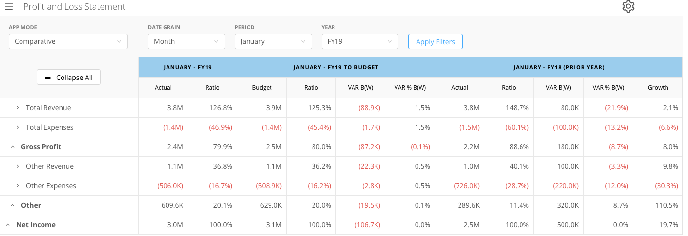

Parts of the Profit and Loss App
--------------------------------

The Profit and Loss app is all contained within one main view but includes several different metric-filtering options, including App Mode, Date Grain, Time Period type, Year, and collapsible statement sections.

### Main View

The Profit and Loss app's main view is set to whatever your last viewing state was, so if you leave the app with certain metrics selected and sections un-collapsed, that would be the state you'd see when the app opens again. The selectable metrics in the app include App Mode, Date Grain, Time Period type (based upon what Date Grain you've selected), and Year. The Trended App Mode includes a # of Period(s) metric as well. The Apply Filters button applies all the selected filters to the app. If any sections are un-collapsed, then the Collapse All button closes all opened sections. 

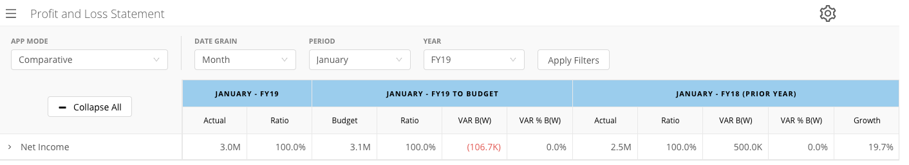

### Profit and Loss Settings

The Profit and Loss settings options is located at the top right corner of the app, and once it is selected, you can choose certain settings to be applied. There are three main sections included: Number Formation Options, Ratio Options, and Comparative Options. 

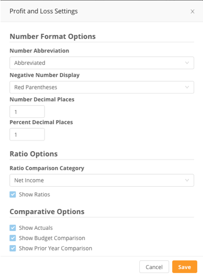

#### Number Formation Options

The Number Formation Options section has four selectors: Number Abbreviation, Negative Number Display, Number Decimal Places, and Percent Decimal Places.

**Number Abbreviation**

The Number Abbreviation option has two selectable choices: Abbreviated and No Abbreviation located in the dropdown menu.

**Negative Number Display**

The Negative Number Display has five selectable choices, Red Parenthesis, Black Parenthesis, Red Negative Sign, Black Negative Sign, and Red Color Only, located in the dropdown menu.

**Number Decimal Places**

The Number Decimal Places option allows you to select how many decimal places will be included in each number displayed in the app. You can either use the up and down arrows or type in the number.

**Percent Decimal Places**

The Percent Decimal Places option allows you to select how many percent decimal places will be included in each percentage displayed in the app. You can either use the up and down arrows or type in the number.

#### Ratio Options

The Ratio Options section has one selector, Ratio Comparison, and also includes a Show Ratio checkbox. The Show Ratio checkbox, you can select whether or not you want ratios to be shown in the app's display.

**Ratio Comparison Category**

The Ratio Comparison Category allows you to select which category you'd like to include ratios, including all the available categories that you've selected to include in the Profit and Loss app. You're able to select from this dropdown menu.

#### Comparative Options

The Comparative Options section has three checkboxes: Show Actual, Show Budget Comparison, and Show Prior Year Comparison. The Show Actual checkbox includes the Actual category display, the Show Budget checkbox makes the Budget Comparison display visible, and the Show Prior Year Comparison makes the Prior Year Comparison section display visible. 

### App Mode: Comparative

The App Mode dropdown allows users to select from two options: Comparative or Trended. Each option allows for different filters to be selected. However, this section covers the options available for the Comparative filter. 

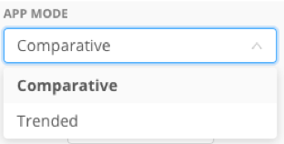

#### Date Grain

The Comparative filter has the following Date Grain options, Month, Quarter, and Year to Date.

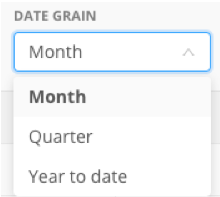

#### Period

The Period options vary depending upon which Date Grain you've selected. For Month, the period includes a list of months from January to December. Quarter to Period includes Q1-Q4 and Year to Date includes a list of months January to December as well.

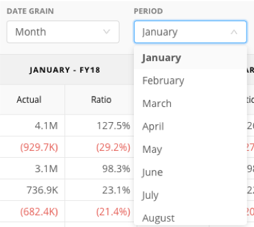    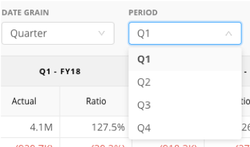    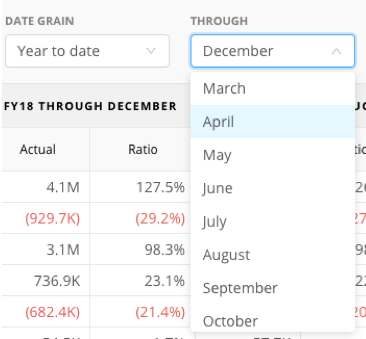

#### Year

The Year dropdown filter includes a list of years included in your data (shown below).  

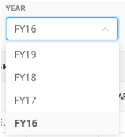

### App Mode: Trended

The App Mode dropdown allows users to select from two options: Comparative or Trended. Each option allows for different filters to be selected. However, this section covers the options available for the Trended filter.  

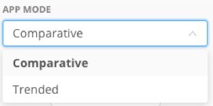

Date Grain

The Date Grain dropdown filter option includes two options: Month and Quarter.

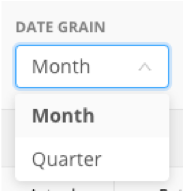

#### Period

The Period dropdown filter option depends on the Date Grain options you've selected. Month to Period includes a list of the 12 months, while Quarter to Period includes a list of quarters: Q1-Q4.

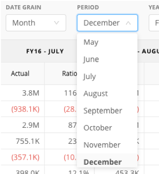    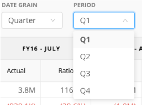

#### Year

The Year dropdown filter includes a list of years that you've included in your data.

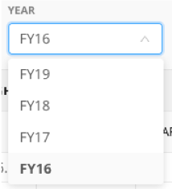

#### # of Periods

The # of Periods filter option allows you to either type in or use the app's up and down arrows to select how many periods you'd like to include in the actual app display.

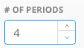

### Row Selection

The included Statement sections are configured by you, so they'll vary depending upon how you've decided to set yours up. The base rows are Total Revenue, Total Expenses, Gross Profit, Other Revenue, Other Expenses, Other, and Net Income. The Total Revenue, Total Expenses, Other Revenue, and Other Expenses rows may be expanded. You can create accounts and link them to parent accounts in order to create drill paths within the app by using the Profit and Loss App - Account Order Domo WebForm. 

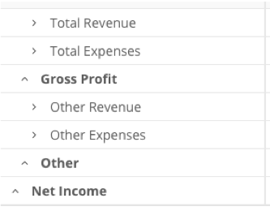

### Statement Display Table

The Statement Display Table will display data according to the selected filters, settings, and un-collapsed/collapsed rows. The overall display for the Comparative and Trended App Modes do vary depending on what you have selected in the app.

#### Statement Table: Comparative

The column values will vary depending on which filters you apply, but overall, the Comparative App Mode includes three main sections: Actuals, Budget Comparison, and Prior Year Comparison. For example, if you select Quarter, Q2, and FY18, your data would be filtered as Q2 – FY18, Q2 – FY18 To Budget, and Q2 – FY17 (Prior Year). Note that each of these main sections can be “turned off” in Settings, as can the Ratio sub-column in each section.

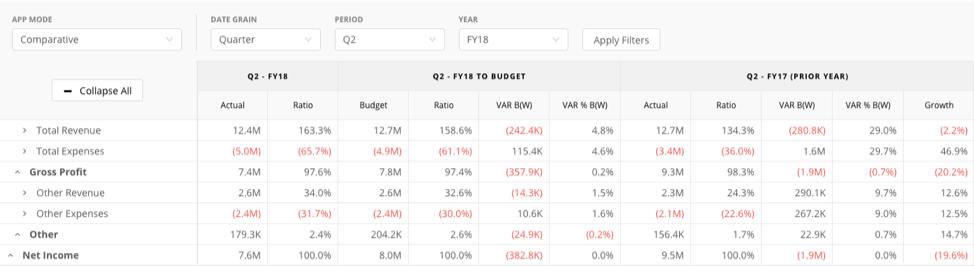

**Actuals**

The Actuals section includes the columns Actual and Ratio.

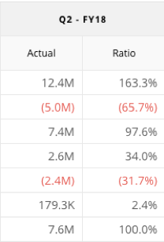

**Budget Comparison**

The Budget Comparison includes the Budget, Ratio, VAR B(W), and VAR % B(W) columns.

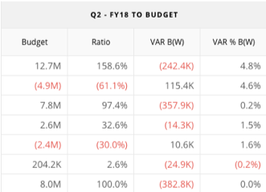

**Prior Year Comparison**

The Prior Year Comparison section includes the Actual, Ratio, VAR B(W), VAR % B(W), and Growth columns.

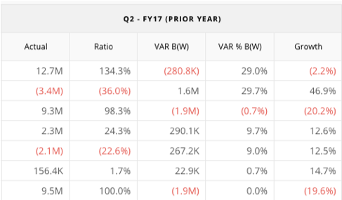

#### Statement Table: Trended

The number of columns in the Trended filter depends on how many periods are selected using the # of Periods filter. For example, if you select Month, March, FY17, and 3 periods the table would display three main columns: FY17 – January, FY-17 February, and FY-17 March. Each column contains two sub-columns: Actual and Ratio. The Ratio column can be “turned off” in Settings.

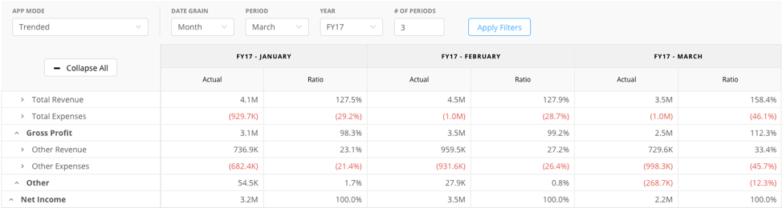

 

How Do I Get This?
------------------

**To begin using the Flex Map App, locate the app in the Domo Appstore or have an admin contact your Customer Success Manager.**

 

 

 

 

 

 

 

