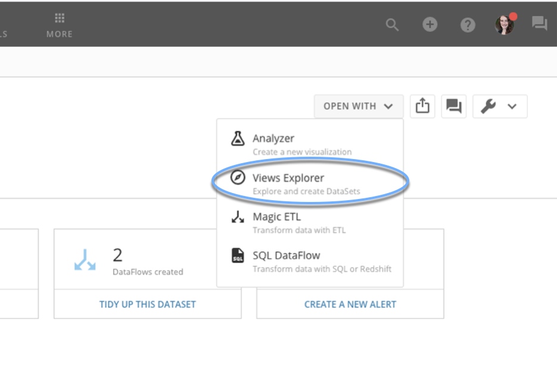
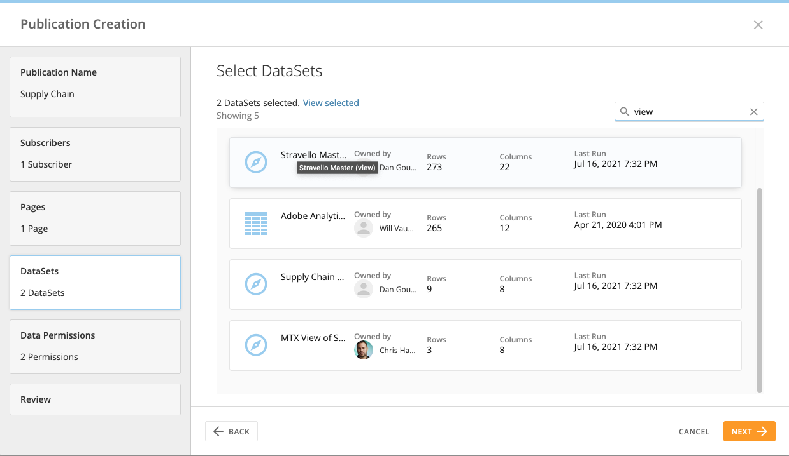

Intro
-----

DataSet Views make it easy to explore, wrangle, and combine data in a simple spreadsheet interface.

Maintaining policy compatibility
--------------------------------

DataSet Views can be published across instances through Domo Everywhere as long as you remember one key point: **Upstream PDP policies from any input DataSet will still apply** (as documented in the final line in [DataSet Views](/s/article/360046074774).)  
Since those policies are meant to focus on users in the parent instance, you have three main options to keep DataSet Views compatible with Publications:

1. Avoid upstream policies and only apply PDP to the final DataSet View that is being published.
2. Include both the input DataSets and the final DataSet View in the Publication.
3. Use Magic ETL rather than Views to create the DataSets that you want to publish.

