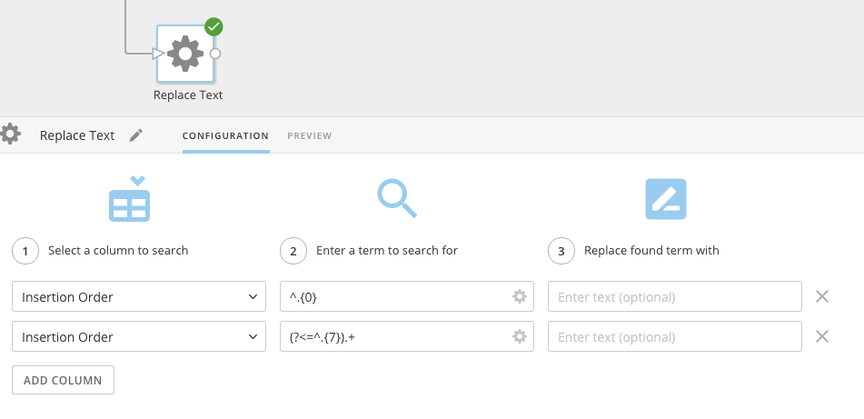

---
    title: Pulling a Segment of Text from a Text String
    url: https://domo-support.domo.com/s/article/360042923494
    linked_kbs:  ['[https://domo-support.domo.com/s/knowledge-base/](https://domo-support.domo.com/s/knowledge-base/)', '[https://domo-support.domo.com/s/](https://domo-support.domo.com/s/)', '[https://domo-support.domo.com/s/topic/0TO5w000000ZamzGAC](https://domo-support.domo.com/s/topic/0TO5w000000ZamzGAC)', '[https://domo-support.domo.com/s/topic/0TO5w000000ZaoJGAS](https://domo-support.domo.com/s/topic/0TO5w000000ZaoJGAS)', '[https://domo-support.domo.com/s/article/360042923494](https://domo-support.domo.com/s/article/360042923494)', '[https://domo-support.domo.com/s/topic/0TO5w000000ZaoJGAS/transformation-tips-and-tricks](https://domo-support.domo.com/s/topic/0TO5w000000ZaoJGAS/transformation-tips-and-tricks)', '[https://domo-support.domo.com/s/article/360043429933](https://domo-support.domo.com/s/article/360043429933)', '[https://domo-support.domo.com/s/article/360043429953](https://domo-support.domo.com/s/article/360043429953)', '[https://domo-support.domo.com/s/article/360042925494](https://domo-support.domo.com/s/article/360042925494)', '[https://domo-support.domo.com/s/article/360043429913](https://domo-support.domo.com/s/article/360043429913)', '[https://domo-support.domo.com/s/article/4408174643607](https://domo-support.domo.com/s/article/4408174643607)', '[https://domo-support.domo.com/s/login/](https://domo-support.domo.com/s/login/)']
    article_id: 000004602
    views: 2,847
    created_date: 2022-10-24 22:15:00
    last updated: 2022-10-24 22:41:00
    ---

Intro
-----

You can pull a segment of text from a text string using either a MySQL or Magic ETL DataFlow (similar to using SUBSTRING in Beast Mode).

SUBSTRING in a MySQL DataFlow
-----------------------------

You can use SUBSTRING\_INDEX()in a MySQL DataFlow to pull a segment of text from a string of text. For example, you might want to pull the number and name from {"number":"91402","name":"Frodo"}.

Use SUBSTRING\_INDEX(*str,delim,count*) to return the substring *str*before *count* occurrences of the delimiter *delim*. If *count* is positive, everything to the left of the final delimiter (counting from the left) is returned. If *count* is negative, everything to the right of the final delimiter (counting from the right) is returned. SUBSTRING\_INDEX() performs a case-sensitive match when searching for *delim*. 

**`mysql> SELECT SUBSTRING_INDEX('[www.mysql.com](http://www.mysql.com)', '.', 2); -> 'www.mysql' mysql> SELECT SUBSTRING_INDEX('[www.mysql.com](http://www.mysql.com)', '.', -2); -> '[mysql.com](http://mysql.com)'`**

Using our example...

`,substring_index(substring_index(`data`, '"', 4),'"',-1)  as ‘number’`

`,substring_index(substring_index(`data`, '"', 8),'"',-1)  as ‘name’`

SUBSTRING in a Magic ETL DataFlow
---------------------------------

To perform a SUBSTRING action in a Magic ETL DataFlow, use the **Replace Text** action. You will perform two searches in the same column. For the first search, use this regular expression:

^.{X}  

where X is the number of the character to start the SUBSTRING on.

For the first search, use this regular expression:

(?<=^.{Y}).+

where Y is the number of characters to remove.

For the functions to work, make sure you click the Gear icon and select **Use RegEx** for both search boxes.

So in the following example...

...the SUBSTRING action begins at position 0 and extracts 7 characters.

 

