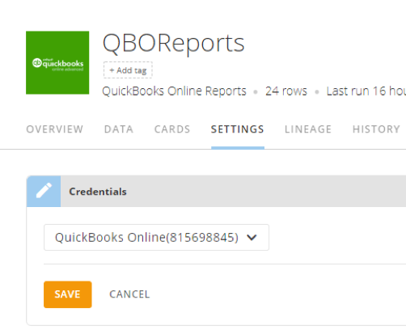

 

**Important:**   
  
**What is happening?**  
Quickbooks will be deprecating their OAuth 1.0 authentication on December 17. After this change, the Domo Quickbooks Online Connectors will no longer be able to authenticate to your Quickbooks Online Accounts. To prepare for this change, Domo is updating the Quickbook Connectors to support the newest version of OAuth that will be ready on December 9.  
  
**How will this change affect me?**  
From December 9 onward, you will need to re-authenticate your Quickbooks Online accounts. Your DataSets will continue updating through December 17.  
  
**What do I need to do to prepare?**  
After the updated Connector is released on December 9, you will not be able to see which Accounts were authenticated for which DataSet. Between today and December 9, please take the time to note which Credential Account your QuickBooks connectors are using.  
  
**Before December 9**  
We recommend adding the account number to the name of each Quickbooks DataSet so you will be able to choose the correct account to authenticate to after the change on December 9. The account number can be found in the account name.  
  
  
You can find all of your QuickBooks Accounts and the DataSets they power in the Accounts section in the Data Center.  
  
**Between December 9 and December 17**  
When you open the DataSet settings on December 9, the credentials section will state that you do not have access to the account that powers the DataSet. You will need to go to each DataSet and click **Use a different account** and then re-authenticate your account by selecting the appropriate one from the drop down or selecting **Add account** to authenticate the one that needs to be used.  
  
**After December 17th**  
Because QuickBooks is deprecating OAuth 1.0 on December 17, if you have not reauthenticated your account by December 17, there is a high probability that your DataSets will not continue updating. Please reauthenticate your account as soon as possible.  
  
**FAQs**  
**What if I don't know which account was authenticated to my DataSet?**  
You will need to figure out which account it is based on the data in the Connector.  
  
**What if I haven't updated my account and my DataSet stops working before December 17?**  
Domo is using the cached AccessToken from the OAuth 1.0 which lasts 180 days. If your token expires between December 9 and December 17, your DataSets will stop running. In this case, you simply need to reauthenticate your account for the DataSets to update.  
  
**How do I found the unique Account ID on QuickBooks Online?**  
To find your unique Account ID in QuickBooks Online, log into your account and select the settings gear. Navigate to **Account and Settings** and select the **Billing** area where you will see the Company ID

Intro
-----

QuickBooks Online is a leading online accounting software. With the QuickBooks Online QuickStart, you have quick access to balance sheet details, PL performance, and important financial ratios like gross profit margin, return on sales, current ratio, and more.

Usage
-----

* Business questions that can be answered:

	+ What is the current state of my assets and liabilities?
	+ How are my revenue and expenses changing over time?
	+ What is my gross profit margin?
	+ What is my return on sales?
	+ What is my current debt ratio?
* Metrics included in the app:

	+ Net Income
	+ Cash Flows
	+ Top Customers
	+ Top Products/Services
	+ Working Capital
	+ Accounts Receivable Aging
	+ Accounts Payable Aging
	+ Current Assets
	+ Fixed Assets
	+ Other Assets
	+ Current Liabilities
	+ Long-Term Liabilities
	+ Top Vendor Expenses
	+ Income
	+ Costs of Goods Sold
	+ Gross Profit
	+ Operating Expenses
	+ EBITDA
	+ Other Income
	+ Other Expenses
	+ Gross Profit Margin
	+ Return on Sales
	+ Current Ratio
	+ Debt Ratio

Authentication
--------------

* QuickBooks Email or User ID
* QuickBooks password

Reports
-------

For report descriptions, see QuickBooks Online Reports Connector.

QuickStart Data
---------------

The QuickBooks Online QuickStart will provide the following data collections and cards:

| Collection
  | Card | Card Description | Data Name |
| --- | --- | --- | --- |
| Executive Pulse: 5 financial metrics to check daily. | Net Income | Also referred to as the bottom line, net profit, or net earnings, is a measure of the profitability of a venture after accounting for all costs. Consider reducing COGS and looking for areas to grow revenue.
 
  | Profit and Loss Detail |
| Executive Pulse: 5 financial metrics to check daily. | Cash Flows | Shows the total amount of cash moving into and out of the company. Monitor balances and ensure that the company has enough cash to run its operations.
  | Statement of Cash Flows |
| Executive Pulse: 5 financial metrics to check daily. | Top Customers | Displays the customers that contribute the most to the company's income. Take measures to maintain good relationships and to retain these customers.
  | Income by Customer Detail
  |
| Executive Pulse: 5 financial metrics to check daily. | Top Products/ Services
  | Displays the company's most profitable products/services. Use this information to help guide product, pricing and promotional decisions.
 
  | Sales by Product/Service Summary |
| Executive Pulse: 5 financial metrics to check daily. | Bank Accounts | Shows the running balance of all bank accounts, by account. Consider investing in new opportunities with excess cash.
  | Balance Sheet |

 

| Collection
  | Card | Card Description | Data Name |
| --- | --- | --- | --- |
| Balance Sheet: Gain perspective on assets, equity and liabilities. | Working Capital | Measures the amount of liquid assets the company has available to build its business. Take measures to ensure that the company maintains a healthy debt load.CALCULATION: Working Capital = Current Assets - Current Liabilities
  | Balance Sheet |
| Balance Sheet: Gain perspective on assets, equity and liabilities. | Accounts Receivable Aging | Categorizes open accounts receivable according to the length of time an invoice has been outstanding (e.g., current, 1-30, 31-60, 61-90, and over 90 days). If necessary, consider taking measures to reduce the average length of time it takes to collect receivables.
  | A/R Aging Detail |
| Balance Sheet: Gain perspective on assets, equity and liabilities. | Accounts Payable Aging | Categorizes open accounts payable according to the length of time an invoice has been outstanding (e.g., current, 1-30, 31-60, 61-90, and over 90 days). Prioritize payment plans to maintain positive relations among suppliers.
  | A/R Aging Detail |
| Balance Sheet: Gain perspective on assets, equity and liabilities. | Current Assets | Displays the value of all assets that are expected to be converted into cash within one year. Improve asset allocation and A/R collection efficiency to maximize profitability.
  | Balance Sheet |
| Balance Sheet: Gain perspective on assets, equity and liabilities. | Fixed Assets | Tracks assets that are not expected to be converted into cash within the next year by account. Consider investing in additional property, plants or equipment, depending on the company’s growth strategy.
  | Balance Sheet |
| Balance Sheet: Gain perspective on assets, equity and liabilities. | Other Assets | Shows the balance of other assets. Consider making additional investments or selling existing assets, as needed.
 
  | Balance Sheet |
| Balance Sheet: Gain perspective on assets, equity and liabilities. | Current Liabilities | Displays the value of all debts or obligations that are due within one year by account. Consider reducing spending or liquidating assets in order to meet obligations, as necessary.
  | Balance Sheet |
| Balance Sheet: Gain perspective on assets, equity and liabilities. | Long-Term Liabilities | Displays the value of all debts or obligations, by account, that are not due within one year. Take measures to ensure that the company maintains a healthy debt load.
 
  | Balance Sheet |

 

| Collection
  | Card | Card Description | Data Name |
| --- | --- | --- | --- |
| Profit & Loss: Monitor revenue and expenses over time. | Top Vendor Expenses | Displays the company's top 20 vendor expenses. Use this information to determine what expenses can be reduced without adversely affecting the company.
 
  | Expenses by Vendor |
| Profit & Loss: Monitor revenue and expenses over time. | Income |  
 
 
             Shows the income received from the direct sale of goods, broken down by account. Use this information to understand where revenue is being generated and what areas could use improvement.
 
  | Profit and Loss Detail |
| Profit & Loss: Monitor revenue and expenses over time. | Costs of Goods Sold | Tracks direct costs attributable to the production of goods sold by the company. This information can be used to provide insight into the company's gross margin.
  | Profit and Loss Detail |
| Profit & Loss: Monitor revenue and expenses over time. | Gross Profit | Measures the difference between revenue and the cost of making a product or providing a service, before deducting overhead, payroll, taxation, and interest payments. This information can help the company determine the value of incremental sales and guide pricing and promotion decisions.
  | Profit and Loss Detail |
| Profit & Loss: Monitor revenue and expenses over time. | Operating Expenses | Tracks the company's operating expenses (costs from the company's normal business operations). Expenses should be monitored and controlled to ensure that cost cutting strategies do not negatively impact the quality of the business or damage the company.
  | Profit and Loss Detail |
| Profit & Loss: Monitor revenue and expenses over time. | EBITDA | Measures earnings before interest, taxes, depreciation and amortization (EBITDA). Use this information to gain insight into the profitability of the company's operations.
 
  | Profit and Loss Detail |
| Profit & Loss: Monitor revenue and expenses over time. | Other Income | Shows the income received from sources other than the direct sale of goods. Use this information to understand additional revenue streams of the business.
  | Profit and Loss Detail |
| Profit & Loss: Monitor revenue and expenses over time. | Other Expenses | Tracks the company's other expenses (non-operating costs). Expenses should be monitored and controlled to ensure that cost cutting strategies do not negatively impact the quality of the business or damage the company.
  | Profit and Loss Detail |

 

| Collection
  | Card | Card Description | Data Name |
| --- | --- | --- | --- |
| Ratios: Gain perspective on financial status and prospects for the future. | Gross Profit Margin | Measures the difference between revenue and the cost of making a product or providing a service, before deducting overhead, payroll, taxation, and interest payments. Consider making changes to product pricing and production costs to improve margins.CALCULATION: Gross Profit Margin = Income - Cost of Goods Sold / Income
  | Profit and Loss Detail |
| Ratios: Gain perspective on financial status and prospects for the future. | Return on Sales |  
 
 
Measures the company's operational efficiency. Consider making changes to product pricing, production costs and operational efficiencies to improve margins. CALCULATION: Return on Sales = Net Income / Sales
  | Profit and Loss Detail |
| Ratios: Gain perspective on financial status and prospects for the future. | Current Ratio | Measures the company's liquidity and ability to pay short-term obligations. Take measures to ensure that the company maintains a healthy debt load.CALCULATION: Current Ratio = Current Assets / Current Liabilities
  | Balance Sheet |
| Ratios: Gain perspective on financial status and prospects for the future. | Debt Ratio | Measures the company's debt relative to its assets. Take measures to ensure that the company maintains a healthy debt load.CALCULATION: Debt Ratio = Total Liabilities / Total Assets
 
  | Balance Sheet |

 

