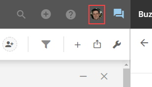
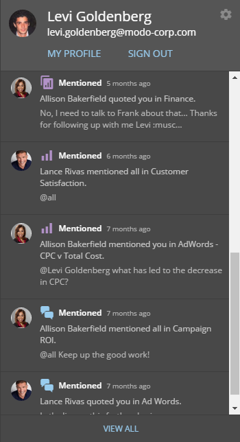
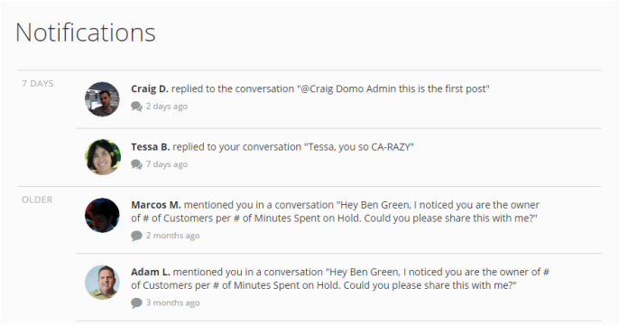

---
    title: Receiving and Viewing Notifications
    url: https://domo-support.domo.com/s/article/360042925954
    linked_kbs:  ['[https://domo-support.domo.com/s/knowledge-base/](https://domo-support.domo.com/s/knowledge-base/)', '[https://domo-support.domo.com/s/](https://domo-support.domo.com/s/)', '[https://domo-support.domo.com/s/topic/0TO5w000000ZamsGAC](https://domo-support.domo.com/s/topic/0TO5w000000ZamsGAC)', '[https://domo-support.domo.com/s/topic/0TO5w000000ZanxGAC](https://domo-support.domo.com/s/topic/0TO5w000000ZanxGAC)', '[https://domo-support.domo.com/s/article/360042925574](https://domo-support.domo.com/s/article/360042925574)', '[https://domo-support.domo.com/s/article/360043430513](https://domo-support.domo.com/s/article/360043430513)', '[https://domo-support.domo.com/s/article/360042923834](https://domo-support.domo.com/s/article/360042923834)', '[https://domo-support.domo.com/s/article/360042925814](https://domo-support.domo.com/s/article/360042925814)', '[https://domo-support.domo.com/s/article/360042925794](https://domo-support.domo.com/s/article/360042925794)', '[https://domo-support.domo.com/s/article/360042925954](https://domo-support.domo.com/s/article/360042925954)', '[https://domo-support.domo.com/s/topic/0TO5w000000ZanxGAC/notifications-and-alerts](https://domo-support.domo.com/s/topic/0TO5w000000ZanxGAC/notifications-and-alerts)', '[https://domo-support.domo.com/s/article/360043429933](https://domo-support.domo.com/s/article/360043429933)', '[https://domo-support.domo.com/s/article/360043429953](https://domo-support.domo.com/s/article/360043429953)', '[https://domo-support.domo.com/s/article/360042925494](https://domo-support.domo.com/s/article/360042925494)', '[https://domo-support.domo.com/s/article/360043429913](https://domo-support.domo.com/s/article/360043429913)', '[https://domo-support.domo.com/s/article/4408174643607](https://domo-support.domo.com/s/article/4408174643607)', '[https://domo-support.domo.com/s/login/](https://domo-support.domo.com/s/login/)']
    article_id: 000004351
    views: 2,190
    created_date: 2022-10-24 21:45:00
    last updated: 2022-10-24 22:40:00
    ---

Intro
-----

You can be notified when certain events occur in Domo. You can receive Notifications via email or text. These event occurrences include the following:

* A Buzz message is posted to a conversation you are a member of.  
For more information, see [Chatting in Buzz](/s/article/360042925574 "Chatting in Buzz").
* You are mentioned in a Buzz discussion using @ (in which case you become a part of the discussion and continue receiving Notifications for comments in that discussion unless you unfollow the discussion).
* An Alert you have created is triggered. For more information, see [Creating a Custom Alert for a Visualization Card](/s/article/360043430513 "Creating a Custom Alert for a KPI Card").
* A Domo Daily Alert Summary message is sent to you.
* An issue is reported in a card that you own or that you are following. For more information, see [Reporting Issues with Cards](/s/article/360042923834 "Reporting Issues with Cards").
* Someone "likes" a discussion you started or a comment you made in Buzz.

In addition, you can view all of your Notifications by clicking your user profile photo in the top right corner of the screen.

Configuring Notifications
-------------------------

You can specify how you receive Notifications for certain events in the Notifications Center. For more information, see [Configuring Notification and Alert Settings](/s/article/360042925814 "Configuring Notification and Alert Settings").

**Video - Notifications and Settings in Buzz**

Viewing Notifications
---------------------

You can view Notifications in your user profile panel. You open this panel by clicking your user profile picture in the top right corner of the screen.

The most recent Notification events appear in the panel. You can open a conversation in Buzz by clicking on its message.

You can see all of your Notifications (sorted by date) in an enlarged view by clicking **View All** at the bottom of the panel view.

Unfollowing conversations
-------------------------

You can stop receiving Notifications for conversations you are a member of by unfollowing those conversations in Buzz. This is discussed in more detail in [Unfollowing a Buzz Conversation](/s/article/360042925794 "Unfollowing a Buzz Conversation").

