Intro
-----

With Cloud Amplifier, you can power your Domo instance using Snowflake.  
  
This article is for users who are familiar with Snowflake and provides information on how to register Snowflake with Cloud Amplifier in the following topics:

* [Prerequisites](#pre-reqs)
* [Read-only setup](#read_only)
* [Write setup](#write_integration)
* [Using Snowflake-sourced DataSets](#snowflake)
* [Troubleshooting](#troubleshooting)

You can also find troubleshooting techniques for common places where you may get stuck.

Prerequisites
-------------

Cloud Amplifier setup consists of two parts: Read-only or Read/Write.  
After the Read-only setup is complete, you may begin using virtual tables that read from Snowflake to create cards, set up Alerts, or serve as inputs in Magic ETL flows. You can set up Read-only and return later to set up the Write portion.  
  
Before setting up the Read-only configuration, you must complete the following:

* (Recommended) ​Create a Snowflake service account
 We recommend creating a new Snowflake account specifically for this integration. You can use any account with read access in Snowflake, but a service account is best practice. This account must have read access to your default Snowflake environment in order to create virtual Snowflake tables in Domo.
* (Recommended) Create a Domo service account
 We recommend creating a new Domo account specifically for this integration. The account role must have the Manage Cloud Accounts and Manage DataSet grants enabled.  
 For more information about roles and grants, see [Managing Custom Roles.](/s/article/360043438973)

Before registering with Cloud Amplifier for the Write portion of the setup, you must complete the following:

* (Required) Create a default Snowflake database 

 You need a Snowflake database that is exclusively for Domo to write Domo-managed tables. During setup, this database is the default.

 

**Note:** Any tables not managed by Domo in this database will not be seen by Cloud Amplifier.

 

* (Conditional) Place IP Addresses on an allowlist
 If your Snowflake environment restricts access based on IP address, you may need to place Domo IPs on an allowlist.

For more information, see [Allowlisting IP Addresses for Connectors and Federated Adapters](/s/article/360043630093).

 

**Important:** During the Write setup process, you are provided with SQL statements to create the integration. These statements must be executed against your Snowflake environment by a Snowflake administrator with the ACCOUNTADMIN role.  
 This is a Snowflake requirement and prevents the need to manage your Snowflake administrator credentials within Domo, which is especially important in larger organizations where your Snowflake administrator may not have Domo access. After the integration is established, you no longer need a Snowflake administrator account.

Read-only Setup
---------------

To set up Read-only access and to begin referencing Snowflake tables from within Domo using Cloud Amplifier, follow these steps:

1. Log into your Domo service account.
2. In the navigation header, select **Data**.  
 The Data Center displays.
3. If you are not already there, go to the   **Data Warehouse**in the side rail.
4. In the warehouse area of the screen, select the molecule.  
 The screen brings the molecule into focus. 
 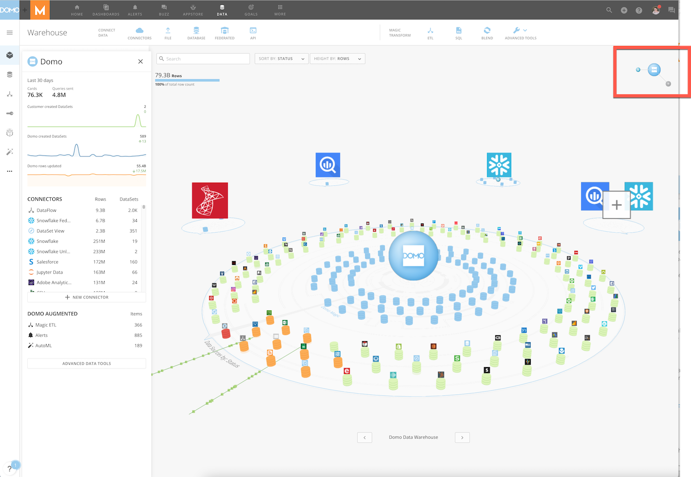

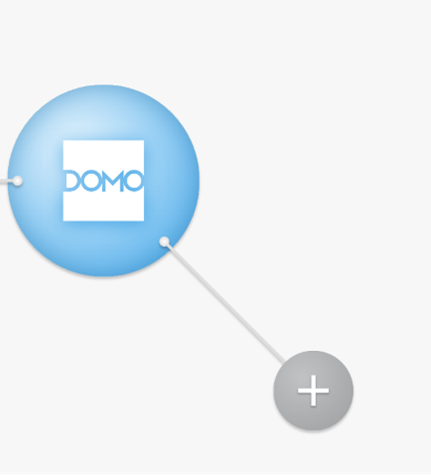
5. Select ** Add New Cloud**.  
 A modal displays.
6. Select **Snowflake** from the**Native integration** menu.
 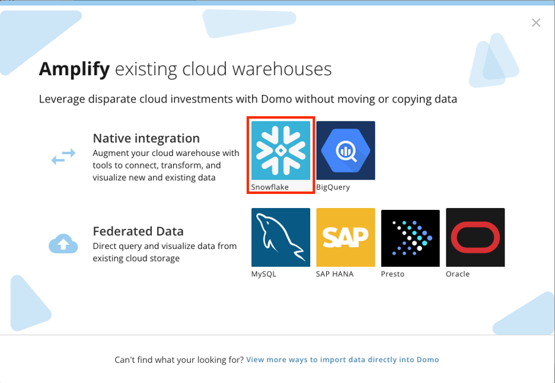
7. Select **+ Add New Integration**.
 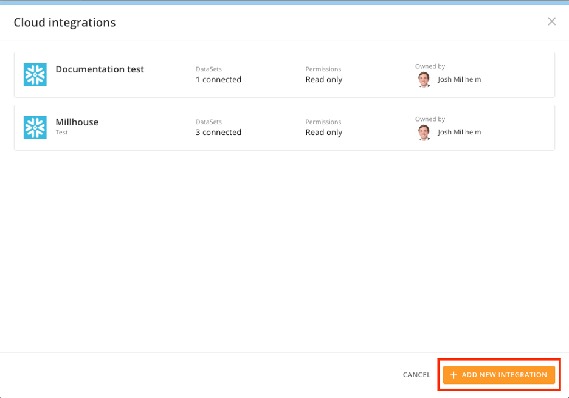
8. Enter the Snowflake setup information:
	* **Integration name —**A unique name to help you identify the integration in Domo.
	* (Optional) **Integration description —**An optional description for the integration.
	* **Snowflake connection URL —**This is your Snowflake URL. You can find the URL on the Snowflake login page. The URL is in this format: *instancename.region*.[snowflakecomputing.com](http://snowflakecomputing.com).
	 
	
	 
	
	**Important:** Be sure to remove "[https://"](https://)" from the beginning and anything after ".com." If you have an issue during setup, check this field. It is the most common place to find a mistake.
	* **Username/password —** The credentials for the Snowflake service account that you created.
	 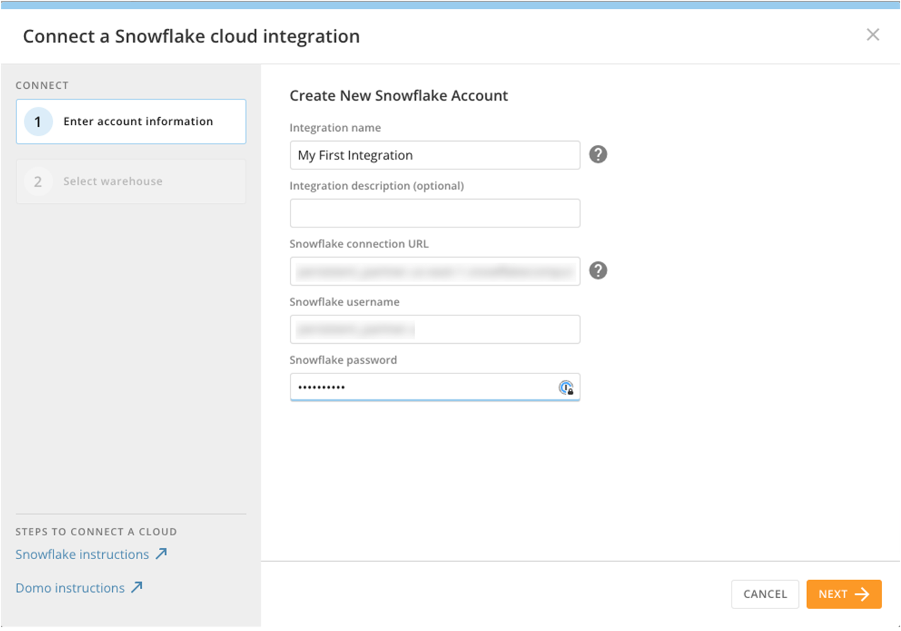
9. Select the Snowflake warehouse to use for loading and/or querying data.
 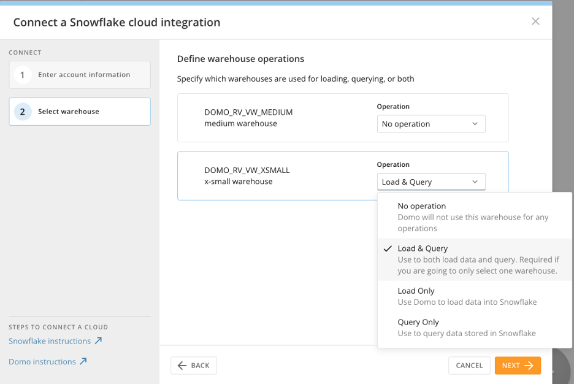
10. Read-only configuration is now complete.
 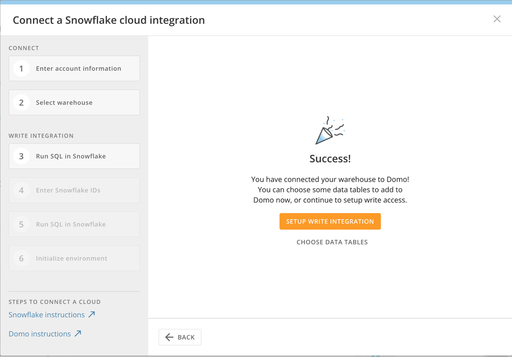
11. (Optional) Select data dables to create DataSets in Domo. Navigate to the desired tables by choosing the appropriate Snowflake **database** > **schema** > **tables**. 
 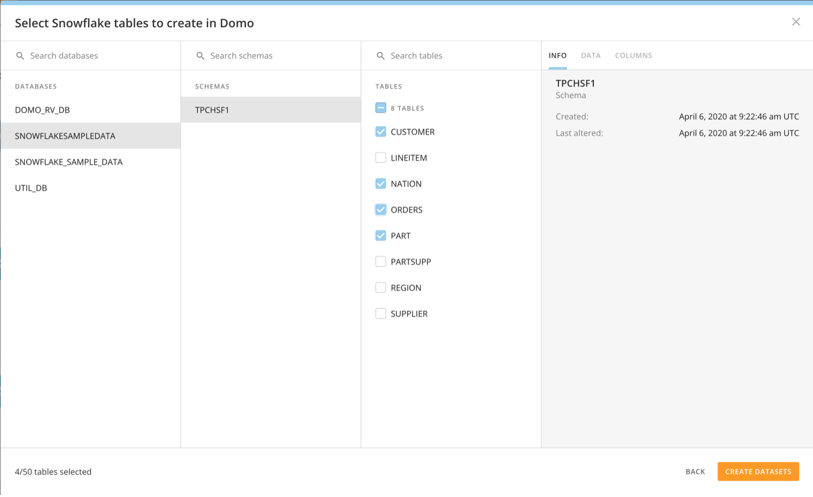

Write Setup
-----------

Registering with Cloud Amplifier for write capabilities is a multi-step process that requires a Snowflake administrator.

The following graphic displays the process to register a Snowflake instance with Cloud Amplifier. 

1. Enter the name of the **Default Role** that you assigned to the Snowflake service account and the **Snowflake write database name**.

 The **Snowflake write database name** is the default Snowflake Database to which all new data coming from Domo is added. The name is case-sensitive and each letter should be capitalized.
2. Select **Generate SQL** to generate SQL unique to this integration.
 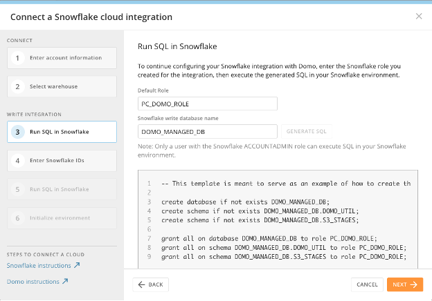

 

**Important:** This SQL cannot be used for other integrations or accounts and must be regenerated if the credentials are changed.
3. Copy the SQL from the dialog and execute the SQL against your Snowflake warehouse. This SQL can only be executed by a Snowflake account administrator with the ACCOUNTADMIN role. The output of that SQL is a CSV file description of the integration that includes IDs required by Domo to continue setup. 
 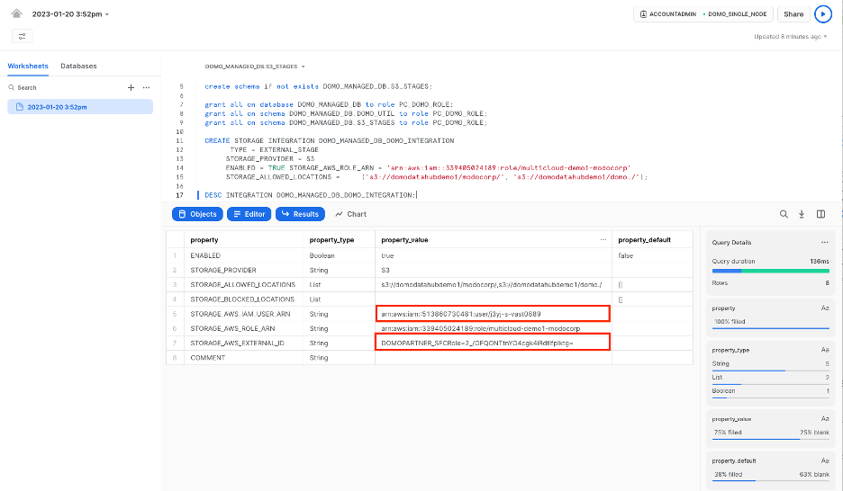
4. Copy the following values from the SQL output:
	* **User ARN**:STORAGE\_AWS\_IAM\_USER\_ARN
	* **External ID**: STORAGE\_AWS\_EXTERNAL\_ID 
	 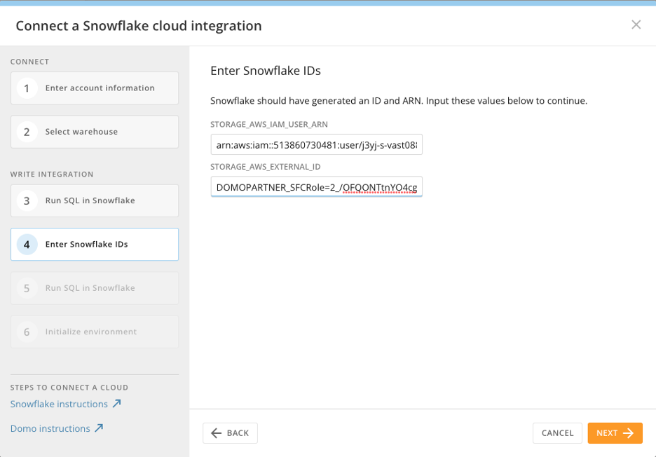Additional SQL is generated to register the ARN and External ID with Domo. A Snowflake administrator with the ACCOUNTADMIN role must execute this SQL against the warehouse you selected for storing data earlier in this process. 
	
	
	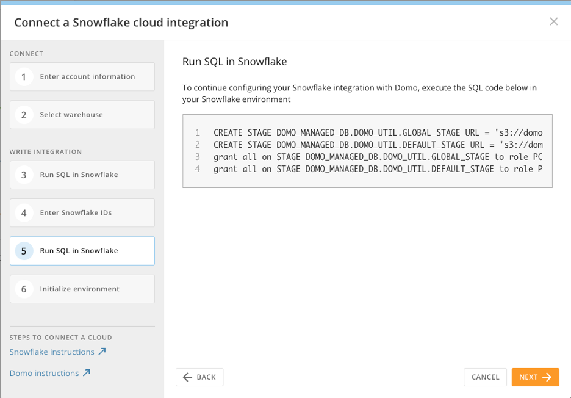
	
	
	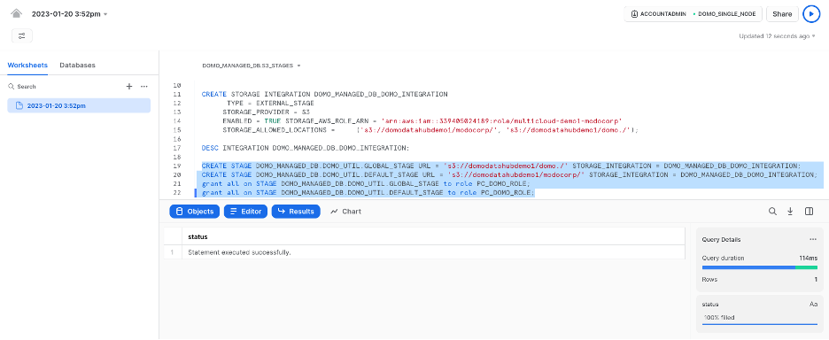
5. In Domo, confirm that the script successfully executed. Domo then initializes the Snowflake integration, creates required assets in Snowflake, such as tables and schemas, and enables Cloud Amplifier for this account.
 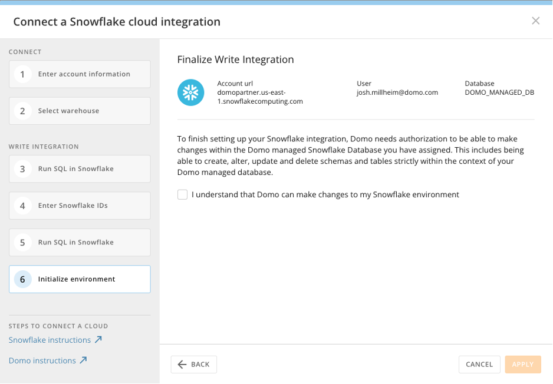  
 When you see the **Select Snowflake tables** screen, your connection is working.
6. (Optional) Select **Choose Data Tables** to create DataSets in Domo. Navigate to the desired tables by selecting **database**> **s****chema** > **t****ables**. 
 

Registration is now complete.

Using Snowflake-sourced DataSets
--------------------------------

When Snowflake-sourced DataSets are used in a DataFlow, the data is queried live from Snowflake at the time the flow is executed. In addition, Snowflake-sourced DataSets are checked for updates every 15 minutes based on the table's LAST\_ALTERED DateTime. If a table has been updated since it was last checked, DataFlows that use that table as a trigger execute.

Troubleshooting
---------------

If you get stuck, one of the following may help:

**Check Snowflake Service Account**

1. Log into Snowflake with the service account credentials.

2. Make sure you can view the default Snowflake Database and can query tables that you expect to import.

**Assign Correct Role**

Make sure that a Snowflake administrator with the ACCOUNTADMIN role is executing the SQL that Domo provided in Snowflake.

**Use Correct URL**

Make sure that the Snowflake connection URL in Domo matches the Snowflake login URL.

You can find the URL on the Snowflake login page. The URL will be in this format: *instancename.region.*snowflakecomputing.com.

 

**Important:** Be sure to remove "[https://"](https://)" from the beginning and anything after ".com." If you have an issue during setup, check this field. It is the most common place to find a mistake.

If you are still experiencing issues, please submit a request to the [Domo Support](https://domo-support.domo.com) team.

 