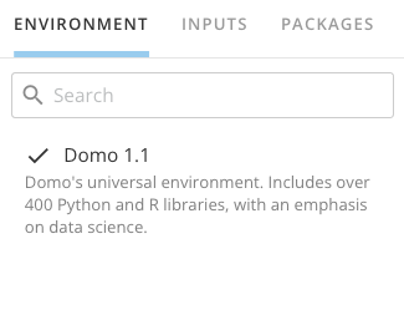
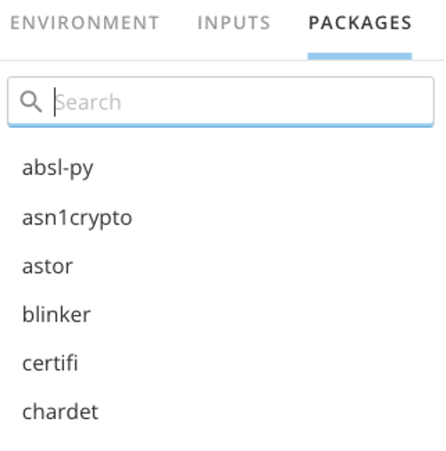
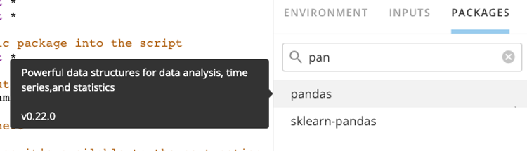
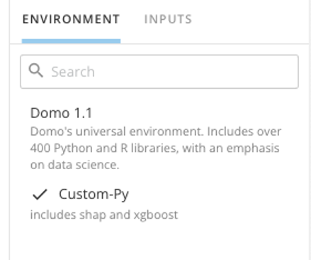

Intro
-----

You can use the Scripting tiles in Magic ETL to automate data processing and data science workflows. For an overview, see [Magic ETL Tiles: Scripting](/s/article/360045485833).

In this article, we’ll provide an overview of your default environment and how to add a custom environment for R and Python that meets your DataFlow needs.

 

**Important:** We strongly recommend reading the [Behavior Changes and Feature Updates in Magic ETL](file:///hc/en-us/articles/360047787514) article before converting mission-critical Magic ETL DataFlows. **Failure to do so may risk an unintended change to your DataFlow’s behavior.**

 

**Note:**  This feature is available *on demand and paid*.

 

To request this feature be enabled, reach out to your Customer Success Manager (CSM), Technical Consultant (TC), or Account Executive (AE). If you do not have contact information for them, see [Getting Help.](/s/article/360042922874)

Depending on the feature, you may be required to complete training before you can use the feature.

Default Environment
-------------------

Domo 1.1 is your default environment. It includes over 400 R and Python packages.  
  

To see the list of packages and versions included in your environment, select **Packages**. You can select a package to see its description and version.  
  

Custom Environment
------------------

You can issue a custom environment in your Domo instance by submitting a request to Domo Support. You can create custom environments for both R and Python, based on your needs.

Please include the items below in your request to the Support team.

* Name you would like to use for the new environment (e.g., “Custom-Py”).
* Description of the new environment.
* Version of Python or R needed.
* List of packages and respective versions (or minimal version.)

**Important:** Custom environments do not contain all the packages included in the default environment. If a script is relying on a package available in the default environment, that package will need to be specified in the request for the custom environment.

Your new environment will appear under **Environment**, and you will be able to select it for your DataFlow.  
  

