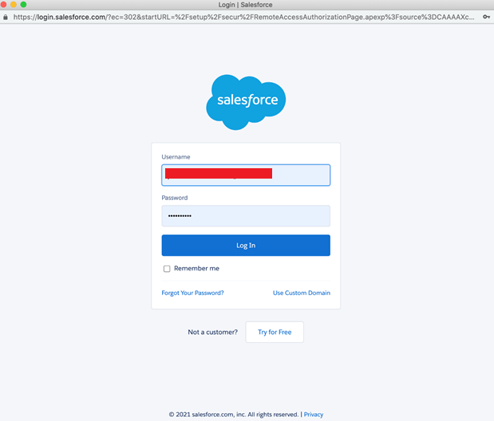
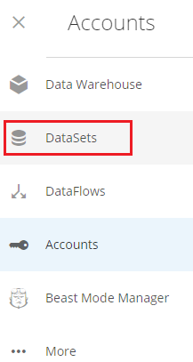

---
    title: Salesforce Pardot to Salesforce Pardot SSO Connector Migration
    url: https://domo-support.domo.com/s/article/360062526733
    linked_kbs:  ['[https://domo-support.domo.com/s/knowledge-base/](https://domo-support.domo.com/s/knowledge-base/)', '[https://domo-support.domo.com/s/](https://domo-support.domo.com/s/)', '[https://domo-support.domo.com/s/topic/0TO5w000000ZammGAC](https://domo-support.domo.com/s/topic/0TO5w000000ZammGAC)', '[https://domo-support.domo.com/s/topic/0TO5w000000ZanLGAS](https://domo-support.domo.com/s/topic/0TO5w000000ZanLGAS)', '[https://domo-support.domo.com/s/topic/0TO5w000000ZaoQGAS](https://domo-support.domo.com/s/topic/0TO5w000000ZaoQGAS)', '[https://domo-support.domo.com/s/article/360062526733](https://domo-support.domo.com/s/article/360062526733)', '[https://domo-support.domo.com/s/topic/0TO5w000000ZaoQGAS/api-connectors](https://domo-support.domo.com/s/topic/0TO5w000000ZaoQGAS/api-connectors)', '[https://domo-support.domo.com/s/article/360043429933](https://domo-support.domo.com/s/article/360043429933)', '[https://domo-support.domo.com/s/article/360043429953](https://domo-support.domo.com/s/article/360043429953)', '[https://domo-support.domo.com/s/article/360042925494](https://domo-support.domo.com/s/article/360042925494)', '[https://domo-support.domo.com/s/article/4408174643607](https://domo-support.domo.com/s/article/4408174643607)', '[https://domo-support.domo.com/s/article/360043429913](https://domo-support.domo.com/s/article/360043429913)', '[https://domo-support.domo.com/s/login/](https://domo-support.domo.com/s/login/)']
    article_id: 000003254
    views: 1,088
    created_date: 2022-10-24 21:12:00
    last updated: 2022-10-24 22:41:00
    ---

 

 

Intro
-----

Beginning on February 15, 2021, Pardot’s user authentication system will be discontinued and all users will be required to use Salesforce Single Sign-On (SSO). The users who are not enabled with Salesforce SSO by February 15, 2021 will lose the ability to log into Pardot until they are connected to a Salesforce user. This only impacts the way users authenticate to Pardot.

Domo users with Pardot DataSets need to migrate to the Salesforce Pardot SSO Connector because Salesforce is going to force them to use SSO.

#### *What is happening?*

Salesforce will require Salesforce Single Sign-On to access Pardot beginning on February 15, 2021. See [Pardot User Migration Overview](https://help.salesforce.com/articleView?id=000353746&language=en_US&mode=1&type=1) for more information.

#### *What is the impact of this change?*

* Beginning on February 15, 2021, you will need to use Domo’s Salesforce Pardot Connector with Single Sign-On Support (com.domo.connector.pardot.oauth) to create new DataSets for Pardot.
* Current DataSets using Domo’s Salesforce Pardot Connector (com.domo.connector.pardot) will need to be migrated to the Single Sign-On version by February 15, 2021 to prevent disruptions of service.

#### *What do I need to do?*

If you no longer need your Pardot DataSets, then no action is required on your part.

If you are using the non-SSO version of the Salesforce Pardot Connector (com.domo.connector.pardot) and need to keep using your Pardot DataSets, you will need to do the following:

* Contact Domo Support to request your DataSets to be migrated. Please include the DataSet ids of the DataSets. Domo Support will contact you once the DataSets are completely migrated.
* Create a Pardot OAuth Account. You can create this account at any time.
* Once the DataSets are migrated and you have created your Pardot OAuth Account, associate the new Account with your migrated DataSets.
* Run your DataSets.

#### *Will there be an outage of my Pardot DataSets during the migration?*

Your Pardot DataSets will not run between the time they are migrated to the new Connector version, and the time you associate them with the new OAuth Account. 

#### *What happens if I don’t migrate my DataSets by February 15, 2021?*

If you do not migrate your DataSets by February 15, 2021, your DataSets will continue to run until Salesforce’s hard cutover in June. However, Salesforce will be implementing rolling outage windows from February 2021 until the hard cutover. See [Pardot User Migration Overview](https://help.salesforce.com/articleView?id=000353746&language=en_US&mode=1&type=1) for more information.

#### *What should I do if I run into issues?*

Please contact Domo Support if you have any questions, or if you have issues with your migrated DataSets.

#### *How do I create a Salesforce Pardot OAuth Account?*

Creating a Salesforce Pardot OAuth account*:*

1. In the Data Center, click on the **Accounts** icon in the left-hand pane.

2. The Accounts section will appear.

3. Click **Add Account**. 

4. Select the **Salesforce Pardot OAuth Account.**

5. The Log in window for Salesforce Pardot will appear. Enter your business unit and concurrency unit. Click **Connect**.

6. You will then be prompted to enter your Salesforce username and password in a separate OAuth window.

7. Enter your Salesforce credentials, and click **Login** to finish creating the Account.

#### *How do I associate the new Account with my DataSets?*

Associating the new OAuth account with Pardot DataSets:

1. In the Data Center, click on the **DataSets** icon in the left-hand pane.

2. Locate your existing DataSet that you want to associate with a new Salesforce Pardot OAuth account.

3. The DataSet details will appear.

4. Under **Settings**, look for the **Credentials**. You will now be able to select the Salesforce Pardot OAuth Account that you have previously created.

 

