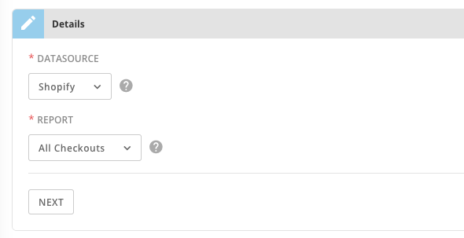
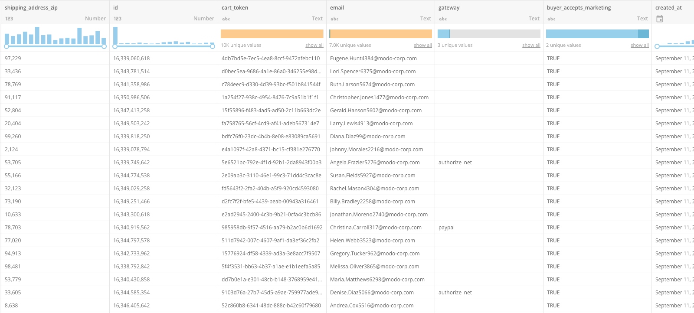

---
    title: Sample Data Connector
    url: https://domo-support.domo.com/s/article/360043435953
    linked_kbs:  ['[https://domo-support.domo.com/s/knowledge-base/](https://domo-support.domo.com/s/knowledge-base/)', '[https://domo-support.domo.com/s/](https://domo-support.domo.com/s/)', '[https://domo-support.domo.com/s/topic/0TO5w000000ZammGAC](https://domo-support.domo.com/s/topic/0TO5w000000ZammGAC)', '[https://domo-support.domo.com/s/topic/0TO5w000000ZanLGAS](https://domo-support.domo.com/s/topic/0TO5w000000ZanLGAS)', '[https://domo-support.domo.com/s/topic/0TO5w000000ZaoQGAS](https://domo-support.domo.com/s/topic/0TO5w000000ZaoQGAS)', '[https://domo-support.domo.com/s/article/360042926274](https://domo-support.domo.com/s/article/360042926274)', '[https://domo-support.domo.com/s/article/360043435953](https://domo-support.domo.com/s/article/360043435953)', '[https://domo-support.domo.com/s/topic/0TO5w000000ZaoQGAS/api-connectors](https://domo-support.domo.com/s/topic/0TO5w000000ZaoQGAS/api-connectors)', '[https://domo-support.domo.com/s/article/360043429933](https://domo-support.domo.com/s/article/360043429933)', '[https://domo-support.domo.com/s/article/360043429953](https://domo-support.domo.com/s/article/360043429953)', '[https://domo-support.domo.com/s/article/360042925494](https://domo-support.domo.com/s/article/360042925494)', '[https://domo-support.domo.com/s/article/4408174643607](https://domo-support.domo.com/s/article/4408174643607)', '[https://domo-support.domo.com/s/article/360043429913](https://domo-support.domo.com/s/article/360043429913)', '[https://domo-support.domo.com/s/login/](https://domo-support.domo.com/s/login/)']
    article_id: 000003308
    views: 2,162
    created_date: 2022-10-24 21:12:00
    last updated: 2022-10-24 22:40:00
    ---

Intro
-----

You can use Domo's Sample Data Connector to generate sample data for any of our Cloud App connectors without actually needing to supply credentials for that system. This is useful for seeing the kind of data available for a given connector as well as the types of cards you can build from it. Note that this connector is used to generate sample data for our Cloud App connectors, such as Facebook and Salesforce reports. It cannot be used to retrieve files (such as Excel or Box files) or data from databases (such as MySQL query data). For more information about these connector types, see [Adding a DataSet using a connector](/s/article/360042926274 "Adding a DataSet Using a Data Connector").

You can import sample data for a connector in the Data Center. This topic discusses the fields and menus that are specific to the Sample Data Connector user interface. General information for adding DataSets, setting update schedules, and editing DataSet information is discussed in [Adding a DataSet Using a Data Connector](/s/article/360042926274 "Adding a DataSet Using a Data Connector").

You can find out more about this connector here: [https://developer.domo.com/docs/appstore/data-resources-2#Sample%20Data%20Engine](https://developer.domo.com/docs/appstore/data-resources-2#Sample%20Data%20Engine "https://developer.domo.com/docs/appstore/data-resources-2#Sample%20Data%20Engine").

|  |  |
| --- | --- |
| **Primary Use Cases** | This connector is useful in the following use cases:* When you're trying to understand what Domo might be able to offer for a given third-party system you're considering (especially when you don't currently have access to the system).
* When you need non-private data that still tells a story to prototype cards, dashboards, or Apps.
 |
| **Primary Metrics** | N/A |
| **Primary Company Roles** | * Developers
* Software purchasers
* BI analysts
 |
| **Average Implementation Time** | Less than 5 minutes |
| **Ease of Use (on a 1-to-10 scale with 1 being easiest)** | 2 |

**Video - Sample Data Connector**

Best Practices
--------------

Be aware that when the actual connectors change versions due to API updates by the third party, there is a lag time for the sample data version to be updated to correspond with the new connector's reports and DataSets.

Prerequisites
-------------

None. The Sample Data Engine connector does not require credentials or any other information to work—all you need to do is select the Domo Cloud App connector you want to generate sample data for, as well as the specific report.  
 

Connecting to Sample Data
-------------------------

Because this is sample data, the Sample Data Engine connector has no **Credentials** pane and only the **Details** pane needs to be configured. 

#### Datasource

Use the drop-down to select the third party connector for which you want to generate sample data. 

#### Report

Select a report from the drop-down for which you would like to generate sample data. 

 

Using the above configuration, my sample data will look like this:

  
 

### Other Panes

For information about the **Scheduling** and **Name & Describe Your DataSet** panes, see [Adding a DataSet Using a Data Connector](/s/article/360042926274 "Adding a DataSet Using a Data Connector").

