Intro
-----

Thank you for your interest in the Scheduler app! This guide will help you familiarize yourself with the features and layout of the app— please refer to the Scheduler Implementation Guide for app set-up and further explanation into the app’s features. The main purpose of the Scheduler app is to allow for a broad variety of scheduling use-cases, as opposed to other offerings in the market which are targeted towards very specific business needs. You can also select which language you would like the app to appear in, the language configuration is done in the admin settings.  
  

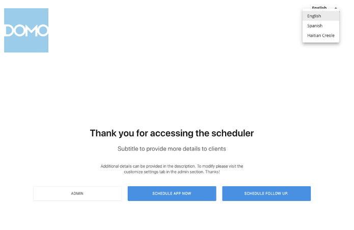

How do I get this?
------------------

To begin using the Scheduler app, locate the app in the Appstore or have an Admin contact your Customer Success Manager.

Scheduler
---------

The Scheduler portion of the app, which is set-up and configured in the Admin settings, is where end-users will go to schedule initial and follow-up appointments. The flow/ordering of sections, questionnaire, and availability, are a few of the options that appear throughout the Scheduler that are implemented on the Admin side and are not hard-coded.

### Splash Screen

The first thing that you will see in the app is the app splash screen, which can be customized in the Admin settings. End-users will only be able to see the **Schedule Now** button and **Schedule Follow-Up** button—if follow-up appointments have been enabled in the app—and will not be able to see the **Admin** button.  
  

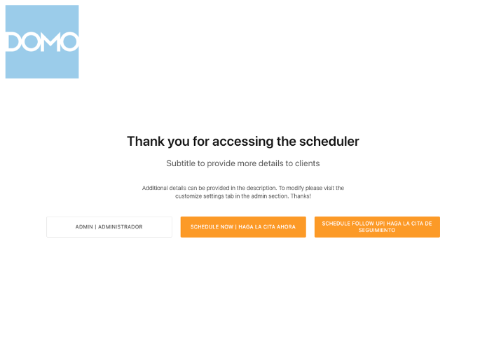

### Schedule Now - Information

The first step of the Scheduler is the **Information** section—note that the title can be changed by admins in Admin settings. The questions in the Information section are hard-coded and cannot be changed by admins. The questions include:

1. First Name: free-text field
2. Last Name: free-text field
3. Date of Birth: validated MM/DD/YYYY format
4. Address: free-text field
5. City: free-text field
6. State: dropdown with pre-populated options
7. Zip Code: validated numeric field (5-to-9-digit format)
8. Phone Number: validated numeric field (\_\_\_) \_\_\_-\_\_\_\_
9. Email Address: validated free-text field
10. Validate Email Address: validated free-text field (validated against the end-users answer to the Email Address question)

All of the questions are required in this section, and if any fields are left blank end-users will not be able to move on to the next section.

Users can move to the next section by selecting the **Next Step** button from the bottom-right corner of the screen. The **Cancel** button will take users back to the splash screen.  
  

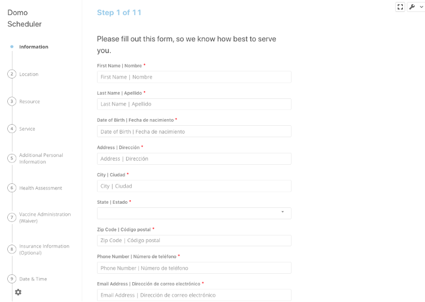  
  

### Schedule Now - Location

A list of locations—configured in the Admin settings—will be available to end-users in this section. Users can only select one option from the list, or they can select the **Any** option if it has been enabled by Admins. The selected location will determine the date and time range available for scheduling.

Users can move to the next section by selecting the **Next Step** button from the bottom-right corner of the screen or move to the previous section by selecting the **Previous Step** button. The **Cancel** button will take users back to the splash screen.  
  

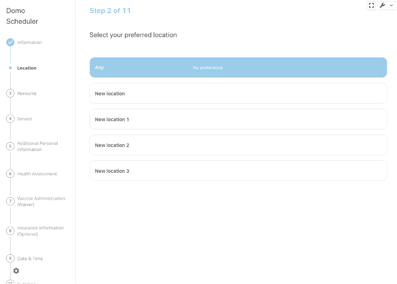  
  

### Schedule Now - Resource

A list of resources—configured in the Admin settings—will be available to end-users in this section. Available resources will be dependent upon the location that was selected. Users can only select one option from the list, or they can select the **Any** option if it has been enabled by Admins.  
  

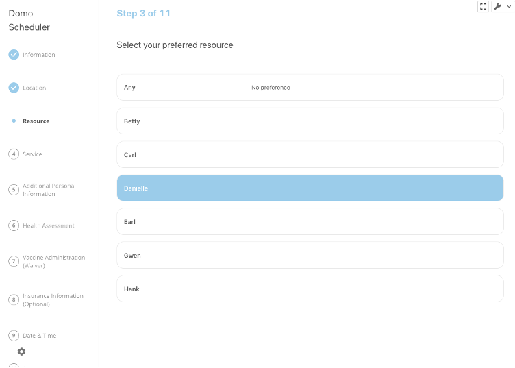  
  

### Schedule Now - Service

A list of services—configured in the Admin settings—will be available to end-users in this section. Available services will be dependent upon the location and resource that were selected. Users can only select one option from the list, or they can select the **Any** option if it has been enabled by Admins.  
  

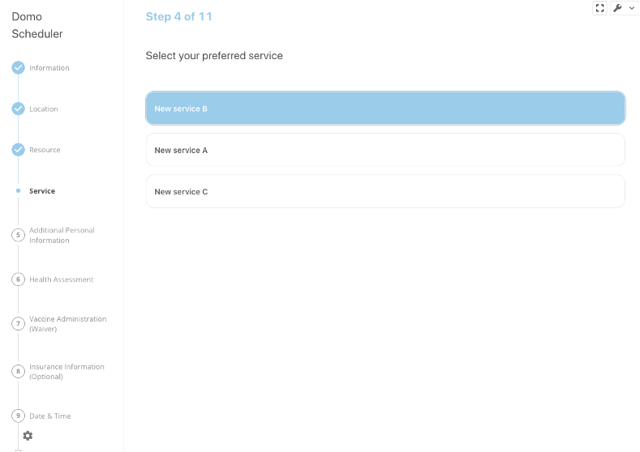  
  

### Schedule Now - Date & Time

The date and time of an appointment can be selected on this screen. Resources can also be changed on this screen if users want to use a different resource for their appointment. Available appointments will be indicated on the calendar and once a date has been selected the available appointment times will show on to the right of the calendar. Only one appointment can be scheduled at a time. If there are no available time periods for the selected day then the time option will not appear.  
  

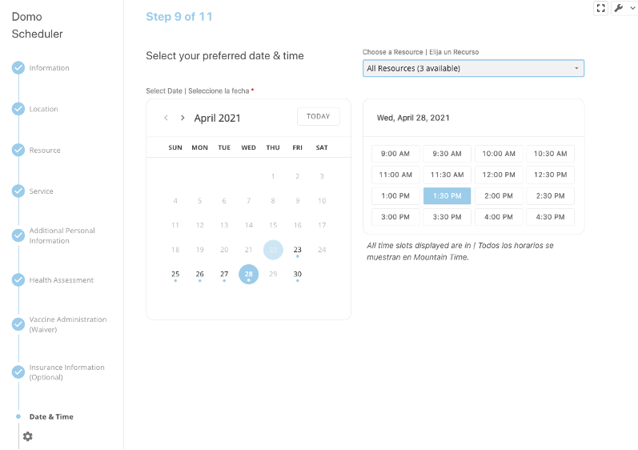  
  

### Schedule Now - Questionnaire

The questionnaire section may or may not be available in the Scheduler, depending on if the Admin included it in the configuration portion of the app. The questionnaire may be different for every version of the Scheduler depending on the connected Form Builder DataSet.  
  

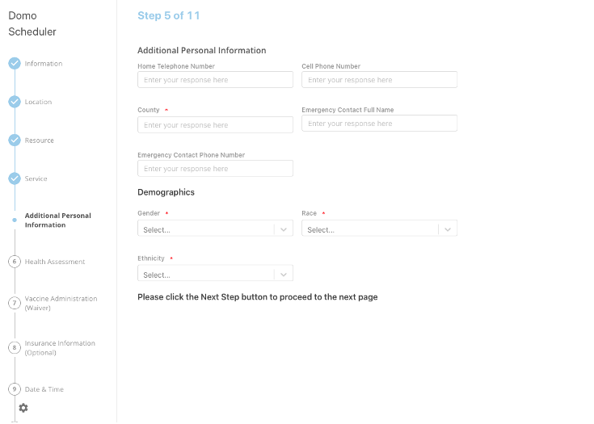  
  

### Schedule Now - Summary

The Summary screen shows an overview of all of the submitted answers in each section in order (i.e., Information, Resource, Location, Date & Time, etc.). In order to book their appointment, users will need to select the **Submit** from the bottom-right corner of the screen. The Summary screen also includes a reCAPTCHA checkbox that will need to be checked before submitting their appointment information.  
  

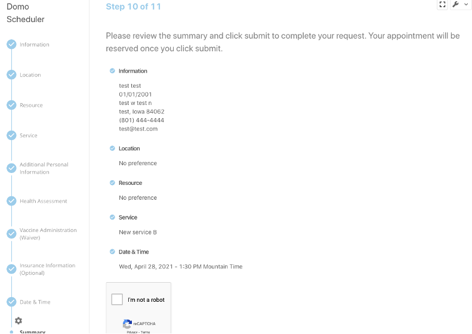  
  

### Schedule Now - Confirmation

The Confirmation screen will show the users’ appointment information and display the QR code that the user may need in order to get into their appointment. Users can book another appointment (start over) by selecting the **Book Again** button from the bottom of the screen.  
  

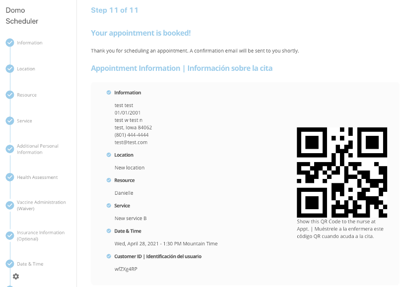  
  

### Schedule Follow Up - Customer ID

The only difference with the follow-up scheduling flow is the **Customer ID** step. This step prompts users to enter the customer ID they have been provided—this ensures that they are scheduling the correct service based upon their initial appointment.  
  

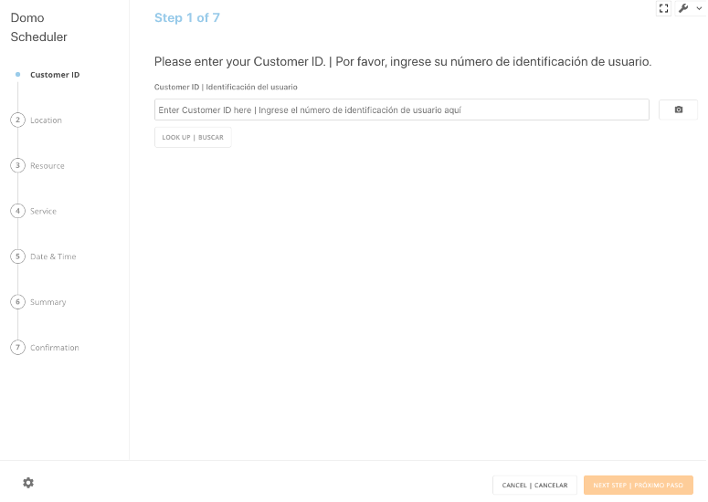

### 

Admin
-----

The Admin portion of the app allows users with admin-level roles to see a list view of all appointments and configure the app settings. The Admin screen can be accessed either by selecting the **Admin** button from the splash screen or selecting the gear icon in the Scheduler portion of the app.

### List View

Admin users are able to see a list view of all currently scheduled appointments. Admins can view today’s appointments, this week’s, this month’s, and past appointments. Admins are also able to filter by location, service, and resource as well as search by first and last name, email, and phone number to find specific appointments. The **New Item** button will take admin users through the Scheduler flow, where they can schedule appointments for users.  
  

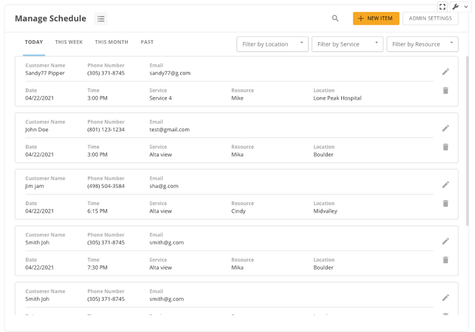  
  

### Admin Settings - Set up Workflow

Admins can set up the workflow order for the Scheduler portion of the app in the **Set Up Workflow** tab. The workflow options include Location, Resource, Service, and Questionnaire. Each of these steps can be hidden by selecting the checkbox next to each step. Steps can be moved around in order by selecting the dot menu next to each step. The **Show Any** button will allow users to see an **Any** option when they are selecting a location, service, or resource. The **Invitations required for appointment scheduling** configures the Scheduler app to only accept appointments if the user has an invite code.  
  

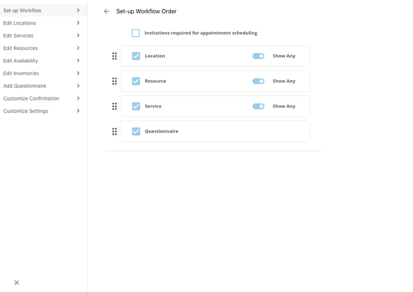  
  

### Admin Settings - Edit Locations

The **‘Edit Locations’** tab allows admins to add, edit, delete, and hide locations in the Scheduler app. Location items include the location name, location address, associated resource(s), and associated service(s). Set locations as ‘Private’ to generate a unique Invite ID that can be sent to recipients. Resource and service are required, if they are not added then the location will be marked as incomplete and will not be visible in the app. New locations can be added by selecting the ‘Add New Location’ option from the upper-right corner of the screen.

  
  

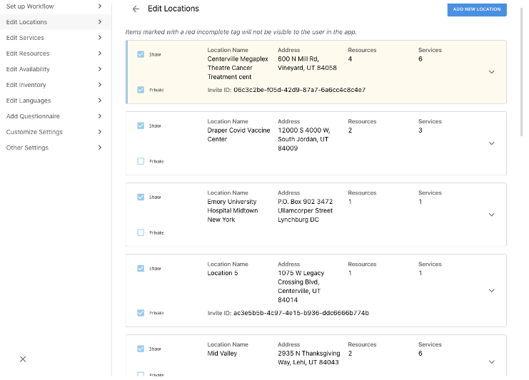  
  

### Admin Settings - Edit Services

The **Edit Services** tab allows Admins to add, edit, delete, and hide services in the Scheduler app. Service items include the service name, description of the service, estimated service duration, booking type (initial, follow-up, or both), associated inventory, inventory usage, follow-up at least, follow-up at most, follow-up parent service, associated resource(s), and associated location(s). Resources and locations are required fields on service items—services without these will show as incomplete and will not be visible in the Scheduler app. New services can be added by selecting the **Add New Service** button from the upper-right corner of the screen.  
  

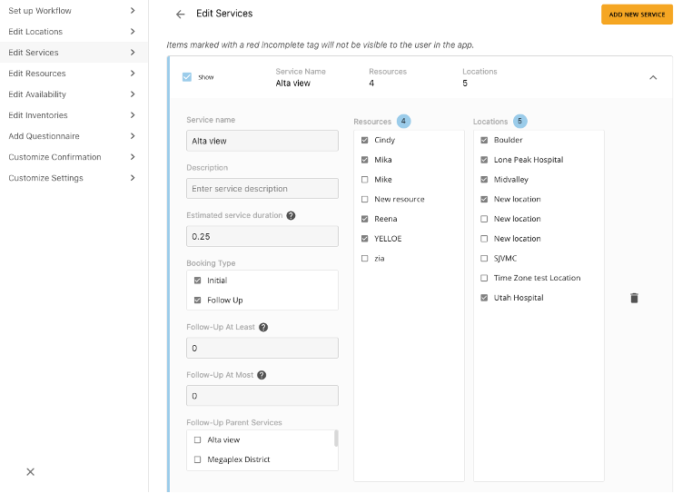  
  

### Admin Settings - Edit Resources

The **Edit Resources** tab allows Admins to add, edit, delete, and hide resources in the Scheduler app. Resource items include the resource name, description of the resource, double booking, associated location(s), and associated service(s). Locations and services are required fields on resource items—resources without these will show as incomplete and will not be visible in the Scheduler app. New resources can be added by selecting the **Add New Resource** button from the upper-right corner of the screen.  
  

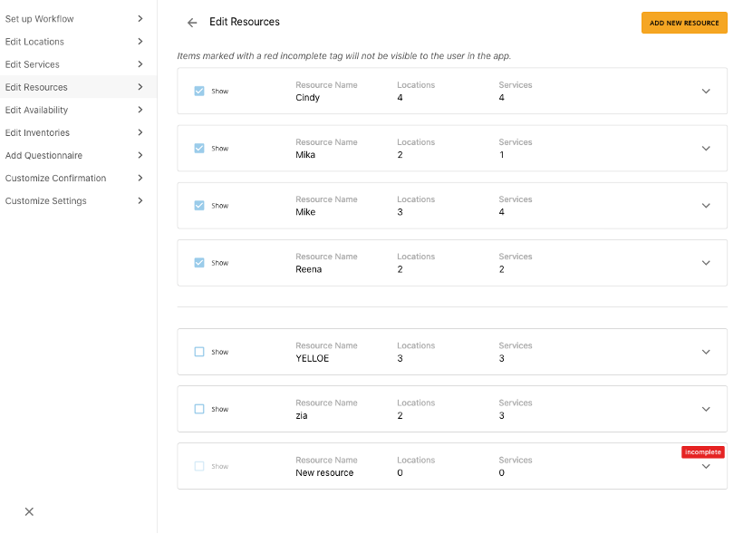  
  

### Admin Settings - Edit Availability

The **Edit Availability** tab allows Admins to set company availability and both default and custom schedules. Schedules can be added, edited, and deleted by Admins at any time. Start and end dates, the scheduling time zone, and time slot intervals are also set on this screen. Default schedules are applied to all users/resources who are not added to custom schedules. Default schedules includes the schedule name, days of the week it applies to, blackout periods, and available hours. Custom schedules override default schedules and should include added users/resources. Custom schedules include the schedule name, days of the week it applies to, blackout periods, scheduled resources, and available hours.  
  

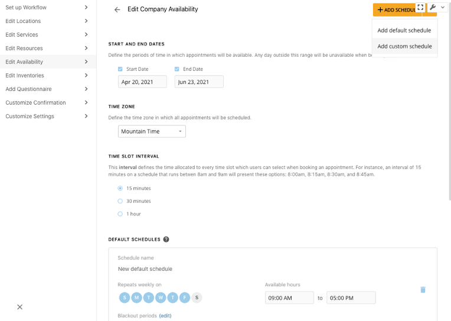  
  

### Admin Settings - Edit Inventories

The **Edit Inventories** tab allows Admins to add, edit, and delete inventories. Inventories include the inventory name, inventory description, current inventory, and the ability to add or remove from the current inventory. New inventories can be added by selecting the **Add Inventory** button from the upper-right corner of the screen.  
  

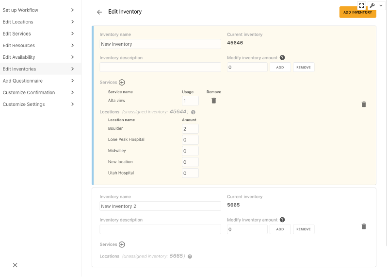  
  

### Admin Settings - Add Questionnaire

The **Add Questionnaire** tab is where questionnaires built in the Form Builder app can be added to the Scheduler. Only one questionnaire can be added at a time and a preview of the questionnaire will be available to review. To add a new questionnaire, select the **Add a New Form Builder DataSet** button.  
  

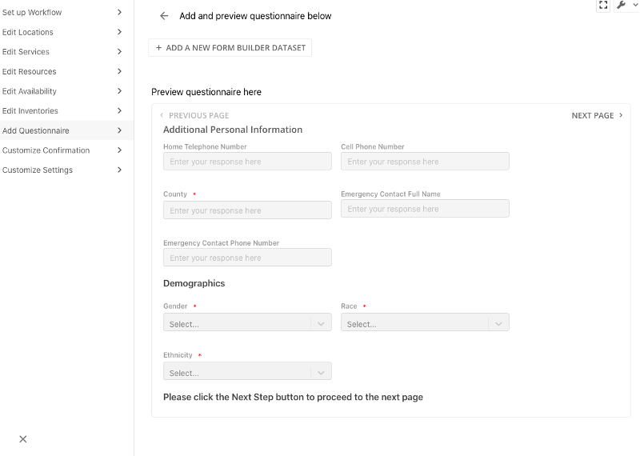  
  

### Admin Settings - Edit Languages

The **‘Edit Languages’** tab allows admin users to set languages up in the app. The currently configurable languages include English, Spanish, Haitian Creole, and Japanese. Admins can set one language as the default and enable all or some as translatable fields. Once a language is selected, users will be able to go through all of the text fields and translate them for the corresponding language. If one language text field has been changed, a warning sign will appear on that language tab letting you know that something has been changed and the number of changed fields will appear on all of the other language tabs.

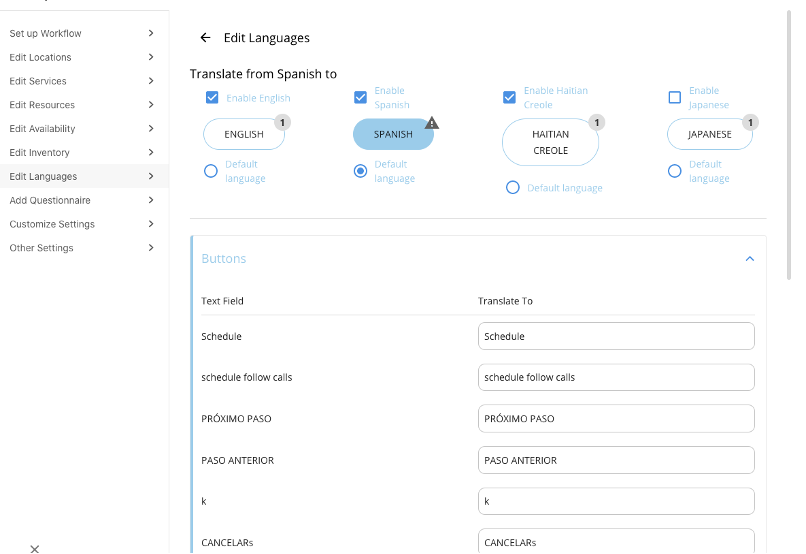

 

### Admin Settings - Customize Settings

The ‘Customize Settings tab is where admins can customize the logo, color palette, and add/edit app name. Logos can be added to the app by selecting the ‘Upload’ button in the ‘Add/Edit Logo’ section. The primary and secondary colors can be updated in the app, as well as the primary and secondary font colors—a preview of these changes can be seen in the ‘Preview of colors selected’ section. The app name can be added or edited, the name will automatically be set as Domo Scheduler App.

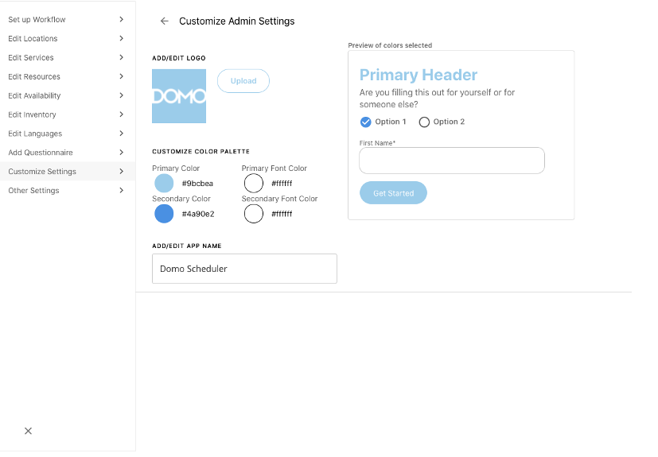  
  

 

FAQ
---

##### Why is this app important?

Enables you to quickly and efficiently customize your scheduling within the app to gather and share only necessary information with your users.

##### How do I use/demo it?

Once the app has been added to your Domo instance, connect the necessary DataSets and begin configuring the app so end-users can begin scheduling appointments.

