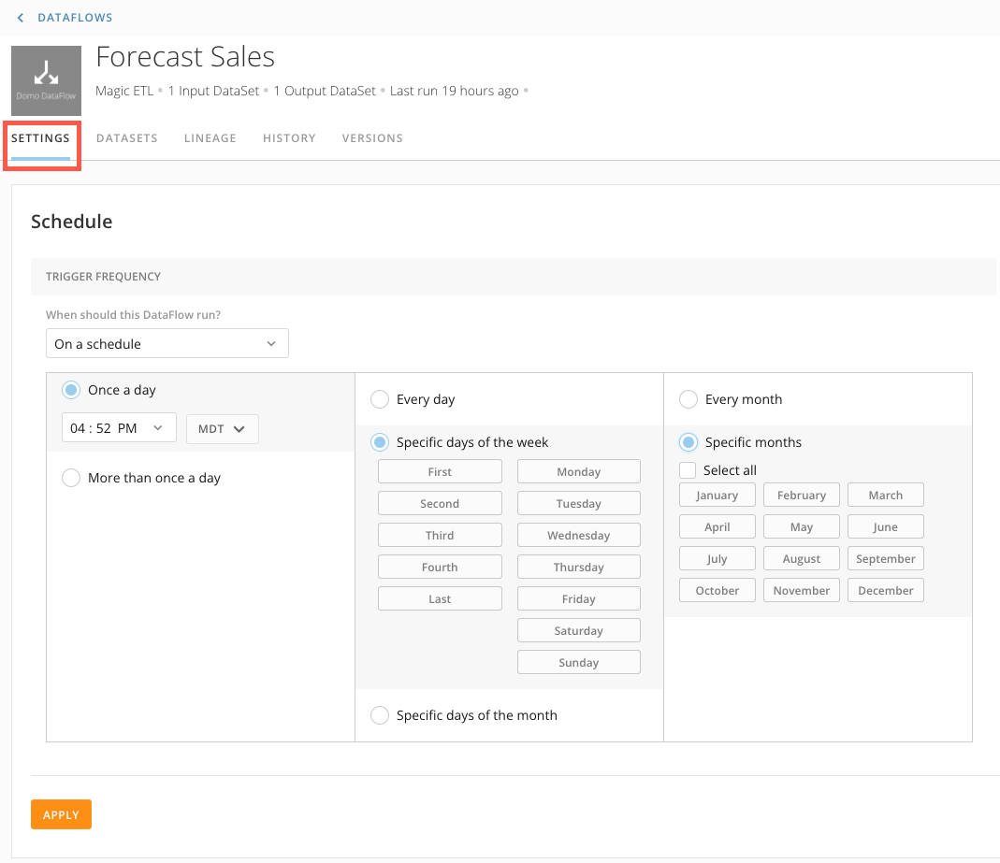
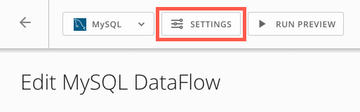

Intro
-----

Customize a schedule for your DataFlow runtime. With DataFlow schedules, you can continue kicking off your DataFlow when an input has updated or set a specific time at an hourly, daily, weekly, or monthly cadence. You can specify what time zone the DataSet trigger times are in as well as running on specific days of the week or month.

Schedule Types
---------------

|  |  |
| --- | --- |
| Manually | The DataFlow will not update without someone selecting the run option manually. |
| On a schedule | Set exactly when the DataFlow runs by selecting both the time and frequency (hourly, daily, weekly, monthly.) |
| Only when DataSets are updated | The DataFlow will run as soon as the chosen DataSet input has updated. |

How to Schedule a DataFlow
--------------------------

To schedule a DataFlow from the details view,

1. Navigate to the Data Center and find and select the DataFlow you want to schedule.
2. Click on the **Settings** tab.  
  

3. Choose the type of schedule you would like.

**Note:** If you need your DataSet to update faster than every 15 minutes, please reach out to your account team for evaluation.
4. Click Apply

### Magic ETL

To schedule a Magic ETL DataFlow from the edit view,

1. Find and select the DataFlow you want to schedule.
2. Click **Edit** to edit the DataFlow.
3. Click the  icon.  
  

4. Choose the type of schedule you would like.

**Note:** If you need your DataSet to update faster than every 15 minutes, please reach out to your account team for evaluation.
5. Click **Apply** and **Save** the DataFlow.

### MySQL

To schedule a MySQL DataFlow from the edit view,

1. Find and select the DataFlow you want to schedule.
2. Click **Edit** to edit the DataFlow.
3. Click **Settings**.  
  

4. Choose the type of schedule you would like.

**Note:** If you need your DataSet to update faster than every 15 minutes, please reach out to your account team for evaluation.
5. Click **Apply** and **Save** the DataFlow.

FAQs
----

#### If you have multiple inputs set to trigger a DataFlow, does it run when any of the input DataSets are updated or when all of them are updated?

Currently, if you have multiple DataSets set to trigger a DataFlow, it will run when any of those input DataSets update. If all of the inputs need to be updated before the DataFlow runs, we recommend staggering the input DataSet update times. Then, only set the input with the latest update time to trigger the DataFlow. This will ensure all the inputs have been updated before the DataFlow runs.

