---
    title: Scorecard App Implementation Guide
    url: https://domo-support.domo.com/s/article/360044408153
    linked_kbs:  ['[https://domo-support.domo.com/s/knowledge-base/](https://domo-support.domo.com/s/knowledge-base/)', '[https://domo-support.domo.com/s/](https://domo-support.domo.com/s/)', '[https://domo-support.domo.com/s/topic/0TO5w000000ZampGAC](https://domo-support.domo.com/s/topic/0TO5w000000ZampGAC)', '[https://domo-support.domo.com/s/topic/0TO5w000000Zan9GAC](https://domo-support.domo.com/s/topic/0TO5w000000Zan9GAC)', '[https://domo-support.domo.com/s/article/360042922874](https://domo-support.domo.com/s/article/360042922874)', '[https://domo-support.domo.com/s/article/360044408153](https://domo-support.domo.com/s/article/360044408153)', '[https://domo-support.domo.com/s/topic/0TO5w000000Zan9GAC/available-apps](https://domo-support.domo.com/s/topic/0TO5w000000Zan9GAC/available-apps)', '[https://domo-support.domo.com/s/article/360043429933](https://domo-support.domo.com/s/article/360043429933)', '[https://domo-support.domo.com/s/article/360043429953](https://domo-support.domo.com/s/article/360043429953)', '[https://domo-support.domo.com/s/article/360042925494](https://domo-support.domo.com/s/article/360042925494)', '[https://domo-support.domo.com/s/article/360043429913](https://domo-support.domo.com/s/article/360043429913)', '[https://domo-support.domo.com/s/article/4408174643607](https://domo-support.domo.com/s/article/4408174643607)', '[https://domo-support.domo.com/s/login/](https://domo-support.domo.com/s/login/)']
    article_id: 000004145
    views: 1,093
    created_date: 2022-10-24 21:25:00
    last updated: 2022-10-24 22:40:00
    ---

Thank you for choosing to install the Scorecard App! This guide is intended to help you connect this app to your own data. If you have completed the purchasing process for this app or have purchased AppsPass, you will be able to go through all of the steps of this guide. The first steps are to make sure that the app and the app's DataFlow have been properly downloaded from the Appstore, and that your data is in the correct format to be used by the app.  
 

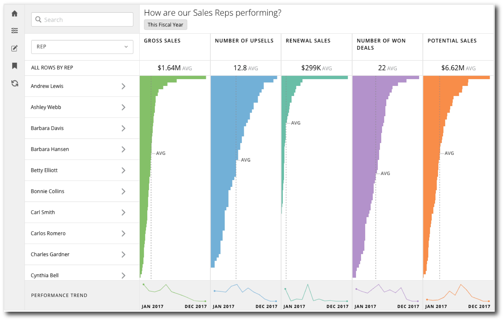  
 

### Prerequisites:

* An understanding of the Appstore tool called Grid Builder. A walkthrough of how to use the Grid Builder can be found here: [https://developer.domo.com/docs/installation-guides/grid-builder-walkthrough](https://developer.domo.com/docs/installation-guides/grid-builder-walkthrough "https://developer.domo.com/docs/installation-guides/grid-builder-walkthrough").
* Though not required, it is helpful to have a working knowledge of how a MySQL query works. More information can be found here: [https://www.w3resource.com/mysql/mysql-tutorials.php](https://www.w3resource.com/mysql/mysql-tutorials.php "https://www.w3resource.com/mysql/mysql-tutorials.php").

Below is a diagram that shows the order in which the customer data will be fed through the DataFlow and output to the app.  
 

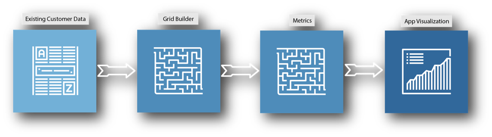  
 

When you are familiar with how the Grid Builder works, follow these steps to make sure that the app and the DataFlow are properly deployed to your instance of Domo:

1. Install the app
	* If you purchased the app as part of AppsPass, make sure that you have clicked the install button in the AppsPass interface to deploy the app. This will take you to the Appstore where you can click the **Try It** button to deploy the app and the DataFlow to your instance. You will be asked to name the page where you'd like the app to appear in your instance of Domo.
	* If you purchased through the Appstore, make sure you have clicked the **Try It** button on the page for this app in the Appstore to deploy the app and its DataFlow to your instance. You will be asked to name the page where you'd like the app to appear in your instance of Domo.
2. Verify the DataFlow has deployed
	* Double check that the DataFlow has been deployed to your instance. To do this, navigate to the Data Center by clicking the menu button in the top right corner of Domo, then clicking the Data button located in the top left corner of Domo (see image below for example.)  
	   
	 
	* Click **DataFlows** on the left side of the screen, then use the Data Center search bar to search for "scorecard". You should see a DataFlow that matches the name of the version of scorecard you downloaded. Ex. "Helpdesk Scorecard" or "Sales Scorecard"
	* Alternatively, you can locate the DataFlow using the following method. Navigate to the page where the app is deployed and click on the bottom banner of the app to access the app detail view. Scroll down to the bottom of the page and you'll be able to see the DataSets that are powering the app. One of the DataSets should be named similarly to the app. Ex. "Sales Scorecard" or "Retail Scorecard". Click on that DataSet, and then click the wrench on the right side of the page, and then click **Edit DataFlow** in the dropdown. This will take you to the DataFlow for the app.

### Step 1: Prepare Your Data

The Scorecard App displays data filtered by date and grouped by a primary group (Sales Rep, Campaign, Helpdesk Rep, Store Location, etc.) This means that you need to get your data into a format where you have a column for dates and a column for your primary group with each row representing a member of your primary group on the respective date. Then the other columns in the data would be numeric columns for metrics you want to display in the app, or categorical columns that you would like to use as filtering options. See the example below.

|  |  |  |  |  |  |
| --- | --- | --- | --- | --- | --- |
| Date | Sales Rep | Number of Sales | Number of Leads | Sales Amount | Region |
| 01/01/2017 | Tim Dobbs | 4 | 16 | $1,440 | NE |
| 01/01/2017 | Heather Smith | 7 | 24 | $2,520 | NW |
| 02/01/2017 | Tim Dobbs | 6 | 18 | $2,160 | NE |
| 02/01/2017 | Heather Smith | 3 | 16 | $1,080 | NW |
| 03/01/2017 | Tim Dobbs | 9 | 22 | $3,240 | NE |
| 03/01/2017 | Heather Smith | 11 | 28 | $3,960 | NW |

In this example, the Primary Group is "Sales Rep", there are three numeric columns that will be used to display metrics, and one categorical column that will be used as a filter. For a more robust example check out this spreadsheet [here](https://domosoftware.sharepoint.com/:x:/s/CS-Edu-PublicFiles/EehUk9ctqtJKgGPe4HGhVecBN2bR7cmzvNq303hJGnMKIA?e=WgzVIP "Sales Scorecard - Sample.xlsx").

 

**Protips:** 
* You can use more than one DataSet as source data for the app as long as they can be joined together using your date and primary group columns. Information on how to do joins in the grid builder will be found in the following sections.
* It is worth noting that the app can do simple calculations to calculate metrics. For example, the app could calculate leads to sales conversion rate for the above example using the following calculation: SUM(NumberOfSales)SUM(NumberOfLeads)\*100. It is usually better to calculate ratios in the app later, rather than beforehand in the DataFlow. More on creating metric calculations in following sections.

### Step 2: Add Your Source Data to the DataFlow

As soon as you have prepared your data, you will need to navigate to the DataFlow and add your data as inputs to the DataFlow. Follow these steps to do so:

1. Navigate to the Data Center by clicking the Data button located in the top left corner of Domo (see image below for example.)  
   
 
2. Click **DataFlows** on the left side of the page, then search for "Scorecard" in the Data Center search bar. You should see a DataFlow named similarly to the version of the app you installed. Ex. "Sales Scorecard" or "Campaign Scorecard"
3. Click on the DataFlow to go to the detail view, then click the pencil icon on the right side of the page to edit the DataFlow.  
   
 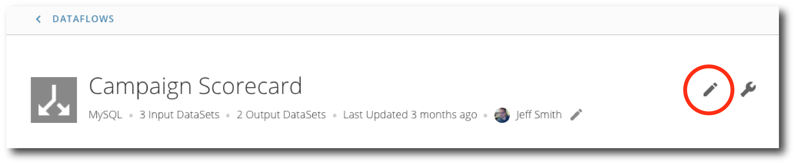
4. Remove the sample DataSet by clicking the **x** on the corner of the DataSet. The sample DataSet will be the one with the name that doesn't end in "Grid Builder" or "Settings". Keep those other two DataSets as input.  
   
 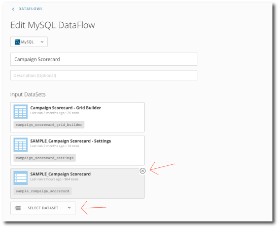
5. Click the **Select DataSet** button, then add the DataSets here that you prepared for the app.
6. After you have added your DataSets, scroll to the bottom of the page and click the **Save** button.
7. Navigate back to the Data Center.

### Step 3: Edit the Grid Builder

For this step, you will need to edit the appropriate fields in the grid builder to match you input data. This guide presents a basic set of steps here, but for a more comprehensive tutorial on how the Grid Builder works, please review the [Grid Builder Walkthrough](https://developer.domo.com/docs/installation-guides/grid-builder-walkthrough "https://developer.domo.com/docs/installation-guides/grid-builder-walkthrough"). As you make changes, it may be wise to occasionally copy your work into an Excel sheet to track your changes, in case the web browser encounters any errors.

Follow these steps to edit the grid builder:

1. Navigate to the Grid Builder webform that came with the app. It will be named after the version of scorecard you installed plus "-Grid Builder" on the end. Ex. "Sales Scorecard - Grid Builder". Click **DataSets** on the left side of the Data Center and search for that name. Click the DataSet, then in the details view, click the wrench button on the right side, then click **Edit Webform**.  
   
 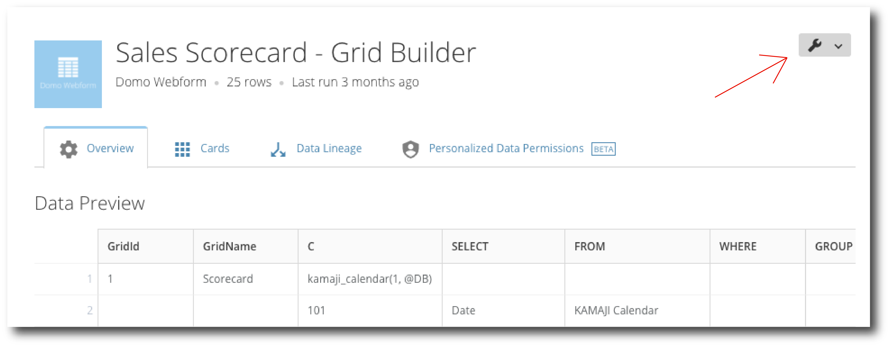
2. You most likely won't need to change the date range options, so don't change any of the calendar information on the first few rows (rows C101 through C108). If you do need to change the date filters refer to the Grid Builder Walkthrough for instructions.
3. Under the "FROM" column, change the value on row C201 to match the name of your first DataSet (#1 in example image below.)
4. Under the "SELECT" column from C201 on down, replace these sample values with the names of the columns from the DataSet you named in the "FROM" column that you would like to use in the app. You may have more or less entries than the sample information, so you may need to add rows or delete extra information from the sample rows (#2 in example image below.)
5. Under the “AS” column from C201 on down, choose names for the columns that you listed in the “SELECT” column. Avoid using spaces, numbers, and special characters in the names here. For example, use Gross\_Sales as opposed to Gross Sales. This will make later steps easier (#3 in example image below.)  
   
 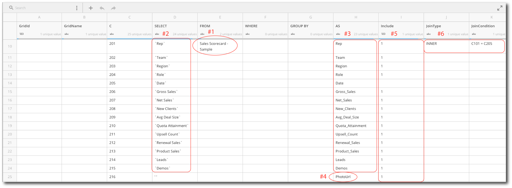
6. The app requires a specific field to function called the “PhotoUrl” field. Add one more row at the end of this grouping. Assign it a number in the “C” column. If your customer has a column with photo URLs then use that in the “SELECT” column. Otherwise, put two single quotes in that column (‘’). Put “PhotoUrl” in the “AS” column. This is case sensitive, so make sure that only the “P” and “U” are capitalized (#4 in example image.)
7. Under the “Include” column place a 1 in each row that you are including from your data that isn’t being used solely for a join. This is generally everything except your date field, since the date is also coming from the calendar that the app generates (#5 in example image.)
8. Double check the JoinType and JoinCondition columns on row C201. When joining with the calendar, typically, use “INNER” for JoinType and make sure the JoinCondition references the row where your date column is brought in from your DataSet (#6 in example image.)
9. Repeat this process for any additional DataSet that you bring in. Each new DataSet should be assigned the next 100’s value under the “C” column. Ex. Start with 301 for the second DataSet, 401 for the third, etc. Additional joins usually use “LEFT” for the JoinType and join on date and your primary group from your first DataSet. Ex C201 = C301 AND C202 = C302 (If 201 and 301 were both the primary and 202 and 302 were both the date.)  
   
 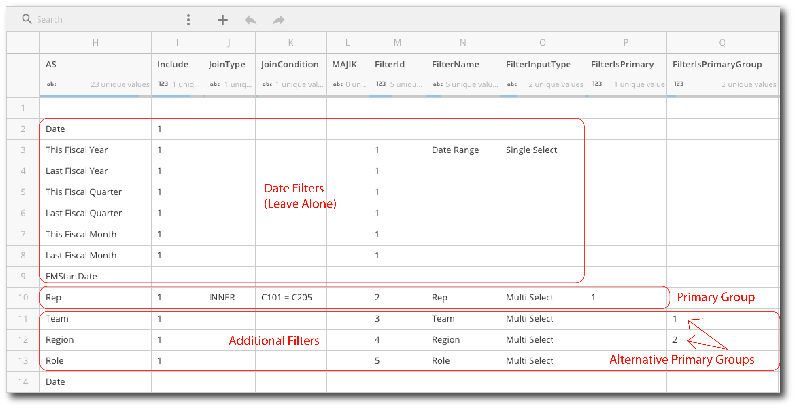
10. As soon as you have the information entered for your DataSets you’ll need to configure your filters. On each row of the grid builder that references a column in your data that you would like to use as a filter you’ll need to update the five filter columns, “FilterId”, “FilterName”, “FilterInputType”, “FilterIsPrimary”, and “FilterIsPrimaryGroup”.
11. On the row that references your Primary Group, use “2” for the FilterID, choose a name under FilterName, “Multi Select” for FilterInputType, and put a “1” in the FilterIsPrimary.
12. On other rows that you would like to use as filters, use incrementing numbers for the FilterID (3,4,5 etc.) choose names under FilterName, use “Multi Select” or “Single Select” for FilterInputType (Check out the Grid Builder Walkthrough for more information on what the two filter types do,) leave FilterIsPrimary empty for these rows, then add incrementing numbers under FilterIsPrimaryGroup for any rows that reference columns that you’d like to use as alternative Primary Groups in the app.
13. Click **Save & Continue** at the top of the page to save the DataSet.

As soon as you've made changes to the grid builder, go to the Data Center and run the Scorecard DataFlow. If the DataFlow runs successfully, you've most likely filled out the grid builder correctly. If you encountered errors, review the Grid Builder Walkthrough, or contact Technical Support. For information on how to contact Support, please see: [Getting Help](/s/article/360042922874).

### Step 4: Edit the Metrics Form

The final step in setting up the app is editing the metrics form. Follow these steps to edit the Metrics form:

##### **Adding standard metrics:**

1. In the Data Center, navigate to the metrics form. It will be named similarly to the grid builder, with the name of the version of scorecard that you installed, followed by “- Metrics”. Ex. “Helpdesk Scorecard – Metrics”.
2. Click on the DataSet and then click on the wrench to edit the webform.  
   
 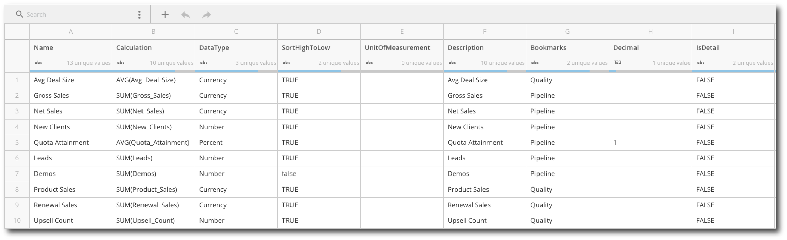
3. For each metric you would like to display in the app, fill out a row in this form. The first column is the “Name” column. Enter the name for the metric you would like to see in the app.
4. In the “Calculation” column, enter the calculation for the metric. Only simple calculations are supported. You can use simple sums, averages, max, and min (“SUM(column)” or “AVG(column)”), simple single operations (“SUM(columnA) + SUM(column)” or “SUM(columnA) \* MIN(columnB)”, etc. ), or ratio calculations (“SUM(columnA)/SUM(columnB)\*100”). More complicated calculations will need to be calculated in part beforehand in the grid builder.
5. In the DataType column, enter “Currency”, “Number” or “Percent”. This tells the app how to display your metric.
6. In the “SortHighToLow” column, put “true” if you want the metric’s bar chart to display from highest to lowest, or input “false” if you’d like the metric’s bar chart to display lowest to highest.
7. Under “UnitOfMeasurement” write the unit of the metric. Ex. Dollars, People, Referrals, etc. May be left blank.
8. Under “Description” write a short description of the metric. May be left blank.
9. Under “Bookmarks”, enter the name of the Bookmark that you would like the metric to be a part of. This is where bookmarks are created for the app. You may name your bookmarks anything that you’d like. Metrics can be part of more than one bookmark, simply list all of the bookmarks you’d like the metric to be a part of separated by commas (no spaces.)
10. Under “Decimal” list the number of decimals you’d like to display for that metric. The options are 0,1 and 2. Leaving this blank defaults to 2 decimal places.
11. Under “IsDetail” write “FALSE” for all standard metrics. This is used when adding a detail view to the app which is detailed below.

##### **Adding detail views and metrics:**

Detail views and detail metrics appear in the detail window when a specific member of your primary group is clicked.  
 

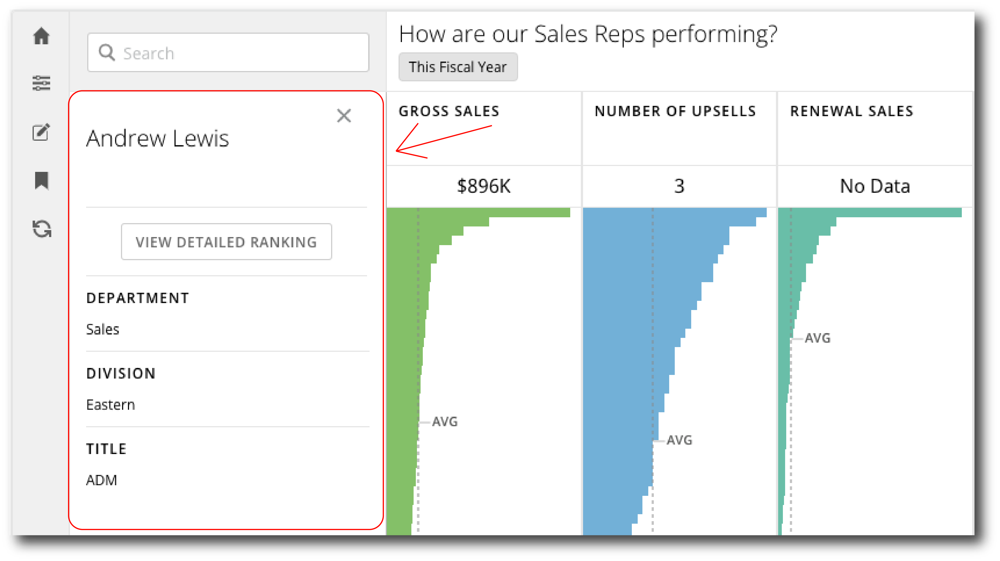

  
 There are a handful of options for detail views that you can create, including Single Values such as text, currency, numbers and percents, as well as pie and line charts. To create a detail view follow the steps below:  
 

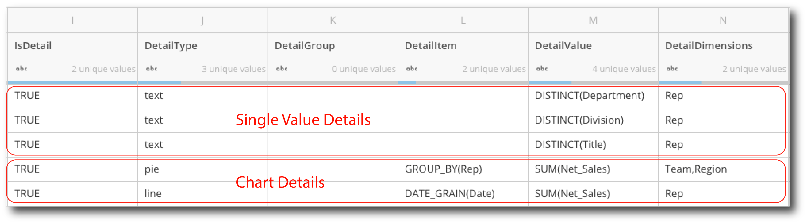  
 

###### Single Value Details:

1. To create a single value detail view, first, under the “Name” column enter the name you want to use to label your detail, then leave the other columns before “IsDetail” blank.
2. Under “IsDetail” write “TRUE”.
3. Under “DetailType” you can use the following option to choose the format of your single value detail: “single value”, “text”, “currency”, “percent”, and “number”.
4. Leave “DetailGroup” and “DetailItem” blank.
5. Under “DetailValue” either enter a calculation for a numeric detail, or enter DISTINCT(column) for a text value.
6. Under “DetailDimensions” use a comma separated list (no spaces) of the different primary groupings to which you’d like to apply this detail. Use the same values that were entered in the “FilterName” column in the grid builder.

###### Chart Details:

1. Under the “Name” column enter the name you want to use to label your detail, then leave the other columns before “IsDetail” blank.
2. Under “IsDetail” write “TRUE”.
3. Under “DetailType” use “pie” for a pie chart, or use “line” for a line graph.
4. Leave “DetailGroup” blank.
5. Under “DetailItem” if you are creating a pie chart use “GROUP\_BY(column)”, choosing a column in your data that you would like to use as the different pieces of the pie chart. If you are creating a line graph use “DATE\_GRAIN(dateColumn)” choosing a column that represents the date grain you’d like to use for the chart.
6. Under “DetailValue” enter the calculation of the metric you’d like to track.
7. Under “DetailDimensions” use a comma separated list (no spaces) of the different primary groupings to which you’d like to apply this detail. Use the same values that were entered in the “FilterName” column in the grid builder.

  
 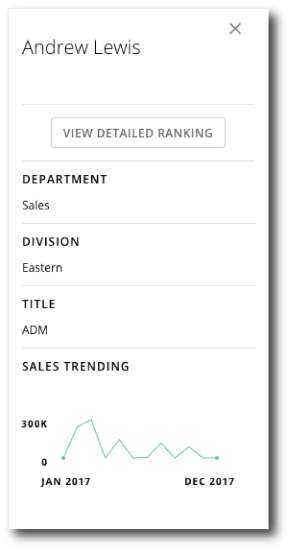 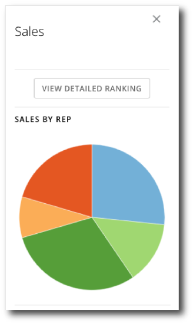

### Step 5: Validation

Now that you have configured the grid builder and the metrics forms, you should be ready to check your app to validate your metrics. We suggest the following process to validate:

1. Build KPI cards to test metrics. Build these cards based off of your source data, not the output of the app. As an example, if you are displaying trending sales by sales rep in the app, build a bar chart type card that displays sales per rep, and have the date range of the KPI card match one of the date ranges the app displays.
2. Compare your data between the KPI cards and the app. Remember to make sure your filtering options and date ranges match between the app and the card.
3. If you find discrepancies, check if you need to change join conditions or groupings in the grid builder and double check your calculations.
4. Repeat this process for any metrics you need to validate.

#### Congratulations!

Your Scorecard App should be good to go! Enjoy getting great value out of your data. If you have any questions or need help troubleshooting, contact Technical Support. For information on how to contact Support, please see: [Getting Help](/s/article/360042922874).

