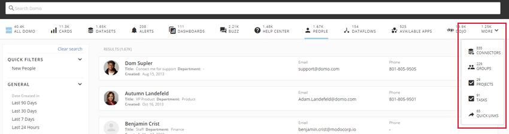
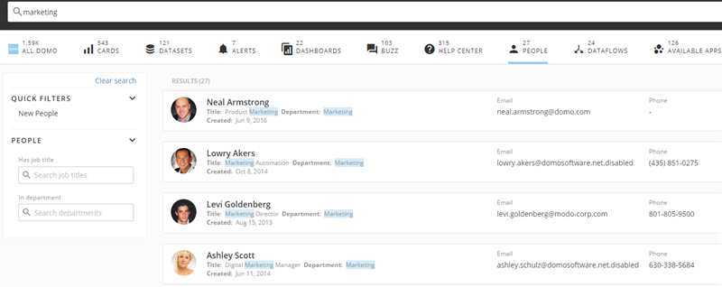
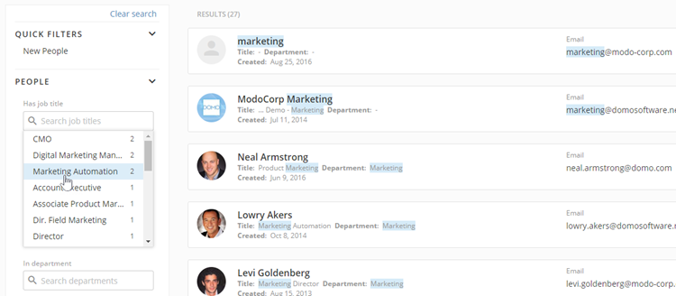
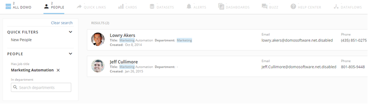
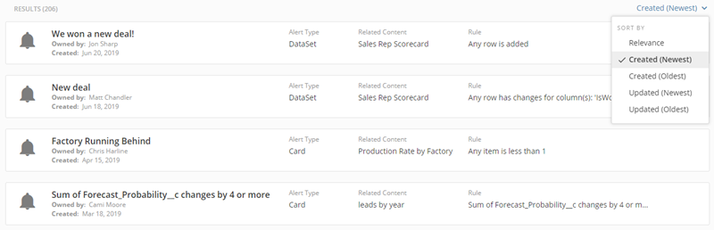
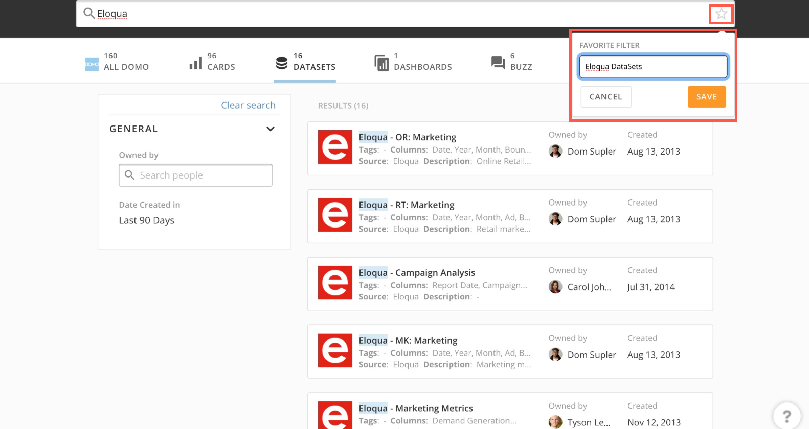
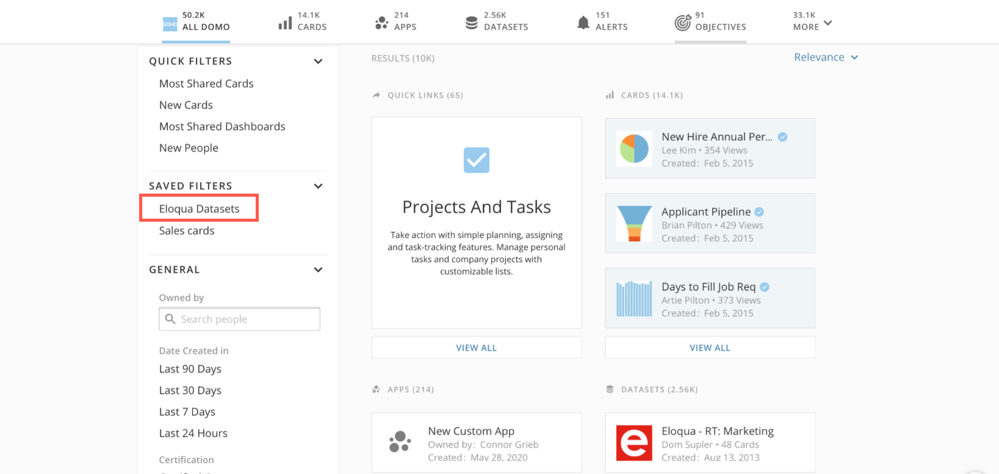
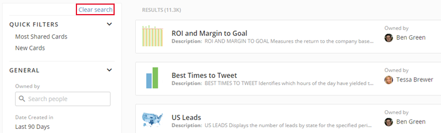
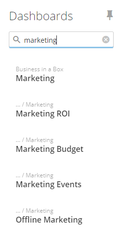

---
    title: Searching in Domo
    url: https://domo-support.domo.com/s/article/360043427393
    linked_kbs:  ['[https://domo-support.domo.com/s/knowledge-base/](https://domo-support.domo.com/s/knowledge-base/)', '[https://domo-support.domo.com/s/](https://domo-support.domo.com/s/)', '[https://domo-support.domo.com/s/topic/0TO5w000000ZamsGAC](https://domo-support.domo.com/s/topic/0TO5w000000ZamsGAC)', '[https://domo-support.domo.com/s/topic/0TO5w000000ZanlGAC](https://domo-support.domo.com/s/topic/0TO5w000000ZanlGAC)', '[https://domo-support.domo.com/s/article/360043428553](https://domo-support.domo.com/s/article/360043428553)', '[https://domo-support.domo.com/s/article/360043428573](https://domo-support.domo.com/s/article/360043428573)', '[https://domo-support.domo.com/s/topic/0TO5w000000ZapJGAS](https://domo-support.domo.com/s/topic/0TO5w000000ZapJGAS)', '[https://domo-support.domo.com/s/article/360043438913](https://domo-support.domo.com/s/article/360043438913)', '[https://domo-support.domo.com/s/topic/0TO5w000000ZanRGAS](https://domo-support.domo.com/s/topic/0TO5w000000ZanRGAS)', '[https://domo-support.domo.com/s/topic/0TO5w000000ZamzGAC](https://domo-support.domo.com/s/topic/0TO5w000000ZamzGAC)', '[https://domo-support.domo.com/s/topic/0TO5w000000ZanLGAS](https://domo-support.domo.com/s/topic/0TO5w000000ZanLGAS)', '[https://domo-support.domo.com/s/article/360042925574](https://domo-support.domo.com/s/article/360042925574)', '[https://domo-support.domo.com/s/topic/0TO5w000000ZampGAC](https://domo-support.domo.com/s/topic/0TO5w000000ZampGAC)', '[https://domo-support.domo.com/s/topic/0TO5w000000Zao5GAC](https://domo-support.domo.com/s/topic/0TO5w000000Zao5GAC)', '[https://domo-support.domo.com/s/topic/0TO5w000000ZanxGAC](https://domo-support.domo.com/s/topic/0TO5w000000ZanxGAC)', '[https://domo-support.domo.com/s/article/360042922894](https://domo-support.domo.com/s/article/360042922894)', '[https://domo-support.domo.com/s/article/360043438953](https://domo-support.domo.com/s/article/360043438953)', '[https://domo-support.domo.com/s/article/360043427393](https://domo-support.domo.com/s/article/360043427393)', '[https://domo-support.domo.com/s/topic/0TO5w000000ZanlGAC/getting-started](https://domo-support.domo.com/s/topic/0TO5w000000ZanlGAC/getting-started)', '[https://domo-support.domo.com/s/article/360043429933](https://domo-support.domo.com/s/article/360043429933)', '[https://domo-support.domo.com/s/article/360043429953](https://domo-support.domo.com/s/article/360043429953)', '[https://domo-support.domo.com/s/article/360042925494](https://domo-support.domo.com/s/article/360042925494)', '[https://domo-support.domo.com/s/article/360043429913](https://domo-support.domo.com/s/article/360043429913)', '[https://domo-support.domo.com/s/article/4408174643607](https://domo-support.domo.com/s/article/4408174643607)', '[https://domo-support.domo.com/s/login/](https://domo-support.domo.com/s/login/)']
    article_id: 000004341
    views: 2,448
    created_date: 2022-10-24 21:41:00
    last updated: 2022-10-24 22:39:00
    ---

Intro
-----

You can perform a global (Domo-wide) search to locate any of the following:

* [Pages](/s/article/360043428553 "Understanding Pages") (referred to as "Dashboards" in the UI) (includes subPages)
* [Cards](/s/article/360043428573 "Understanding Cards")
* [People](/s/topic/0TO5w000000ZapJGAS "Managing Users and Groups")
* [Groups](/s/article/360043438913 "Creating and Managing User Groups")
* [DataSets](/s/topic/0TO5w000000ZanRGAS "Managing DataSets") (searches names as well as row values)
* [DataFlows](/s/topic/0TO5w000000ZamzGAC "Magic Transforms")
* [Connectors](/s/topic/0TO5w000000ZanLGAS "Configuring Each Connector")
* [Buzz conversations](/s/article/360042925574 "Chatting in Buzz") (including group conversations, public and private channels, message threads, and Card and Page conversations)
* [Available Appstore apps](/s/topic/0TO5w000000ZampGAC "The Appstore")
* [Projects and tasks](/s/topic/0TO5w000000Zao5GAC "Projects and Tasks")
* [Alerts](/s/topic/0TO5w000000ZanxGAC "Notifications and Alerts")
* Knowledge Base articles
* [Dojo posts](/s/article/360042922894 "Finding Top Customer-Generated Solutions Using Dojo")
* "Quick Links" to various Domo tools

You can also search specifically for Pages and Subpages in the **Filter by name** field at the top of the left-hand navigation pane. 

Performing a global search
--------------------------

You can perform a Domo-wide search to locate any of the entities listed above. This is a keyword-specific search, so searching for "sales" would return only those items. You can use quotation marks around search terms when you want to search for the term as a whole instead of the individual words. Boolean operators and wildcards are supported.

Your search returns only those items that you have sufficient access rights to view. For more information about security roles, see [Default Security Role Reference](/s/article/360043438953).

Search results are usually accompanied by helpful metadata. For example, search results for Cards show you the Card type and the owner and the number of views. Search results for people show you their contact information (if it has been entered in their Profile Page). Clicking a search result usually opens the associated item in Domo. For example, clicking a Buzz message opens the parent conversation in Buzz with that message selected; clicking a Card opens the Card Details view; and so on.

### Performing a basic search

To perform a basic global search in Domo, you simply open the Search interface by clicking the magnifying glass icon  in the toolbar at the top of the screen, then enter your search term into the **Search Domo** field. All results matching your query are then returned, grouped by category, including Pages, Cards, Buzz, People, DataSets, Groups, etc. The category bar at the top of the screen shows the number of search results within each category. Any categories that do not fit in your category bar can be found in the **More** menu, on the right side of the bar.   
  

### Filtering and sorting search results

There are many ways to filter and sort your search results to better find what you're looking for, including the following:

* Filtering on a specific category of search results by clicking the category name under the search bar.   
  
In the following example, the user has first entered "marketing" as a search term. He then clicks on the **People** category, which filters the search results to show all people whose title or department includes the keyword "marketing."  
  

* Choosing a filter from the pane on the left-hand side of the screen.  
  
This pane is context-sensitive, meaning options appear depending on the currently selected search category. For example, if you select **Buzz** as the search category, you get "Date created" options for filtering by creation date, along with Buzz-specific filters, including **Message from**, **Message @mentions**, **In conversation**, and **Conversation type**; you can also specify whether the message contains attachments or links. If the default **All Domo** category is selected, all filter options are available.   
  
Continuing with the previous example, the user wants to filter the search results to show only those individuals with "Marketing Automation" in their title. Clicking in the **Search job titles** field opens a list of marketing-related job titles in your Domo instance. The user locates "Marketing Automation" in the list and clicks on it.  
  
  
  
This filters the results to show only "Lowry Akers" and "Jeff Cullimore," the two people in the instance with "Marketing Automation" in their titles.  
  

* Sorting the results by selecting a sort option in the dropdown menu above the search results. You can choose to sort by relevance, by newest or oldest creation date, or by newest or oldest updated date. "Relevance" in this case returns search results based on how frequently the provided query occurs in a given search result.  In addition, certain fields are deemed more relevant than others (for example, "User Name" is considered more relevant than "User Department").  
  

* Combinations of all of the above.

### Save search results

Once you have filtered and sorted your search results to better find what you're looking for, you can now save those results and easily come back to your common searches—no matter how complex they are.

1. Click the Star icon in the search bar to favorite a filter.
2. Name the filter and click Save.  
  

3. It will now display under the Saved Filters section so that you can easily pull up the results.  
  

### Clearing search results

You can clear the results of the latest search by clicking **Clear search** in the left-hand pane. 

Searching for a Page or Subpage
-------------------------------

In the **Filter by name** field at the top of the left-hand navigation pane in the **Dashboards** tab, you can filter to show the desired Page(s) or Subpage(s). You can then click a Page or Subpage to open it. Subpages in search results will include the name of the parent Page or Subpage above them. 

**To search for a Page or Subpage,**

1. (Conditional) Click **Dashboards** in the top left corner of Domo if it is not open already.
2. In the **Filter by name** field, enter the name of the desired Page or Subpage.  
The Pages and Subpages matching your query are filtered as you add or remove letters.

