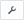
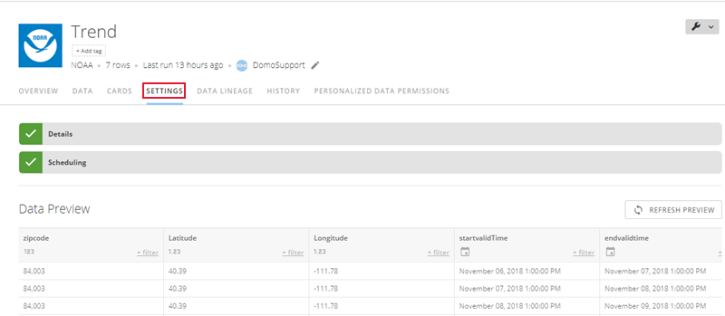

---
    title: Setting the Expected Update Frequency for a DataSet
    url: https://domo-support.domo.com/s/article/360042926114
    linked_kbs:  ['[https://domo-support.domo.com/s/knowledge-base/](https://domo-support.domo.com/s/knowledge-base/)', '[https://domo-support.domo.com/s/](https://domo-support.domo.com/s/)', '[https://domo-support.domo.com/s/topic/0TO5w000000Zan2GAC](https://domo-support.domo.com/s/topic/0TO5w000000Zan2GAC)', '[https://domo-support.domo.com/s/topic/0TO5w000000ZanRGAS](https://domo-support.domo.com/s/topic/0TO5w000000ZanRGAS)', '[https://domo-support.domo.com/s/article/360042926074](https://domo-support.domo.com/s/article/360042926074)', '[https://domo-support.domo.com/s/article/360042926274](https://domo-support.domo.com/s/article/360042926274)', '[https://domo-support.domo.com/s/article/360042926114](https://domo-support.domo.com/s/article/360042926114)', '[https://domo-support.domo.com/s/topic/0TO5w000000ZanRGAS/data-center-overview](https://domo-support.domo.com/s/topic/0TO5w000000ZanRGAS/data-center-overview)', '[https://domo-support.domo.com/s/article/360043429933](https://domo-support.domo.com/s/article/360043429933)', '[https://domo-support.domo.com/s/article/360043429953](https://domo-support.domo.com/s/article/360043429953)', '[https://domo-support.domo.com/s/article/360042925494](https://domo-support.domo.com/s/article/360042925494)', '[https://domo-support.domo.com/s/article/360043429913](https://domo-support.domo.com/s/article/360043429913)', '[https://domo-support.domo.com/s/article/4408174643607](https://domo-support.domo.com/s/article/4408174643607)', '[https://domo-support.domo.com/s/login/](https://domo-support.domo.com/s/login/)']
    article_id: 000004897
    views: 2.369
    created_date: 2022-10-24 22:34:00
    last updated: 2022-10-24 22:42:00
    ---

You can set the *expected* update frequency for a DataSet, which Domo uses to determine when to send a notification or to display a warning that the DataSet has not been updated. When the *actual* update does *not* occur within your expected update frequency, Domo displays a warning on the DataSet and cards powered by the DataSet. (The warning appears after a delay, depending on the specified frequency.) For connectors like Excel that do not include automatic update capability, you can choose how often you want to receive reminders to update manually.  

**To set the expected update frequency for a DataSet,**

1. Click **Data** in the toolbar at the top of the screen.  
The Data Center opens, with the **Data Warehouse** tab opened by default.
2. Click the  icon on the left side of the screen to open the **DataSets**tab.
3. Search for the DataSet you want, then view the details either by clicking the name or by clicking  > **View Details**.  
  
A page appears showing details for the DataSet. If you are the owner of this DataSet or have an "Admin" default security profile or a custom role with the "Manage DataSets" privilege enabled, a **Settings** tab appears in the tab row; otherwise this tab does not appear. (This tab also does not appear for a few unique connectors such as the Webform connector.) For more information about default security roles, see [Changing the Owner of a DataSet](/s/article/360042926074).   
  

4. Click **Settings**.  
  
You should see several expandable sections with options for configuring the connector, such as "Credentials," "Details," and so on. Note that the buttons you see may differ depending on the connector. For example, many connectors that pull public information do not have a **Credentials** section.
5. Click **Scheduling**.
6. Set the desired update frequency.  
The controls for setting the update frequency depend on the connector. For connectors that don't have automatic update capability, such as File Upload, only one menu appears; you can choose a preset setting or leave it set to **Never** if you don't want to receive reminders to update this DataSet. For most connectors, you can choose whether to use basic or advanced scheduling. For more information about scheduling, see [Connecting to Data with Connectors](/s/article/360042926274 "Connecting to Data with Connectors").

**Note:** If you need your DataSet to update faster than every 15 minutes, please reach out to your account team for evaluation.
7. When finished, click **Save**.
