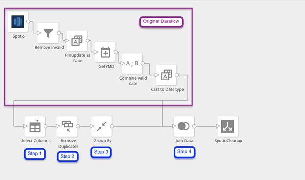

---
    title: Showing the Distinct Count for a Column
    url: https://domo-support.domo.com/s/article/360042923634
    linked_kbs:  ['[https://domo-support.domo.com/s/knowledge-base/](https://domo-support.domo.com/s/knowledge-base/)', '[https://domo-support.domo.com/s/](https://domo-support.domo.com/s/)', '[https://domo-support.domo.com/s/topic/0TO5w000000ZamzGAC](https://domo-support.domo.com/s/topic/0TO5w000000ZamzGAC)', '[https://domo-support.domo.com/s/topic/0TO5w000000ZaoJGAS](https://domo-support.domo.com/s/topic/0TO5w000000ZaoJGAS)', '[https://domo-support.domo.com/s/article/360042923634](https://domo-support.domo.com/s/article/360042923634)', '[https://domo-support.domo.com/s/topic/0TO5w000000ZaoJGAS/transformation-tips-and-tricks](https://domo-support.domo.com/s/topic/0TO5w000000ZaoJGAS/transformation-tips-and-tricks)', '[https://domo-support.domo.com/s/article/360043429933](https://domo-support.domo.com/s/article/360043429933)', '[https://domo-support.domo.com/s/article/360043429953](https://domo-support.domo.com/s/article/360043429953)', '[https://domo-support.domo.com/s/article/360042925494](https://domo-support.domo.com/s/article/360042925494)', '[https://domo-support.domo.com/s/article/360043429913](https://domo-support.domo.com/s/article/360043429913)', '[https://domo-support.domo.com/s/article/4408174643607](https://domo-support.domo.com/s/article/4408174643607)', '[https://domo-support.domo.com/s/login/](https://domo-support.domo.com/s/login/)']
    article_id: 000004597
    views: 2,462
    created_date: 2022-10-24 22:15:00
    last updated: 2022-10-24 22:41:00
    ---

At times when using Magic ETL it is useful to be able to show a distinct count for a column in a DataSet; however, this action is not currently available in ETL's pool of tiles. Luckily you can accomplish this by doing a small amount of data manipulation. All you need to do is pull out the column to be counted, remove duplicates, and do a GROUP BY, and a distinct count of the column will be shown.

**To show the distinct count for a column in ETL,**

 

**Note:**Perform these steps *after* all other DataFlow transformations have been completed.

1. Use the **Select Columns** tile to select any columns that need a distinct count or can be used to group the other columns.
2. Use the **Remove Duplicates** tile to reduce the data down to unique rows of data.
3. Use the **Group By**tile. Identify which column you will be grouping by (i.e. whatever would be in the GROUP BY statement within a MySQL DataFlow) and what columns will be aggregated, then select **Number of Values** for the aggregation.
4. Join this data back onto the final transform of the original DataFlow.  
   
   

This will result in a unique count for each row of data. You can then use a MIN() or MAX() aggregation to get the actual count. 

