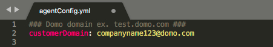
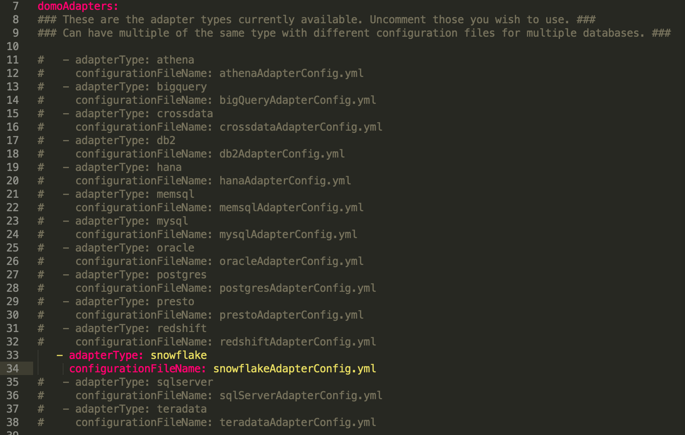
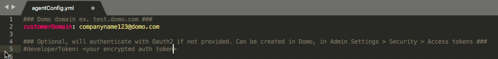
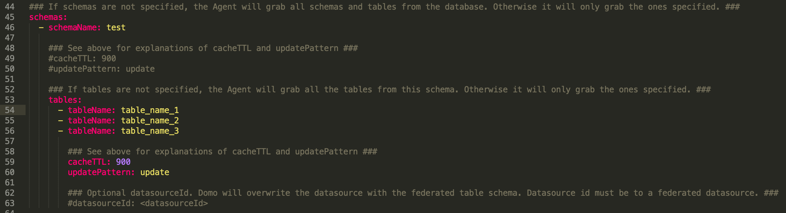
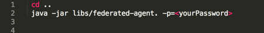

---
<<<<<<< HEAD
title: Snowflake Federated Agent
url: https://domo-support.domo.com/s/article/360044353933
linked_kbs:  ['[https://domo-support.domo.com/s/knowledge-base/](https://domo-support.domo.com/s/knowledge-base/)', '[https://domo-support.domo.com/s/](https://domo-support.domo.com/s/)', '[https://domo-support.domo.com/s/topic/0TO5w000000ZammGAC](https://domo-support.domo.com/s/topic/0TO5w000000ZammGAC)', '[https://domo-support.domo.com/s/topic/0TO5w000000ZanzGAC](https://domo-support.domo.com/s/topic/0TO5w000000ZanzGAC)', '[https://domo-support.domo.com/s/article/360042934494](https://domo-support.domo.com/s/article/360042934494)', '[https://domo-support.domo.com/s/article/360044353933](https://domo-support.domo.com/s/article/360044353933)', '[https://domo-support.domo.com/s/topic/0TO5w000000ZanzGAC/other-connection-methods](https://domo-support.domo.com/s/topic/0TO5w000000ZanzGAC/other-connection-methods)', '[https://domo-support.domo.com/s/article/360043429933](https://domo-support.domo.com/s/article/360043429933)', '[https://domo-support.domo.com/s/article/360043429953](https://domo-support.domo.com/s/article/360043429953)', '[https://domo-support.domo.com/s/article/360042925494](https://domo-support.domo.com/s/article/360042925494)', '[https://domo-support.domo.com/s/article/360043429913](https://domo-support.domo.com/s/article/360043429913)', '[https://domo-support.domo.com/s/article/4408174643607](https://domo-support.domo.com/s/article/4408174643607)', '[https://domo-support.domo.com/s/login/](https://domo-support.domo.com/s/login/)']
article_id: 000003152
views: 2,279
created_date: 2022-10-24 21:10:00
last updated: 2022-10-24 22:40:00
---
=======
title: Snowflake Federated Agent
url: https://domo-support.domo.com/s/article/360044353933
linked_kbs:  ['[https://domo-support.domo.com/s/knowledge-base/](https://domo-support.domo.com/s/knowledge-base/)', '[https://domo-support.domo.com/s/](https://domo-support.domo.com/s/)', '[https://domo-support.domo.com/s/topic/0TO5w000000ZammGAC](https://domo-support.domo.com/s/topic/0TO5w000000ZammGAC)', '[https://domo-support.domo.com/s/topic/0TO5w000000ZanzGAC](https://domo-support.domo.com/s/topic/0TO5w000000ZanzGAC)', '[https://domo-support.domo.com/s/article/360042934494](https://domo-support.domo.com/s/article/360042934494)', '[https://domo-support.domo.com/s/article/360044353933](https://domo-support.domo.com/s/article/360044353933)', '[https://domo-support.domo.com/s/topic/0TO5w000000ZanzGAC/other-connection-methods](https://domo-support.domo.com/s/topic/0TO5w000000ZanzGAC/other-connection-methods)', '[https://domo-support.domo.com/s/article/360043429933](https://domo-support.domo.com/s/article/360043429933)', '[https://domo-support.domo.com/s/article/360043429953](https://domo-support.domo.com/s/article/360043429953)', '[https://domo-support.domo.com/s/article/360042925494](https://domo-support.domo.com/s/article/360042925494)', '[https://domo-support.domo.com/s/article/360043429913](https://domo-support.domo.com/s/article/360043429913)', '[https://domo-support.domo.com/s/article/4408174643607](https://domo-support.domo.com/s/article/4408174643607)', '[https://domo-support.domo.com/s/login/](https://domo-support.domo.com/s/login/)']
article_id: 000003152
views: 2,278
created_date: 2022-10-24 21:10:00
last updated: 2022-10-24 22:40:00
---
>>>>>>> fe496b1d734bfbc1f7998509d0072e99b55e6786

Intro
-----

The Domo Federated Agent is a solution that allows you to connect your on-premise data to Domo through Snowflake. The agent makes a socket connection to Domo and then proxies requests to your database which allows you to visualize your snowflake data in Domo in real-time, any time, anywhere. With the Snowflake Federated Agent, your data always stays in your database and is never stored in Domo. 

How to get the Federated Agent
------------------------------

For more information on the Snowflake Federated Agent pricing and access, contact your Customer Success Manager (CSM). 

Prerequisites
-------------

* Admin access to your database and the ability to write a new table to your database.
* Database access credentials
* Admin level access in Domo
* Database connection URL
* (Optional) [Managing Access Tokens](/s/article/360042934494 "Snowflake Federated Agent")

Agent Configuration
-------------------

###### To properly configure your Domo Federated Agent,

1. Navigate to the conf directory in the unzipped file Domo provided.
2. Open the agent configuration file titled agentConfig.yml

 

**Note:** The configuration files are all .yml files are case and character sensitive.
3. Fill in your Domo domain.  
  

4. Uncomment the `adapterType: snowflake` and `configurationFileName: snowflakeAdapterConfig.yml` lines.  
  

There are two ways to authenticate to Domo—using a developerToken property (recommended) or using Oauth2 (default). Using a developerToken is recommended because it automatically authenticates to Domo every time. By using Oauth2, for every change or restart of the agent, you will need to reauthorize. 

**To authenticate using a developerToken,**

1. Create an Access Token in Domo. See [Managing Access Tokens](/s/article/360042934494 "Managing Access Tokens") for detailed instructions on creating an Access Token.
2. Uncomment the developerToken line and enter the Access Token.  
  

  
**To authenticate using Oauth2,**

No additional configuration is needed. Leave the developerToken line commented out, and the agent will prompt you to authenticate by Oauth login.

Adapter Configuration
---------------------

1. In the conf directory of the unzipped file Domo provided, open the snowflakeAdapterConfig.yml file.
2. Enter the required information on the uncommented lines.

For every table you wish to visualize in Domo, the `tableName:` line must be copied.  
  

 

**Important:** If table names are not specified, the Snowflake Agent will visualize all tables available in your database.

Password Encryption
-------------------

In order to run the Snowflake Federated Agent, you will need to set a password. Optionally, your password can be used to encrypt your database passwords and Domo Access Token.

If you choose not to encrypt, you still need to generate a password and store it in one of two ways.

### Set the password as an Environment Variable

 

 

**Important:** This is the recommended way to set the encryption password

Variable: `DOMO_FD_ENCRYPTION_PW`

E.g. `DOMO_FD_ENCRYPTION_PW=<your encryption password>`

### Pass it as a command line property

 

 

**Note:** -p or --encryptionPassword may be used.
 

If this method is chosen, you must edit the [startAgent.sh](http://startAgent.sh) or startAgent.bat file, found in the bin directory, and add the -p=<yourPassword> property at the end of the java -jar line. Using this method, the password will be stored in the command history.

E.g. `java -jar libs/federated-agent.jar -p=testpw`

Optionally, the database passwords and Domo Auth Token can be encrypted using our encryption jar. You can also place your passwords in plain text in the configuration files.

To encrypt your passwords or token run the [startEncryption.sh](http://startEncryption.sh) or startEncryption.bat file found in the bin folder and follow the instructions there. Copy the newly encrypted database password and store it in the appropriate adapter configuration.

Standard Calendar Table Configuration
-------------------------------------

In order for date grain queries to work in Domo, the domo.standardcalendar must be loaded into your database.

**Important:** 

* If the Standard Calendar Table is not configured, any query that includes a date type column will fail.
* Domo uses double quotes for identifiers in SQL queries, which may result in queries containing identifiers that cannot be found in Snowflake due to differences in case. To prevent this situation from occurring, Snowflake provides a session parameter, QUOTED\_IDENTIFIERS\_IGNORE\_CASE, that ensures all alphabetical characters in identifiers created within the session are stored in uppercase, regardless of whether the identifier is double-quoted. You can fix any problems with this by setting the session parameter at the user level using the ALTER USER command. The syntax is as follows:  
  
`ALTER USER [ IF EXISTS ] *<name>* SET { [ **objProperties** ] [ **sessionParams** ] }`  
  
For more information, see <https://docs.snowflake.net/manuals/sql-reference/parameters.html#quoted-identifiers-ignore-case>.

 

**To configure the Standard Calendar table,**

1. Navigate to the standardCalendar folder of the unzipped file provided by Domo.
2. Select the snowflake folder. There are create table statements listed under each database type in the format `<databaseName>Standardcalendar.sql`.

 

**Note:** For each database used, a standard calendar table using the [schema](#h_02b6f2c1-2b8b-4b98-a457-547e27c23082 "Snowflake Federated Query") below will need to be created.
3. Once the table is created, load the data using either the standardcalendar\_data.csv or standardcalendar\_data.txt file found in the standardCalendar file.

 

**Note:** Fields are terminated with the ',' character and lines are terminated with the '\r\n' return. There are no quotes surrounding any of the data, and no need to escape any fields. The dates are in the format "yyyy-MM-dd".
4. Optionally, there is a standard\_calendar\_data.sql file where the data is formatted as insert statements.

##### domo.standardcalendar Schema

| Field Name | Data Type |
| --- | --- |
| Domo\_Key | Date |
| Date | Date |
| DayOfWeek | String |
| DayNumberInWeek | Integer |
| DayNumberInMonth | Integer |
| DayNumberInQuarter | Integer |
| DayNumberInYear | Integer |
| MonthName | String |
| MonthAbrv | String |
| MonthNumberInYear | Integer |
| Quarter | String |
| Year | Integer |
| CalendarMonth | String |
| CalendarQuarter | String |
| WeekStart | Date |
| QuarterStart | Date |
| DaySinceEpoch | Integer |
| WeekSinceEpoch | Integer |
| MonthSinceEpoch | Integer |
| QuarterSinceEpoch | Integer |
| YearSinceEpoch | Integer |
| MonthStart | Date |
| YearStart | Date |
| QuarterNumberInYear | Integer |

Fiscal Calendar Configuration
-----------------------------

If a fiscal calendar needs to be set up for Federated Data, please send an email to [labs@domo.com](mailto:labs@domo.com "mailto:labs@domo.com") including the following items:

* Domo domain

Then, we will provide you with the schema and steps for adding the calendar to your database.

Running the Agent
-----------------

Once all components above are properly configured, it is time to run the agent.

**To run the Agent,**

1. Using the appropriate startAgent file for your machine from your bin folder found in the Domo provided file.

	* For Windows, use the .bat file.
	* For Mac or Linux, use the .sh file.
2. Make sure a DataSet was created in Domo for your tables by navigating to the Data Center in Domo.  

	* Filter to the DataSet type of Data Anywhere to see any federated queried DataSets.

You can now use your federated datasets in Domo to create cards and consume your on-premise data.

**Tip:** To use multiple databases of the same type, copy the type configuration and point to another configuration file.

FAQ
---

**Can I still use PDP and create Beastmodes on federated DataSets?**

Yes, you can still use PDP and create Beastmodes just like on a standard DataSet.

**Can I use my federated DataSets in Domo DataFlows?**

No, federated DataSets are not supported as inputs in Magic ETL, MySQL Dataflows, or Fusion.

**Can I set Alerts on cards powered from a federated DataSet?**

No, Alerts are not currently supported on cards powered by a federated DataSet.

