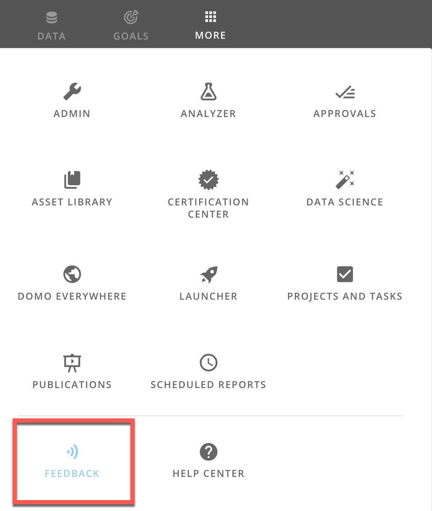
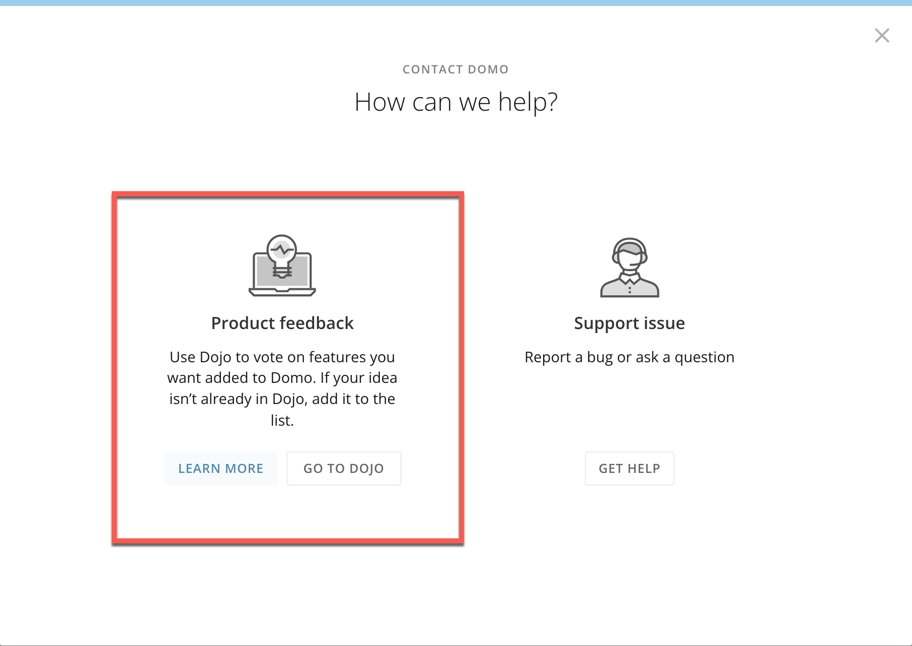
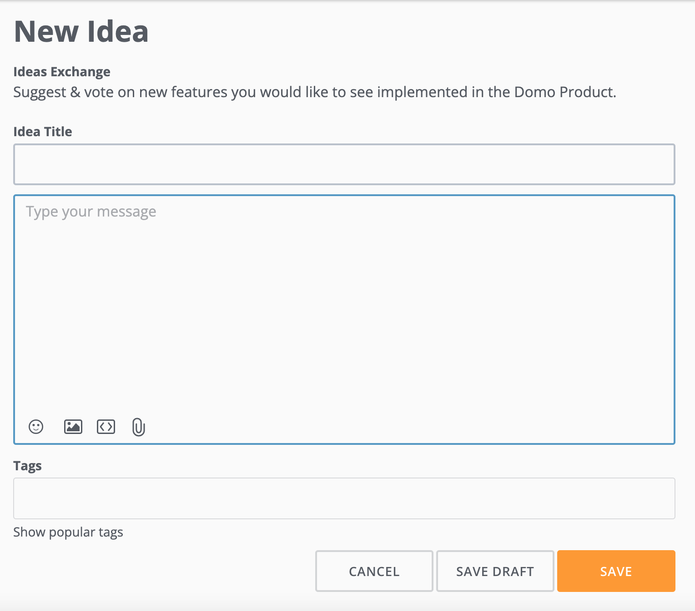

Intro
-----

With the July 2022 release, Domo is introducing a new product feedback process: the **Ideas Exchange** in Dojo**.** 

The **Ideas Exchange** enables users to: 

* Submit ideas for feature improvement
* Get support from other users and Domo's product managers

Domo users can submit, track, and follow up on feedback. Additionally, users can add multimedia to their submissions and upvote ideas. Domo's product managers regularly review idea submissions, and the most upvoted ideas are given top consideration for future development. 

**Video: Product Feedback in the Ideas Exchange**

 

Submitting a Feature Request Using the Ideas Exchange
-----------------------------------------------------

Note: In order to post, you must be logged in using your Domo credentials. 

 

Follow the steps below to post in the Ideas Exchange:

 

1. In the navigation header, select **More > Feedback.**

 

2.  Select **Product feedback**.

You will be taken to Dojo's **Ideas Exchange.**

 

**Note:** If you would like to submit an issue rather than an enhancement to the product, select **Support Issue** to contact Domo Support. 

 

3. To share an idea for a new feature, select **New Idea**.

 

**Tip:** To ensure our product team can use your suggestions, we have a few guidelines to help you get the most out of the Ideas Exchange:

 

1. Search your product idea before you post a new one. It is likely your idea or something similar has already been posted. 

* If your idea has already been posted,  **Upvote** to increase validity.
* If a variation of your idea exists,  **Upvote** the idea, then comment with your added recommendations.
* Finally, if your idea doesn’t exist, post your new idea.

2. Please include images and detailed descriptions for your idea. The more context, the better the product team can understand your suggestion.

  
3. Our product team regularly reviews top-voted ideas. You can expect updates (via the comments) from product managers on top-voted ideas. 

 

4. Add a title, description, and tags. You can also add pictures, files, and URLs. To see trending topics, select **Show popular tags**. 

 

5. Select **Save**. 

Your post is added to the Ideas Exchange. Top-voted suggestions will be reviewed by the product team. 

 

FAQs
----

**How do I know when to submit Product Feedback as opposed to a Support ticket?**

Product Feedback is reserved for features or enhancements that you would like added to Domo and not necessarily problems or bugs that you may encounter. Any issues you experience should be sent to our [Help Center](/s/article/360042922874 "Getting Help") for additional troubleshooting or assistance. Reach out to the support team by emailing [support@domo.com](mailto:support@domo.com) 

 

**When can I expect to hear back from Domo's Product team regarding my feedback?**

We do not have an exact timeframe on when this turnaround will occur. However, we can assure you that our team will follow up with you directly to address your request in detail.

 

**When will my requested feature be added to the Domo product?**

We cannot guarantee that all features will be added, but your ideas help us to create an incredible Domo experience for everyone.

