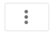
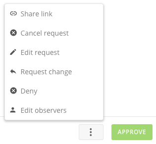

Intro
-----

In Approvals, you can review and leave a comment on any request you have access to view as a submitter, approver, or observer. Once submitted, a request proceeds in a linear fashion through the approval chain. While the request is pending review, the submitter or the pending approver may edit any of the request details.   
 While reviewing a request, the pending approver may choose to approve, deny, request a change, or delegate. When taking any of these actions, the approver may also leave an optional message to provide context for the action taken.

This topic discusses how to submit requests for approval as well as approve them. For information about creating a request template, see [Approvals Layout](/s/article/360042926014 "Creating a Request Form").

Example
-------

Let's say that the chief inspections engineer for filtration company "Wetter Water" creates a template to be used by members of his quality control staff whenever they need to do an inspection at a customer company. The template includes required fields such as the customer name, the physical address, the expected amount of time to be spent offsite, the priority level, and so on. Two approvers are specified in the approval chain—Marlo, the chief inspections engineer himself, and Marlo's supervisor, company COO Janice. The following workflow shows a typical example of how this template might be used:

1. Quality engineer Jake receives a call from a customer complaining about low water flow in a fountain.
2. Jake fills out the inspection template with details for a planned visit and submits it.
3. Marlo is notified about the request via email.
4. Marlo opens Approvals and takes a look at the details of the request. Satisfied, he gives his stamp of approval.
5. Janice is notified about the request via email.
6. Janice opens Approvals and takes a look at the details of the request. She feels that Jake has scheduled too much time for the inspection, as the customer company is located only a mile away and the problem probably has an easy solution. She uses the **Request Change**option, being sure to include a message suggesting that Jake subtract an hour from the allotted time.
7. Jake is notified via email that the request has been sent back.
8. Jake opens Approvals and modifies the proposed amount of time. He then resubmits the request.
9. Marlo and Janice both approve the modified request.
10. Jake is notified via email that his request has been approved.

Submitting a Request
--------------------

As explained above, when you submit a request, the first Domo user specified in the approver chain receives a notification. This user can then...

* approve the request, causing a notification to be sent to the next approver in the chain (unless this user is the only user in the approver chain, in which case the submitting user is notified of the approval),
* leave a comment about the request,
* share access to the request by adding specified users and groups as observers,
* make changes to the request details,
* request that a change be made to the details of the request,
* delegate the request to someone else, or
* deny the request altogether.

If this user approves the request, the next approver in the chain is given this same set of options. 

**To submit a request,**

1. Select  **> Approvals**.
2. Select **New Request** in the left-hand navigation.
3. Locate the request template you want to use to submit your request.  
 If you do not see the request template you need, you can create it yourself or ask another user to create it. For more information, see [Creating a Request Template](https://domohelp.domo.com/Docs_in_Production_(Internal)/Creating_a_Request_Template "Creating a Request Form"). 

 

**Note:**The request form for certifying cards is *not* found in the Approval Center (though any card certification requests *will* appear in the **Submitted by You**/**Waiting on You** tabs). You open this form for a specified card by selecting **Request certification**in the dropdown menu for the card. If you want to edit the form fields and/or approvers for the card certification form, you can do so in **Admin Settings > Certified Content**. You must have an "Admin" security role to do this. For more information, see [Certifying Content](https://domohelp.domo.com/Optimize/Approving_and_Certifying_Content/Certifying_Content "Certifying Content").
4. Fill out the fields in the template as required.
5. (Optional) If you want to add additional approvers to the approval chain, and the approval chain is unlocked, you can do so by clicking **Add Approver**.
6. (Optional) If you want to add additional observers to the request, you can do so by clicking Add Observer.
7. Click **Submit**.

A notification is now sent to the first approver in the chain, who has the option to approve the request, ask for modifications, or reject the request.

Reviewing a Request
-------------------

If you are specified as an approver or observer for any request template in Approvals, it is your responsibility to handle any requests submitted via that template. When a request is made, a notification is sent, based on your preferences in global notification settings, to you letting you know that there is something that needs your attention in Approvals. For any submitted request that is pending your approval, you can take the following actions:

* Approve the request.
* Ask a question or leave a comment about the request.
* Share access to the request by adding a individuals or groups as an observers.
* Edit details of the request.
* Request changes from anyone prior to you in the approval chain.
* Delegate the request to someone else (this person or group will replace you in the approval chain.)
* Deny the request altogether.

**To act on a request,**

1. Select  **> Approvals**.
2. Select the **Waiting on You** quick filer on Approvals home screen or select **Active requests** in the left-hand navigation.
3. In the list pane, locate and click on the request you wish to review and take action on. When you click a request, details for that request appear in the pane on the right side of the screen.
4. Do one of the following:

	* To *approve*the request, click **Approve**.   
	 If there are approvers after you in the chain, the next approver is notified about the approval, and it now falls upon that user to approve the request, reject it, etc. Otherwise, the approval process is finished and the submitter is notified.
	* To *review* the comments attached to the request, click on the **Comments** tab. (When there are new comments you have not read, a red dot will appear on this tab.)
	* To *share access* to the request, click on the  and select **Edit observers**.
	* To *edit* the request, click on the  , select **Edit request**, make your changes, then click **Save**.
	* To *request changes, delegate, or deny*, click on the , then select the action you wish to take.  
	   
	
