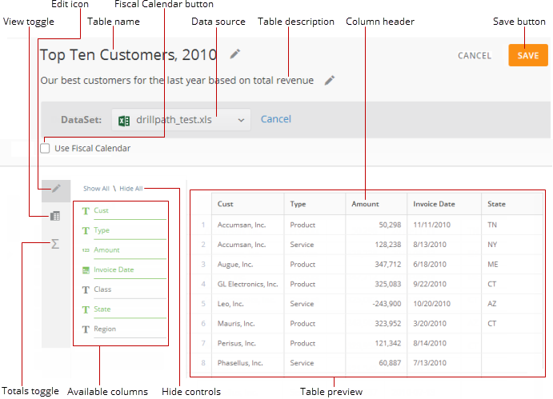
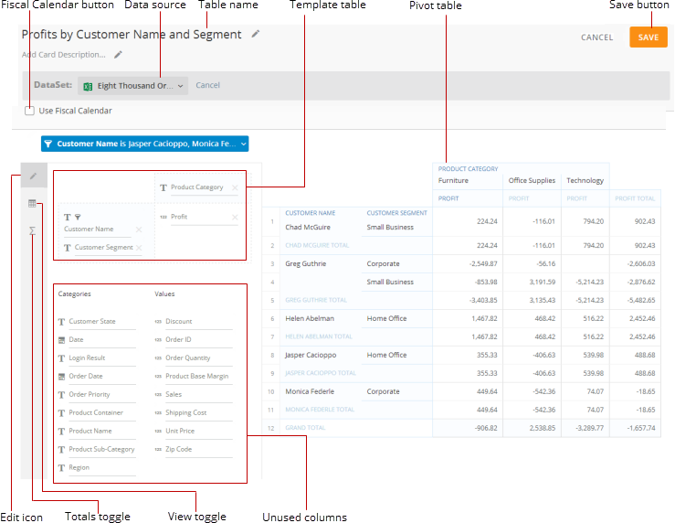

---
    title: Sumo Editor Layout
    url: https://domo-support.domo.com/s/article/360046752694
    linked_kbs:  ['[https://domo-support.domo.com/s/knowledge-base/](https://domo-support.domo.com/s/knowledge-base/)', '[https://domo-support.domo.com/s/](https://domo-support.domo.com/s/)', '[https://domo-support.domo.com/s/topic/0TO5w000000ZamoGAC](https://domo-support.domo.com/s/topic/0TO5w000000ZamoGAC)', '[https://domo-support.domo.com/s/topic/0TO5w000000ZaoHGAS](https://domo-support.domo.com/s/topic/0TO5w000000ZaoHGAS)', '[https://domo-support.domo.com/s/article/360042924014](https://domo-support.domo.com/s/article/360042924014)', '[https://domo-support.domo.com/s/article/360043428573](https://domo-support.domo.com/s/article/360043428573)', '[https://domo-support.domo.com/s/article/360042926274](https://domo-support.domo.com/s/article/360042926274)', '[https://domo-support.domo.com/s/article/360042925674](https://domo-support.domo.com/s/article/360042925674)', '[https://domo-support.domo.com/s/topic/0TO5w000000ZanAGAS](https://domo-support.domo.com/s/topic/0TO5w000000ZanAGAS)', '[https://domo-support.domo.com/s/article/360046752694](https://domo-support.domo.com/s/article/360046752694)', '[https://domo-support.domo.com/s/topic/0TO5w000000ZaoHGAS/sumo-cards](https://domo-support.domo.com/s/topic/0TO5w000000ZaoHGAS/sumo-cards)', '[https://domo-support.domo.com/s/article/360043429933](https://domo-support.domo.com/s/article/360043429933)', '[https://domo-support.domo.com/s/article/360043429953](https://domo-support.domo.com/s/article/360043429953)', '[https://domo-support.domo.com/s/article/360042925494](https://domo-support.domo.com/s/article/360042925494)', '[https://domo-support.domo.com/s/article/360043429913](https://domo-support.domo.com/s/article/360043429913)', '[https://domo-support.domo.com/s/article/4408174643607](https://domo-support.domo.com/s/article/4408174643607)', '[https://domo-support.domo.com/s/login/](https://domo-support.domo.com/s/login/)']
    article_id: 000004115
    views: 2,349
    created_date: 2022-10-24 21:22:00
    last updated: 2022-10-24 22:41:00
    ---

Intro
-----

A Sumo card provides two possible views of a table—a standard column-based view or a more powerful pivot view with functionality similar to that found in Microsoft Excel. The Sumo card builder interface consists of a **Column View** and a **Pivot View**. **Column View** provides an interface for creating standard column-based tables, whereas in **Pivot View** you can create pivot tables. You can manipulate table data in each view independently. The view that is selected when you save your table is the view that appears in this Sumo card in the page view.

In the build/edit interface for a Sumo card, you can add and remove columns, sort, aggregate, change how date data is represented, and so on. The available options are the same whether you are building a Sumo card, editing an existing card, or applying temporary edits in the Details view. When you make edits in the Details view, your changes are applied only to your own Domo instance and are temporary; when you leave the Details view, your changes disappear. In contrast, any changes you make in the Edit view are applied permanently to the Sumo table unless you or another user changes them again in the Edit view. For more information about filtering data in a card Details view, see [Filtering Data in a Card Details View](/s/article/360042924014 "Filtering Data in a Card Details View").

This topic discusses the interfaces for **Column View** and **Pivot View**. For information about creating a Sumo card using the components in this view, see [Sumo cards](/s/article/360043428573 "Adding or Editing a Sumo Card"). 

Column View
-----------

This view presents the standard columnar table view for the data in the DataSet you have selected. In this view you can add or remove columns from your table; hide or show all columns; sort column data; combine rows with like headings and aggregate their data; break up rows you have combined; change how date data is represented; change how data is aggregated in combined rows; apply filters; format numbers in value columns; and apply conditional formatting to value and string columns.

The following screenshot calls out the most important parts of **Column View**:

You can learn more about these components in the following table:

| Name | Description |
| --- | --- |
| View toggle | Toggles between **Column View** and **Pivot View**. |
| Edit icon | Lets you hide or show the edit controls. |
| Table name | The name of this Sumo table. You can change the name by clicking anywhere within the current name (or default text, if no name has been entered yet) and entering the desired name. |
| Fiscal Calendar button  | Toggles the Fiscal Calendar on and off if one has been implemented in your Domo instance.  |
| DataSet | The DataSet used to power up this Sumo table. You can add a DataSet or change the selected DataSet by clicking anywhere in the DataSet field and selecting the desired DataSet. Once a DataSet is selected, a preview of the data appears on the screen.

**Note:**The DataSet you select must already exist in Domo. You cannot upload a new DataSet in the Sumo card interface. For more information about uploading DataSets, see [Adding a DataSet Using a Data Connector](/s/article/360042926274 "Adding a DataSet Using a Data Connector").

 |
| Table description | The description that appears when you mouse over this Sumo table in the Card view or click the card name in the Details view. You can change the description by clicking anywhere within the current description (or default text, if no description has been entered yet) and entering the desired description. |
| Column header | The name of this column. Mousing over a column causes two icons to appear.
Click to sort a column. Clicking the icon once sorts the column alphabetically; clicking it a second time applies a descending sort; and clicking it a third time turns off sorting in the column (in which case, items appear as they do in the DataSet).
Click to access options for manipulating the data in a column. Available options include the following:
Update all of the below links using anchors once Sumo creation topic is in place.* **Hide Column.**Hides this column. You can show a column you have hidden by clicking its name in the column list on the left side of the table.
* **Sort Ascending/Sort Descending.**Allows you to sort columns using an ascending or descending sort. This option is available for all columns. In **Column View** you can only have one column sort at a time. For example, you could not sort by date and then have a separate sort for your values column for each represented date. If you want multiple sorts, create your table in **Pivot View**. For more information about sorting, see [Adding a Sumo Card](/s/article/360042925674 "Adding or Editing a Sumo Card").
* **Group.**Combines all rows with like headings for the column you apply it to and aggregates the data in those rows. Cells in columns that cannot be aggregated display a value of "Unique" by default, which is a count of all unique items within that column. For example, if a column with salesperson names contained five instances of the name "Bob Jones," that name would only be counted once using the "Unique" aggregation. You can change the aggregation type by clicking in the second row or by choosing **Change Aggregate** in the column dropdown menu and selecting the desired aggregation type. This option is available for all columns *except* date columns. For more information about grouping and ungrouping, see [Adding a Sumo Card](/s/article/360042925674 "Adding or Editing a Sumo Card").
* **Ungroup.**Breaks apart rows that have been grouped. For more information about grouping and ungrouping, see [Adding a Sumo Card](/s/article/360042925674 "Adding or Editing a Sumo Card").
* **Date Grain.**Lets you change how date data is represented, either by day, week, quarter, month, or year. For more information, see [Adding a Sumo Card](/s/article/360042925674 "Adding or Editing a Sumo Card").
* **Change Aggregate.**Appears in the column dropdown menus after you have rolled up one or more columns (except for the menus of the column(s) you rolled up). Available aggregations include the following:
	+ Sum — Totals all values in the rows for this column.
	+ Average — Shows the average value for all rows.
	+ Unique — Shows the number of unique items in the column.
	+ Count — Shows the number of all items in the column.
	+ Min — Shows the smallest value in the column.
	+ Max — Shows the largest value in the column.You can also change the aggregation type for the total value for a column. Totals are shown in the "TOTAL" cells at the bottom of each column, along with their aggregation indicators (unless you hide the totals row).For more information about aggregating, see [Adding a Sumo Card](/s/article/360042925674 "Adding or Editing a Sumo Card").
* **Filter.**Filters rows. For a text column, you select the specific items that you want to appear in the table. For a value column, you select the desired value range from a number of comparisons like "greater than," "less than," etc. For a date column, you select a date range from a number of options. When you add a filter, a bar for that filter appears above the table. You can click the bar to open the filter for editing or removal. For more information about filtering, see [Adding a Sumo Card](/s/article/360042925674 "Adding or Editing a Sumo Card").
* **Formatting.**Lets you apply different formatting to numbers in value and date columns. For more information about formatting, see [Adding a Sumo Card](/s/article/360042925674 "Adding or Editing a Sumo Card").
* **Conditional Formatting.**Lets you set rules for a value or string column so that any values or strings that meet certain conditions appear with a different text color and/or background. For more information about formatting, see [Adding a Sumo Card](/s/article/360042925674 "Adding or Editing a Sumo Card").
 |
| Save button | Saves this Sumo card and updates the summary image in the card page accordingly. This image appears as a standard table or a condensed pivot table depending on whether **Column View** or **Pivot View** is selected, respectively, when you save. For more information, see [Sumo cards](/s/article/360043428573 "Understanding Cards"). |
| Totals toggle | Hides/shows the "Total" row at the bottom of the table. |
| Available columns | The columns in this DataSet. Green indicates that this column is found in the table; gray indicates that it is not. You can click a column to add it to the table or remove it. You can also drag and drop columns within the list to reorder them in the table.
Columns you add to a DataSet using Beast Mode appear in your list of available columns in Sumo. For more information about adding Beast Mode columns to a DataSet, see [Transforming Data Using Beast Mode](/s/topic/0TO5w000000ZanAGAS "Transforming Data Using Beast Mode"). |
| Hide controls | Let you hide or show columns in **Column View**. |
| Table preview | A preview of the table in its standard columnar format. |

Also, if your DataSet contains more than 50 rows, you can load more rows into the table preview by clicking **Load More Rows**, which is found at the bottom of the preview.

### Pivot View

In this view, you can create powerful pivot tables by dragging and dropping column names into a template table with regions for rows, columns, and values. As you add column names to the template table, the data in those columns appears in your pivot table. You can also reposition column names in the template table or delete them altogether, and the pivot table is updated accordingly.

The following screenshot calls out the most important parts of **Pivot View**:

You can learn more about the components in the following table:

| Name | Description |
| --- | --- |
| Fiscal Calendar button  | Toggles the Fiscal Calendar on and off if one has been implemented in your Domo instance.   |
| DataSet | The DataSet used to power up this Sumo table. You can add a DataSet or change the selected DataSet by clicking anywhere in the DataSet field and selecting the desired DataSet. Once a DataSet is selected, a preview of the data appears on the screen.

**Note:**The DataSet you select must already exist in Domo. You cannot upload a new DataSet in the Sumo card interface. For more information about uploading DataSets, see [Adding a DataSet Using a Data Connector](/s/article/360042926274 "Adding a DataSet Using a Data Connector").

 |
| Table name | The name of this Sumo table. You can change the name by clicking anywhere within the current name (or default text, if no name has been entered yet) and entering the desired name. |
| Template table | A table with regions for rows, columns, and values. When you drag and drop column names from the unused columns pool into any of the regions in the template table, or double-click a column name to add it to the template table, the data from those columns appears in the associated region of the pivot table. For example, if you dragged a column into the rows region of the template table, the values from that column would appear on the left side of the pivot table. You can also reposition column names in the template table or delete them altogether, and the pivot table is updated accordingly.
For more information about building a pivot table, see [Adding a Sumo Card](/s/article/360042925674 "Adding or Editing a Sumo Card").
When you click a column name in the template table, a dialog pops up in which you can specify filters for this column. For more information about applying filters, see [Adding a Sumo Card](/s/article/360042925674 "Adding or Editing a Sumo Card"). |
| Pivot table | Your Sumo pivot table. You can add rows, columns, and values to the table by dragging column names from the unused columns pool into the rows, columns, or values regions of the template table. As you move column names from region to region in the template table, the pivot table updates accordingly. If you have not yet added any columns to the template table, no pivot table appears.
For more information about building a pivot table, see [Adding a Sumo Card](/s/article/360042925674 "Adding or Editing a Sumo Card").
When you click a column name in the pivot table, a pop-up list appears with many options. These options include the following:* **Hide Column.**Removes this column from the pivot table, sending it back to the unused columns pool.
* **Sort Ascending/Sort Descending.**Allows you to sort columns using an ascending or descending sort. This option is available for all columns. In **Pivot View**, you can sort by multiple columns at once as long as you sort only date and series columns. For example, you could have a descending sort in your date column (so that the most recent date would appear at the top) and an ascending (alphabetical) sort in your series column. If you sort a value column, all other columns are sorted accordingly to match the value sort. For more information about sorting, see [Adding a Sumo Card](/s/article/360042925674 "Adding or Editing a Sumo Card").
* **Date Grain.**Lets you change how date data is aggregated, either by day, week, quarter, month, or year. For more information, see [Adding a Sumo Card](/s/article/360042925674 "Adding or Editing a Sumo Card").
* **Change Aggregate.**Appears for value columns in the pivot table. Available aggregations include the following:
	+ Sum — Totals all values in the rows.
	+ Average — Shows the average value for each row.
	+ Unique — Shows the number of unique items for each row.
	+ Count — Shows the number of items in each row.
	+ Min — Shows the smallest value in each row.
	+ Max — Shows the largest value in each row.For more information about aggregating, see [Adding a Sumo Card](/s/article/360042925674 "Adding or Editing a Sumo Card").
* **Filter.**Filters rows. For a text column, you select the specific items that you want to appear in the table. For a value column, you select the desired value range from a number of comparisons like "greater than," "less than," etc. For a date column, you select a date range from a number of options. When you add a filter, a bar for that filter appears above the table. You can click the bar to open the filter for editing or removal. For more information about filtering, see [Adding a Sumo Card](/s/article/360042925674 "Adding or Editing a Sumo Card").
* **Formatting.**Lets you apply different formatting to numbers in value columns. You can also access formatting options for a column by clicking the column name in the template table or unused columns pool. For more information about formatting, see [Adding a Sumo Card](/s/article/360042925674 "Adding or Editing a Sumo Card").
* **Conditional Formatting.**Lets you set rules for a value or string column so that any values or strings that meet certain conditions appear with a different text color and/or background. For more information about formatting, see [Adding a Sumo Card](/s/article/360042925674 "Adding or Editing a Sumo Card").
 |
| Save button | Saves this Sumo card and updates the summary image in the card page accordingly. This image appears as a standard table or a condensed pivot table depending on whether **Column View** or **Pivot View** is selected, respectively, when you save. For more information, see [Sumo cards](/s/article/360043428573 "Understanding Cards"). |
| Edit icon | Hides/shows the unused columns pool and template table. |
| Totals toggle | Hides/shows all "Total" rows and columns in the pivot table. |
| View toggle | Toggles between **Column View** and **Pivot View**. |
| Unused columns | The columns in this DataSet you have not added to your pivot table. You can add columns to your pivot table by dragging and dropping them into the desired region of the template table. Normally you drop category columns into the rows and columns regions of the template table and value columns into the values region. However, you are not required to do so. For example, you might want to show sales by zip code. The "Zip Codes" column would be interpreted by Domo as a values column and thus appear in your "Values" unused column listing. But you could drop it into the rows or columns region of your template table, and it would be treated as category data.
For more information about building pivot tables, see [Adding a Sumo Card](/s/article/360042925674 "Adding or Editing a Sumo Card"). 
When you click a column name in the template table, a dialog pops up in which you can specify filters for this column. For more information about filters, see [Adding a Sumo Card](/s/article/360042925674 "Adding or Editing a Sumo Card").
Columns you add to a DataSet using Beast Mode appear in your list of unused columns in Sumo. For more information about adding Beast Mode columns to a DataSet, see [Transforming Data Using Beast Mode](/s/topic/0TO5w000000ZanAGAS "Transforming Data Using Beast Mode"). |

