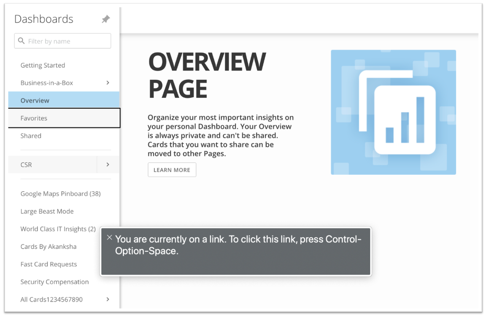

Intro
-----

Domo’s improved accessibility functionality allows customers to make their Cards screen reader-friendly, as well as find Stories, traverse layouts, and read Card details. Expanded access for screen readers and keyboards better enables customers with a diverse base of users to expose Domo content to users with accessibility requirements.

