Intro
-----

Thank you for choosing to install the Talent Pipeline app! This guide is intended to help you connect this app to your own data. If you have completed the purchasing process for this app, then you will be able to go through all of the steps in this guide. The first steps are making sure that the app and the app's DataFlow have been properly downloaded from the Appstore, and that your data is in the correct format to be used by the app. 

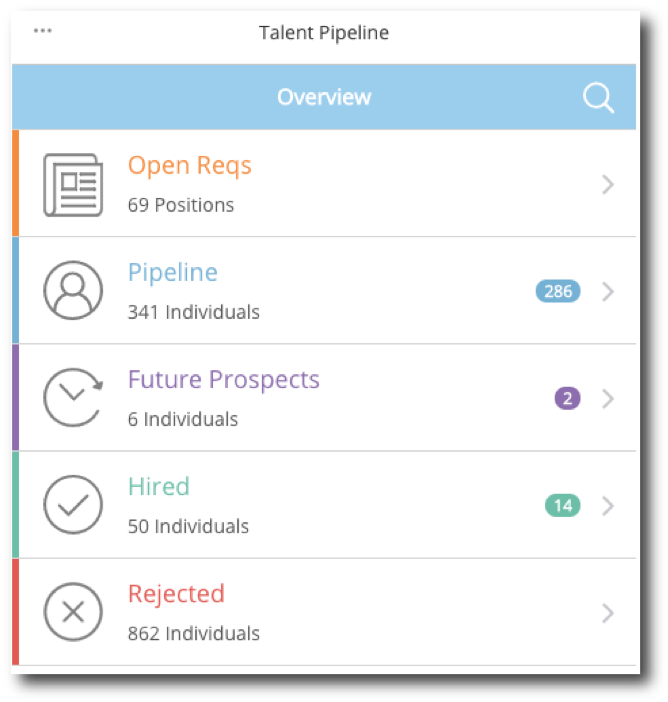

Prerequisites
-------------

This app utilizes a tool called the Grid Builder to map your data to the schema that is required by the app. If you are not already familiar with the Grid Builder, please read Grid Builder walkthrough [here](https://developer.domo.com/docs/installation-guides/grid-builder-walkthrough). Though it is not required, it is also useful to have a working knowledge of how a MySQL query works. 

Below is a diagram that displays the order in which your data will be fed through the DataFlow and then output to the app. 

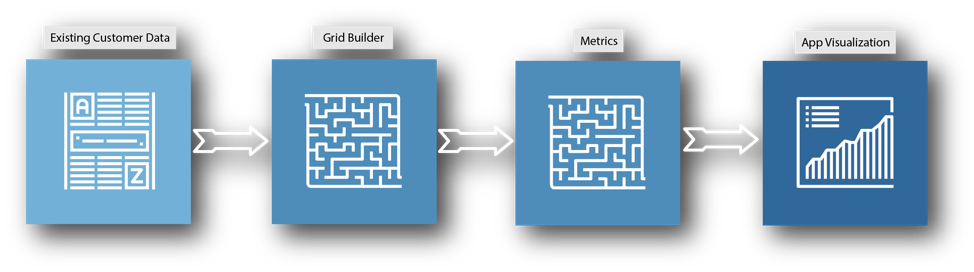

When you are familiar with how the Grid Builder works, follow these steps to make sure that the app and its DataFlow are properly deployed to your instance in Domo:

* If you purchased the app through the Appstore, make sure that you have clicked the **Try It** button located on the app's page in the Appstore to deploy the app and its DataFlow to your instance. You will be asked to name the page where you'd like the app to live in Domo.
* Double check that the app's DataFlow has been deployed to your instance. To check this, navigate to the Data Center by clicking the menu button in the top right corner of Domo, then clicking the **Data Center** icon. (see image below for example)

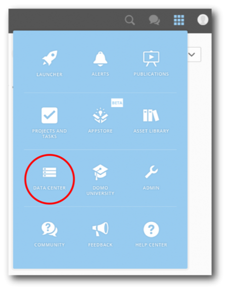

* Click **DataFlows** on the left side of the Data Center screen, then use the Data Center's search bar to search for "Talent Pipeline". You should be able to see a DataFlow that matches your search term.

If you've followed these steps and you still aren't able to find the app on the page you've created or its DataFlow, contact Domo Support.

Part 1: Prepare Your Data
-------------------------

The Talent Pipeline app displays and tracks the progress of every candidate in your hiring pipeline through the hiring process—this means that you'll need four tables to run this app. One table will be the "current details about candidates", another will be a "history of the statuses for these candidates", another will be "information on requisitions", and the last table will be "contact information for company managers". Certain columns are required in order for the DataFlow to run, the table schemas below show all of the required columns. The column names will be mapped when you fill out the Grid Builder, so you don't need to change your column names to fit the schemas. You may, however, add other categorical columns to the tables that you'd like to use as filtering options. (see example below)

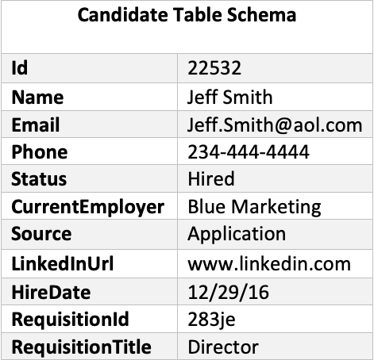   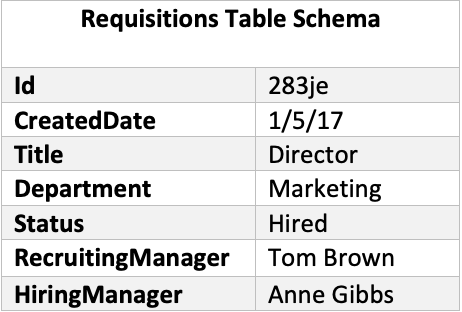

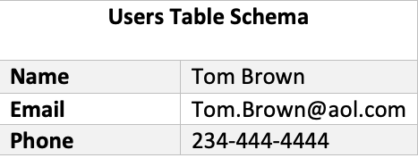   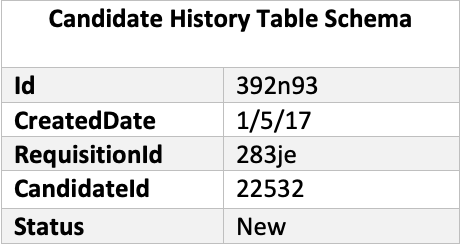

See the Entity Relationship Diagram below for further clarification on how the tables are connected. You can also use multiple table to create the necessary tables that you'll need by joining tables in the Grid Builder—the Grid Builder section later in this guide will explain how to do these.

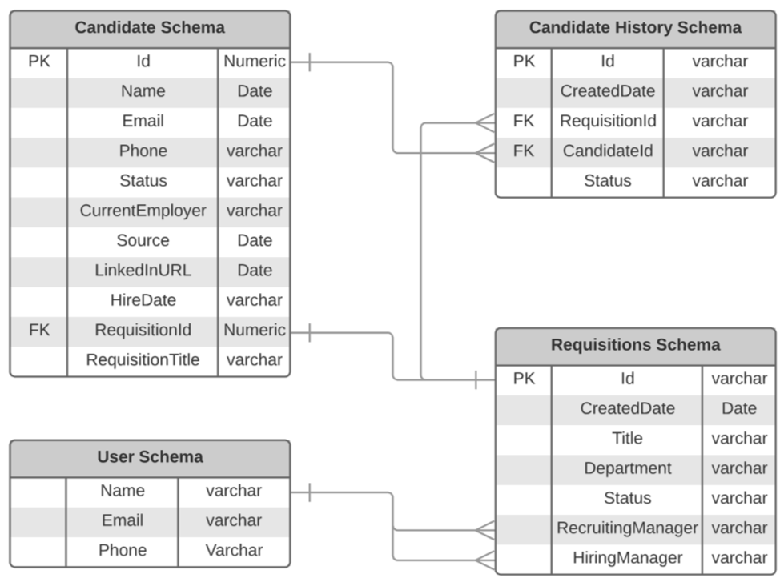

When you downloaded the app, a DataSet called "Talent Pipeline - Status" was created, you must edit this DataSet. Search for and then click on the DataSet, you should see a wrench menu icon, click on the icon and select **Edit Webform**. Here is where you'll manually update the webform with the name of the statuses that appear in your data. Next, update the category column and erase all of the rows that were previously populated with sample data. (see example table below)

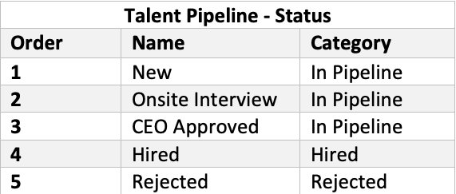

 

**Note:**  

* The Talent Pipeline app has a built-in "Hiring Manager" filter that cannot be removed nor repositioned in the app—it is labeled "HIRING MNGR".
* You can reach out to your hiring managers in the app by clicking the mail icon in the app. These messages are automated in the "Talent Pipeline—Email Forms" DataSet. If you want to change the automated messages, click on that DataSet, then click on the wrench menu icon, and select **Edit Webform**.
* You can use more than one DataSet for the app as long as the DataSets can be joined together using your date and primary group columns. Information on how to do join in the Grid Builder can be found in later sections of this guide.
* If you are missing any columns in your DataSets, you can create them by setting a default value in the DataFlow using MySQL. For example, if you don't have a "LinkedInURL" column in your data, you can set all of your values to 'None'. This 'None' value means that no sales rep will have a picture in the app, but it will finish running the DataSet. If you are missing any columns the DataFlow will stop running with an error.

Step 2: Add Your Source Data to the DataFlow
--------------------------------------------

As soon as you've prepped your data, you will need to navigate to the DataFlow and add your data as inputs to the DataFlow.

Follow these steps for adding your DataSets as inputs:

* Navigate to the Data Center using the navigation menu in the top right corner of Domo.

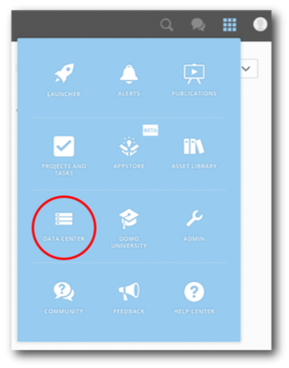

* Click **DataFlows** on the left side of the Data Center page, then search for "Talent Pipeline" in the Data Center's search bar. You should see a DataFlow with that name.
* Click on the **DataFlow** to go into the detail view and click the pencil icon on the right side of the page to edit the DataFlow
* Remove the sample DataSets: "Candidate History", "Candidates", "Requisitions", and "Users", by clicking the **x** on the corner of each of the data sets. Keep the DataSets named, "Talent Pipeline - Grid Builder", "Talent Pipeline - Settings", and "Talent Pipeline - Status".
* Click the **Select DataSet** button located at the bottom of the DataFlow page, then search for the DataSets that you've created for the app and add them.

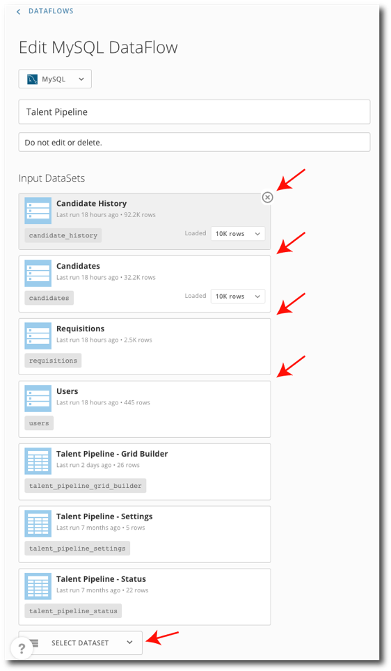

* After you have added your DataSets, scroll to the bottom of the page and click the **Save** button.
* Navigate back to the Data Center.

Step 3: Edit the Grid Builder
-----------------------------

For this next step, you'll need to edit the appropriate fields in the Grid Builder to match your input data. This guide presents a basic set of steps, but for a more comprehensive tutorial on how the Grid Builder works please review the [Grid Builder Walkthrough](https://developer.domo.com/docs/installation-guides/grid-builder-walkthrough). As you make changes, it may be wise to occasionally copy your work into an Excel Spreadsheet to track your changes, in case any web browser errors occur.

Follow these steps to edit the Grid Builder:

* Navigate to the Grid Builder webform that came with the Talent Pipeline app. A webform is a type of DataSet so you'll need to search for it in the DataSet tab and not the DataFlow tab. The DataSet will be named "Talent Pipeline - Grid Builder"—click the DataSet, then in the details view click the wrench menu icon and click **Edit Webform**.

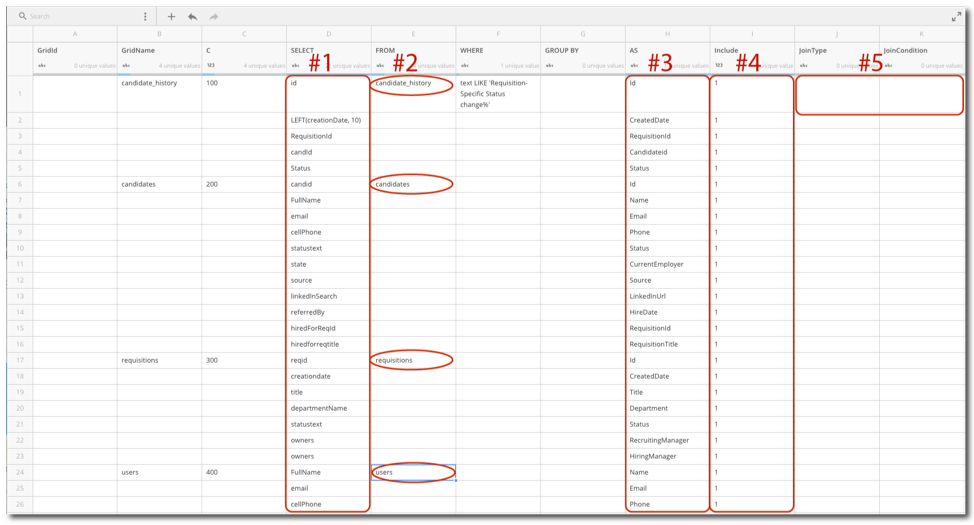

* In the SELECT column from C100 down, replace the sample values with the column names from the DataSets in the FROM column that you would like to use in the app. This column is where you'll map your data to the app. You may have more columns that you want as filters, so you may need to add more rows. (see #1 in example image above)
* In the FROM column, change the value on row C100 to match the name of your first DataSet. Repeat this same step for all the tables that you'll be using as source data. Each new DataSet should be assigned the next set of 100's values under the "C" column. For example, start with 200 for the second DataSet, 300 for the third, etc. (see #2 in the example image above)
* In the AS column from C100 down are the new names of the columns that are from the SELECT column. These column names should match the schema in the table above and should already be listed correctly. You do not need to alter this column unless you add additional columns to be used as filters in the app. When using this AS column, avoid using space, number, and special characters. For example, use Gross\_Sales as opposed to the Gross Sales. (see #3 in the example image above)
* In the "Include" column, place a 1 in each row that you're including from your data that is not being used solely for a join. If you are not including a column, place a 0 in the "Include" column. (see #4 in the example image above)
* To do a join, you will need to fill out the "JoinType" and "JoinCondition" columns on row C200. The "JoinType" column needs to be typed in all CAPS and can be any type of join used in MySQL. Additional joins usually use LEFT as the "JoinType". The "JoinCondition" references the row where your column is being brought in from your DataSet. The "JoinCondition" column should look like this: `Ctable#.COLUMNNAME = Ctable#.COLUMNNAME.`
* As soon as you have the information entered for your DataSets you'll then need to configure your filters. You'll need to update the three filter columns, "FilterId", "FilterName", and "FilterInputType" for every row in the Grid Builder that references a column in your data that you'd like to use as a filter.

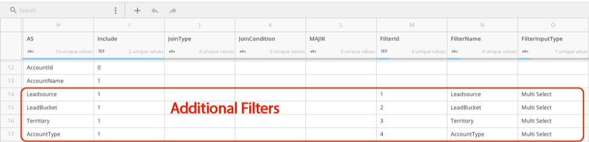

* On other rows that you'd like to use as filters, use incrementing number in the "FilterId" column (3,4,5,etc.) with the smallest numbers at the top. Define filter names in the "FilterName" column, use "Multi Select" or "Single Select" for "FilterInputType" (check out the [Grid Builder Walkthrough](https://developer.domo.com/docs/installation-guides/grid-builder-walkthrough) for more information on what these two filter types do), and leave "FilterIsPrimary" and "FilterIsPrimaryGroup" empty. (see example image above)
* Click **Save & Continue** at the top of the page to save your changes to the DataSet.

As soon as you've made changes to the Grid Builder, go back to the Data Center and run the "Talent Pipeline" DataFlow. If the DataFlow runs successfully, then you've most likely filled out the Grid Builder correctly. If you do encounter any errors, review the [Grid Builder Walkthrough](https://developer.domo.com/docs/installation-guides/grid-builder-walkthrough) or reach out to Domo Support.

Step 4: Validation
------------------

Now that you've configured the Grid Builder, you should now be ready to check your app in order to validate your metrics. 

We suggest following this process for validation:

1. Build KPI cards to test metrics. Build these cards based off of your source data, not the output data in the app. For example, if you are displaying trending sales by sales rep in the app, build a bar chart type card that displays sales per rep and have the date range in the KPI card match one of the date ranges that is displayed in the app.
2. Compare your data in the KPI cards to the data in your app. Remember to make sure that your filtering options and date ranges match in the app and the card.
3. If you find any discrepancies, check to see if you need to change any join conditions or groupings in the Grid Builder and double check your calculations.
4. Repeat this process for any metrics that you need to validate.

#### Congratulations!

Your Talent Pipeline app should now be ready to go! Enjoy getting the best value from your data. If you have any questions or need help troubleshooting, reach out to Domo Support.

