---
    title: Triggering a Campaign from a Domo DataSet Alert
    url: https://domo-support.domo.com/s/article/1500000316201
    linked_kbs:  ['[https://domo-support.domo.com/s/knowledge-base/](https://domo-support.domo.com/s/knowledge-base/)', '[https://domo-support.domo.com/s/](https://domo-support.domo.com/s/)', '[https://domo-support.domo.com/s/topic/0TO5w000000ZampGAC](https://domo-support.domo.com/s/topic/0TO5w000000ZampGAC)', '[https://domo-support.domo.com/s/topic/0TO5w000000Zan9GAC](https://domo-support.domo.com/s/topic/0TO5w000000Zan9GAC)', '[https://domo-support.domo.com/s/article/360042925994](https://domo-support.domo.com/s/article/360042925994)', '[https://domo-support.domo.com/s/article/1500000316201](https://domo-support.domo.com/s/article/1500000316201)', '[https://domo-support.domo.com/s/topic/0TO5w000000Zan9GAC/available-apps](https://domo-support.domo.com/s/topic/0TO5w000000Zan9GAC/available-apps)', '[https://domo-support.domo.com/s/article/360043429933](https://domo-support.domo.com/s/article/360043429933)', '[https://domo-support.domo.com/s/article/360043429953](https://domo-support.domo.com/s/article/360043429953)', '[https://domo-support.domo.com/s/article/360042925494](https://domo-support.domo.com/s/article/360042925494)', '[https://domo-support.domo.com/s/article/360043429913](https://domo-support.domo.com/s/article/360043429913)', '[https://domo-support.domo.com/s/article/4408174643607](https://domo-support.domo.com/s/article/4408174643607)', '[https://domo-support.domo.com/s/login/](https://domo-support.domo.com/s/login/)']
    article_id: 000004128
    views: 1,239
    created_date: 2022-10-24 21:24:00
    last updated: 2022-10-24 22:41:00
    ---


Intro
-----


You can start a Campaign from a Domo DataSet Alert. Documentation on Domo DataSet Alerts can be found [here](/s/article/360042925994 "Creating an Alert for a DataSet").


Setting up a Domo DataSet Alert with Campaigns
----------------------------------------------


### Go to DataSet Alerts


To setup a Domo DataSet Alert, go to **Data**, select your DataSet, select the **Alerts**tab, and click on **New Alert**.


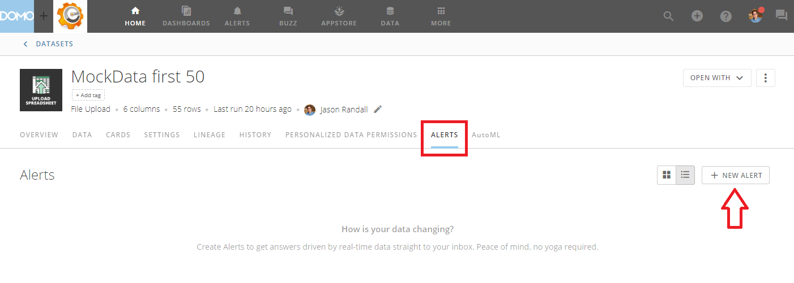


 
### Configure your Alert


Configure your Alert Rule. Documentation on setting up your Alert can be found [here](/s/article/360042925994 "https://knowledge.domo.com/Optimize/Notifications_and_Alerts/Creating_an_Alert_for_a_DataSet").


 


**Note:** Be sure to go to the "You'll be notified when this alert is in a triggered state **every time your data updates**:" section and **Uncheck** the check box "Keep sending notifications while in a triggered state". Otherwise, your Campaign could be triggered over and over again and you could end up spamming your recipients.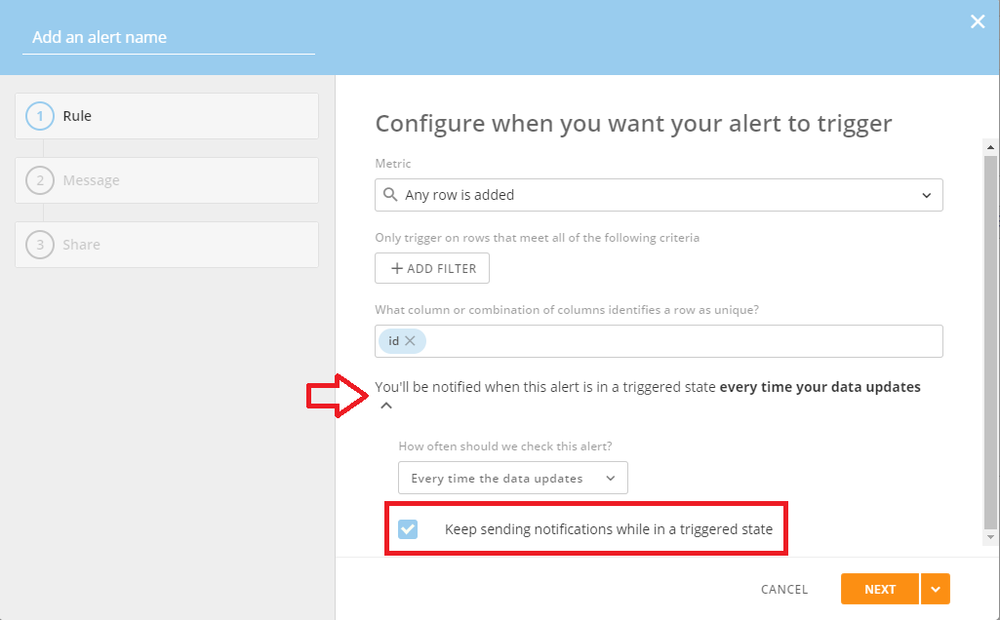


 
Click **Next** when finished.
### Create a Domo Webhook


The next step is to create the Domo Webhook that will be triggering your Campaign. In the Message screen, click **Attach Action**and select **Domo Webhook**.


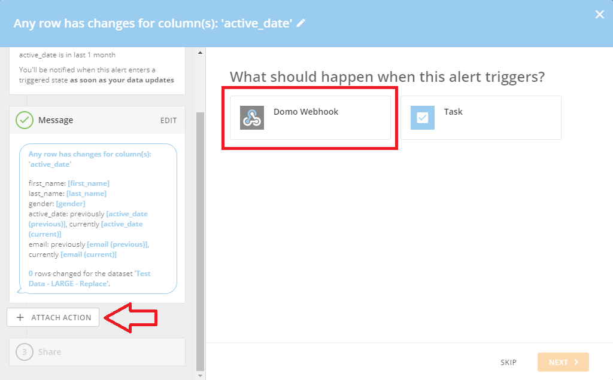


 
### Configure the Domo Webhook


Next:
1. In the box titled **URL**, paste the following URL:
[https://campaigns-prod.domolabs.io/api/v1/campaigns/bae/start](https://campaigns-prod.domolabs.io/api/v1/campaigns/bae/start "https://campaigns-prod.domolabs.io/api/v1/campaigns/bae/start")
2. Set **Method** to **POST**.
3. Leave the box **Secret (optional)** blank.
4. Click on **Webhook body** to expand that section.


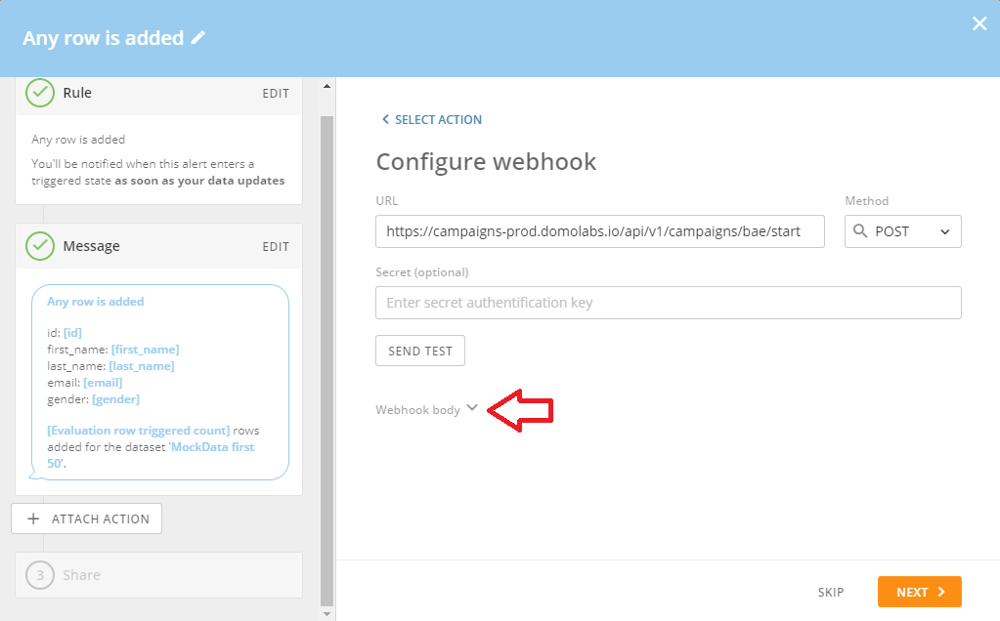


 
### Configure the Domo Webhook body


In order to configure the Domo Webhook body, you need to click the pencil icon next to **Message**.


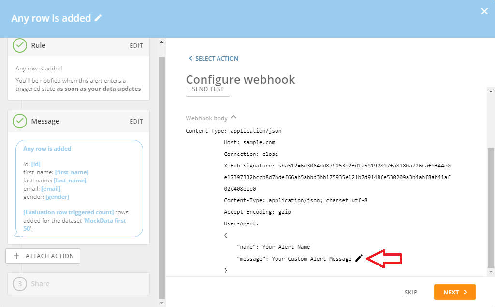


 
In the **Customize the webhook's body's message** section, paste the following JSON:


```
{
 "campaignId": 0, 
 "instance": "", 
 "domoAccessToken": "", 
 "domoAccessTokenOwnerEmailAddress": "", 
 "emailAddresses": [""], 
 "isTest":true,
 "fields":[{"key": "", "value": ""},
           {"key": "", "value": ""},
           {"key": "", "value": ""}]
}

```

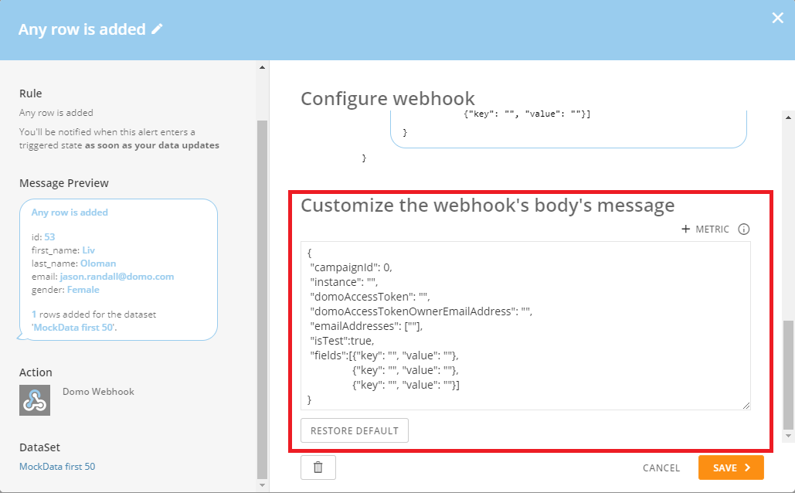


 

Each of the values should be defined as follows:


#### Campaign Id


The id of the Campaign you want to start. You can get the Campaign Id by editing the Campaign and going to the **Settings** tab:


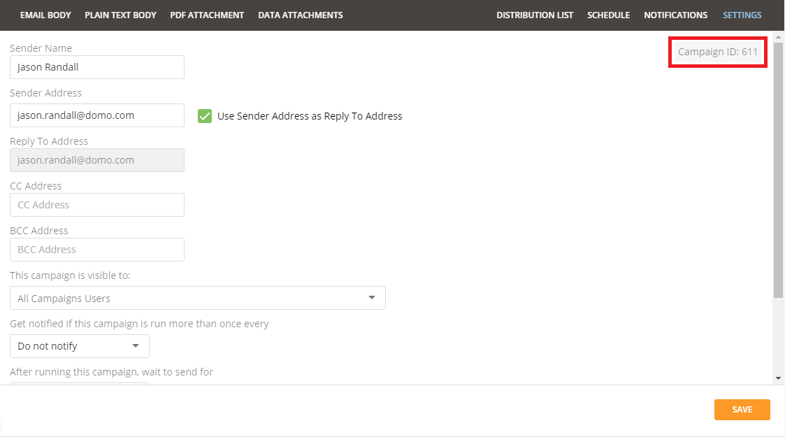


 


#### Domo Access Token


A Domo access token that has been generated in Domo. You can generate Domo Access Tokens by logging in, going to the **Admin** settings section, go to **Security**, and selecting **Access tokens**. There you can simply generate a new access token to use for calls to the API.


 


#### Domo Access Token Owner Email Address


The email address of the user who owns the **Domo Access Token** specified above.


#### Email Addresses (OPTIONAL)


A list of email addresses the campaign should be delivered to. If no email addresses are selected, the entire campaign will be started and delivered to all recipients in the distribution list.


 


**Note:** These email addresses **MUST** exist in your distribution list.  If you specify an email address that does not exist in your distribution list, no email will be delivered to that email address.


 


 


**Tip:** You can use the **+ Metric** button to include values from the row in the DataSet that triggered this Alert. For instance, if you want to only deliver this Campaign to the email address in the row in the DataSet that triggered this Alert, you would click on **+ Metric** and select the field in your DataSet that contains the email address.
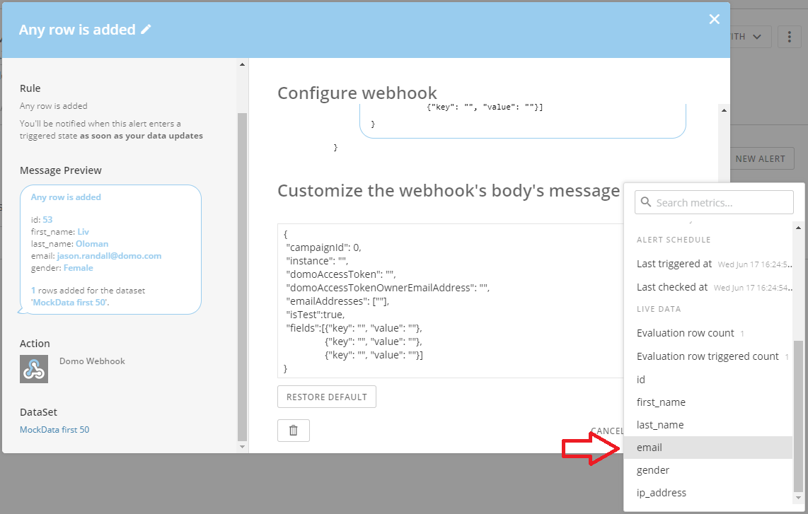


 
This will add a tag to your webhook's body's message that will reference that field in your DataSet. Now when this Alert is triggered, the email address from the row that triggered the Alert will be included in the message that is sent to Campaigns. This will cause the Campaign to only be delivered to that email address. Again, please note that the email address **MUST** exist in your distribution list or the email will not be delivered.


#### Instance


You Domo instance (e.g. [domo.domo.com](http://domo.domo.com)). 


#### Is Test (OPTIONAL)


You can use this flag to send a test Campaign. This can help you test your Campaign, connection, access token, etc. without actually sending an email to your recipients. This is the same functionality as when you click the **Test Email** button from within the **Distribution List** in the Campaigns app. When you send a test Campaign the email will be delivered to the **Sender Address** of the Campaign rather than the recipients so that the delivered content can be tested and verified.


 


**Note:** If you set this flag to **true**, you **MUST** specify at least one email address in the **Email Addresses** field. You cannot send a Test Campaign without specifying at least one email address.


#### Fields (OPTIONAL)


Fields give you the ability to pass other information and values from the Alert to Campaigns so that information can be used in the Campaign messages. 


For instance, if the DataSet to which I am adding this Alert has a field for **first name** and **last name** and I want to include those fields in my Campaign, I would include those fields from my DataSet in the **fields** list.  You can then use the **key** to insert those values into Campaigns.


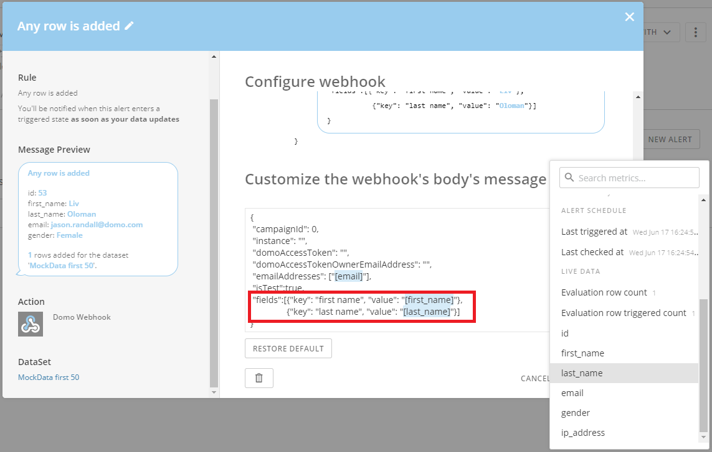


 
Then I would go to my Campaign and add the following tag into my Campaign anywhere I would want my Alert fields to be rendered.


```
{{domo-alert-**[field key goes here]**}}

```

So anywhere I want **first name** rendered I would add the tag


```
 {{domo-alert-first name}} 

```

and anywhere I want **last name** rendered I would add the tag 


```
{{domo-alert-last name}}

```

In Campaigns it would look like this:


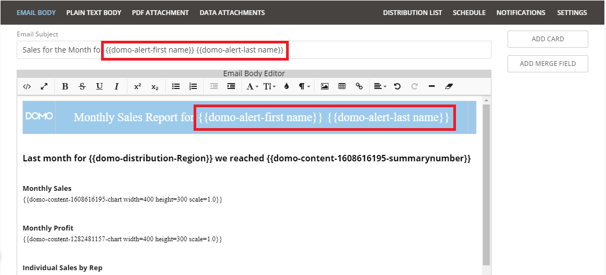


 


 


**Note:** To avoid failures and issues, make sure the name of your key in your DataSet Alert exactly matches the name in your Campaigns tag.


 

#### Example of Webhook's Body's Message


An example of a completed webhook's body's message would look like this:


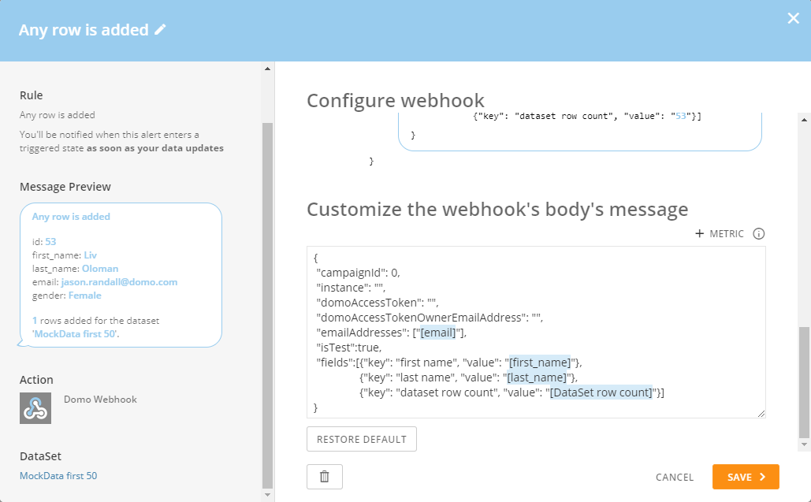


 
### Testing and errors


#### Testing


Once you have your webhook's body's message configured, you can test it by clicking on the **Send Test** button.


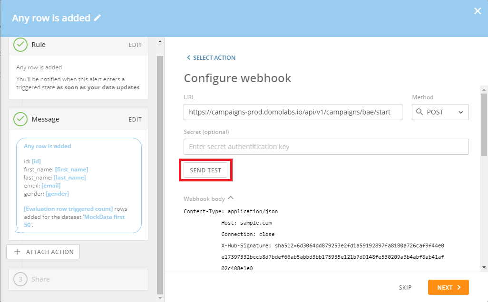


 
This will call the endpoint in Campaigns with your custom webhook's body's message and will notify you if the call succeeded or failed.


 


**Note:** be sure to have the **isTest** flag set to **true** and include at least one email address in the **emailAddresses** field so you don't accidentally deliver this Campaign to all of your recipients.


#### Errors


If your test does not succeed, there are a number of things to check. A few of them are:


1. Ensure your Campaign Id is correct.
2. Ensure you have a valid Domo Access Token specified in the **domoAccessToken** field.
3. Ensure the Domo user who owns the Domo Access Token has access to the Campaign and the Campaign's distribution list DataSet.
4. Ensure the email address specified in the **domoAccessTokenOwnerEmailAddress** field matches the email address of the user in Domo who owns the Domo Access Token.
5. If the **isTest** flag is set to **true**, ensure you have included at least one email address in the **emailAddresses** field.
6. Ensure your webhook's body's message is a correctly formed JSON object. There are a number of JSON validators available online that you could use to check.
