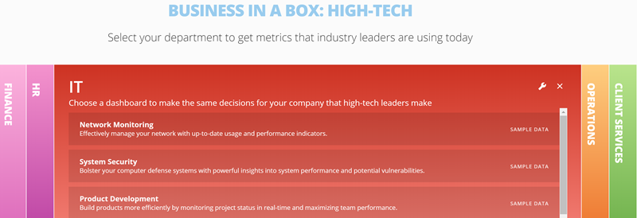
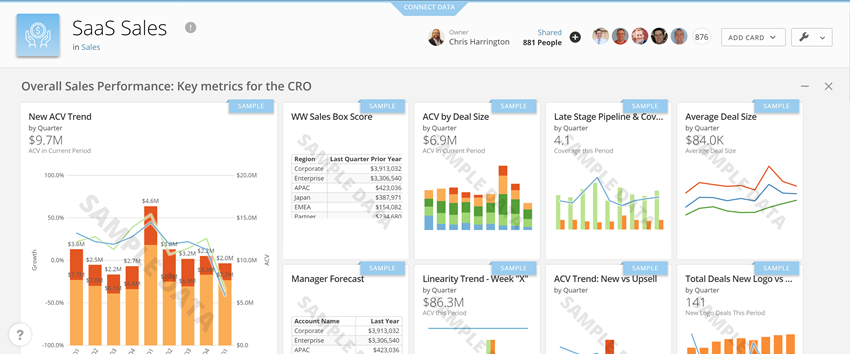
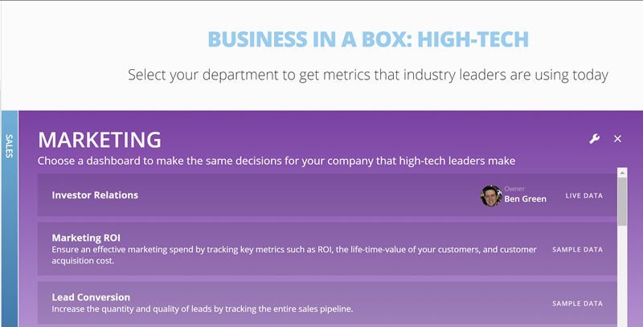

Domo's "Business-in-a-Box" feature provides pre-installed best practice dashboards that allow you to quickly bring the power of Domo to your whole company. These dashboards are based on Domo’s research of best practices and are organized by department and key topics for each department. With Business-in-a-Box, you can see best practice industry applications of Domo for departments that may interest you. You can also quickly navigate to dashboards for any department in your company to see metrics for that department.   

For example, the "IT" department tab in Business-in-a-Box provides access to such dashboards as "Network Monitoring," "System Security," "Cloud Operations," etc., as shown here:

Each pre-installed dashboard contains cards powered by sample data to give you a quick understanding of how the cards provide answers for these key topics. The following screenshot shows an example of a dashboard with cards powered by sample data:

You can then make these cards your own by powering them up with your own live data, as explained in [Powering Up Business-in-a-Box Dashboards](/s/article/360042935114 "Powering Up Business in a Box Dashboards").

In addition to giving you the ability to power up pre-installed best practice dashboards, Business-in-a-Box also allows you to link existing Domo dashboards (card pages) to your department tabs as well as install new dashboards from the Appstore. When you do this, the new dashboard appears in the specified department tab, allowing quick access from the tab. In the following example, the "Investor Relations" dashboard was added to the "Marketing" tab from the Appstore:    
  

**Video - Business-in-a-Box**

