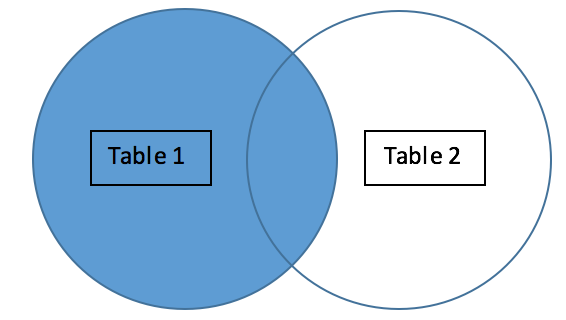
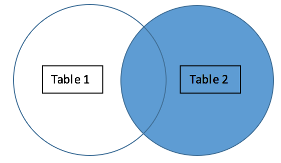
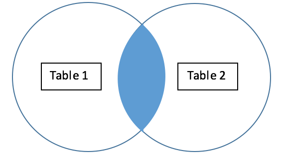
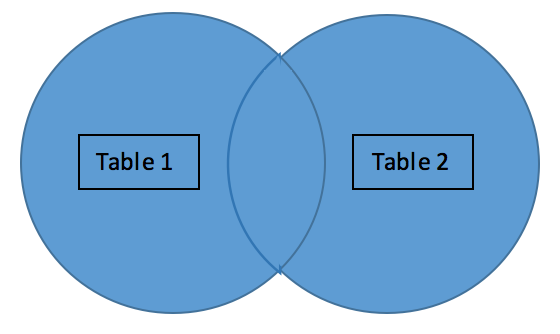

Intro
-----

One of the most common reasons for an “Invalid Query” error and duplicated rows is improperly joined data in SQL, or, essentially, a lack of understanding of how joins are supposed to work. The following article will give you the knowledge you need about joining data using SQL so you can avoid Invalid Query errors and duplicate row problems like this in the future.

Append and Join Data Video
--------------------------

Watch the following video to gain a better understanding of joining and appending data:

Use Case Example
----------------

Joins in SQL are used to combine two tables together, typically when you are adding additional columns. Joins work by combining two tables together on a unique column. The type of join you’re using will determine the way the two tables will join together. 

For example, say you have a table (see Table 1) that gives you daily sales numbers and a second table (see Table 2) that gives you daily number of employees worked, and you would really like to see how many employees worked on any given day and compare that to your sales numbers for each day. Using a full outer left join, we would join the two tables together, so that date = date. Any row on table two that has a date that matches table one will be joined onto table one on the same row. So, for Table 3, we now have date, the daily sales, and the number of employees worked all in the same table.

When you pull this DataSet into Domo, no error will result.

##### Table 1. Sales per day

| Date | Sales |
| --- | --- |
| 2016-05-14 | 100 |
| 2016-05-15 | 200 |
| 2016-05-16 | 300 |
| 2016-05-17 | 400 |

 

##### Table 2. Employees worked per day

| Date | Employees Worked |
| --- | --- |
| 2016-05-14 | 10 |
| 2016-05-15 | 15 |
| 2016-05-16 | 20 |
| 2016-05-17 | 25 |

 

##### Table 3. Sales and employees worked per day

| Date | Sales | Employees Worked |
| --- | --- | --- |
| 2016-05-14 | 100 | 10 |
| 2016-05-15 | 200 | 15 |
| 2016-05-16 | 300 | 20 |
| 2016-05-17 | 400 | 25 |

 

Avoiding Duplicates
-------------------

Duplicates come into play when you *aren’t* joining on a unique column. Let’s look at Table 4 and 5, which are similar to Tables 1 and 2 above, but now two rows in both tables happen to have the same date of 2016-05-17. Again, if we perform a left outer join where date = date, each row from Table 5 will join on to every matching row from Table 4. However, in this case, the join will result in 4 rows of duplicate dates in the joined DataSet (see Table 6). 

##### Table 4. Sales per day

| Date | Sales |
| --- | --- |
| 2016-05-14 | 100 |
| 2016-05-15 | 200 |
| 2016-05-16 | 300 |
| 2016-05-17 | 400 |
| 2016-05-17 | 450 |

 

##### Table 5. Employees worked per day

| Date | Employees Worked |
| --- | --- |
| 2016-05-14 | 10 |
| 2016-05-15 | 15 |
| 2016-05-16 | 20 |
| 2016-05-17 | 25 |
| 2016-05-17 | 26 |

 

##### Table 6. Sales and employees worked per day

| Date | Sales | Employees Worked |
| --- | --- | --- |
| 2016-05-14 | 100 | 10 |
| 2016-05-15 | 200 | 15 |
| 2016-05-16 | 300 | 20 |
| 2016-05-17 | 400 | 25 |
| 2016-05-17 | 400 | 26 |
| 2016-05-17 | 450 | 25 |
| 2016-05-17 | 450 | 26 |

In order to avoid duplicate dates like this, you should always join on a unique column.

Overview of the Types of Joins
------------------------------

Another common misunderstanding among users are the differences between each type of join. To help you get a better sense of which rows in a dataset are affected by each type of join, review the following visuals:

 

LEFT OUTER JOIN

 

RIGHT OUTER JOIN

 

INNER JOIN

 

FULL OUTER JOIN

 

In summary, ensure you’re applying the proper type of join to match the same column types or column set-up that you would like to appear in your resulting dataset.

Different Types of Joins Video
------------------------------

Watch the following video to gain a better understanding of the different types of joins:

Join Errors to Avoid
--------------------

* Joining where a string is equal to a value.
* Joining on columns that have empty string values.
* Performing a date function on a column in the join that looks like a date but for whatever reason is coming in as a string.

 

