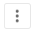

When editing a DataSet, you can select options in the Options menu by clicking . This menu appears only if you are the DataSet owner or have an Admin security role. For more information about security roles, see [Default Security Role Reference](/s/article/360043438953).

| Option | Description |
| Edit Name & Description | Lets you edit the title and description of the DataSet. |
| Run Now | Lets you update the data in the DataSet instead of waiting for the next scheduled run. |
| Tags | Lets you see and add tags to the DataSet to help with searching for the DataSet in the Data Center. |
| Notifications | Lets you set notifications for the DataSet. |
| Request certification | Lets you send the DataSet to be certified as an official DataSet used by your company. For more information on certification see [Certifying Cards and DataSets](/s/article/360043430613). |
| Chart color rules | Lets you see and add Color Rules saved to the DataSet so that all Cards powered from the DataSet will display the same color scheme. |
| Share DataSet | Lets you add users to the DataSet so they can view it. |
| Export data | Lets you export the DataSet to either an Excel or CSV file.  |
| Delete | Lets you delete the DataSet from Domo. |

