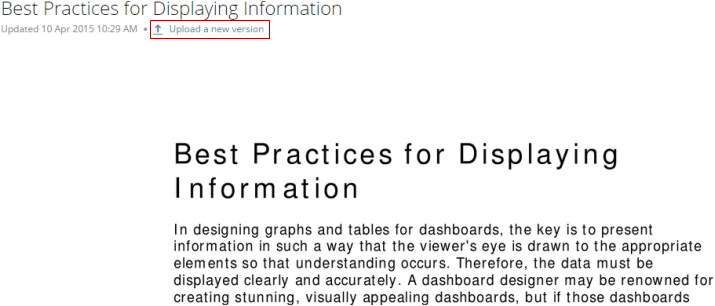

---
    title: Updating a Doc Card
    url: https://domo-support.domo.com/s/article/360042925614
    linked_kbs:  ['[https://domo-support.domo.com/s/knowledge-base/](https://domo-support.domo.com/s/knowledge-base/)', '[https://domo-support.domo.com/s/](https://domo-support.domo.com/s/)', '[https://domo-support.domo.com/s/topic/0TO5w000000ZamoGAC](https://domo-support.domo.com/s/topic/0TO5w000000ZamoGAC)', '[https://domo-support.domo.com/s/topic/0TO5w000000ZanZGAS](https://domo-support.domo.com/s/topic/0TO5w000000ZanZGAS)', '[https://domo-support.domo.com/s/article/360042923934](https://domo-support.domo.com/s/article/360042923934)', '[https://domo-support.domo.com/s/article/360043430193](https://domo-support.domo.com/s/article/360043430193)', '[https://domo-support.domo.com/s/article/360043428373](https://domo-support.domo.com/s/article/360043428373)', '[https://domo-support.domo.com/s/article/360042925614](https://domo-support.domo.com/s/article/360042925614)', '[https://domo-support.domo.com/s/topic/0TO5w000000ZanZGAS/doc-cards](https://domo-support.domo.com/s/topic/0TO5w000000ZanZGAS/doc-cards)', '[https://domo-support.domo.com/s/article/360043429933](https://domo-support.domo.com/s/article/360043429933)', '[https://domo-support.domo.com/s/article/360043429953](https://domo-support.domo.com/s/article/360043429953)', '[https://domo-support.domo.com/s/article/360042925494](https://domo-support.domo.com/s/article/360042925494)', '[https://domo-support.domo.com/s/article/360043429913](https://domo-support.domo.com/s/article/360043429913)', '[https://domo-support.domo.com/s/article/4408174643607](https://domo-support.domo.com/s/article/4408174643607)', '[https://domo-support.domo.com/s/login/](https://domo-support.domo.com/s/login/)']
    article_id: 000004108
    views: 2,159
    created_date: 2022-10-24 21:22:00
    last updated: 2022-10-24 22:42:00
    ---

After you add a Doc Card, you can upload new versions of the file as necessary in the Card Details view. Whenever you upload a new version of a file, that version becomes the "current" version. The preview in the Page and Card Details view is updated to reflect any changes, and the download version is also updated. Older versions of the file can be found in the **Versions** panel at the bottom of the Details view. For more information, see [Card Details View Layout](/s/article/360042923934 "Card Details View Layout"). 

**To update a file,**

1. Click the Doc Card.  
 The Details view opens.
2. Click **Upload a new version**.  
   

3. Browse to the new version of the file on your hard drive then click **Open**.

All old versions of the file are saved as thumbnails in the **Versions** panel at the bottom of the Details view. You can restore any non-current version of a file by clicking its thumbnail in this panel.

**To make an earlier version of a file the current version,** 

1. Click the Doc Card.  
   
 The Details view opens.
2. Scroll to the bottom of the Details view.
3. (Conditional) If the **Versions** panel is closed, open it by clicking .

 

**Note:**If only one version of the document exists, the **Versions** panel does not appear.
4. Locate and click the thumbnail for the version you want to restore.

You can also download a non-current version of a file. For more information, see [Downloading a Document from Domo](/s/article/360043430193 "Downloading a Document from Domo").

In the Notifications Center, you can configure whether you receive Notifications when "Favorited" Doc Cards are updated. For more information about the Notifications Center, see [Adding Cards as Favorites](/s/article/360043428373).

