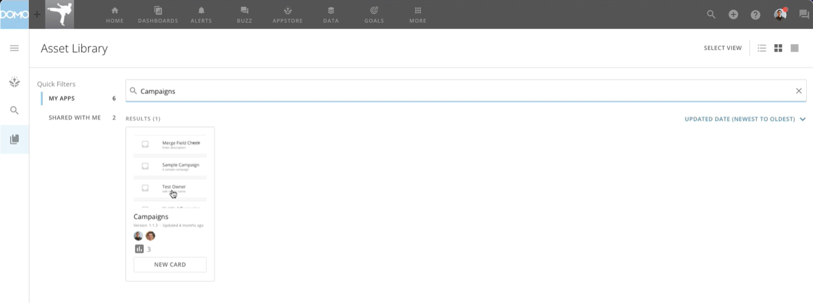
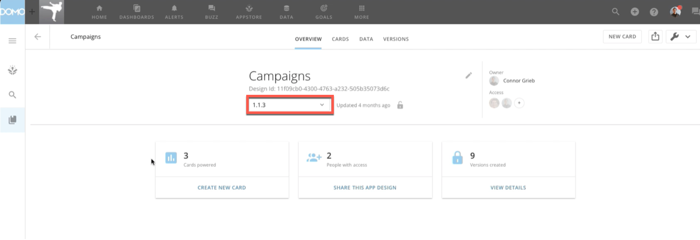
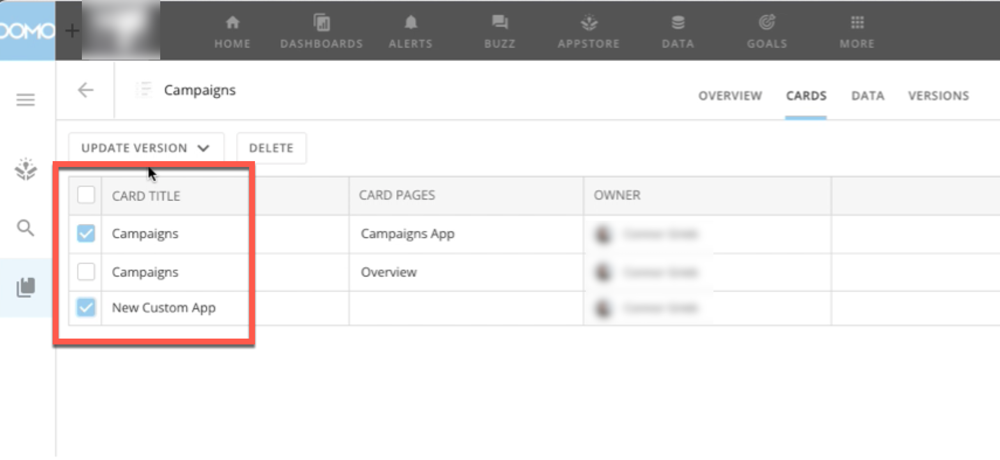
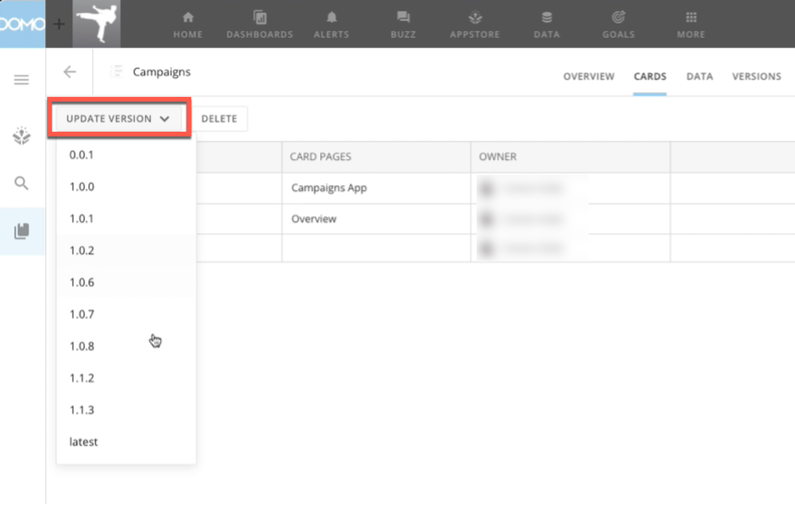
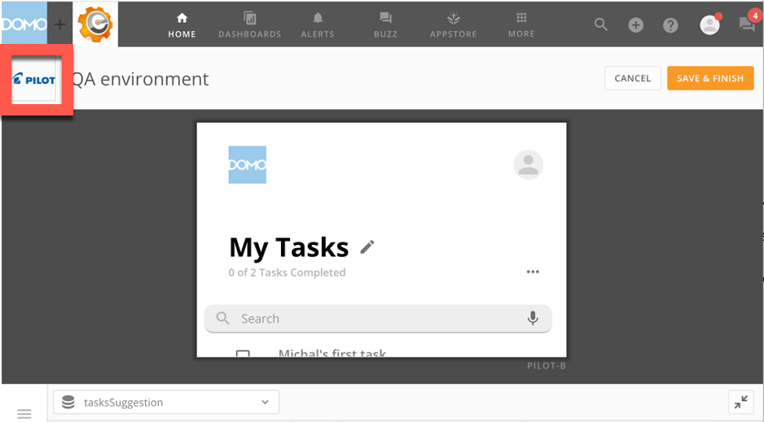
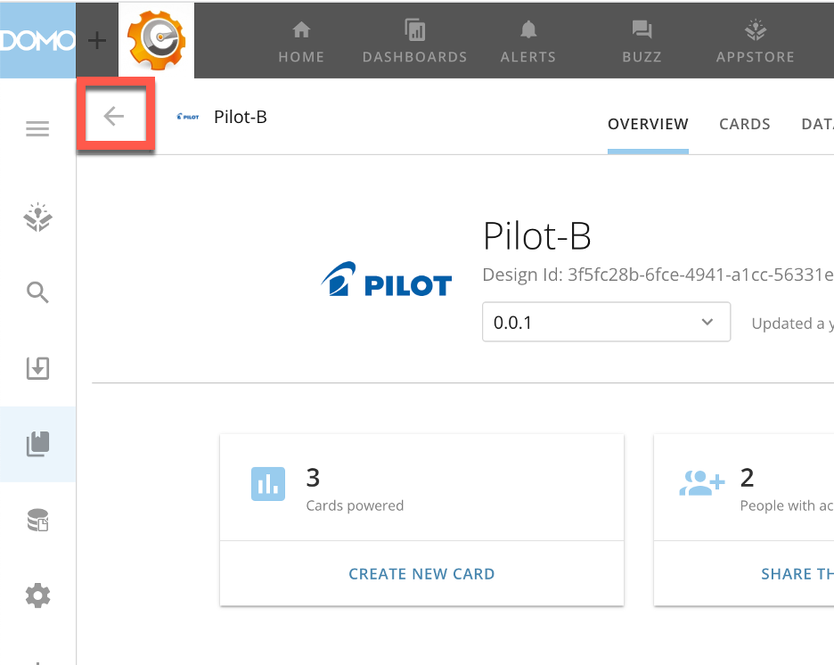
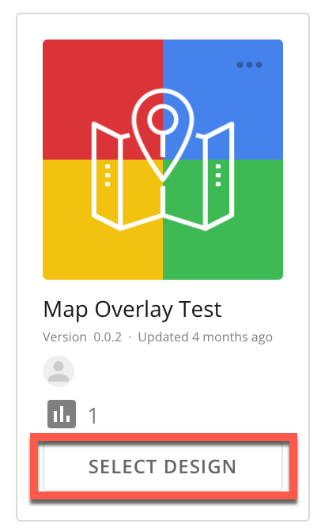
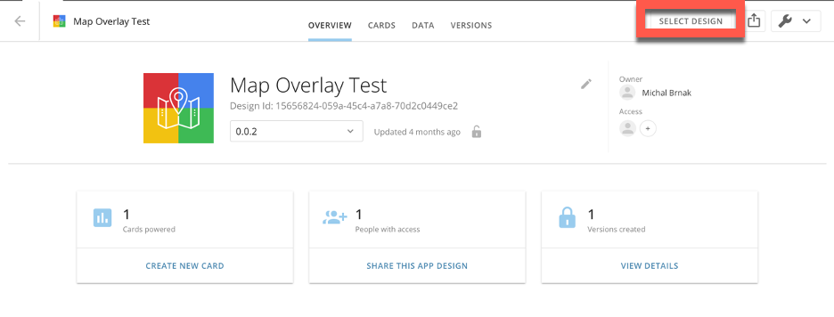

---
    title: Updating and Switching Assets
    url: https://domo-support.domo.com/s/article/000005080
    linked_kbs:  ['[https://domo-support.domo.com/s/knowledge-base/](https://domo-support.domo.com/s/knowledge-base/)', '[https://domo-support.domo.com/s/](https://domo-support.domo.com/s/)', '[https://domo-support.domo.com/s/topic/0TO5w000000ZampGAC](https://domo-support.domo.com/s/topic/0TO5w000000ZampGAC)', '[https://domo-support.domo.com/s/topic/0TO5w000000ZaoMGAS](https://domo-support.domo.com/s/topic/0TO5w000000ZaoMGAS)', '[https://domo-support.domo.com/s/article/000005080](https://domo-support.domo.com/s/article/000005080)', '[https://domo-support.domo.com/s/topic/0TO5w000000ZaoMGAS/using-the-appstore](https://domo-support.domo.com/s/topic/0TO5w000000ZaoMGAS/using-the-appstore)', '[https://domo-support.domo.com/s/article/360043429933](https://domo-support.domo.com/s/article/360043429933)', '[https://domo-support.domo.com/s/article/360043429953](https://domo-support.domo.com/s/article/360043429953)', '[https://domo-support.domo.com/s/article/360042925494](https://domo-support.domo.com/s/article/360042925494)', '[https://domo-support.domo.com/s/article/360043429913](https://domo-support.domo.com/s/article/360043429913)', '[https://domo-support.domo.com/s/article/4408174643607](https://domo-support.domo.com/s/article/4408174643607)', '[https://domo-support.domo.com/s/login/](https://domo-support.domo.com/s/login/)']
    article_id: 000005080
    views: 1.005
    created_date: 2022-12-11 04:18:00
    last updated: 2023-01-06 16:43:00
    ---

Intro
-----

The **Asset Library** stores all of your assets in Domo, but each card is unique and can be powered by a different design version of an asset. If you update an asset, you may need to update each card individually. You can find instructions for doing this below in [Updating an Asset](#updating_asset).

In some cases, you may need to connect a card to a different asset. A possible use case is moving from a demo or custom version of an app to another version. This requires you to switch any cards to the correct asset. See instructions for [Switching an Asset](#switching_asset) below.

Updating an Asset
-----------------

1. From the navigation header, select **More** > **Asset Library**.
2. In the **Asset Library**, locate the app you want to update.
 
3. Select the app to display the **Overview**tab. Under the app name, there is a list of the app's versions. 
 
4. Select the version you want or select **Latest version**, which automatically updates the app to the latest version in the future.
5. Go to the **Cards** tab. A list of cards deployed by the app displays.
6. Select the cards you want to update by checking the boxes. 
 
7. Select **Update Version** and choose the version you would like to update the selected cards to. 
 

The cards you selected are now updated.

Switching an Asset
------------------

1. Locate the card you want to switch the asset for.
2. Hover over the card until  **Card options** displays in the top right corner. Select the arrow to display the card options, then **Edit Card**.
 The card editor displays.
3. In the card editor, locate the icon for the app in the top left corner and select it.
   
   
 The **Overview** tab displays.
4. Select  **Back** in the top left corner.
   
   
 The **Asset Library** displays.
5. Search for and find the asset you want to power the card.
6. Click **Select****Design**.
 

You can also do this from the design **Details** screen. 

7. Connect the card according to the instructions for that app in the Knowledge Base.
8. Select **Save & Finish**.

The card is now connected to the new asset. You can confirm this by searching for the asset in the **Asset Library**, going to the **Cards** tab, and verifying that the card you connected now displays in the list.