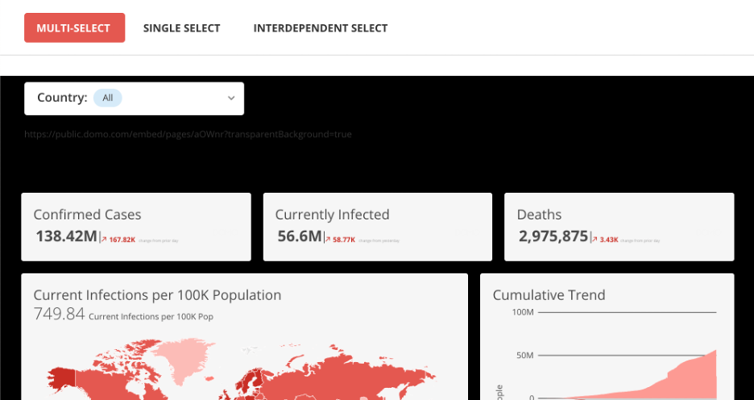
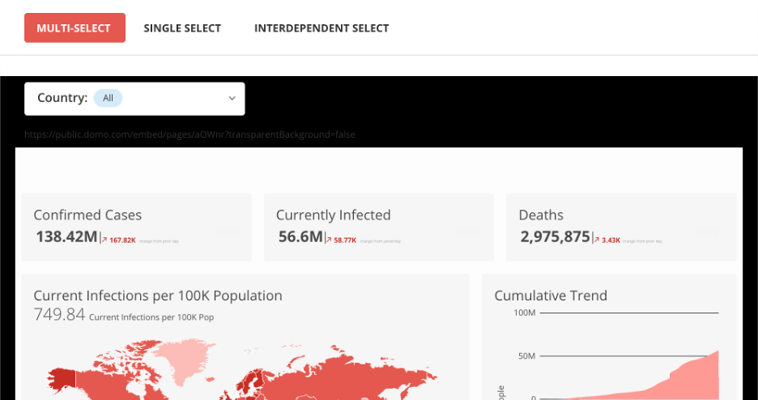
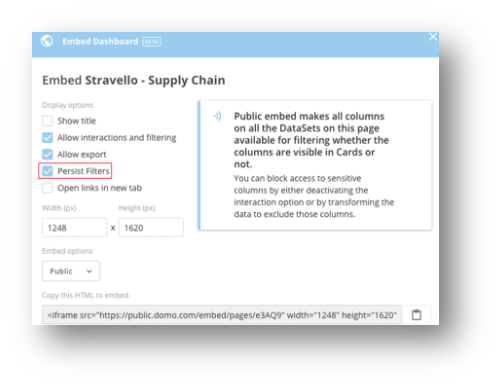

---
    title: URL Parameters for Embedded Content
    url: https://domo-support.domo.com/s/article/7797499784343
    linked_kbs:  ['[https://domo-support.domo.com/s/knowledge-base/](https://domo-support.domo.com/s/knowledge-base/)', '[https://domo-support.domo.com/s/](https://domo-support.domo.com/s/)', '[https://domo-support.domo.com/s/topic/0TO5w000000ZamqGAC](https://domo-support.domo.com/s/topic/0TO5w000000ZamqGAC)', '[https://domo-support.domo.com/s/topic/0TO5w000000ZanbGAC](https://domo-support.domo.com/s/topic/0TO5w000000ZanbGAC)', '[https://domo-support.domo.com/s/article/360042933114](https://domo-support.domo.com/s/article/360042933114)', '[https://domo-support.domo.com/s/article/7797499784343](https://domo-support.domo.com/s/article/7797499784343)', '[https://domo-support.domo.com/s/topic/0TO5w000000ZanbGAC/domo-everywhere](https://domo-support.domo.com/s/topic/0TO5w000000ZanbGAC/domo-everywhere)', '[https://domo-support.domo.com/s/article/360043429933](https://domo-support.domo.com/s/article/360043429933)', '[https://domo-support.domo.com/s/article/360043429953](https://domo-support.domo.com/s/article/360043429953)', '[https://domo-support.domo.com/s/article/360042925494](https://domo-support.domo.com/s/article/360042925494)', '[https://domo-support.domo.com/s/article/360043429913](https://domo-support.domo.com/s/article/360043429913)', '[https://domo-support.domo.com/s/article/4408174643607](https://domo-support.domo.com/s/article/4408174643607)', '[https://domo-support.domo.com/s/login/](https://domo-support.domo.com/s/login/)']
    article_id: 000004233
    views: 1.169
    created_date: 2022-10-24 21:34:00
    last updated: 2022-10-24 22:41:00
    ---


Intro
-----


Domo Everywhere supports three types of URL parameters in embedded content: 


* Transparent Backgrounds
* Pfilters
* AppData


Transparent Backgrounds
-----------------------


Users can customize their dashboard background color or image to match their organization's branding. With this URL parameter, the transparent background can make embedded content seem even more native to the host page.


**Video: Adding Background Images in Domo Stories**


 


In the example below, the embedded dashboard's background and the host page is black and the URL parameter is set to "true". 


http://*<domain>*.[domo.com/embed/pages/aOWnr](http://domo.com/embed/pages/aOWnr)**?transparentBackground=true**





 


In the example below, the same embedded dashboard's background transparency is set to "false".


http://*<domain>*.[domo.com/embed/pages/abcdef](http://domo.com/embed/pages/abcdef)**?transparentBackground=false)**


****


 


Pfilters
--------


Pfilters are used to push filters from an external control into embedded content. With pfilters, non-sensitive data can be passed into apps. 


Pfilters can be created and persisted automatically when embedded content links to other embedded content while maintaining previously clicked items. This auto-creation of pfilters is activated by checking the **Persist filters** box. 





Example:


 


```
[example.domo.com/embed/pages/abcde](http://example.domo.com/embed/pages/abcde)  
  
?pfilters=[  
  
{  
  
"column":"Role",  
  
"operand":"IN",  
  
"values":["Director","Manager"],  
  
},  
  
{  
  
"column":"Team",  
  
"operand":"IN",  
  
"values":["Sales","Marketing"],  
  
}  
  
]
```

 


More examples of URL parameter filters can be found in [Using Pfilters to Apply Filters from URL Query Parameters to Embedded Dashboards.](/s/article/360042933114)


 


AppData
-------


The appData parameter supports passing in general types of inputs to the app. App developers specify the parameter, parse the value, and inject it into the most relevant part of the app. 


 


For example, the value of the parameter could then auto-populate a drop-down menu in an app that selects the location. This way, the host page can avoid the delay of waiting for manual inputs. They can now deep-link to a version of the app that already has specific values filled in.


 


**Important:** Spaces should encoded as "+".


 


*<domain>*.[domo.com/embed/pages/abcde](http://domo.com/embed/pages/abcde)**?appData=This+is+an+example**


 


The query parameters on the embed URL will then be automatically passed down into the apps contained by the embedded cards or dashboards.


 


Example: [xyz.domoapps.prod4.domo.com](http://xyz.domoapps.prod4.domo.com)


 


 

