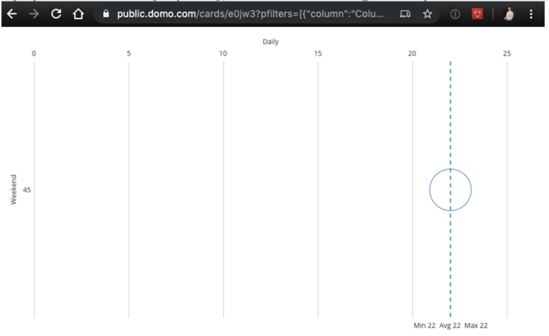
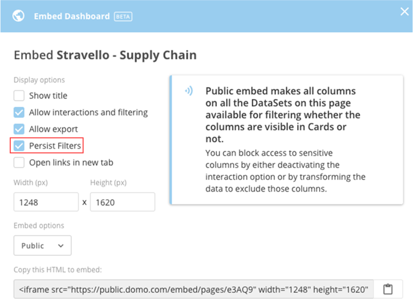
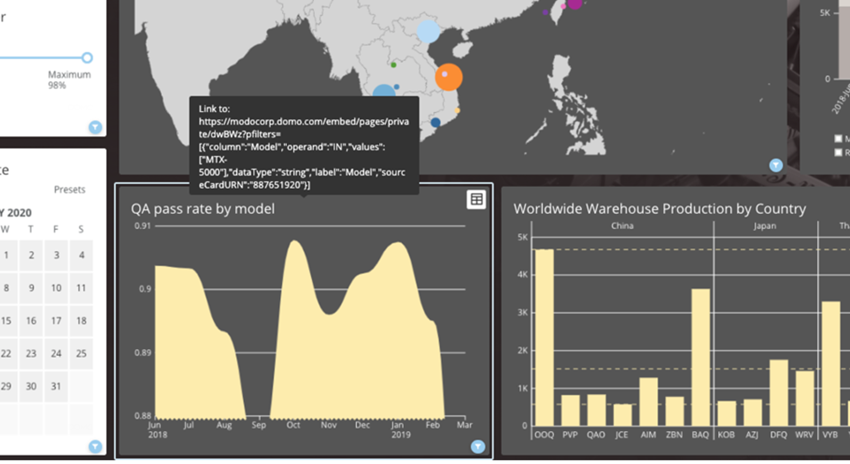
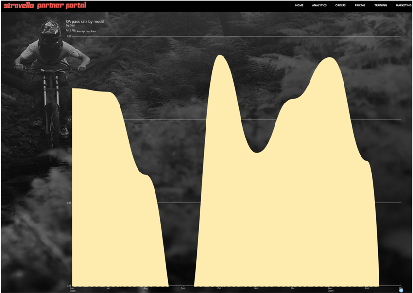
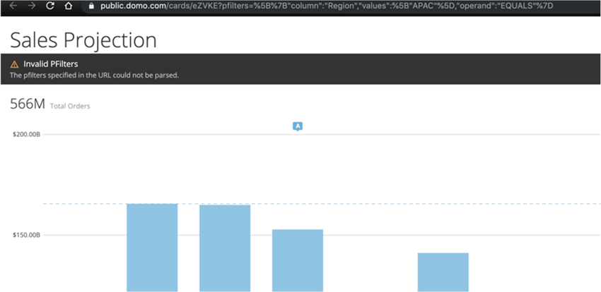

### Intro

You can use Pfilters (Python particle filters) to apply filters from URL query parameters to embedded Domo Dashboards as a layer after SSO or [programmatic filtering](/s/article/360042933134 "Using Programmatic Filters with Domo Embed (BETA)"). The Pfilter acts as an array of page filter objects. Any matching column names will be filtered upon page load even if they are based on different DataSets. Results can be validated in POST requests on the network tab. 

Examples
--------

### Example #1

The following multi-line example shows Pfilters being used to apply filters to an embedded Domo Dashboard. Example is broken up into multiple lines:

`[example.domo.com/embed/pages/private/ABCDE](http://example.domo.com/embed/pages/private/ABCDE)`

`?pfilters=[`

`{`

`"column":"Pos",`

`"operand":"IN",`

`"values":["TE","WR"],`

`},`

`{`

`"column":"Location",`

`"operand":"IN",`

`"values":["Amsterdam","Anchorage"],`

`}`

`]`

### Example #2

Here is another example, which also shows Pfilters being used to apply filters to a Dashboard but keeps the code in a single line:

`[https://public.domo.com/cards/e0jw3?...2Bugatti%22]}]](https://public.domo.com/cards/e0jw3?pfilters=%5B%7B%22column%22:%22Column_3%22,%22operand%22:%22IN%22,%22values%22:%5B%22Veyron%22%5D%7D,%7B%22column%22:%22Column_2%22,%22operand%22:%22IN%22,%22values%22:%5B%22Bugatti%22%5D%7D%5D "https://public.domo.com/cards/e0jw3?pfilters=[{%22column%22:%22Column_3%22,%22operand%22:%22IN%22,%22values%22:[%22Veyron%22]},{%22column%22:%22Column_2%22,%22operand%22:%22IN%22,%22values%22:[%22Bugatti%22]}]")`

  

Operands
--------

The operands you can use when writing code with Pfilters are as follows. Note that the values always need square brackets for the array, even when only a single value is included.  

* IN
* CONTAINS
* EQUALS
* NOT\_EQUALS
* GREATER\_THAN
* LESS\_THAN
* GREAT\_THAN\_EQUALS\_TO
* LESS\_THAN\_EQUALS\_TO
* BETWEEN

Persistence of Pfilters across Pages
------------------------------------

Domo automatically creates Pfilters when you check **Persist Filters** in the embed dialog, as shown here:  
 

  
You can then view the parameters by hovering over the content. (Card interactions must be turned on and set to **External link** for this to work). This is shown for the "QA pass rate by model" Card in the following example:  
 

When viewers click those links, any parts of the story they had previously clicked will be passed along as Pfilters to the next Page. These filters can either be applied to single Cards or complete Pages (even if the Pages contain many Cards based on various DataSets)*.*

        

Persistence of Pfilters across sessions
---------------------------------------

If you want Pfilters to expand beyond pages to also persist across sessions and refreshes, you'll need to store and load the last known state of the Pfilters. 

Malformed criteria
------------------

If a Pfilter is written incorrectly, the unfiltered version renders and a black error bar appears.

