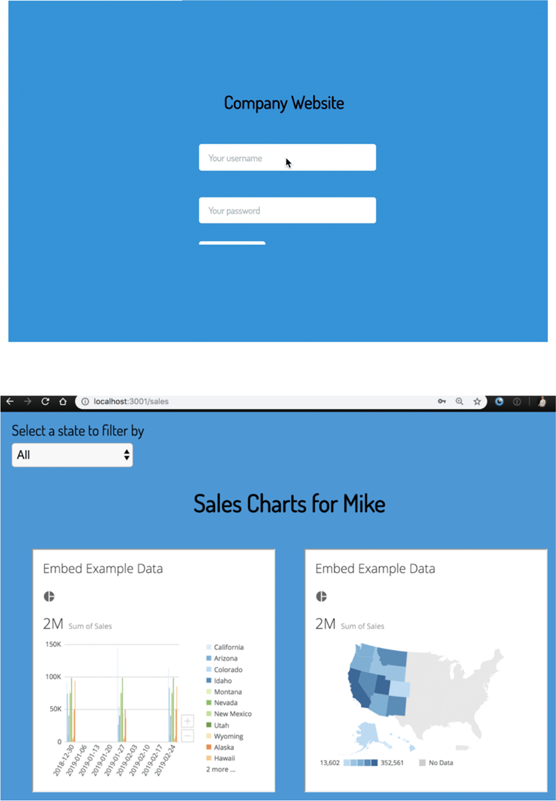
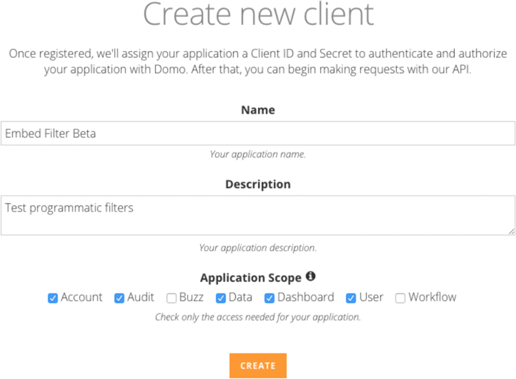
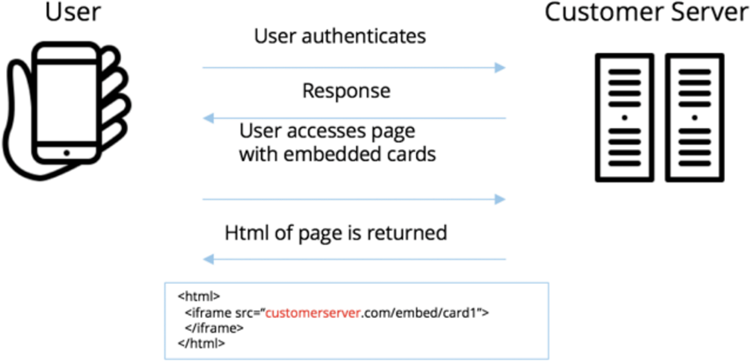
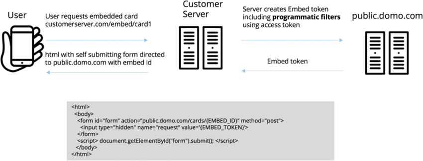
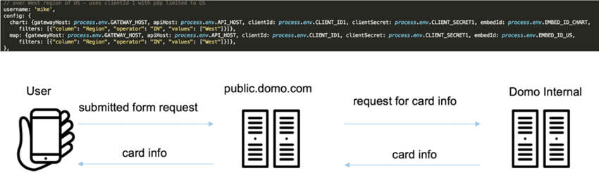

Intro
-----

By using programmatic filtering with Domo Embed, you can distribute personalized content in portals and software at scale. You can share your Domo content with an unlimited number of viewers, even if they do not have Domo accounts. 

For more in-depth information about programmatic filters in Domo Embed, visit the following links:

* <https://developer.domo.com/docs/overview/embedded-analytics>
* <https://developer.domo.com/docs/embed/embed-2>
* <https://github.com/domoinc/domo-node-embed-filters>
* <https://developer.domo.com/docs/embed-token-api-reference/embed-token-api-reference>

Programmatic filters provide all of the following benefits:

* Showing only approved and relevant content for the viewer.
* Decreasing the number of PDP policies you need to manage.
* Eliminating the need for viewers of embedded content to be full Domo users.
* Decreasing the risk of viewers logging into the full instance.

Filters are defined in your code based on the login credentials of your systems instead of Domo data permissions policies. This ensures that viewers only see approved subsets of the data even if you choose not to integrate your identity provider or automate the provisioning of users in Domo.

This is portrayed in the following example, in which user Mike logs into his company website using his username and password and is shown a filtered view of his company data based on his login credentials:

 

**Tip:**You can also use Domo's JavaScript API to allow multiple iFrames on the same page to utilize the same dropdown control. For more information about using this API, please refer to [developer.domo.com](https://developer.domo.com "https://developer.domo.com"). 

Configuring an example of programmatic filtering
------------------------------------------------

To configure an example of programmatic filtering, follow these steps:

1. Download the example code at <https://github.com/domoinc/domo-node-embed-filters>.  
You can also use these examples for the following programming languages:  
**[Asp.net](http://Asp.net):** <https://github.com/domoinc/domo-asp-embed-filters>  
**Python:** <https://developer.domo.com/docs/embed/python-code-example>  
**PHP:** <https://developer.domo.com/docs/embed/php-code-example>  
**Salesforce Lightning:** <https://github.com/michaelforce-repo/domo-salesforce-embed-example>
2. Activate an API client by doing the following:

	1. Go to [https://developer.domo.com](https://developer.domo.com "https://developer.domo.com") and log in (or create an account if you don't have one).
	2. Select **My Account > New Client**.
	3. Complete the fields.   
	  
	
3. Use a text editor to open the [README.md](http://README.md) file.
4. Follow the instructions in the file.  
  
The readme file walks you through the following tasks:

	* Creating an example DataSet.
	* Customizing the .env file with your specific embed IDs for each Card.
	* Live-testing this example setup on your local machine.

Setting up and configuring programmatic filtering for your environment
----------------------------------------------------------------------

The image below shows how your server gathers the access token, embed token, and embed ID in the embed.js file. This corresponds to the sample code in lines 1- and 11 of the embed.js file. You will need to update the [customerserver.com](http://customerserver.com) entry, noted at the bottom of the image, with your own domain for the pages in which you will programmatically filter Cards.   
 

  
 

The next image shows how the self-submitting form makes the request for the modified Card. The ApiGateway ([public.domo.com](http://public.domo.com)) returns the filtered version of the Card based on the logic defined in your code. This corresponds to lines 100-113 of the embed.js file.   
  
  
 

In the last image, the "request for card info" section corresponds to lines 20-26 of the express.js file. Here, the core criteria of the programmatic filter is defined.   
 

  
 

It is critical that the developer of the code understands the schema of the underlying DataSet. Otherwise the query could fail and the API will respond with "Bad request." This is to maintain the security of your server-side filters. 

