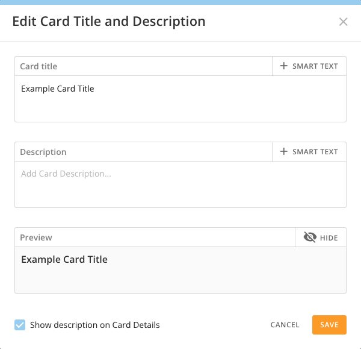
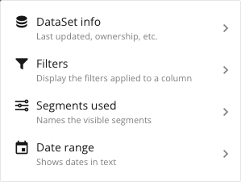
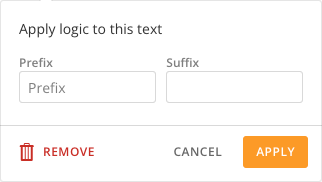
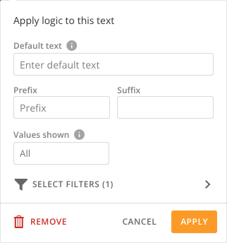
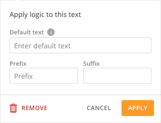
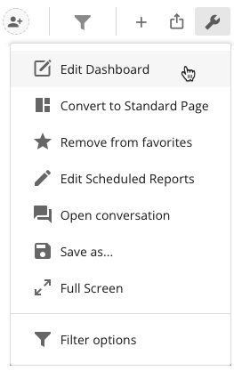
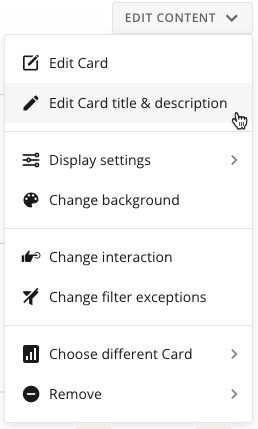

---
    title: Using Smart Text
    url: https://domo-support.domo.com/s/article/4529227357975
    linked_kbs:  ['[https://domo-support.domo.com/s/knowledge-base/](https://domo-support.domo.com/s/knowledge-base/)', '[https://domo-support.domo.com/s/](https://domo-support.domo.com/s/)', '[https://domo-support.domo.com/s/topic/0TO5w000000ZamoGAC](https://domo-support.domo.com/s/topic/0TO5w000000ZamoGAC)', '[https://domo-support.domo.com/s/topic/0TO5w000000ZanDGAS](https://domo-support.domo.com/s/topic/0TO5w000000ZanDGAS)', '[https://domo-support.domo.com/s/article/360042934614](https://domo-support.domo.com/s/article/360042934614)', '[https://domo-support.domo.com/s/article/360043430233](https://domo-support.domo.com/s/article/360043430233)', '[https://domo-support.domo.com/s/article/4529227357975](https://domo-support.domo.com/s/article/4529227357975)', '[https://domo-support.domo.com/s/topic/0TO5w000000ZanDGAS/card-and-dashboard-management](https://domo-support.domo.com/s/topic/0TO5w000000ZanDGAS/card-and-dashboard-management)', '[https://domo-support.domo.com/s/article/360043429933](https://domo-support.domo.com/s/article/360043429933)', '[https://domo-support.domo.com/s/article/360043429953](https://domo-support.domo.com/s/article/360043429953)', '[https://domo-support.domo.com/s/article/360042925494](https://domo-support.domo.com/s/article/360042925494)', '[https://domo-support.domo.com/s/article/360043429913](https://domo-support.domo.com/s/article/360043429913)', '[https://domo-support.domo.com/s/article/4408174643607](https://domo-support.domo.com/s/article/4408174643607)', '[https://domo-support.domo.com/s/login/](https://domo-support.domo.com/s/login/)']
    article_id: 000004086
    views: 2,771
    created_date: 2022-10-24 21:20:00
    last updated: 2022-10-24 22:42:00
    ---

Intro
-----

With Smart Text in Card text, you are able to insert metadata inside a Notebook Card, Card titles, or Card descriptions to help others become more data literate. The Metadata that is available for use are:

* DataSet information
* Filters
* Date Range
* Segments

**Video - Smart Text Overview**

Adding Smart Text in Analyzer
-----------------------------

You can add Smart Text to your Card's title or description referencing DataSet info, Filters, Segments, or Date range data. Thereafter, anytime the underlying data changes, the Smart Text will change automatically. Personalized Data Permissions (PDP) are respected when adding Smart Text to a Card title or description. For more information about PDP, see [Personalized Data Permissions (PDP)](/s/article/360042934614).

**To add Smart Text to a Card title or description,**

1. Create a new Card or open an existing Card inside of Analyzer.
2. Click on the Card **Title** or **Description** to open the edit modal.  
  

3. Click  next to the title or description.  
This opens the **Smart Text** menu, in which you select what data you would like to display.
4. Select one of the following options:  
  
  

	* **DataSet info** - Allows you to display the **Name**, **Owner**, or **Date last updated** for a specific DataSet.
	* **Filters** - Allows you to display the filters applied to a column or **Display any filter**.
	* **Segments used** - Allows you to display the **Segment name** or **Segment description** of the visible Segments.
	* **Date range** - Allows you to display the **Date range** or **Graph by** dates.
	
	
	
	
	
	
	
	**Note:** The steps for configuring the different Smart Text options are listed in the sections below.
5. Fill out the information in the **Apply logic to this text** menu.
6. Click **Apply**.

### DataSet Info Smart Text Configuration

Allows you to display the **Name**, **Owner**, or **Date last updated** for a specific DataSet.

#### DataSet Name Smart Text

**To configure the DataSet info Name Smart Text,**

1. Create a new Card or open an existing Card inside of Analyzer.
2. Click on the Card **Title** or **Description** to open the edit modal.  
  

3. Click  next to the title or description.  
This opens the **Smart Text** menu, in which you select what data you would like to display.
4. Select **DataSet info**.
5. Search for and select the DataSet you want to use.
6. Click **Choose DataSet**.
7. Select **Name**.
8. Fill out the **Apply logic to this text** menu.  
  
  
  

	1. (Optional) Apply a **Prefix**.
	2. (Optional) Apply a **Suffix**.
9. Click **Apply**.

#### DataSet Owner Smart Text

**To configure the DataSet info Owner Smart Text,**

1. Create a new Card or open an existing Card inside of Analyzer.
2. Click on the Card **Title** or **Description** to open the edit modal.  
  

3. Click  next to the title or description.  
This opens the **Smart Text** menu, in which you select what data you would like to display.
4. Select **DataSet info**.
5. Search for and select the DataSet you want to use.
6. Click **Choose DataSet**.
7. Select **Owner**.
8. Fill out the **Apply logic to this text** menu.  
  
  
  

	1. (Optional) Apply a **Prefix**.
	2. (Optional) Apply a **Suffix**.
9. Click **Apply**.

#### DataSet Date Last Updated Smart Text

**To configure the DataSet info Date last updated Smart Text,**

1. Create a new Card or open an existing Card inside of Analyzer.
2. Click on the Card **Title** or **Description** to open the edit modal.  
  

3. Click  next to the title or description.  
This opens the **Smart Text** menu, in which you select what data you would like to display.
4. Select **DataSet info**.
5. Search for and select the DataSet you want to use.
6. Click **Choose DataSet**.
7. Select **Date last updated**.
8. Fill out the **Apply logic to this text** menu.  
  
  
  

	1. (Optional) Apply a **Prefix**.
	2. (Optional) Apply a **Suffix**.
9. Click **Apply**.

### Filters Smart Text Configuration

Allows you to display the filters applied to a column or **Display any filter**.

#### Filter (Column Specific) Smart Text

**To configure the Filters applied to a specific column Smart Text,**

1. Create a new Card or open an existing Card inside of Analyzer.
2. Click on the Card **Title** or **Description** to open the edit modal.  
  

3. Click  next to the title or description.  
This opens the **Smart Text** menu, in which you select what data you would like to display.
4. Select **Filters**.
5. Search for and select one or multiple columns you wish to show.
6. Click **Select**.
7. Fill out the **Apply logic to this text** menu.  
  
  
  

	1. (Optional) Enter the **Default text**. The default is to show the name of the column if only one is selected or to display **Filters(x)** where x is the number of columns you have selected. (This will show when no filters are applied and in search results when searching for this Card.)
	2. (Optional) Apply a **Prefix**.
	3. (Optional) Apply a **Suffix**.
	4. (Optional) Enter the desired amount of **Values shown**. The default is **All**. (Any values selected that exceed the threshold will be shown in a tooltip.)
8. Click **Apply**.

#### Filter (Display Any Filter) Smart Text

**To configure the Filters Display any filter Smart Text,**

1. Create a new Card or open an existing Card inside of Analyzer.
2. Click on the Card **Title** or **Description** to open the edit modal.  
  

3. Click  next to the title or description.  
This opens the **Smart Text** menu, in which you select what data you would like to display.
4. Check the box for **Display any filter**.
5. Click **Select**.
6. Fill out the **Apply logic to this text** menu.  
  
  
  

	1. (Optional) Enter the **Default text**. The default is to show **Display any filter**. (This will show when no filters are applied and in search results when searching for this Card.)
	2. (Optional) Apply a **Prefix**.
	3. (Optional) Apply a **Suffix**.
	4. (Optional) Enter the desired amount of **Values shown**. The default is **All**. (Any values selected that exceed the threshold will be shown in a tooltip.)
7. Click **Apply**.

### Segments Used Smart Text Configuration

Allows you to display the **Segment name** or **Segment description** of the visible Segments.

#### Segment Name Smart Text

**To configure the Segments used Segment name Smart Text,**

1. Create a new Card or open an existing Card inside of Analyzer.
2. Click on the Card **Title** or **Description** to open the edit modal.  
  

3. Click  next to the title or description.  
This opens the **Smart Text** menu, in which you select what data you would like to display.
4. Select **Segments used**.
5. Click **Segment name**.
6. Fill out the **Apply logic to this text** menu.  
  
  
  

	1. (Optional) Apply a **Prefix**.
	2. (Optional) Apply a **Suffix**.
7. Click **Apply**.

#### Segment Description Smart Text

**To configure the Segments used Segment description Smart Text,**

1. Create a new Card or open an existing Card inside of Analyzer.
2. Click on the Card **Title** or **Description** to open the edit modal.  
  

3. Click  next to the title or description.  
This opens the **Smart Text** menu, in which you select what data you would like to display.
4. Select **Segments used**.
5. Click **Segment description**.
6. Fill out the **Apply logic to this text** menu.  
  
  
  

	1. (Optional) Apply a **Prefix**.
	2. (Optional) Apply a **Suffix**.
7. Click **Apply**.

### Date Range Smart Text Configuration

Allows you to display the **Date range** or **Graph by** dates.

#### Date Range Smart Text

**To configure the Date range Smart Text,**

1. Create a new Card or open an existing Card inside of Analyzer.
2. Click on the Card **Title** or **Description** to open the edit modal.  
  

3. Click  next to the title or description.  
This opens the **Smart Text** menu, in which you select what data you would like to display.
4. Select **Date range**.
5. Click **Date range**.
6. Fill out the **Apply logic to this text** menu.  
  
  
  

	1. (Optional) Enter the **Default text**. The default is to show **Date Range**. (This will show when no filters are applied and in search results when searching for this Card.)
	2. (Optional) Apply a **Prefix**.
	3. (Optional) Apply a **Suffix**.
7. Click **Apply**.

#### Graph By Smart Text

**To configure the Date range Graph by Smart Text,**

1. Create a new Card or open an existing Card inside of Analyzer.
2. Click on the Card **Title** or **Description** to open the edit modal.  
  

3. Click  next to the title or description.  
This opens the **Smart Text** menu, in which you select what data you would like to display.
4. Select **Date range**.
5. Click **Graph by**.
6. Fill out the **Apply logic to this text** menu.  
  
  
  

	1. (Optional) Enter the **Default text**. The default is to show **Graph by**. (This will show when no filters are applied and in search results when searching for this Card.)
	2. (Optional) Apply a **Prefix**.
	3. (Optional) Apply a **Suffix**.
7. Click **Apply**.

Adding Smart Text to a Dashboard
--------------------------------

You can add Smart Text to your Card's title or description referencing DataSet info, Filters, Segments, or Date range data from your Dashboard. Thereafter, anytime the underlying data changes, the Smart Text will change automatically. Personalized Data Permissions (PDP) are respected when adding Smart Text to a Card title or description. For more information about PDP, see [Personalized Data Permissions (PDP)](/s/article/360042934614).

**To add Smart Text to a Card title or description from your Dashboard,**

1. Navigate to the Dashboard where you want to display the Smart Text.
2. Click the  icon and select **Edit Dashboard**.  
  

3. Hover over the Card where you want to add the Smart Text.
4. Click the **Edit Content** menu in the top right of the Card.
5. Select **Edit Card title & description** to open the edit modal.  
  

6. Click  next to the title or description.  
  
  
  
This opens the **Smart Text** menu, in which you select what data you would like to display.
7. Select one of the following options:  
  
  

	* **DataSet info** - Allows you to display the **Name**, **Owner**, or **Date last updated** for a specific DataSet.
	* **Filters** - Allows you to display the filters applied to a column or **Display any filter**.
	* **Segments used** - Allows you to display the **Segment name** or **Segment description** of the visible Segments.
	* **Date range** - Allows you to display the **Date range** or **Graph by** dates.
	
	
	
	
	
	
	
	**Note:** The steps for configuring the different Smart Text options are listed in the sections above.
8. Fill out the information in the **Apply logic to this text** menu.
9. Click **Apply**.

Smart Text in Notebook Cards
----------------------------

The Smart Text feature can also be used inside of Notebook Cards. For information on how to use Smart Text in Notebook Cards, see [Adding a Notebook Card](/s/article/360043430233).

FAQ's
-----

#### Is PDP supported?

Yes, it works similarly with other PDP features, users will only see values that they have access to.

#### When is prefix/suffix applied to Smart Text?

It is applied when a value is applied or available.

#### Who can modify/edit?

Any user that has Edit permissions to a Card or Dashboard.

