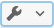
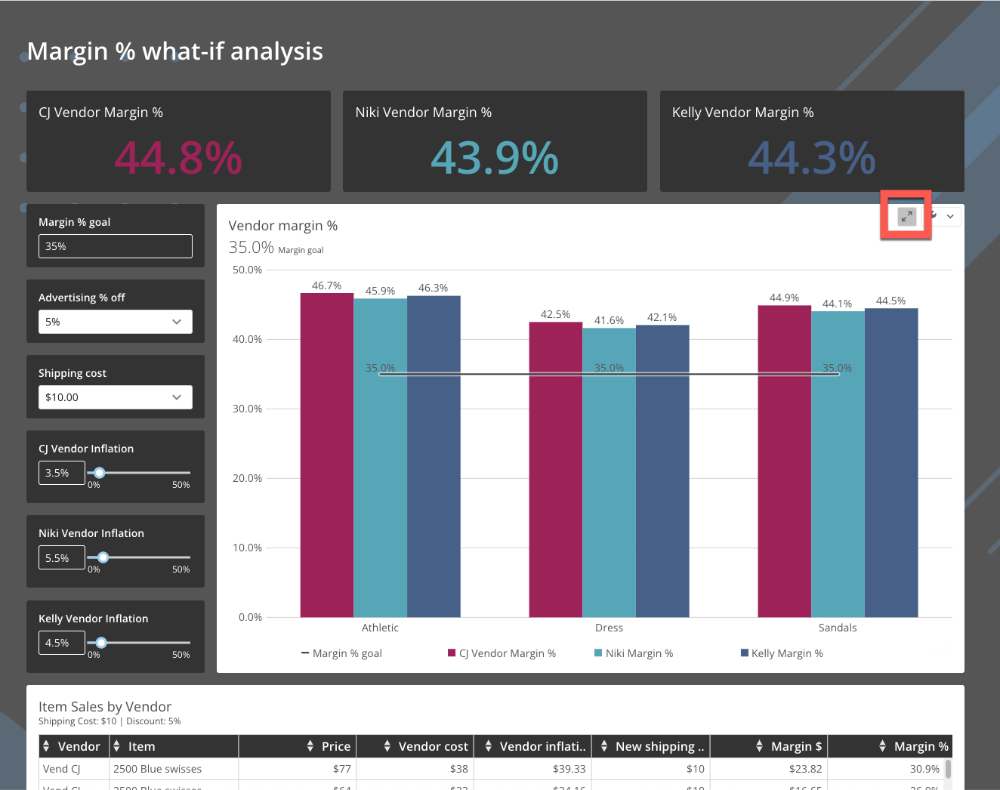
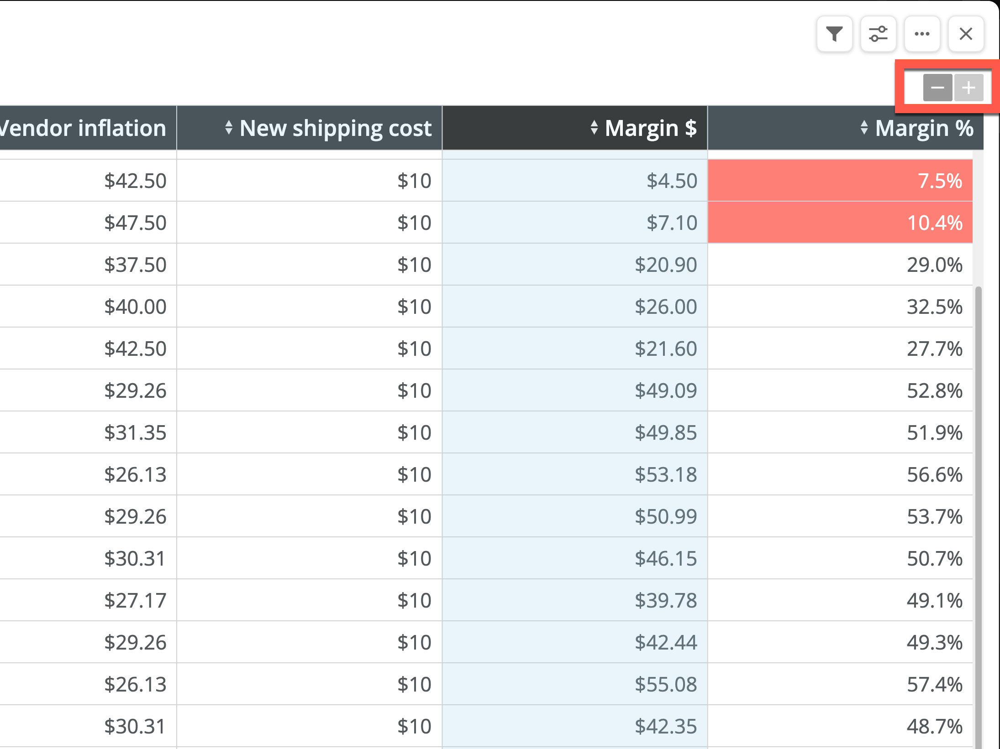
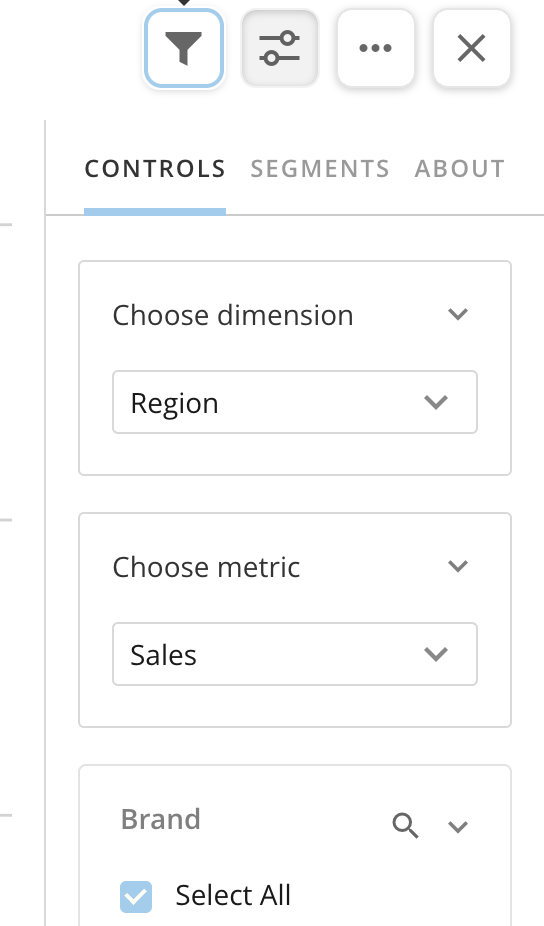
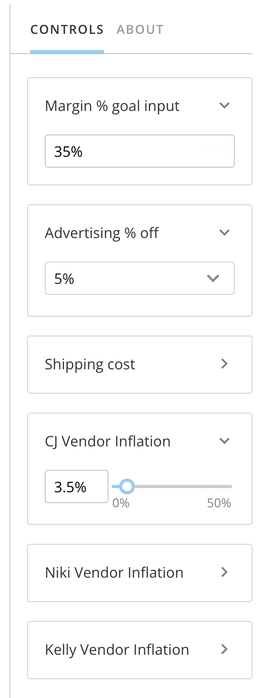
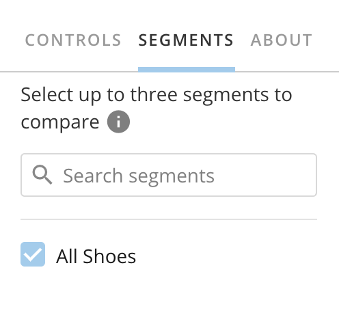
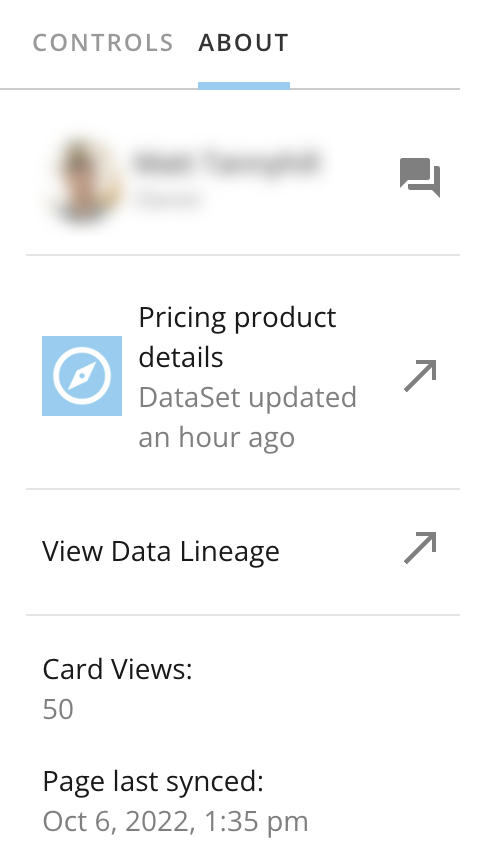
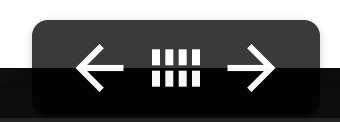
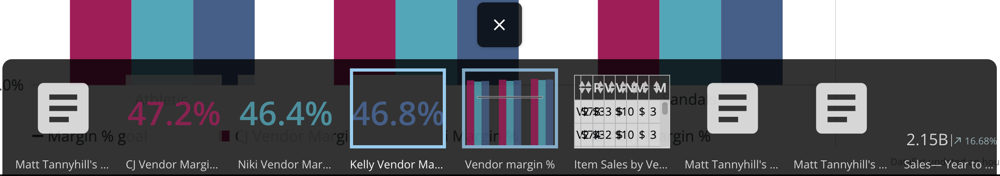

---
    title: Using Story Presentation Mode
    url: https://domo-support.domo.com/s/article/9355841270167
    linked_kbs:  ['[https://domo-support.domo.com/s/knowledge-base/](https://domo-support.domo.com/s/knowledge-base/)', '[https://domo-support.domo.com/s/](https://domo-support.domo.com/s/)', '[https://domo-support.domo.com/s/topic/0TO5w000000ZamnGAC](https://domo-support.domo.com/s/topic/0TO5w000000ZamnGAC)', '[https://domo-support.domo.com/s/topic/0TO5w000000ZansGAC](https://domo-support.domo.com/s/topic/0TO5w000000ZansGAC)', '[https://domo-support.domo.com/s/article/360042924074](https://domo-support.domo.com/s/article/360042924074)', '[https://domo-support.domo.com/s/article/7903767835031](https://domo-support.domo.com/s/article/7903767835031)', '[https://domo-support.domo.com/s/article/9355841270167](https://domo-support.domo.com/s/article/9355841270167)', '[https://domo-support.domo.com/s/topic/0TO5w000000ZansGAC/interacting-with-cards-and-dashboards](https://domo-support.domo.com/s/topic/0TO5w000000ZansGAC/interacting-with-cards-and-dashboards)', '[https://domo-support.domo.com/s/article/360043429933](https://domo-support.domo.com/s/article/360043429933)', '[https://domo-support.domo.com/s/article/360043429953](https://domo-support.domo.com/s/article/360043429953)', '[https://domo-support.domo.com/s/article/360042925494](https://domo-support.domo.com/s/article/360042925494)', '[https://domo-support.domo.com/s/article/360043429913](https://domo-support.domo.com/s/article/360043429913)', '[https://domo-support.domo.com/s/article/4408174643607](https://domo-support.domo.com/s/article/4408174643607)', '[https://domo-support.domo.com/s/login/](https://domo-support.domo.com/s/login/)']
    article_id: 000004976
    views: 1,351
    created_date: 2022-11-01 23:15:00
    last updated: 2022-11-01 23:23:00
    ---

Intro
-----

Domo's Story Presentation Mode allows you to make better presentations featuring your data. While in the mode, you can still view important details about the data, like who owns it and when it was last updated. If your audience wants a closer look at a dense table or visualization, you don't have to leave your presentation—Filters and Drill Paths function normally in the mode.

This article describes the Story Presentation Mode interface.

Navigating Story Presentation Mode
----------------------------------

Enter Story Presentation Mode from any card on your dashboard by selecting ** Expand**.

**Note:** Now to get to the card Details view, you can select  **Card options** > **Details**.

The card displays in Story Presentation Mode.

**Tables**

In Story Presentation Mode, you can use the  **Zoom in/out**buttons to make dense tables easier for your audience to read.

#### Control Rail

In Story Presentation Mode, visualization cards display with a control rail to the right of the chart. The control rail contains four buttons and three columns—**Controls**, **Segments**, and **About**.

**Buttons**

This table describes the buttons in the control rail.

| Button | Description |
| --- | --- |
| Filters_icon.png | **Filters —**Add Filters to your card. |
| show_hide_controls.png | **Hide/Show controls —**Hide or show the control rail to the right of the chart in Story Presentation Mode. The default when you open Story Presentation Mode is that the controls are showing. |
| card_options_spm.png | **Card options —**View the card options to share, export, go to card Details, open with Analyzer, or go to the DataSet. |
| Screen_Shot_2022-10-06_at_1.12.53_PM.png | **Close —**Close Story Presentation Mode and return to the same place on the dashboard where you were when you entered Story Presentation Mode. |

**Controls column**

The **Controls** column contains any Quick Filters or Variables that have been added to the card. You can interact with the controls and collapse or expand them.

To learn more about Quick Filters, see [Adding Filters to Your Chart](/s/article/360042924074).

To learn more about Variables, see [Variables Overview](/s/article/7903767835031).

**Segments column**

The **Segments** column allows you to compare up to three segments or subsets of your data. If there are multiple segments, you can search to locate the one(s) you need.

**About column**

The **About** column contains the name of the card's owner, the name of the DataSet and when it was last updated, a link to the data's lineage, the card view count, and the date and time the page was last synced.

#### Presentation Controls

At the bottom of the screen in Story Presentation Mode, you can access the presentation controls.

**Next card/previous card**

Selecting the **Next card**or the **Previous card** arrows moves you through the cards on the dashboard.

**Card list**

Selecting **Card list** displays a panel with all the cards on the dashboard so that you can quickly move to a particular card without having to scroll through all other cards on the way.

To exit the **Card list**, select  **Close**.

 

**Video - Story Presentation Mode**

