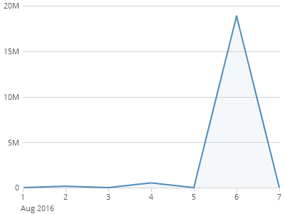
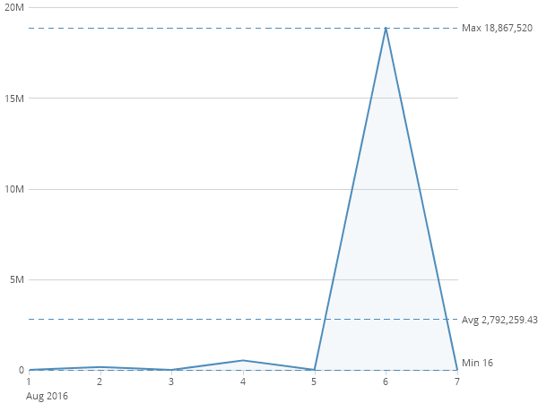
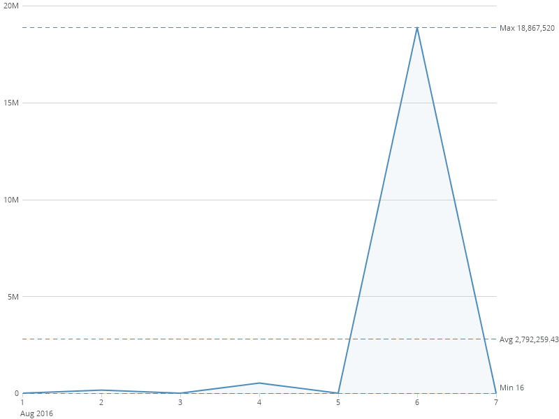
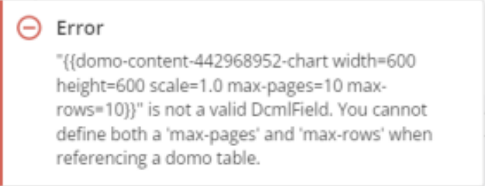
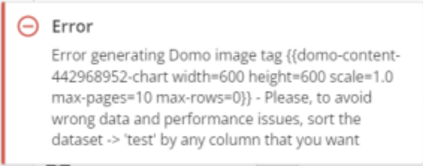

---
    title: Using the Domo Campaign Markup Language
    url: https://domo-support.domo.com/s/article/360042933514
    linked_kbs:  ['[https://domo-support.domo.com/s/knowledge-base/](https://domo-support.domo.com/s/knowledge-base/)', '[https://domo-support.domo.com/s/](https://domo-support.domo.com/s/)', '[https://domo-support.domo.com/s/topic/0TO5w000000ZampGAC](https://domo-support.domo.com/s/topic/0TO5w000000ZampGAC)', '[https://domo-support.domo.com/s/topic/0TO5w000000Zan9GAC](https://domo-support.domo.com/s/topic/0TO5w000000Zan9GAC)', '[https://domo-support.domo.com/s/article/360042933514](https://domo-support.domo.com/s/article/360042933514)', '[https://domo-support.domo.com/s/topic/0TO5w000000Zan9GAC/available-apps](https://domo-support.domo.com/s/topic/0TO5w000000Zan9GAC/available-apps)', '[https://domo-support.domo.com/s/article/360043429933](https://domo-support.domo.com/s/article/360043429933)', '[https://domo-support.domo.com/s/article/360043429953](https://domo-support.domo.com/s/article/360043429953)', '[https://domo-support.domo.com/s/article/360042925494](https://domo-support.domo.com/s/article/360042925494)', '[https://domo-support.domo.com/s/article/360043429913](https://domo-support.domo.com/s/article/360043429913)', '[https://domo-support.domo.com/s/article/4408174643607](https://domo-support.domo.com/s/article/4408174643607)', '[https://domo-support.domo.com/s/login/](https://domo-support.domo.com/s/login/)']
    article_id: 000004213
    views: 1,633
    created_date: 2022-10-24 21:27:00
    last updated: 2022-10-24 22:40:00
    ---

Intro
-----

There are many advanced features of this app that allow for even greater customization of your email campaigns. You can utilize the Domo Campaigns Markup Language to not only add more Domo content such as summary numbers or titles, but you can also specify the size of a card or limit the number of rows in a table.

When adding a distribution list to a campaign, you must specify columns that can act as filters. The filters are used as personalized data permissions (PDP) within the app. You can always make sure that recipients of your campaign are only seeing the data that is filtered to them.  
  
You can also add paginated Mega Tables and Pivot Tables in the email body and PDF attachments.

Customizing Domo Content
------------------------

Although you can already insert cards and card titles natively in the app, you can also add content by using the Domo Campaign Markup Language. To add dynamic content from a card in Domo, simply add the following text to your email or attachment body:

`{{domo-content-[card id]-[content type]}}`

1. Replace **[card id]** with the ID of the card you wish to pull from.
2. Replace **[content type]** with the part of the card you want to reference.

 

**Note:** Valid content types include title, summarynumber, and description.

#### Example 1

You want to insert the title from card 1234567, so you would insert the text below in your email or attachment body:

`{{domo-content-1234567-title}}`

#### Example 2

Now, you want to insert the summary number from card 8868777. You would insert the following text:

`{{domo-content-8868777-summarynumber}}`

### Changing Width, Height, or Scale

You can apply specific customizations to your Domo content such as width, height, or scale. simply add the following text to your email or attachment body:

`{{domo-content-[card id]-chart width=[width] height=[height] scale=[scale]}}`

1. Replace **[card id]** with the ID of the card you wish to pull from.
2. **[width]** and**[height]**specify the size of the image you want to insert into your template.
3. **[Scale]** is optional and always defaults to 1.0 if it is not set.  This allows you to insert more detailed information in a smaller space as if you've zoomed the chart out.

#### Different Scales

All of the charts below are rendered at 300 width x 400 height but at different scales. At higher scales, you get more detailed content in the same size image.

                                        1.0                                                                                        1.5                                                                                     2.0

#### 

#### 

#### Example 1

To insert the chart from card 8868777 and render in 800 width x 600 height, add the following text:

`{{domo-content-8868777-chart width=800 height=600}}`

#### Example 2

If you wanted to insert the same card as the example above but with a scale of 2.0, add the following text:

`{{domo-content-8868777-chart width=800 height=600 scale=2.0}}`

#### Table Cards

To add table cards, add the following text to your email or attachment body:

`{{domo-content-[card id]-table width=[width] height=[height] scale=[scale] max-pages=[maximum number of pages] max-rows=[maximum number of rows]}}`

1. Replace **[card id]** with the ID of the table card you wish to pull from.
2. **[width]**and**[height]**specifies the size of the image you want to insert into your template.
3. **[Scale]** is optional and always defaults to 1.0.
4. **[maximum number of pages]** and **[maximum number of rows]** are optional. Use these options to define a maximum number of pages or rows you want to include.

##### Example 1

If you want to include up to 5 pages of data, set your **[maximum number of pages]** attribute to 5, shown below: 

`{{domo-content-8868777-chart width=800 height=600 scale=2.0 max-pages=5 max-rows=0}}`

##### Example 2

If you want to include up to 100 rows of data, no matter the number of pages required (up to 200 maximum), set the **[maximum number of rows]** attribute to 100 and **[maximum number of pages]** to 0, shown below:

`{{domo-content-8868777-chart width=800 height=600 scale=2.0 max-pages=0 max-rows=100}}`  
 

#### Limitations and Restrictions

1. Supported components include:
	* HTML tables
	* Mega tables
	* Pivot tables
2. The maximum number of pages for Mega and Pivot Tables is 200 pages per PDF.
3. When using max-pages or max-rows tags, note the following:
	* If the user sets both max-pages and max-rows to zero, the system generates all pages.
	* The user must only use one pagination tag and set the other to zero. If both pagination tags have values, the app displays the following error:
	 
	* Mega Tables and Pivot Tables must be sorted by a column set by the user. If the tables are not sorted, the app displays the following error:
	 
	* The number of pages may vary depending on the width, height, and scale properties.
	* In preview mode only, the user can experience timeout exceptions when loading a Mega or Pivot Table with a large amount of data when the number of pages is more than 50.

Distribution List Content
-------------------------

The Domo Campaigns Markup Language (DCML) can also be used to insert fields from the distribution list into campaign emails or attachments.  If you want to add a field, simply add the following text to your email or attachment body:

`{{domo-distribution-[field name]}}`

1. Replace **[****field name]** with the name of the column in the distribution list you wish to pull from.

Example 1

For example, if I wanted to insert the ***Name*** field from your distribution list, you would use the text below:

`{{domo-distribution-name}}`

#### 

**Note:** Columns are case sensitive. (Ex: Name is different from name.)

Commenting out References

If you are having problems with a reference or want to comment it out for any reason, you can simply add an exclamation point **(!)** at the beginning of the text.

`{{!domo-distribution-name}}`

If a reference has been commented out, it will simply be removed when rendering the HTML or pdf.

### Data Filters

Filters are used to send a subset of your data to a given recipient by creating custom filters as columns within your distribution list.  You must have at least a single filter column but can have multiple filters that will be executed together when rendering your Domo content.  Each filter is made up of 3 separate pieces: the ***column name***, the ***operand***, and the ***value***.  They are all assembled to create a single filter value, like so:

`State is equal to Washington`

#### DCML - Filter DL.png

#### Dataset Column Name

The ***column name*** specifies the column to which the filter is applied. Values entered here need to match the column names in the DataSet that is powering the cards referenced in your campaign. 

##### Example 1

`Order Date is greater than or equal to 01/01/2018 00:00:00`

##### Example 2

Or you could only include the sales data for Washington:

`Name is equal to John Smith`

#### Multiple DataSets

If you are referencing multiple cards in your campaign that are powered by multiple datasets, then you ***MUST***specify which dataset the filter applies to by providing the dataset id and the column name in this format:

`[dataset id].[column]`

##### Example 1

Add a filter to only include sales data for orders placed this year would look like this:

`4bded6af-0556-4f24-b943-1858b6e84880.Order Date is greater than or equal to 01/01/2018 00:00:00`

 

**Note:** If all of your Domo content is powered by a single DataSet, the DataSet ID is implied and is not required.

#### Operands

There are 11 different operands that can be used to create your filter:

* Is equal to
* Does not equal
* Is greater than
* Is greater than or equal to
* Is less than
* Is less than or equal to
* Is between
* Is in
* Is not in
* Is null
* Is not null

#### Value

There are two different types of values that can be specified in the filter, a normal value and a column reference. 

#### Normal Value

A normal value is considered an actual value in a column to be filtered on.  For example, if you want to add a filter where the State column is equal to CA, you simply add CA as the value.

`State is equal to CA`

#### Column Reference

A column reference will take the value from any column in your distribution list and add that value to your filter.  So if you want to filter by state and you already have state defined in your distribution list, you can just reference the column by surrounding the column name with %.

##### Example 1

If the first row of your distribution list contains information for John Doe and his state is CA, the filter will be set to ***State is equal to CA***.  If the second row of your distribution list contains information for Jane Doe and her state is UT, the filter will be set to ***State is equal to UT***, and so forth.

`State is equal to %State%`

#### Wildcard Filter

If you don't want to specify any filters and wish to send unfiltered data and information in your email campaign, you must still define one filter column with the "wildcard" value of **\*** in it.  This will tell campaigns that you understand that the data and information being delivered is unfiltered.

#### Multiple DataSets

If you are referencing multiple cards in your campaign that are powered by multiple datasets, then you ***MUST***specify which dataset the wildcard filter applies to by providing the DataSet ID in this format:

`[dataset id]=*`

 

**Tip****:** You can find the DataSet ID by looking at the URL any your DataSets in Domo. (Ex: [https://instancename.domo.com/datasources/](https://instancename.domo.com/datasources/ "https://instancename.domo.com/datasources/")b936442-01cc-4ddc-836f-44457f123456/details/overview)

##### Example 1

If you are referencing multiple datasets and want to specify this dataset as a wildcard, your filter column would look like this:

`4bded6af-0556-4f24-b943-1858b6e84880=*`

### Using HTML to Format PDF Attachments

You can also utilize HTML to format PDF attachments. You can define the page size, orientation, and custom page breaks when the PDF is rendered.

#### 

#### Page Size and Orientation

DCML supports the @page annotation as documented in the [CSS# Paged Media module](https://www.w3.org/TR/css3-page/ "https://www.w3.org/TR/css3-page/").  This allows you to easily specify the size of a page as well as the orientation by simply including some CSS in your HTML definition.  For example, to render the PDF attachment in standard letter size (8.5" x 11") in a landscape orientation, you would include the following code to your HTML header:

`<html>  
    <head>  
          
    </head>  
    <body>  
    ...`

 

**Note:** Standard media sizes (A5, A4, A3, B5, B4, letter, legal, and ledger) and orientations (portrait and landscape) are supported.

You can also specify any custom size in the @page annotation.  For example, if you want to render the PDF in 5" x 7", you would add the following code to your HTML header:

`<html>  
    <head>  
          
    </head>  
    <body>  
    ...`

The CSS3 definition also supports more sophisticated and extensive formatting which is also supported by DCML.  You can find more details in the [CSS3 specification](https://www.w3.org/TR/css3-page "DCMLhttps://www.w3.org/TR/css3-page").

#### Page Breaks

In order for page break annotations to work, the **@media all** and **@media print** properties must be defined somewhere in your CSS.  If you don't have a defined CSS, simply include the following code in your HTML header:

`<html>  
    <head>  
          
    </head>  
    <body>  
    ...`

#### 

**Note:** DCML supports all of the CSS page break properties (**page-break-before, page-break-after,**and **page-break-inside**) with the exception of relatively positioned inline content and positioned/floated content which will paginate just like content in the normal flow.

To add a manual page break to any document, you can simply add the following code to your HTML:

`

`

#### HTML Tags Not Rendering

If you have a title or summary number that contain HTML formatting, the HTML will not always render correctly in the pdf attachment.  This is due to the encoding required to convert HTML to a pdf.  In order to fix this issue, add the following flag to your DCML tag:

`encoding=false`

For example,

`{{domo-content-8868777-summarynumber encoding=false}}`

This stops Domo content from being encoded and will allow the HTML formatting to be rendered correctly.

