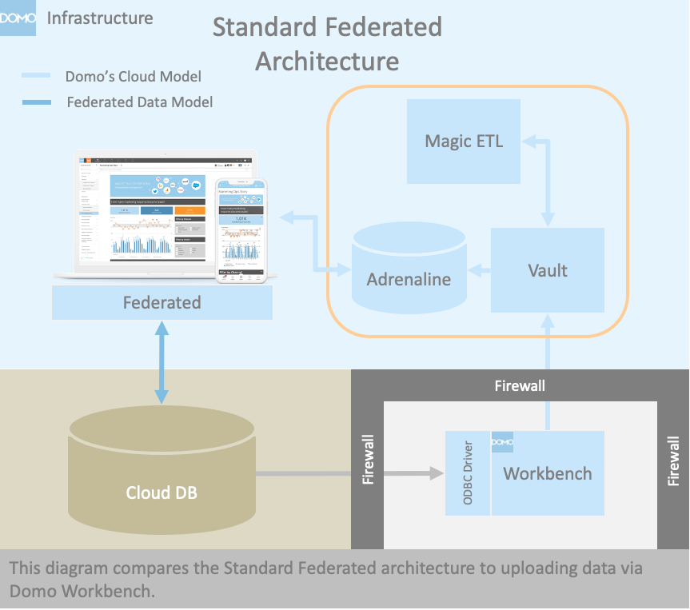
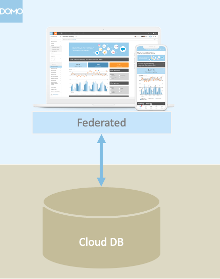
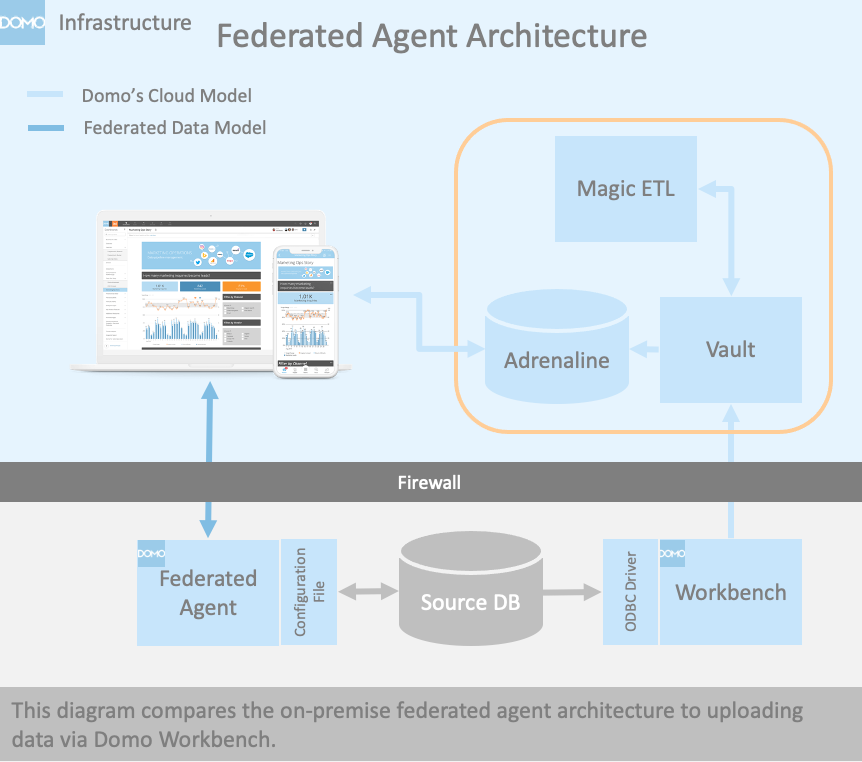
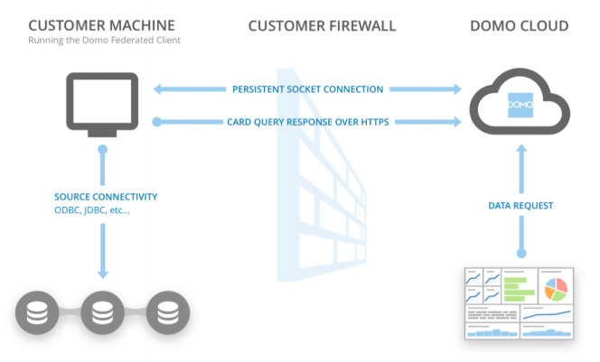
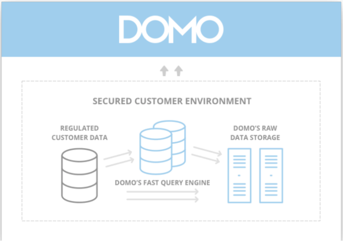
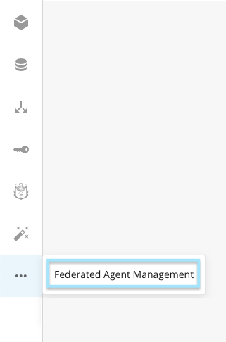
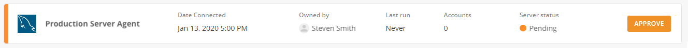

---
<<<<<<< HEAD
    title: Using the Federated Data Solution
    url: https://domo-support.domo.com/s/article/360042932974
    linked_kbs:  ['[https://domo-support.domo.com/s/knowledge-base/](https://domo-support.domo.com/s/knowledge-base/)', '[https://domo-support.domo.com/s/](https://domo-support.domo.com/s/)', '[https://domo-support.domo.com/s/topic/0TO5w000000ZammGAC](https://domo-support.domo.com/s/topic/0TO5w000000ZammGAC)', '[https://domo-support.domo.com/s/topic/0TO5w000000ZanzGAC](https://domo-support.domo.com/s/topic/0TO5w000000ZanzGAC)', '[https://domo-support.domo.com/s/article/360049429094](https://domo-support.domo.com/s/article/360049429094)', '[https://domo-support.domo.com/s/article/360042932974](https://domo-support.domo.com/s/article/360042932974)', '[https://domo-support.domo.com/s/topic/0TO5w000000ZanzGAC/other-connection-methods](https://domo-support.domo.com/s/topic/0TO5w000000ZanzGAC/other-connection-methods)', '[https://domo-support.domo.com/s/article/360043429933](https://domo-support.domo.com/s/article/360043429933)', '[https://domo-support.domo.com/s/article/360043429953](https://domo-support.domo.com/s/article/360043429953)', '[https://domo-support.domo.com/s/article/360042925494](https://domo-support.domo.com/s/article/360042925494)', '[https://domo-support.domo.com/s/article/360043429913](https://domo-support.domo.com/s/article/360043429913)', '[https://domo-support.domo.com/s/article/4408174643607](https://domo-support.domo.com/s/article/4408174643607)', '[https://domo-support.domo.com/s/login/](https://domo-support.domo.com/s/login/)']
    article_id: 000003159
    views: 3,684
    created_date: 2022-10-24 21:10:00
    last updated: 2022-10-24 22:41:00
    ---
=======
title: Using the Federated Data Solution
url: https://domo-support.domo.com/s/article/360042932974
linked_kbs:  ['[https://domo-support.domo.com/s/knowledge-base/](https://domo-support.domo.com/s/knowledge-base/)', '[https://domo-support.domo.com/s/](https://domo-support.domo.com/s/)', '[https://domo-support.domo.com/s/topic/0TO5w000000ZammGAC](https://domo-support.domo.com/s/topic/0TO5w000000ZammGAC)', '[https://domo-support.domo.com/s/topic/0TO5w000000ZanzGAC](https://domo-support.domo.com/s/topic/0TO5w000000ZanzGAC)', '[https://domo-support.domo.com/s/article/360049429094](https://domo-support.domo.com/s/article/360049429094)', '[https://domo-support.domo.com/s/article/360042932974](https://domo-support.domo.com/s/article/360042932974)', '[https://domo-support.domo.com/s/topic/0TO5w000000ZanzGAC/other-connection-methods](https://domo-support.domo.com/s/topic/0TO5w000000ZanzGAC/other-connection-methods)', '[https://domo-support.domo.com/s/article/360043429933](https://domo-support.domo.com/s/article/360043429933)', '[https://domo-support.domo.com/s/article/360043429953](https://domo-support.domo.com/s/article/360043429953)', '[https://domo-support.domo.com/s/article/360042925494](https://domo-support.domo.com/s/article/360042925494)', '[https://domo-support.domo.com/s/article/360043429913](https://domo-support.domo.com/s/article/360043429913)', '[https://domo-support.domo.com/s/article/4408174643607](https://domo-support.domo.com/s/article/4408174643607)', '[https://domo-support.domo.com/s/login/](https://domo-support.domo.com/s/login/)']
article_id: 000003159
views: 3,683
created_date: 2022-10-24 21:10:00
last updated: 2022-10-24 22:41:00
---
>>>>>>> fe496b1d734bfbc1f7998509d0072e99b55e6786

Intro
-----

Domo's Federated Data model allows you to render cards in Domo using a direct connection to your database hosted outside of Domo's cloud. Instead of executing the visualization query against Domo, the query is executed at the target database and the results are sent to Domo to render the visualization. This model is especially relevant for users who would like to keep their data at rest within their infrastructure for security or logistical reasons.

### Benefits

* Preserves existing data warehouse investment by allowing for direct connection to customer data lakes and warehouses.
* No upload to cloud storage.
	+ Avoids data duplication and costly data transfers.
	+ Reduces data latency due to transfers.
* Domo supports most commonly available databases. See the FAQ's for our current list.
* Customer admins retain control of the data.
* Custom database optimizations can be performed by the customer.

### Drawbacks

Before using Domo's Federated Data solution, be aware of the following:

* Query performance depends on the configuration of the customer’s data warehouse, its performance profile and the query load it experiences. This is managed outside of Domo.
* Federated DataSets do not support the following:
+ ETL, including Data Science actions (as an alternative, you can create Views with the on-premise DataSet.)
+ DataSet Alerts (Card Alerts are supported on Snowflake Federated DataSets.)
+ DataFusions
+ DataSet Views (Supported on Snowflake Federated DataSets from the same account. Cross-account Views are not currently supported.)

Federated Data Options
----------------------

Domo’s Federated Data model works both **direct** (standard architecture) and through an **installed agent** (agent-based architecture). The direct approach requires allowing incoming connections to the data layer. This approach is generally used for cloud providers. The agent approach does not require incoming connections and is generally used for on-premise providers, but can be used for cloud connections. More detailed information about each approach is detailed below.

Standard Federated Architecture
-------------------------------

 

### Overview

The standard federated option is ideal for cloud-based systems and connections to databases that can be queried directly by Domo.

### Benefits

* Simpler Setup
* Hosted in Domo
* No on-premise infrastructure
* Less overhead to manage and administer

### Drawbacks

Before using this solution, be aware of the following:

* Because it requires an incoming connection to your database, this approach is generally not ideal for on-premise solutions. Check with your IT or Infrastructure team before proceeding.

### Prerequisites

* You must have a connection string to the target database, including the database URL, username, and password.
* Whitelisting (if applicable) must be completed.

### Security

 

Domo connects to and queries the target database directly. All traffic between the Domo cloud and your data warehouse is encrypted. Your own firewalls can control all inbound and outbound traffic and strong authentication is in place to help ensure the integrity of the system accounts.

### Access

Standard federated is available to all customers. To access, navigate to the Domo data center and click the Federated icon.

### Getting Started

1. Configure an account by clicking the **Add New Account** button on the Federated screen.
2. Select the appropriate adapter.
3. Enter the connection details to the target database.
4. Configure each table to be made available through this federated account.
1. Select first table.
2. Review the schema and confirm that the appropriate columns are made available. You can change the included columns at any time.
3. Click **Next**.
4. Name the DataSet.
5. Set the Cache TTL as appropriate.  

**Note:** Cache TTL is the amount of time that Domo may cache the results of the query for use by subsequent queries.

6. Repeat the above step for each table by navigating to Federated within the Domo Data Center. You can use an account for as many tables as you'd like. You can also create multiple accounts.

Federated Agent Architecture
----------------------------

 

### Overview

The Federated Agent option is ideal for databases that cannot allow access to queries from Domo. Typically, these are on-premise databases. Under this architecture, an intermediate agent is installed in a location that has access to the database. Typically within the firewall of the database. This agent utilizes a socket connection to Domo to capture the queries, connects to the database and executes the queries, and returns the results to Domo. A configuration file is used to manage the connection to Domo and the target database.

### Benefits

* Installed within the network firewall acting as an intermediary between Domo and the target database.
* Provides an avenue for custom development if necessary. This gives users the ability to make on the fly adjustments to the queries or query routing.

### Drawbacks

Before using this solution, be aware of the following:

* This solution requires an on-premise installation and routine updates to ensure connectivity.
* More technical resources can be required to install and maintain.

### Prerequisites

* A machine must be in place for the agent to run on and must have access to the target database.
* The necessary JDBC driver for the target instance must be available on the server. The path to the JDBC driver file is required in the configuration.
* You must have a connection string to the target database, including the database URL, username, and password.
* You must have the following Domo connection information:
+ Domo domain (i.e. [customer.domo.com](http://customer.domo.com))
+ Domo credentials to OAuth 2.0 or a Domo auth token (generated in **Admin > Authentication > Access tokens**)

### Security

 

Domo Federated Data model federates data between the Domo cloud and your data stores, without duplicating data. This ensures that your data remains protected in your environment. Only the subset of data that is queried is passed to the Domo cloud.

Federated also supports a defense-in-depth model to help ensure that your Data remains protected in all stages of its lifecycle, including data in-transit and at rest.

#### Data in Transit

All traffic between the Domo cloud and your data warehouse is encrypted. Your own firewalls can control all inbound and outbound traffic and strong authentication is in place to help ensure the integrity of the system accounts.

#### Data at Rest

Domo's Federated Data model ensures that your Domo cloud data is ephemeral. A TTL (time-to-live) is associated with your data, and once the TTL expires, so too does your data. This TTL is configurable by you and it can be as short as 5 seconds. The customer data TTL has significant benefits as it allows you to simply disable data access, which results in all customer data being inaccessible in Domo.

### Getting Started

1. Domo's Federated Agent is available to all customers. Download the agent here: <https://app.domo.com/labs/federated-agent-v2/prod/latest/domo-federated-agent-v2.zip>
2. Follow the additional instructions in the [README.md](http://README.md) file included with the agent package.
3. After setting up the federated agent, navigate to your Domo Data Center to authorize the agent. Click the **Federated Agent Management** button.  
  

4. Click the **Approve** button on the agent you’d like to authorize.  
  

5. Your agent is now ready to connect.

FAQ
---

### How do I update the Federated Agent?

1. Create a zip archive or copy your existing installation directory to a new location to serve as a backup. Do not move your existing installation directory.
2. Download the latest version of the agent here: <https://app.domo.com/labs/federated-agent-v2/prod/latest/domo-federated-agent-v2.zip>.
3. Unzip the archive.
4. Copy **federated agent.jar** from the archive and overwrite **federated agent.jar** in your existing installation directory.  

**Important:** Only overwrite the **federated agent.jar** file. Overwriting or replacing other files can cause issues.
5. You can remove the backup archive after validating your upgrade works correctly or during your next upgrade.

### How long does it take to set up the Federated Agent?

Once the prerequisites are in place, it generally takes under an hour to get up and running.

### What databases are supported?

The current list of databases includes the following:

* Amazon Athena
* Amazon Redshift
* Google BigQuery
* IBM Db2
* Microsoft Azure
* Microsoft SQL Server
* MySQL
* Oracle
* PostgreSQL
* Presto
* SAP Hana
* Snowflake\*
* Teradata
* Vertica

\* We recommend using the new cloud native federated experience for Snowflake. See details [here](/s/article/360049429094).

### Will there be a performance impact on the Card loading times?

The additional time added by the Federated Agent is negligible. Any performance impact will be related to the ability of the target server to process the queries.

### How do I optimize performance?

Each target system has different optimization techniques. Due to the complexity associated with performance tuning and the knowledge it requires of your data warehouse, Domo is unable to assist with performance optimization within your data warehouse.

### What options are available to manage the load on the server?

Domo caches the results of queries when possible to be as efficient as possible. Cache settings are configurable in the Federated Adapter.

### Does using the Federated Agent require allowing Domo through our firewall?

No, the Federated Agent uses a web socket to establish a connection to Domo. No inbound traffic is required to use the Federated agent.

### What does a Federated DataSet look like in Domo?

It looks like a normal DataSet. It displays row counts and the schema, but the actual data is not copied to Domo.

### Why am I getting the error “Agent has not been authorized to connect to accounts”?

Your agent must be authorized to accept connections. Please see the [Getting Started](#h_01FM3H1HB336G2AD6F2C2S954P) section above for details.

### How does caching work?

Results are cached at a DataSet & SQL query level. Every Card, Custom App, and DataFlow produce SQL used to select results from an underlying DataSet. It's that combination of the produced SQL and the DataSet that serves as a cache key. If multiple Cards produce the same SQL to retrieve data from the same DataSet, they may utilize the same cache. The same goes for multiple users that access a Card or Cards producing the same SQL against the same DataSet.

### How is caching impacted by filtering and/or PDP?

Filtering (Page Filters, Card Filters, Filter Views, etc.) and PDP are included in the underlying SQL. This means that a given Card may have multiple cache keys as described in the above FAQ, particularly if each user has different PDP rules.

### When does a cache expire?

The cache timeout (TTL - time to live) is set on the adapter by the user configuring the connection.

### Where do I go if I have additional questions?

Reach out to Domo Support or your Customer Success Manager.

