Intro
-----

 

 

**Important:** A Variable is a value that functions in a Beast Mode. You can create a Variable without using it in a Beast Mode, but you cannot use the Variable in a card or on a dashboard unless you use it in a Beast Mode.

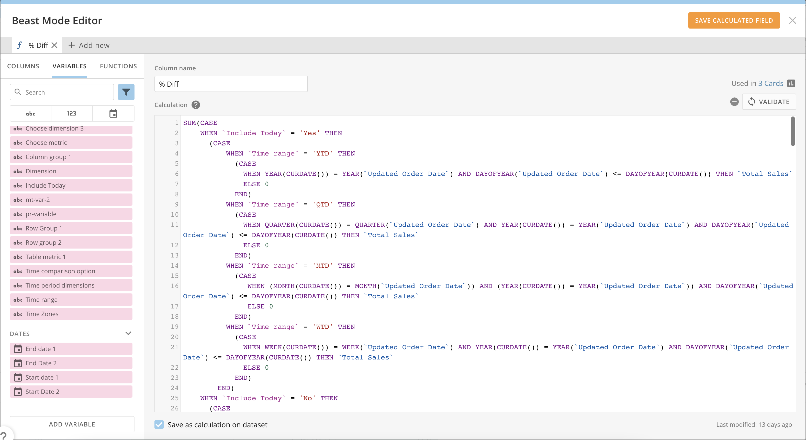

Variables allow data analysts to interact with the data on cards and create dashboards that are fully functional apps, as well as effectively reducing content clutter. Variables provide low-code solutions for many use cases, including the following:

* What-if analysis
* KPI exploration
* Time comparison
* Score cards for product performance
* Guided analysis

This article introduces Variables, default values, and controls; gives instructions on how to complete various tasks with Variables; and discusses Variables and governance. 

#### Variables - Terms to Know

Variables have many uses and can show up in different ways around Domo.

To help you learn about Variables, here is a short list of terms to know:

| Term | Definition |
| --- | --- |
| Variable | A value that functions inside of a Beast Mode.
Similar to variables in math, Variables can be of different data types and various kinds, depending on controls. |
|  
Default value | The default value of a Variable is set when the Variable is created. |
| Value | The value of a Variable can change, depending on your modifications. |
| Control | The way that you can interact with and modify the value of a Variable.
There are three types of Variable controls: [Default Controls](#h_01GET8B1S7MG2RQ59142P27J8A), [Card Variable Controls](#h_01GET8BA5RNV3AY68XVRT1N6W7), and [Dashboard Variable Controls](#h_01GET8BMF2CAP4FP1KRVRJYTGC). |

The rest of this article explains how to use Variables generally, but if you have a specific question about using Variables with your data, contact your Customer Success Manager (CSM).

Variables and the Beast Mode Editor
-----------------------------------

Because Variables must be added to a Beast Mode to function, you can create them in the enhanced Beast Mode Editor.

You can access the Beast Mode Editor from inside **Analyzer** by selecting the **Beast Mode**tile in the **Visualize Tab**, or by selecting **Add Calculated Field** from the left side rail in Analyzer.

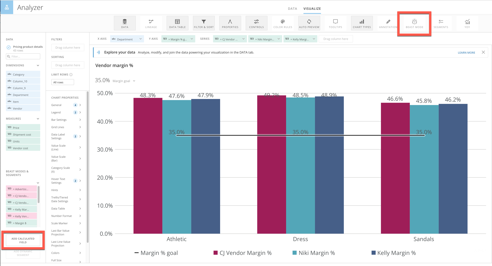

Inside the Beast Mode Editor, you can view all Variables in your Domo instance by selecting the **Variables** tab.

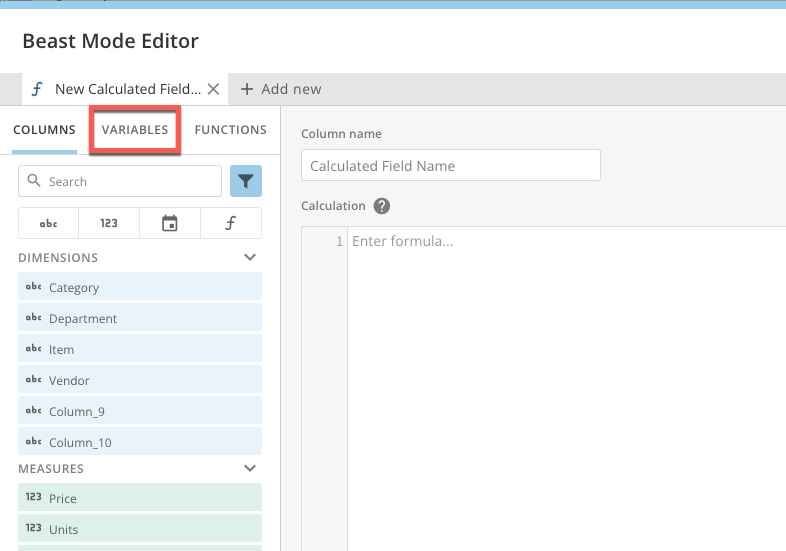

Variables are organized by data type: Numbers, Strings, and Dates. Any user with the Edit Cards grant can use any Variable in an instance, but only those with the Edit Variables grant can create, edit, or delete Variables.

To learn more about this grant, see [Variables and Governance](#h_01GERHWBP8F1WF7MX5ESD9GHSW) later in this article.

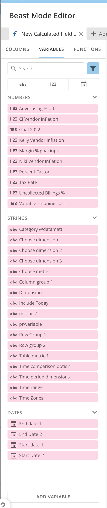

When you create a Variable, you must give it a name, select a data type, and set a default value. This basic Variable can be added to a Beast Mode by any user in the instance with the right permissions. You can think of this basic Variable as a global Variable.

If you create a Variable and later modify the default value or any of the other basic details, those changes are reflected everywhere that the Variable is being used, in any Beast Mode in your instance where it appears.

#### Creating a Variable

1. Identify the card that you would like to add a Variable to and open it with **Analyzer**.

2. Access the **Beast Mode Editor**.

3. Select the **Variables** tab.

4. Below the list of Variables in your instance, select **Add Variable**.  
A ***(x)*** ***New Variable***tab displays at the top of the editor.

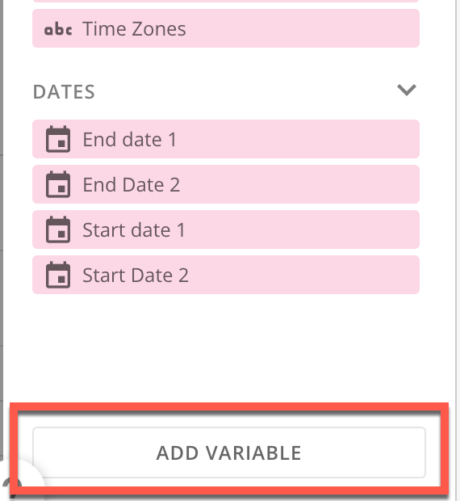

5. Under **Variable Settings**, enter a **Variable name** and an optional **Description.**  
The name now displays in the tab at the top of the editor.

6. Under **Variable Value**, select a data type and enter a **Default** **value**. This default value is the value of the Variable every time it is used in a Beast Mode. If the default value is changed and saved here in the editor, the change is reflected in every Beast Mode in your instance where the Variable is being used.

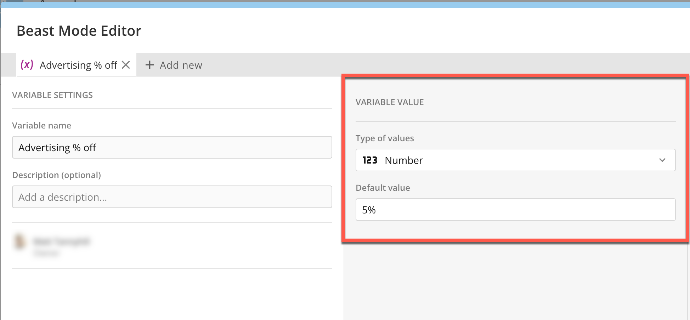

7. Select **Create Variable**.

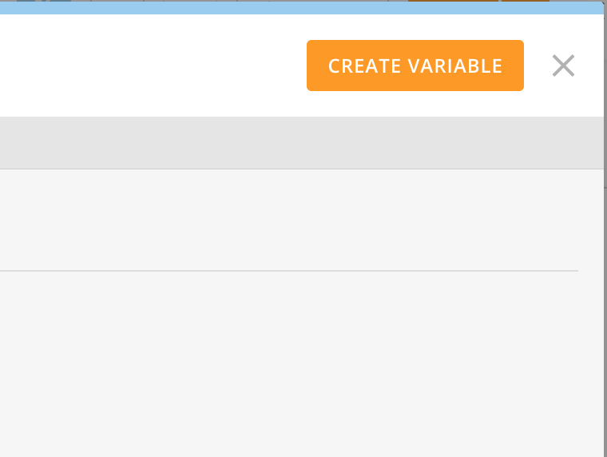

8. Select **Save Variable**.

9. Select the **New Calculated Field**tab at the top of the editor.  
The **Variables** tab is open.

10. Locate the basic or global Variable that you created, organized by data type and alphabetically by name.

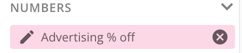

#### Editing/Deleting a Variable

You can  **Edit** or 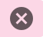 **Delete** a Variable from its place in the **Variables**tab. 

It is possible to lock a Variable so that it can't be edited or deleted. To learn more, see [Variables and Governance.](#h_01GERHWBP8F1WF7MX5ESD9GHSW)

#### Controls

As mentioned previously, you can configure and modify controls for your Variables. Controls allow you to update your Variable's value to find new insights, adjust selections, and update your cards dynamically on a dashboard or in card Details. 

If you are familiar with Domo, controls function with the same hierarchy as Quick Filters. In **Analyzer**, controls display in the same panel as Quick Filters, and that panel is labeled **Controls**, as a general term for both Variable controls and Quick Filters.

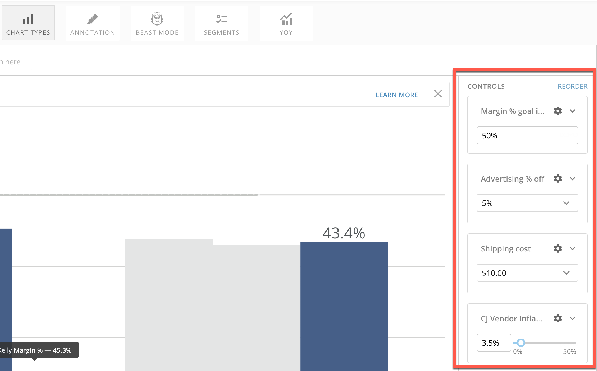

If you aren't familiar with Quick Filters, what this means is that changes to a control on a dashboard override any changes to a particular control in Analyzer. The changes are only visible in the user's current location in Domo. For example, if you modify a control on a dashboard when you open the card in Analyzer, the control will have the same value as was last saved for it in Analyzer.

#### Default Control

The first type of control, a Default Control, is configured in the Beast Mode Editor. There are several kinds of Default Controls, such as dropdowns, pills, sliders, and textbox inputs. The kind of Default Control you can use with a Variable depends on the data type of the Variable.

You can configure a Default Control when you create a Variable or come back later to add it by editing your Variable.

If you change the default value for a Variable after creating the Default Control, the Default Control does not update automatically. To change the Default Control, you must make a change to it in the Beast Mode Editor and save the change.

**Default Control and Other Users**

If you create a Variable without a Default Control and return to add one later, or if you initially configure the Variable with a Default Control and later update it, your changes do not override the different controls other users may have created or modified as they use your Variable in their cards and dashboards. This is not the same as for the default value—if you change the default value for a Variable, every occurrence of that Variable in your instance reflects the change in the cards and dashboards of both you and other users.

Another user can potentially adjust the Default Control for your Variable. If you then remove your Variable from a card or Beast Mode, when you try to add your Variable to another Beast Mode, the Variable's Default Control reflects the adjustments from the other user. You would need to go back to the Beast Mode Editor and adjust the Default Control to the original value if you want the your Variable's Default Control to have the original value. To prevent changes like this to Variables you create, see [Locking/Unlocking a Variable](#h_01GFNN5KTC75DAX85WJ5C049FG), below.

#### Creating a Default Control

1. Are you creating a new Variable?

* **Yes —**After entering information in the **Variable Value** fields, move to step 2 of this workflow.
* **No —** In the **Variables** tab of the Beast Mode Editor, locate the Variable you want to create a Default Control for and select  **Edit.**

2. Under **Default Control**, select **+ Create** **Control**.

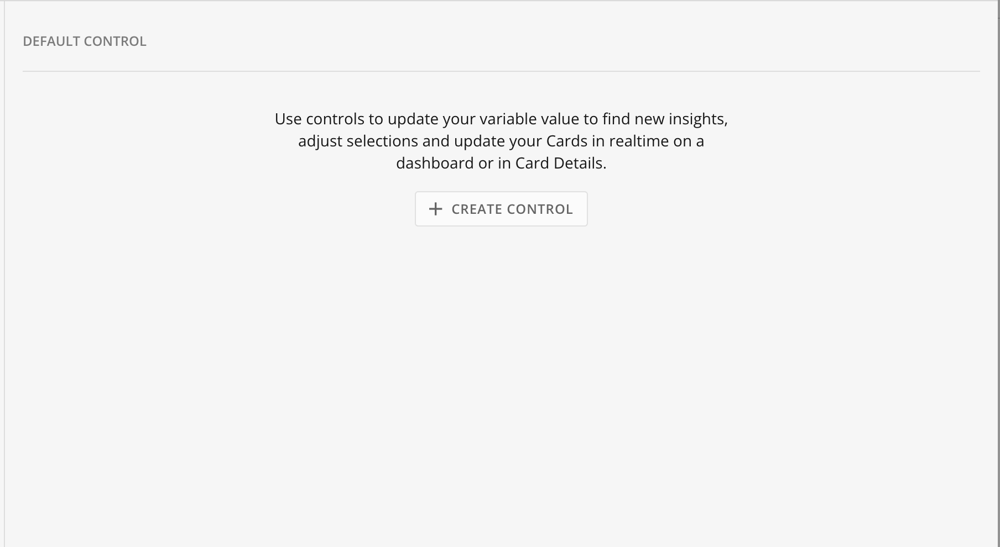

3. Choose the kind of control. Some options may be unavailable based on the Variable's data type.

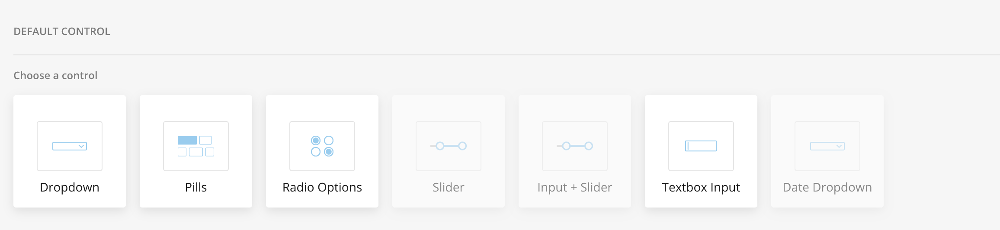

4. Configure the control based on the kind of control and the available values. You can preview how the control displays in Analyzer.

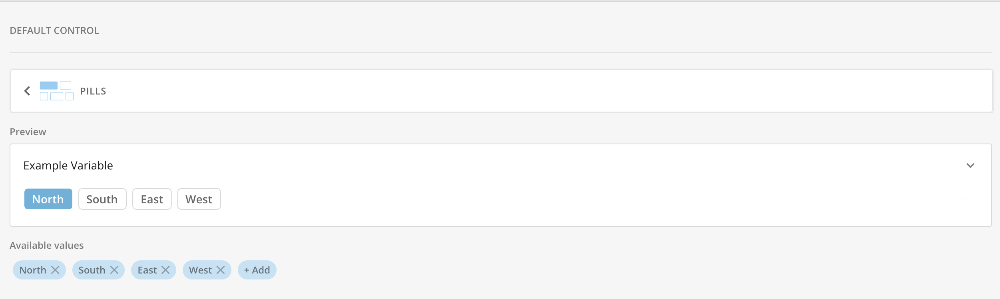

5. (Optional) If you want to add the control to Analyzer so that you can try out different scenarios with the Variable, check the box for **Add Control to Analyzer**.

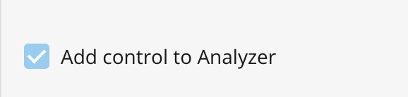

If you add the control to Analyzer, it automatically displays in the **Controls** side panel of Analyzer.

6. Select **Save Variable**.

7. Exit the Beast Mode Editor.

#### Adding a Variable to a Beast Mode

Note: You must add a Variable to a Beast Mode before it can function or be modified in Analyzer or on a dashboard.

1. Select a Beast Mode from inside Analyzer OR open the **Beast Mode Editor** and add a **New Calculated Field**tab at the top.  
Your Beast Mode calculation displays.

2. Select the place in your Beast Mode calculation where you want to add a Variable.

3. Select the **Variables** tab and locate the Variable you want to add.

4. Double-click the Variable to add it to the place you selected in your calculation.

5. (Optional) Repeat steps 3–4 to add as many Variables as you would like to your Beast Mode.

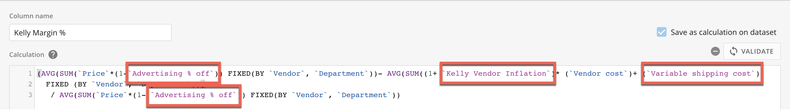

6. (Optional) Select **Validate** to check that your calculation functions with the Variable.

7. Select **Save Calculated Field**. 

8. Exit the Beast Mode Editor.

Card Variable Controls
----------------------

When you bring a Variable into Analyzer, you can override the default value and the Default Control created in the Beast Mode Editor by using a Card Variable Control. This is helpful for performing what-if analysis and other tasks inside Analyzer.

If when you created the Default Control you checked the box to **Add control to Analyzer**, the Card Variable Control displays automatically in the **Controls** side panel in Analyzer.

In this example, the Niki Vendor Inflation Variable has a Default Control of 5.5%. The Variable displays as shown in the **Controls** side panel in Analyzer and is called a Card Variable Control. Card Variable Controls also refers to the controls when they appear in card Details and Story Presentation Mode. 

Follow this link to learn more about [Story Presentation Mode](/s/article/9355841270167).

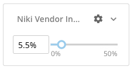

#### Modifying a Card Variable Control

**Note:** To modify a Card Variable Control, the Variable must be in use in a Beast Mode on that card.

Considering the example above, you can modify the Card Variable Control by moving the slider. In this example, the modified value of the Card Variable Control is now 10%. The Default Control for the basic or global Variable, as configured in the Beast Mode Editor, has not changed.

Modifying the Card Variable Control affects only this occurrence of the Variable for this card. This allows you to use the Variable for your DataSet while also allowing other users to use the Variable in their DataSets and create other controls. If another user brings your Variable into Analyzer for their card, the default value and Default Control you configured are in effect unless they modify the Card Variable Control in Analyzer.

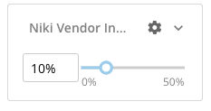

 

**Important:** If you modify the Card Variable Control and save the card, the next time you open the card in Analyzer, the modification remains. But if you use the card in a dashboard, the value of the Variable is the value of the Default Control—no modifications of the Card Variable Control transfer to the dashboard.
Dashboard Variable Controls
---------------------------

After you add a Variable to a Beast Mode, add the Beast Mode to a card in Analyzer, optionally adjust the Card Variable Control, and save the card, you can add the card to a dashboard. Note that any changes made to the Card Variable Control in Analyzer do not transfer to the Variable when you use it on a dashboard. When a Variable control is added to a dashboard, the control is called a Dashboard Variable Control.

When you first add a Dashboard Variable Control to a dashboard, all cards on the dashboard that contain that Variable reflects the default value of the Variable at the basic or global level in **Variable Settings**. If you then modify the Dashboard Variable Control, all cards on the dashboard that use that Variable reflect the modification.

Just as for Card Variables Controls, modifications to a Dashboard Variable Control do not transfer. If you modify a Dashboard Variable Control, the modification is not reflected in Analyzer, card Details, or Story Presentation Mode.

 

**Note:** If you refresh a dashboard, all Dashboard Variable Controls in use reset to the default value of the Variable at the basic or global level in **Variable Settings**.

### Adding a Dashboard Variable Control

1. In the Edit Dashboard mode, click and drag a **Control** from the right side rail onto your dashboard.

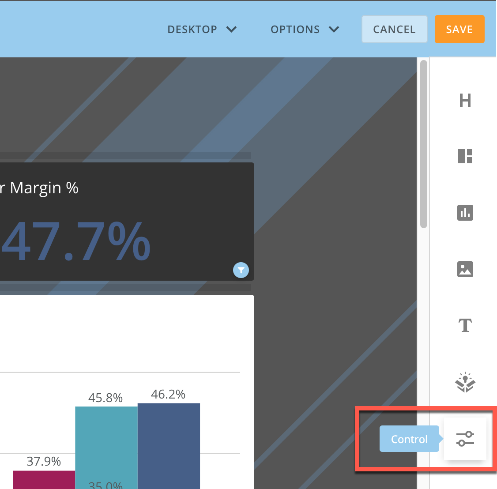

2. Select **Add**.  
A list of available Variables displays.

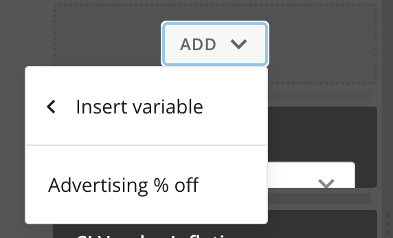

3. Select the Variable you want to add to the dashboard from the list.

The Dashboard Variable Control displays.

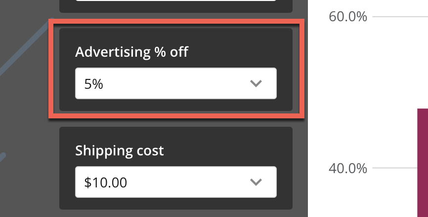

 

**Note:** You can only add each available Variable to a dashboard once. If you attempt to add a Variable and it does not display in the list of available Variables, it already appears somewhere on the dashboard. Locate it and move it to the desired place.

 

### Modifying a Dashboard Variable Control

Anyone with permission to interact with a card can modify a Dashboard Variable Control.

Modify a Dashboard Variable Control by interacting with it depending on its type: moving a slider or choosing another option in a dropdown, for example.

If you modify a Dashboard Variable Control and open a card with that Variable in Analyzer, the Analyzer Variable Control does not reflect the modification—the value of the Card Variable Control is the last value that was saved in Analyzer.

### Page Filters

Variables, by default, do not display in the dashboard Filters bar. If you add a Dashboard Variable Control and modify it (move the slider bar, for example), the Variable then displays in the Filters bar alongside other Filters and reflects the modified value.

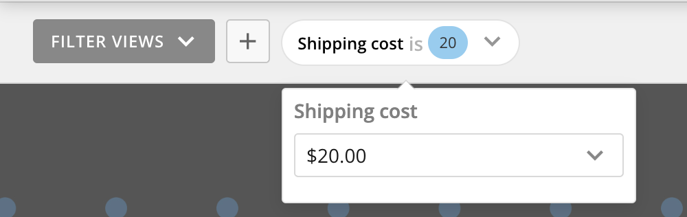

 Variables and Governance
-------------------------

Who can create, edit, and use Variables?

Variables are part of the Domo base product, so after a Variable is created, anyone can use it.

Variables have their own grant—the Edit Variables grant—that is automatically enabled for all users with the Edit Card grant enabled (Editor role and above), beginning with the October 2022 release. The Edit Variables grant allows a user to create, edit, and delete Variables in that instance. Admins can disable this grant for any user. If an admin turns off the Edit Variables grant for a user, that user can still use Variables, they just can't create, edit, or delete them. 

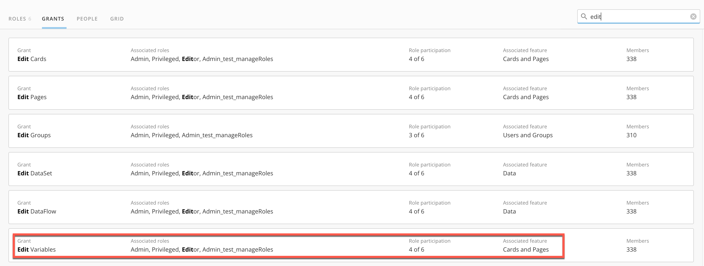

### Locking/Unlocking a Variable

It is also possible for a user to lock a Variable that they create. If a Variable is locked, others can view and use the Variable, including modifying the Card and Dashboard Variable Controls, but they can't edit or delete the Variable. 

To lock a Variable that you create, when you are creating the Variable in the Beast Mode Editor, locate the  **Lock**under **Variable Settings**.

Select  **Lock**before saving your Variable.

Now no other users can edit or delete your Variable unless you unlock it. 

Unlock the Variable by selecting 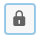 **Unlock**under **Variable Settings**.

### DomoStats Reports

There are three new DomoStats reports to help keep your instance organized: 

* **Variables —** This report lets admins know what Variables exist in their instance.
* **Variables Used in Beast Modes —**This report details which Variables are currently in use in a Beast Mode.
* **Beast Modes Used in Cards —**This report shows which Beast Modes are currently in use in cards.

For more information about DomoStats, see [DomoStats - DataSets and DataFlows](/s/article/360043439293).

FAQ
---

**Do I need to use a Variable in a Beast Mode?**  
Yes. Variables must be used in a Beast Mode calculation to work with a card or dashboard.  
  
**Are Variables saved to a card or DataSet?**  
No. Variables are global and can be used across different DataSets on different cards and dashboards. This prevents creators from having to duplicate the same Variable across multiple DataSets. Variables are created in the Beast Mode Editor and all users in the instance can view them there.  
  
**What permissions do I need to create a Variable?**  
You need the Edit Variables grant. See [Variables and Governance](#variables_and_governance), above.  
  
**Are Variables supported with Domo Everywhere Embed?**  
Yes. Variables are supported with Domo Everywhere Embed.  
  
**Are Variables supported in publication groups?**  
No. Variables are not supported in publication groups.  
  
**Video — Variables Use Cases and Feature Walkthrough**  
  

