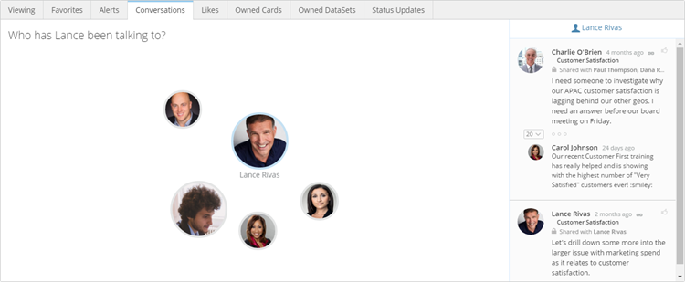

---
    title: Viewing a User's Conversation Activity
    url: https://domo-support.domo.com/s/article/360043439533
    linked_kbs:  ['[https://domo-support.domo.com/s/knowledge-base/](https://domo-support.domo.com/s/knowledge-base/)', '[https://domo-support.domo.com/s/](https://domo-support.domo.com/s/)', '[https://domo-support.domo.com/s/topic/0TO5w000000ZamsGAC](https://domo-support.domo.com/s/topic/0TO5w000000ZamsGAC)', '[https://domo-support.domo.com/s/topic/0TO5w000000ZaoLGAS](https://domo-support.domo.com/s/topic/0TO5w000000ZaoLGAS)', '[https://domo-support.domo.com/s/article/360043439533](https://domo-support.domo.com/s/article/360043439533)', '[https://domo-support.domo.com/s/topic/0TO5w000000ZaoLGAS/user-profile](https://domo-support.domo.com/s/topic/0TO5w000000ZaoLGAS/user-profile)', '[https://domo-support.domo.com/s/article/360043429933](https://domo-support.domo.com/s/article/360043429933)', '[https://domo-support.domo.com/s/article/360043429953](https://domo-support.domo.com/s/article/360043429953)', '[https://domo-support.domo.com/s/article/360042925494](https://domo-support.domo.com/s/article/360042925494)', '[https://domo-support.domo.com/s/article/360043429913](https://domo-support.domo.com/s/article/360043429913)', '[https://domo-support.domo.com/s/article/4408174643607](https://domo-support.domo.com/s/article/4408174643607)', '[https://domo-support.domo.com/s/login/](https://domo-support.domo.com/s/login/)']
    article_id: 000004387
    views: 2,114
    created_date: 2022-10-24 21:45:00
    last updated: 2022-10-24 22:40:00
    ---

In a user's Profile page, in the **Conversations** tab you can see all of the people that user has been conversing with in Buzz, along with a live feed of the actual conversations.

**To open the Conversations tab for a user,**

1. Open the user's Profile page by clicking his or her profile picture anywhere that it appears.
2. Click **Conversations** in the tab row under the row of hyperlinks.

The tab is divided into two panels. The panel on the left shows bubbles for all of the users this user has been talking to. Bubble size is determined by the number of conversations a user has been involved in. The panel on the right contains a miniature version of Buzz that updates to reflect new conversations this user is engaging in. The name over this right panel is the name of the user whose bubble is selected in the left-hand panel. By default the owner of this Profile page is the selected user. However, you can click on any other user's bubble to filter the right-hand feed to show only conversations in which that user was involved. When you do this, the new selected user's bubble moves to the center of the panel to indicate that it is selected. In the previous screenshot, user "Hal Bunderson"'s bubble has been selected, so the feed updates to show only conversations in which Hal was involved.

