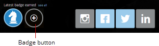
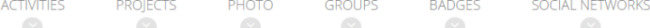

---
    title: Viewing and Awarding Badges
    url: https://domo-support.domo.com/s/article/360043439493
    linked_kbs:  ['[https://domo-support.domo.com/s/knowledge-base/](https://domo-support.domo.com/s/knowledge-base/)', '[https://domo-support.domo.com/s/](https://domo-support.domo.com/s/)', '[https://domo-support.domo.com/s/topic/0TO5w000000ZamsGAC](https://domo-support.domo.com/s/topic/0TO5w000000ZamsGAC)', '[https://domo-support.domo.com/s/topic/0TO5w000000ZaoLGAS](https://domo-support.domo.com/s/topic/0TO5w000000ZaoLGAS)', '[https://domo-support.domo.com/s/article/360043438973](https://domo-support.domo.com/s/article/360043438973)', '[https://domo-support.domo.com/s/article/360043439493](https://domo-support.domo.com/s/article/360043439493)', '[https://domo-support.domo.com/s/topic/0TO5w000000ZaoLGAS/user-profile](https://domo-support.domo.com/s/topic/0TO5w000000ZaoLGAS/user-profile)', '[https://domo-support.domo.com/s/article/360043429933](https://domo-support.domo.com/s/article/360043429933)', '[https://domo-support.domo.com/s/article/360043429953](https://domo-support.domo.com/s/article/360043429953)', '[https://domo-support.domo.com/s/article/360042925494](https://domo-support.domo.com/s/article/360042925494)', '[https://domo-support.domo.com/s/article/360043429913](https://domo-support.domo.com/s/article/360043429913)', '[https://domo-support.domo.com/s/article/4408174643607](https://domo-support.domo.com/s/article/4408174643607)', '[https://domo-support.domo.com/s/login/](https://domo-support.domo.com/s/login/)']
    article_id: 000004391
    views: 2,125
    created_date: 2022-10-24 21:45:00
    last updated: 2022-10-24 22:42:00
    ---

In a user's Profile page, in the **Badges** pane you can see the badges awarded to the user. You can also award a badge to this user if you have permission to award that badge. You get permission to award a badge when a user with an "Admin" default security role or a custom role with "Manage Company Settings" enabled grants you permission in the Admin Settings. Otherwise you cannot award badges, even if you already have an "Admin" security role. For information about creating a badge and assigning who can award it, see [Managing Custom Roles](/s/article/360043438973 "Creating Badges for Achievements").

**To award a badge,**

1. Open the user's Profile page by clicking his or her profile picture anywhere that it appears.
2. Do one of the following:

	1. Click the + button that appears under the "Latest badge earned" text in the profile header. If you do not have permissions to award any badges, this button does not appear.  
	   
	
	2. Navigate to the **Badges** pane either by clicking the Badges navigation button under the user statistics panel or by scrolling down until you find it, then click **Give a Badge**. If you do not have permissions to award any badges, this button does not appear.  
	   
	  
	   
	 A list appears containing the names of the badges you have permissions to award.
3. Click the badge you want to award.  
 The image for the badge appears in the **Badges** pane.
