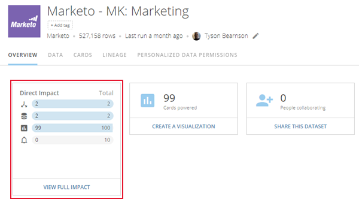
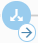
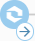
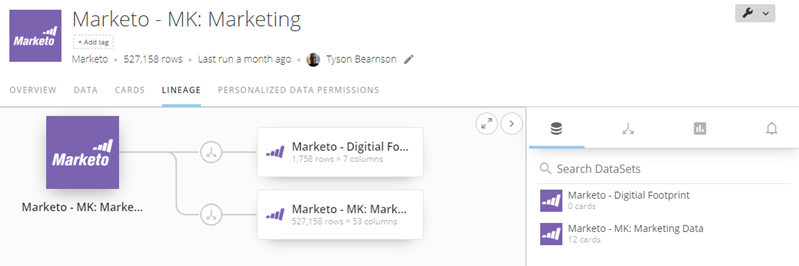

Intro
-----

Before you make changes to DataSets, it is vital that you understand the impact those changes will have on other DataSets, DataFlows, Cards, and Alerts that are associated with that DataSet, both directly and indirectly. For example, you might have a DataSet that is used in a DataFlow, which is used to power a Card, which an Alert has been set on. Making changes to this DataSet directly impacts the DataFlow and indirectly impacts the Card and Alert further downstream. If the changes cause anything to break, everything downstream breaks also.  

Domo's Data Impact Analysis tool, available in the details view for a DataSet, helps you understand the impact of actions you take on your DataSets. 

Impact Card
-----------

When you open the details view for a DataSet, a new card in the **Overview** tab shows you the number of DataSets, DataFlows, Cards, and Alerts directly and indirectly impacted by changes to that DataSet. The card displays the direct impact for each, along with the total number of impacts. So in the following example, we could deduce that changes to the DataSet would affect 99 Cards directly and only 1 indirectly (since the total is 100). 

 

Lineage View
------------

Clicking ****View Full Impact**** opens a new ****Lineage**** view, in which you can see the upstream and downstream impact of changes made to the DataSet. You can also see the lineage for a DataSet simply by clicking on the **Lineage** tab.

### Icons in the Lineage view

Different kinds of connections in the Lineage view are indicated by different icons. These icons are as follows:

 - Indicates that a DataFlow was used to generate the child DataSet.

 - Indicates that a DataFusion was used to generate the child DataSet.

 - Indicates that this DataFlow has been selected (by clicking on the icon). Selecting a DataFlow opens an information panel on the left side of the screen. Clicking the arrow opens the details view for the DataFlow. If you do not have rights to view the DataFlow, you cannot see the details in this panel. 

 -  Indicates that this DataFusion has been selected (by clicking on the icon). Selecting a DataFusion opens an information panel on the left side of the screen. Clicking the arrow opens the details view for the DataFusion.

 - Indicates that this DataFlow is broken.

Other icons used in this view are as follows:

 - Opens the fullscreen Lineage view.

 - Closes the fullscreen Lineage view.

 - Opens the right-hand panel.

 - Closes the right-hand panel.

You can also click on a DataSet (represented by the rectangles) to see information about that DataSet in the info panel. 

### Info Panel

When you click on a DataFlow or DataFusion icon in the Lineage view, an info panel opens on the left side of the screen. This panel shows the owner, the number of direct and indirect impacts on downstream elements, input and outset DataSets (for DataFlows and DataFusions), the update history, and the number of rows and columns (for DataSets). If you do not have access to a given DataSet, DataFlow, or DataFusion, you cannot view the information in the panel. For DataSets, a button appears that allows you to request access from the owner. For DataFlows and DataFusions, a simple message appears stating that you do not have access.   

### List Panel

A collapsible panel on the right allows you to see all of the individual DataSets, DataFlows, Cards, and Alerts powered by this DataSet. Click  to see impacted DataSets,  to see DataFlows,  to see Cards, and  to see Alerts.

