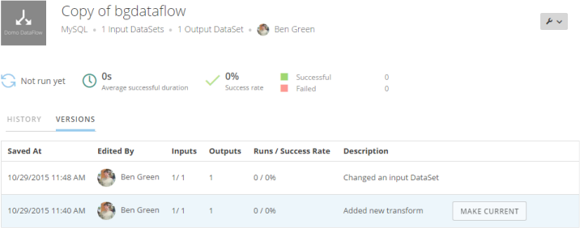

In the Details view of a DataFlow, you can see a version history for the DataFlow. Every time you save in the **Edit** view of a DataFlow, a new version entry is added to this list. Each entry includes the save date and time, the name of the user who saved the changes, the number of input and output data sources, the number of runs and success rate, and the description of the change if available. (You are given the option of entering a description when saving changes to a DataFlow.) You also have the option of restoring an old version of a DataFlow as the current version. When you do this, the restored version is added as a new version, and the original version remains in its place in the list.

**To view the version history for a DataFlow,**

1. In the **DataFlows** tab of the Data Center, locate and click the DataFlow you want to see the version history of.
2. Click the **Versions** tab.
3. (Optional) To restore an old version as the current version, mouse over the old version and click **Make Current**.

**Video - MySQL Version Control**

 

**Video - Using ETL Version Control**

 

