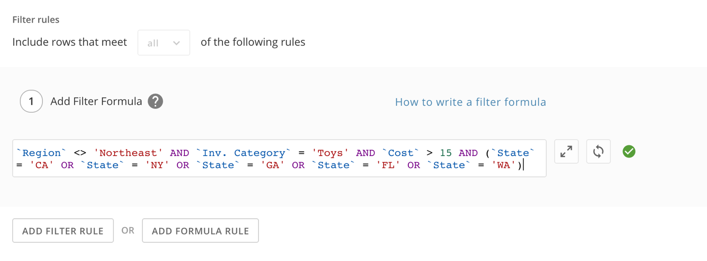

Intro
-----

Filter Formulas enable Magic ETL DataFlow authors to easily filter out data using SQL-style syntax. The filter formula needs to be a logical (Boolean) expression. In other words, the result of your formula must be a True/False return. Now you can save time by using expressions like *'Column name' >= 7* or*`Column name` BETWEEN 15 AND 20* rather than navigate the traditional Filter Configuration tab.

 

**Important:** There are significant behavioral differences in Magic ETL. Read the [Behavior Changes and Feature Updates in Magic ETL](file:///hc/en-us/articles/360047787514) article before converting mission-critical Magic ETL DataFlows. **Failure to do so may risk an unintended change to your DataFlow’s behavior.**

Common Logical Filters
----------------------

A few examples of common logical filters are as follows:

* *`id` >= 7*
* *`Percent Change` BETWEEN .35 AND .65*
* *`Phone Number` LIKE ‘801%’ AND `Age` < 35 AND `State` = ‘California’*
* *(`Age` > 20 AND (`Salary` / 12) > 40000) or `Age` > 50*
* *REGEXP\_LIKE(`Email`, ‘@[gmail.com](http://gmail.com)’)*
* *`Product Type` IN (1, 3, 7, 9)*

Filter Rows
-----------

Null values are treated differently by the comparison functions. In SQL and Magic ETL DataFlows, the result of any comparison with null is always null, which is treated by the **Filter Rows** tile like a false result. In most contexts in Magic ETL, null is not equal to null, but null is also not not equal to null; null is not greater than zero, but it is also not less than zero, nor is it equal to zero. If you have nulls in columns referenced by **Filter Rows** tiles, all of those rows will be dropped, regardless of the function or its other argument. The only functions that can deal with nulls truthfully are “is null” and “is not null”. In v1, a filter might have tested “column = null”. This will no longer have the same result; such filters should be changed to use the “is null” operator.

If after switching a flow from Magic ETL v1 to Magic ETL v2, it runs successfully, but the output seems to be missing rows, this change is a likely culprit. It can be especially surprising with the “is not equal to” function. It might seem like “column <> 5” should only drop rows where column’s value is 5, but in fact it will also drop rows where column is null, for the reason described above. The table below has additional examples of null behavior in **Filter Rows**.

| Test | Evaluated Result  | Filter Effect |
| --- | --- | --- |
| 4 <> 5 | true | keep |
| 5 <> 5 | false | drop |
| null <> 5 | null | drop |
| null = null | null | drop |
| null <> null | null | drop |
| null is null | true | keep |
| null is not null | false | drop |
| 5 is not null | true | keep |
| 5 is null | false | drop |

To handle nulls in more complex ways, use the new formula system. The **Filter Rows** tile is one of three tiles (**Group By** and **Add Formula** being the other two) which supports formula evaluation. The IFNULL() function works particularly well for handling a null result from a filter expression. For example, if column “col” has null values, and we want to filter for rows whose value for “col” is not 5, preserving our nulls, we could write this expression: IFNULL(col <> 5, TRUE)

Besides null handling, there are many other scenarios that filter formulas make easier. In the previous version of Magic ETL, the single formula below would have required two separate **Filter Rows** tiles with multiple conditions each.

