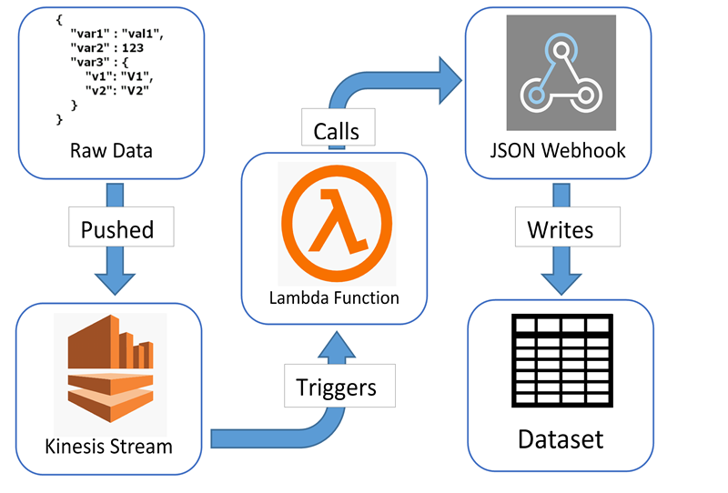
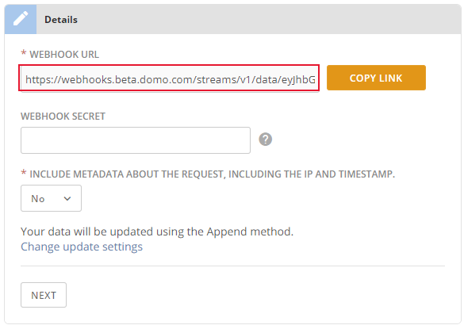
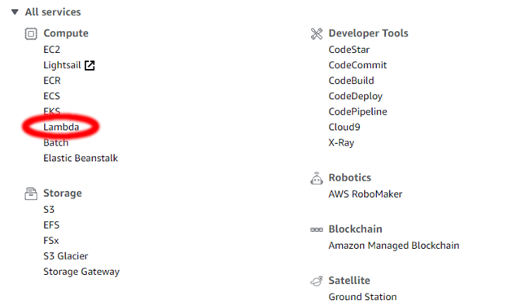
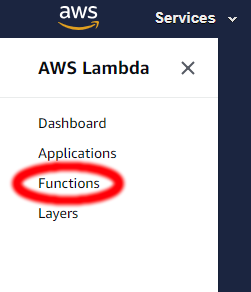
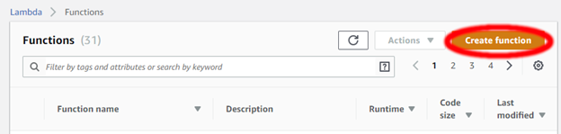
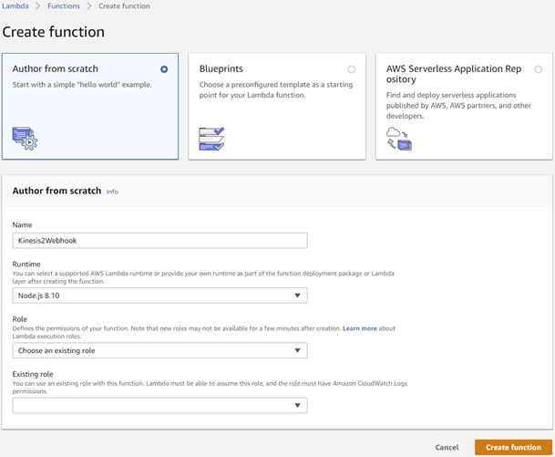
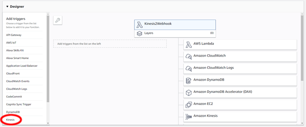
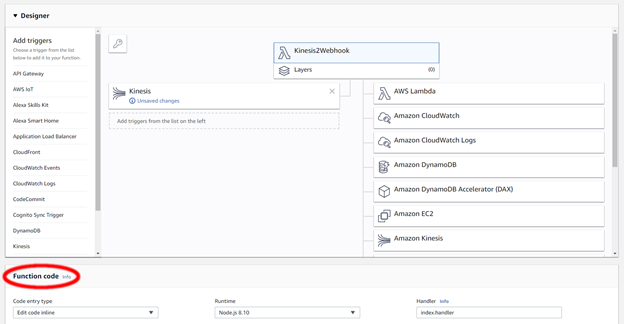
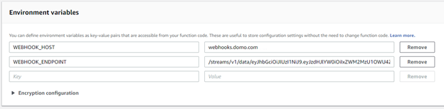

---
<<<<<<< HEAD
title: Writing Amazon Kinesis Data to Domo
url: https://domo-support.domo.com/s/article/360042932954
linked_kbs:  ['[https://domo-support.domo.com/s/knowledge-base/](https://domo-support.domo.com/s/knowledge-base/)', '[https://domo-support.domo.com/s/](https://domo-support.domo.com/s/)', '[https://domo-support.domo.com/s/topic/0TO5w000000ZammGAC](https://domo-support.domo.com/s/topic/0TO5w000000ZammGAC)', '[https://domo-support.domo.com/s/topic/0TO5w000000ZanzGAC](https://domo-support.domo.com/s/topic/0TO5w000000ZanzGAC)', '[https://domo-support.domo.com/s/article/360042932954](https://domo-support.domo.com/s/article/360042932954)', '[https://domo-support.domo.com/s/topic/0TO5w000000ZanzGAC/other-connection-methods](https://domo-support.domo.com/s/topic/0TO5w000000ZanzGAC/other-connection-methods)', '[https://domo-support.domo.com/s/article/360043429933](https://domo-support.domo.com/s/article/360043429933)', '[https://domo-support.domo.com/s/article/360043429953](https://domo-support.domo.com/s/article/360043429953)', '[https://domo-support.domo.com/s/article/360042925494](https://domo-support.domo.com/s/article/360042925494)', '[https://domo-support.domo.com/s/article/360043429913](https://domo-support.domo.com/s/article/360043429913)', '[https://domo-support.domo.com/s/article/4408174643607](https://domo-support.domo.com/s/article/4408174643607)', '[https://domo-support.domo.com/s/login/](https://domo-support.domo.com/s/login/)']
article_id: 000003158
views: 1,138
created_date: 2022-10-24 21:10:00
last updated: 2022-10-24 22:41:00
---
=======
title: Writing Amazon Kinesis Data to Domo
url: https://domo-support.domo.com/s/article/360042932954
linked_kbs:  ['[https://domo-support.domo.com/s/knowledge-base/](https://domo-support.domo.com/s/knowledge-base/)', '[https://domo-support.domo.com/s/](https://domo-support.domo.com/s/)', '[https://domo-support.domo.com/s/topic/0TO5w000000ZammGAC](https://domo-support.domo.com/s/topic/0TO5w000000ZammGAC)', '[https://domo-support.domo.com/s/topic/0TO5w000000ZanzGAC](https://domo-support.domo.com/s/topic/0TO5w000000ZanzGAC)', '[https://domo-support.domo.com/s/article/360042932954](https://domo-support.domo.com/s/article/360042932954)', '[https://domo-support.domo.com/s/topic/0TO5w000000ZanzGAC/other-connection-methods](https://domo-support.domo.com/s/topic/0TO5w000000ZanzGAC/other-connection-methods)', '[https://domo-support.domo.com/s/article/360043429933](https://domo-support.domo.com/s/article/360043429933)', '[https://domo-support.domo.com/s/article/360043429953](https://domo-support.domo.com/s/article/360043429953)', '[https://domo-support.domo.com/s/article/360042925494](https://domo-support.domo.com/s/article/360042925494)', '[https://domo-support.domo.com/s/article/360043429913](https://domo-support.domo.com/s/article/360043429913)', '[https://domo-support.domo.com/s/article/4408174643607](https://domo-support.domo.com/s/article/4408174643607)', '[https://domo-support.domo.com/s/login/](https://domo-support.domo.com/s/login/)']
article_id: 000003158
views: 1,137
created_date: 2022-10-24 21:10:00
last updated: 2022-10-24 22:41:00
---
>>>>>>> fe496b1d734bfbc1f7998509d0072e99b55e6786

Intro
-----

You can write the data being pushed to your Amazon Kinesis Stream into a Domo DataSet, using an Amazon Lambda function and a Domo JSON Webhook DataSet.  
   

Prerequisites
-------------

To write data from a Kinesis Stream to Domo, you will need the following:

* a Kinesis Stream receiving data in JSON format, with one JSON object per Kinesis record
* an active Domo instance

Step 1 – Create a JSON Webhook DataSet
--------------------------------------

Data pushed to Kinesis will be copied into a JSON Webhook dataset. Follow these instructions to create this DataSet:

1. In the Domo Appstore, find and click on the JSON Webhook connector.
2. Click **Get the Data**.
3. Copy and save the link in the **Webhook URL**field. (Note that you cannot change this field.)  
   

4. (Optional) If you want a secret credential to be required for the Webhook when data is sent to it, enter it into the **Webhook Secret** field. (For the remainder of these steps, we will assume a Webhook Secret is not being used.)
5. Select whether the DataSet will Append or Replace. It is set to Append by default, which is typically what Kinesis users need.
6. Click **Next**.
7. Name your DataSet and click **Save**.

Your DataSet will appear to run, but there won’t be any data in it. It will only contain data after JSON data is sent to the Webhook URL. The system will automatically check for any new data every 15 minutes. Selecting **Run DataSet** will not speed up the process.

Step 2 – Create an Amazon Lambda Function
-----------------------------------------

To get data from the Kinesis Stream into the Webhook, you will use an Amazon Lambda function. This is a small JavaScript function which will be called whenever new data is pushed to your Kinesis Stream. The function will consolidate all the new Kinesis records into a single JSON array and send that data to the Webhook. Each record will become a single row in the Domo DataSet.

Follow these instructions to create the Lambda Function:

1. In the AWS Management Console, choose the Lambda service. (Note that your AWS UI may be slightly different.)  
   

2. In the menu on the left, choose **Functions**.  
   

3. Click **Create function**.  
   

4. Fill out the fields to author the function from scratch:

	* Name – Give your function a descriptive, memorable name.
	* Runtime – Select the language your function will use. This tutorial uses Node.js 8.10. Note that it is also possible to create functions using Java, C#, Go, Python, or Ruby.
	* Role – Select **Choose an existing role**. Work with your AWS administrator to make sure that there is a role appropriate for this function. The role needs to be able to read from Kinesis, write to CloudWatch (for logging), and make HTTPS calls.  
	   
	
5. Click **Create function**.
6. After the Lambda function has been created, add Kinesis as a trigger to it by selecting **Kinesis** from the menu on the left of the screen.  
   

7. Configure the trigger by filling out the required fields. Generally, the default values are acceptable:

	* Kinesis stream – Select the Stream that you want to use to trigger this function. This is the stream that is getting the data you want to copy to Domo.
	* Consumer – Leave this as **No consumer**.
	* Batch Size – You can adjust this based on how much data your Kinesis Stream has to handle. To start, leave it at 100.
	* Starting Position – Set this to **Latest**. That way, the function will be given the most recent data in the Kinesis Stream.
	* Enable Trigger – Make sure this box is checked.
8. Click **Add**.
9. Click the name of the Function so that the Function Code panel appears.  
   

10. Set the code fields to the following:

	* Code entry type – Edit code inline
	* Runtime – Node.js 8.10
	* Handler – index.handler
11. The code window should show a file called index.js. Replace all of the code in that file with the following:

`/**  
  * Stream data from AWS Kinesis to Domo via Webhook  
  */`

`'use strict';`

`const https = require('https');`

`// This is called when the Lambda function is triggered.  
 // It should be configured to be triggered by data in a Kinesis Stream  
 exports.handler = (event, context, callback) => {  
     let count = 0;`

`// Build an array of all of the JSON objects that came in from Kinesis  
     let collectedData = [];  
     event.Records.forEach((record) => {  
         // Kinesis data is base64 encoded so decode here  
         const data = new Buffer(record.kinesis.data, 'base64').toString('ascii');  
     // console.log('Decoded payload:', JSON.stringify(data, null, 2));  
     console.log('Decoded payload:', data);`

`// Assumes that each Kinesis record contains only 1 JSON object  
     let item = JSON.parse(data);  
     collectedData[count] = item;`

`count += 1;  
 });`

`// The array of objects will be passed to the webhook in a single POST call  
     let postData = JSON.stringify(collectedData);  
     let options = {  
         host: process.env.WEBHOOK_HOST, // Should generally be "[webhooks.demo.domo.com](http://webhooks.demo.domo.com)"  
         path: process.env.WEBHOOK_ENDPOINT, // Should be the rest of the webhook URL given by Domo  
         method: 'POST',  
         headers: {  
             'Content-Type': 'application/json',  
             'Content-Length': postData.length  
         }  
     };`

`const req = https.request(options, (res) => {  
         console.log('statusCode: ' + res.statusCode);`

`res.on('data', (d) => {  
         console.log('data: ' + d);  
 })`

`});`

`req.on('error', (e) => {  
         console.error('*** ERROR ***');  
     console.error(e);  
 });`

`req.write(postData);`

`req.end();`

`console.log('Pushed ' + count + ' record(s) to the webhook');  
 };`
12. Below the code window, add two environment variables:

	* WEBHOOK\_HOST – This should be the domain in the Webhook URL given in the DataSet you created in step 1 of these instructions. It will typically be [webhooks.domo.com](http://webhooks.domo.com).
	* WEBHOOK\_ENDPOINT – This should be everything in the Webhook URL starting with “/streams”. This will be a very long alphanumeric string of characters.  
	   
	
13. From the menu in the editor, select **File --> Save**.
14. At the top of the screen, click **Save** to save all changes to your Lambda function.

Now, whenever data is pushed into your Kinesis Stream, this Lambda function will run. The function will take the individual Kinesis records, combine them into a single JSON array, and pass that JSON array to the Webhook dataset via an HTTPS POST call. This will copy your data into Domo.

