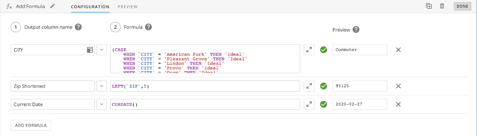
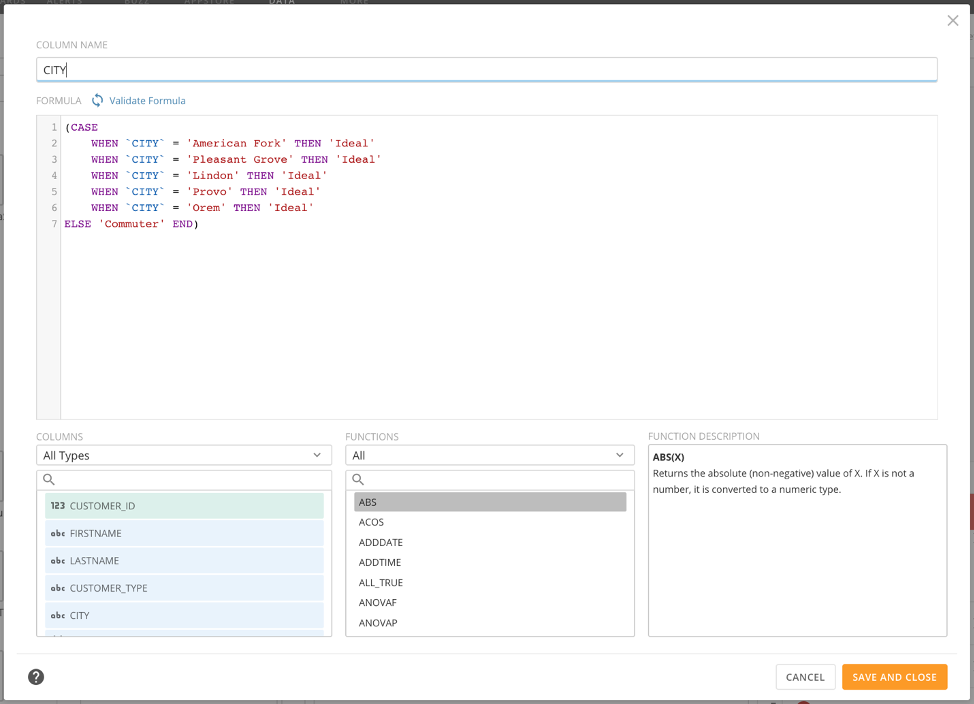

Add_Formula_Icon.png
====================

Intro
-----

The Add Formula action is a row-by-row expression evaluator that brings advanced transformation processes to Magic ETL. Supporting functions such as case statements, time-value-money functions, and statistical utility functions, the Add Formula action gives users enhanced functionality to leverage your Magic ETL DataFlows in new ways.

 

**Important:** There are significant behavioral differences in Magic ETL. Read the [Behavior Changes and Feature Updates in Magic ETL](file:///hc/en-us/articles/360047787514) article before converting mission-critical Magic ETL DataFlows. **Failure to do so may risk an unintended change to your DataFlow’s behavior.**

Parts of the Add Formula Action
-------------------------------

The following screenshot shows how the Add Formula Action looks:

You can learn about the user interface components of the Add Formula dialog in the following table:

| **Name** | **Description** |
| Output Column Name | Add a column name to create a new calculated column and write a formula. To overwrite an existing column, use the Dropdown_Arrow_Menu.png dropdown to view and select an existing column or type the name of that column exactly to overwrite existing column. When the table icon Table_Icon.png appears in the textbox, an existing column will be overwritten by the entered formulas result. |
| Formula | Formulas are calculated columns that use SQL-style syntax like Beast Modes. This action evaluates each row individually with the functions provided. Due to the nature of this tile’s output data, **aggregate functions are not supported**. For aggregations use the Group By action. |
| Expand Editor Button | Expand_Editor.png Opens the formula editor expanded view (see screenshot below.) |
| Validate Formula Button | Validate_Formula_Icon.png Quickly validates the formula’s syntax and checks for errors without running a preview of the entire DataFlow. |
| Preview | Using the Ctrl + Enter hotkey while the Add Formula Configuration tab is open will run a one row test of your formula and return the result. If a Run Preview of the entire DataFlow has yet to run, this hotkey will kick off a DataFlow preview. After the DataFlow preview’s successful completion, Ctrl + Enter will run a one row test and return the result including any updates made to the formula’s syntax. |

**Parts of the Formula Editor (Expanded View)**
-----------------------------------------------

****

| **Name** | **Description** |
| Column Name | Enter the column name here. If the entered column name exactly matches an existing column, the existing column will be overwritten with results of the formula. |
| Formula | The field for entering any functions or transformations you want in your evaluation. You can add column names or functions by double-clicking items in the **Columns** and **Functions** lists. |
| Validate Formula | The validate formula button will quickly validate the formula’s syntax and check for errors without running a preview of the entire DataFlow. |
| Columns | Lists categories and values that you can double-click to add to your formula. Formulas that are already validated can be referenced by subsequent formulas and will display in the Columns tab. You can search for items in the list or filter by type. |
| Functions | Lists all supported functions that you can double-click to add to your formula. You can search for items in the list or filter by type. |
| Function Description | Displays syntax and usage information for the function currently highlighted in the functions list. |
| Help Icon | Tooltip that links to the Add Formula Knowledge Base article. |

Calculation usage notes
-----------------------

* Most calculations use one of the following general formats:

| **Format** | **Description** |
| FUNCTIONNAME(`Column Name`) | Used when some single, specific change is applied to all of the cells in a column. Examples of functions used in this kind of calculation include AVG, MONTHNAME, and CEILING. |
| FUNCTIONNAME(`Column Name1`,`Column Name2`,...) | Used when a calculation is applied across two or more columns. One example of a function used in this kind of calculation is CONCAT, which combines strings from different columns. |
| FUNCTIONNAME(`Column Name`,*somevalue*) | Used when a calculation involving a specified value is applied to a column. An example of a function used in this kind of calculation is POWER. When using this calculation, you specify the power you want all the cells in a column to be raised to. |
| FUNCTIONNAME(`Column Name`, '*string*') | Used when a calculation involving a specified string is applied to a column. An example of a function used in this kind of calculation is DATE\_FORMAT. When using this calculation, you specify specifier characters to use in formatting the date value. For more information, see [Date Format Specifier Characters in Beast Mode](https://knowledge.domo.com/Visualize/Adding_Cards_to_Domo/KPI_Cards/Transforming_Data_Using_Beast_Mode/03Date_Format_Specifier_Characters_in_Beast_Mode). |

* Column names are *not* case sensitive.
* Supported functions are *not* case sensitive.
* Use backticks (aka *backquotes*) (`) or double quotes (") for column names: `Customers` or "Customers"  
Wrap column names of two or more words with backticks (`) or double quotes ("). If you use any column name that matches the name of a function (such as DATE), then use backticks or double quotes (") to wrap the column name.
* Use single quotes (') for strings: 'mystring'
* You can escape a quote using two single quotes: 'O''Neal'
* You can insert a space in a calculation using single quotes: ' '  
This is useful with functions like CONCAT when you need to combine strings.
* You can use most standard arithmetic operators in your custom calculations, such as + (addition), - (subtraction), \* (multiplication), / (division), and so on.
* You *can* refer to a specific new column by name that was created from a formula in a separate calculated formula, as long as the new column being referenced is higher than the formula referencing it.
* Calculations can be completed automatically as you enter them.

* As you enter functions, a list of functions appears, which you can select from.
* If you enter a backtick ('), a list of column names appears, which you can select from.
* While you can combine some functions in a calculation, you *cannot* stack numerical functions. For example, SUM(MIN()) is invalid.
* Do *not* mix data types of values you put in a transformed column.  
For example, in a CASE function, do not store "Yes" (string) and "0" (number) in the same column.
