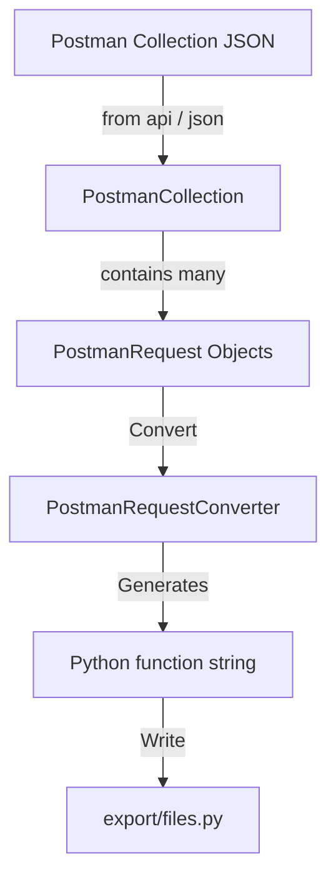

# Postman API Client Generator

A Python library for converting Postman collections into fully functional Python API client code.

## Overview

This library transforms Postman collections into structured Python code, enabling programmatic access to APIs documented in Postman. It creates model classes, conversion utilities, and implementation files that can be used directly in your projects.

**Postman to API Client [YouTube Tutorial](https://youtu.be/CuxqKKF-6f8)**

**Domo [Postman Collection](https://api.datacrew.space/)**

## Features

- **Structured Data Models**: Converts Postman JSON into typed Python dataclasses
- **Automatic Code Generation**: Creates Python API client functions with proper type hints
- **Test Code Generation**: Builds test functions for each API endpoint
- **Customization Options**: Allows customizing how specific endpoints are processed
- **Authentication Support**: Integrates with your authentication mechanisms
- **Request/Response Validation**: Provides validation for API requests and responses

## Project Structure

- `_1_models.py`: Core dataclasses that model Postman collection structures
- `_2_converter.py`: Conversion logic to transform Postman requests into Python code
- `_2_tester.py`: Testing utilities for generated API functions
- `_3_implementation.ipynb`: Jupyter notebook demonstrating the implementation workflow
- `utils.py`: Helper functions for request handling and code generation

## How It Works

