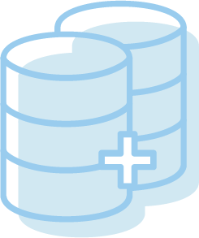
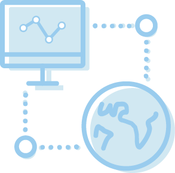
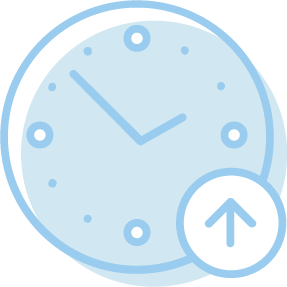
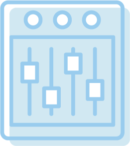

Browse resources by topic:
==========================
* [#### Getting To Know Domo](..\..\category\getting_to_know_domo\index.md)
* [#### Connecting Data To Domo](..\..\category\connecting_data_to_domo\index.md)
* [#### Transforming Data In Domo](..\..\category\transforming_data_in_domo\index.md)
* [#### Creating Content In Domo](..\..\category\creating_content_in_domo\index.md)
* [#### Consuming Data In Domo](..\..\category\consuming_data_in_domo\index.md)
* [#### Administrating Domo](..\..\category\administrating_domo\index.md)
* [#### Distributing Domo Content](..\..\category\distributing_domo_content\index.md)
* [#### Understanding Data](..\..\category\understanding_data\index.md)
* [#### Working With DataSets In Domo](..\..\category\working_with_datasets_in_domo\index.md)
* [#### Creating Custom Visualizations](/s/topic/0TO5w000000ZampGAC)
* [#### Release Notes](..\..\category\release_notes\index.md)
* [#### Using Domo APIs](..\..\category\using_domo_apis\index.md)
* [#### Training](..\..\category\training\index.md)
